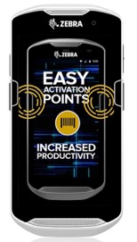

## Overview

ActiveEdge Touch Zones are touch-sensitive areas on the device screen that can be configured to perform desired actions when tapped. Touch Zones can configured as single-purpose buttons or customizable drawers that slide out from the left or right side of the screen. Both can work over any other application. 
 

With a single touch, ActiveEdge lets users: 

* **Scan a barcode**
* **Launch an app**
* **Launch a specific app activity**
* **Trigger an Android intent**

 

An App Drawer can contain as many as three app icons (shown below), giving workers quick access to an organization's line-of-business apps:

 

A Touch Zone also can invoke the device's barcode scanner (shown) or trigger an intent: 

 

-----

## Setting ActiveEdge Zones

ActiveEdge Touch Zones are configured through the [ActiveEdge settings panel](../setup/#settingspanel or by an administrator pushing an XML file to the device. 

_The ActiveEdge settings panel_
 

**IMPORTANT: Once an XML configuration file is deployed to a device, the ActiveEdge settings panel can no longer be used to change settings on that device**. For more information, see [ActiveEdge Setup](../setup) or Contact an IT administrator.  

**NOTES**: 

* **Only one Touch Zone can contain an App Drawer** at a time. 
* **Use the ActiveEdge [Settings Panel](../setup/#settingspanel)** to configure Touch Zones. 
* **There are no “double-tap” or “press and hold” functions** for apps in the App Drawer. 
* **Touch Zones are active only in portrait mode**. 
* **Left and Right ActiveEdge Zones do not change** when device is inverted (upside down). 

-----

### Scan Barcode

When tapping an ActiveEdge Zone configured for barcode scanning, a [Soft Scan Trigger](/datawedge/latest/guide/api/softscantrigger/) intent is sent to [DataWedge](/datawedge), the Zebra scanning service that comes with all Zebra devices. Acquired data is handled according to settings configured in the ActiveEdge Profile (in DataWedge). If no ActiveEdge Profile is present, data is sent to Profile0 (the "Launcher" Profile), which passes the data (usually as keystrokes) to the foreground app. **See [DataWedge Profiles](/datawedge/latest/guide/profiles/) for more information**.  

When DataWedge recieves the Soft Scan Trigger intent from ActiveEdge, it does the following: 

* Activates the scanner currently selected in DataWedge and attempts to acquire data.
	* If acquired, data is processed according to DataWedge Profile assigned to the foreground app, if any.
	* If no app is in the foreground, acquired data is handled according to the "Launcher" Profile or Profile0, if enabled.
* Continues to attempt data acquisition as long as button is held or pressed repeatedly.
* Scan is cancelled when data is acquired or button is released. 
* Acquired data is typically delivered as keystrokes to the foreground application. 

**Note**: Standard device rules apply with applications “competing” for the scanner. If an application currently has the scanner "locked," ActiveEdge scanning will not function (just as other applications would). In this case, pressing the ActiveEdge zone that has been configured for barcode scanning will result in no operation.

Equally, the ActiveEdge service shall not lock use of the scanner. When a button that is configured for barcode scanning is pressed, ActiveEdge will immediately release the scanner either after the barcode is read or the user releases the ActiveEdge zone.

-----

### App Drawer

When the ActiveEdge Zone is configured to open a drawer, a drawer will slide out and up to three applications will be accessible for launching.

* **Opening the drawer**: Tap the ActiveEdge zone to open the drawer. The drawer will always appear on top of any application that is running, including a "full-screen" application. The drawer will always be accessible when in the “open” state.
* **Closing the drawer**: Tapping on the "handle" of the drawer will close the drawer. Tapping elsewhere on the display while the drawer is open will not close the drawer.

-----
### Launching an App

When the ActiveEdge Zone is configured to launch an application, the following will happen:

* The application icon of the associated application will be shown on tap-down and the application will be opened.
* The icon will be removed on tap-up when the ActiveEdge Zone is released. This is similar to how the Scanning option works: The barcode icon is shown for as long as the ActiveEdge Zone is pressed.

> Pressing the ActiveEdge Zone for a second time while the associated application is already in the foreground shall have no effect

-----

### Trigger an intent

When the ActiveEdge Zone is configured to trigger an intent, the following will happen:

* An Android icon is shown on tap-down and the intent is sent.
* The icon is removed on tap-up and the ActiveEdge Zone is released. This is similar the operation of the scanning option; the barcode icon is shown while the ActiveEdge Zone is touched and disappears upon release.

> Each press of the ActiveEdge Zone triggers a new intent.

-----

## See Also

* [About ActiveEdge](../about)
* [Administrative Guide](../setup)
