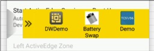

## Overview

ActiveEdge Touch Zones are touch-sensitive areas on the device screen that can be configured to perform desired actions when tapped. Touch Zones can be configured as single-purpose buttons or customizable drawers that slide out from the left or right side of the screen. ActiveEdge Touch Zones are displayed on top of any other application, even if they're configured in "full-screen" mode. 
 

With a single touch, ActiveEdge lets users: 

* **Scan a barcode**
* **Launch an app**
* **Launch a specific app activity**
* **Trigger an Android intent**

 

An App Drawer can contain as many as three app icons (shown below), giving workers quick access to an organization's line-of-business apps:

 

A Touch Zone also can invoke the device's barcode scanner (shown) or trigger an intent: 

 

ActiveEdge works only on [specific devices](../about/#supporteddevices). 

-----

## Setting ActiveEdge Zones

ActiveEdge Touch Zones are configured through the ActiveEdge settings panel or through a file pushed to the device by an administrator. **IMPORTANT: Once a configuration file is deployed to a device, the ActiveEdge settings panel can no longer be used to change settings on that device**, only to view them. For more information, see [ActiveEdge Setup](../setup) or contact an IT administrator.  

_The ActiveEdge settings panel_
 

**Notes**: 

* **Touch Zones are active only in portrait mode**. 
* **Left and Right ActiveEdge Zones do not change** when device is inverted (upside down). 
* **Only one Touch Zone can contain an App Drawer** at a time. 

-----

### Scan Barcode

When tapping an ActiveEdge Zone configured for barcode scanning, the device immediately activates the default scanner and attempts to acquire data. This is done by sending a [Soft Scan Trigger](/datawedge/latest/guide/api/softscantrigger/) intent to [DataWedge](/datawedge), the Zebra scanning service preinstalled on all Zebra devices. Acquired data is usually passed to the foreground app as keystrokes, but is governed by DataWedge Profile settings (see below). **Refer to [DataWedge Profiles](/datawedge/latest/guide/profiles/) for more information about DataWedge processing and handling options**.

_ActiveEdge scanner icon displayed on tap-down_
 

**Tapping Scan Barcode executes the following behavior**: 

* **Activates the scanner currently selected in DataWedge** and attempts to acquire data.
	* **If data is acquired and an app is in the foreground**, it is processed according to DataWedge Profile assigned to the foreground app (if any) and passed to that app (usually as keystrokes).
	* **If data is acquired and no app is in the foreground** (or if the foreground app is not associated with a Profile), acquired data is handled according to the "Launcher" Profile or Profile0, if enabled.
* **Continues trying to acquire data** as long as button is held or subsequently pressed.
* **Scanning is canceled when data is acquired** or button is released. 
* **Acquired data is typically delivered as keystrokes** to the foreground application. 

**IMPORTANT: Control of barcode scanning hardware is exclusive**. When ActiveEdge or DataWedge are using the scanner, other apps are prevented from doing so. Likewise, another scanning app running on the device could prevent ActiveEdge from accessing the scanner and/or acquiring data. 

> ActiveEdge does not block use of the scanner by other apps when it's not being used for scanning. 

-----

### App Drawer
When an ActiveEdge Zone is configured as an App Drawer, tapping the zone slides open the drawer to expose icons for as many as three apps for launching.

* **To open the drawer**: tap the ActiveEdge zone. The drawer appears on top of any running application, even if set to "full-screen" mode. 
* **To close the drawer**: tap the "handle" of the drawer's outer edge. Tapping elsewhere on the display does not close the drawer.

**Notes**: 

* **Only one Touch Zone can contain an App Drawer** at a time. 
* **There are no “double-tap” or “press and hold” functions** for apps in the App Drawer. 
* **Touch Zones are active only in portrait mode**. 
* **Left and Right ActiveEdge Zones do not change** when device is inverted (upside down). 

-----

### Launch an App

When an ActiveEdge Zone is configured to launch an app, tapping that zone immediately runs the specified app. This is unlike the App Drawer, which displays multiple app icons for launching, but does not launch an app unless its icon is tapped. 

**Notes**: 

* On tap-down, the icon of the associated app is shown and the app is launched.
* When the ActiveEdge Zone is released (tap-up), the icon disappears. This action is similar to that of the scanning option, which displays the scanning icon as long as the ActiveEdge Zone is pressed.
* After initially launching an app in this way, subsequent presses of the zone have no effect. 

-----

### Trigger an intent

An ActiveEdge Zone can be configured to trigger an intent. This is useful for launching activities "behind the scenes" such as Android services or other apps that might be listening for a particular broadcast intent. 

**Notes**: 

* On tap-down, an Android icon is shown and the intent is triggered.
* When the ActiveEdge Zone is released (tap-up), the icon is removed on tap-up and the ActiveEdge Zone is released. This is similar the operation of the scanning option; the barcode icon is shown while the ActiveEdge Zone is touched and disappears upon release.

> Each press of the ActiveEdge Zone triggers a new intent.

-----

## See Also

* [About ActiveEdge](../about)
* [Administrative Guide](../setup)
