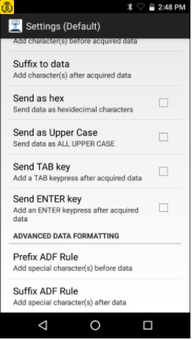

## Overview

This section explains how to configure audio and vibrate options of the device, as well as Profile settings, which control how data is manipulated before and after being sent to the PC.

-----

## Audio and Vibrate Options

CartScan provides control over audio and tactile feedback to indicate each successful scan. For example, audio can be disabled on the mobile device so as not to disturb patients. **These settings apply only to barcodes scanned with CartScan; device sounds and feedback settings of other apps are not effected**.  

**To configure the audio and vibrate options**:

1. From the mobile device Home screen, tap All Apps > CartScan. 

When CartScan launches, the Home screen displays ON/OFF toggle switches to set audio and vibrate when scanning. Tap a switch to change its setting.

* **Audio -** controls beep sound played with each successful scan (default = ON)
* **Vibrate -** controls tactile feedback activated with each successful scan (default = OFF)

_Configure Audio and Vibrate Options_
 

-----

## Configuring Profiles

CartScan behavior is controlled by Profiles, which define how acquired data is processed and delivered to a line of business (LOB) application.
Viewing/Editing the Default Profile

To view/edit a Profile:
From the mobile device Home screen, tap  All Apps > CartScan.

Tap Menu > Profiles:

_Default Profile Screen_
 

Tap and hold Default:

_Edit Profile Screen_
 

Tap Edit Profile to view and/or edit the Profile settings as needed.

_Default Profile Settings Screen_
 

Profile Settings
Session Timeout

WARNING:  Disabling Session Timeout is strongly discouraged.

Ignore Session Timeout - Select this option to maintain the connection indefinitely (or until the user exits the CartScan app or the mobile device moves out of range).
Session Timeout - Enter a timeout period value from 1 to 60 minutes. The default is 2 minutes. This option enables the system administrator to configure the length of time to maintain the Bluetooth connection between the mobile device and the PC during periods of inactivity.
Bluetooth Output
Enable/disable BT Output - This option provides a measure of security by restricting delivery of acquired data to the application running on a PC. If this setting is disabled, the scanned data is not delivered to the connected PC.
Data Formatting
Data formatting provides an easy way to append or prepend acquired data with custom values or keystrokes before passing it to the LOB application on the PC. This can be useful for adding application-specific characters to acquired data or for sending an ENTER and/or TAB character after submitting the data to advance the cursor to the next field.

NOTE: Do not use Data Formatting in Zebra DataWedge Profile settings for CartScan. Modifying the basic data formatting and/or the advanced data formatting results in conflicts with the Zebra CartScan application.

Enable/disable data formatting - Enable Data Formatting to access Basic or Advanced Data Formatting functions. If Data Formatting is not enabled, scanned data is passed to the app without modification or extra keystrokes.

Basic Data Formatting
Basic Data Formatting provides an easy way to append or prepend acquired data with custom values or special keystrokes. The supported options are:
Prefix to data - adds (prepends) the specified character(s) to the beginning of the acquired data before sending.
Suffix to data - adds (appends) the specified character(s) to the end of the acquired data before sending.
Send as hex - sends the data in hexadecimal format. For example, if the acquired barcode data is 012345, this option sends the hex equivalent of 303132333435.
Send as Upper Case - sends the data in all caps. For example, if the acquired barcode data is abcde, this option sends the string of ABCDE. Any selected prefix and/or suffix data is also converted to upper case (if appropriate).
Send TAB key - appends a TAB character to the processed data.
Send ENTER key - appends an ENTER character to the processed data.
Advanced Data Formatting
Advanced Data Formatting can append or pre-pend acquired data with special characters and keystrokes such as functional keys, mouse clicks, spaces and num-lock characters.
Prefix ADF Rule - Can be configured as displayed in the following table. Keys can be selected from the scrolling list without manually entering the details.
Suffix ADF Rule - Can be configured as displayed in the following table. Keys can be selected from the scrolling list without manually entering the details.

NOTE:  ADF keystrokes are visible only in the LOB application on the PC and not in the CartScan app.

## Supported ADF Keystrokes

<table class=MsoNormalTable border=0 cellspacing=0 cellpadding=0
 style='margin-left:59.7pt;border-collapse:collapse'>
 <tr style='height:20.0pt'>
  <td width=224 valign=top style='width:168.0pt;border:solid black 1.0pt;
  padding:0in 0in 0in 0in;height:20.0pt'>
  
ALT 2

  </td>
  <td width=224 valign=top style='width:168.0pt;border:solid black 1.0pt;
  border-left:none;padding:0in 0in 0in 0in;height:20.0pt'>
  
LEFT ARROW
  Key

  </td>
  <td width=224 valign=top style='width:168.0pt;border:solid black 1.0pt;
  border-left:none;padding:0in 0in 0in 0in;height:20.0pt'>
  
Browser Back Key

  </td>
 </tr>
 <tr style='height:20.0pt'>
  <td width=224 valign=top style='width:168.0pt;border:solid black 1.0pt;
  border-top:none;padding:0in 0in 0in 0in;height:20.0pt'>
  
ALT [A-Z]

  </td>
  <td width=224 valign=top style='width:168.0pt;border-top:none;border-left:
  none;border-bottom:solid black 1.0pt;border-right:solid black 1.0pt;
  padding:0in 0in 0in 0in;height:20.0pt'>
  
UP ARROW
  Key

  </td>
  <td width=224 valign=top style='width:168.0pt;border-top:none;border-left:
  none;border-bottom:solid black 1.0pt;border-right:solid black 1.0pt;
  padding:0in 0in 0in 0in;height:20.0pt'>
  
Browser Refresh Key

  </td>
 </tr>
 <tr style='height:20.0pt'>
  <td width=224 valign=top style='width:168.0pt;border:solid black 1.0pt;
  border-top:none;padding:0in 0in 0in 0in;height:20.0pt'>
  
ALT [

  </td>
  <td width=224 valign=top style='width:168.0pt;border-top:none;border-left:
  none;border-bottom:solid black 1.0pt;border-right:solid black 1.0pt;
  padding:0in 0in 0in 0in;height:20.0pt'>
  
RIGHT ARROW
  Key

  </td>
  <td width=224 valign=top style='width:168.0pt;border-top:none;border-left:
  none;border-bottom:solid black 1.0pt;border-right:solid black 1.0pt;
  padding:0in 0in 0in 0in;height:20.0pt'>
  
Browser Stop Key

  </td>
 </tr>
 <tr style='height:20.05pt'>
  <td width=224 valign=top style='width:168.0pt;border:solid black 1.0pt;
  border-top:none;padding:0in 0in 0in 0in;height:20.05pt'>
  
ALT ]

  </td>
  <td width=224 valign=top style='width:168.0pt;border-top:none;border-left:
  none;border-bottom:solid black 1.0pt;border-right:solid black 1.0pt;
  padding:0in 0in 0in 0in;height:20.05pt'>
  
DOWN ARROW
  Key

  </td>
  <td width=224 valign=top style='width:168.0pt;border-top:none;border-left:
  none;border-bottom:solid black 1.0pt;border-right:solid black 1.0pt;
  padding:0in 0in 0in 0in;height:20.05pt'>
  
Browser Search
  Key

  </td>
 </tr>
 <tr style='height:20.0pt'>
  <td width=224 valign=top style='width:168.0pt;border:solid black 1.0pt;
  border-top:none;padding:0in 0in 0in 0in;height:20.0pt'>
  
Control-break processing

  </td>
  <td width=224 valign=top style='width:168.0pt;border-top:none;border-left:
  none;border-bottom:solid black 1.0pt;border-right:solid black 1.0pt;
  padding:0in 0in 0in 0in;height:20.0pt'>
  
PRINT SCREEN Key

  </td>
  <td width=224 valign=top style='width:168.0pt;border-top:none;border-left:
  none;border-bottom:solid black 1.0pt;border-right:solid black 1.0pt;
  padding:0in 0in 0in 0in;height:20.0pt'>
  
Browser Favorites Key

  </td>
 </tr>
 <tr style='height:20.0pt'>
  <td width=224 valign=top style='width:168.0pt;border:solid black 1.0pt;
  border-top:none;padding:0in 0in 0in 0in;height:20.0pt'>
  
BACKSPACE Key

  </td>
  <td width=224 valign=top style='width:168.0pt;border-top:none;border-left:
  none;border-bottom:solid black 1.0pt;border-right:solid black 1.0pt;
  padding:0in 0in 0in 0in;height:20.0pt'>
  
INS Key

  </td>
  <td width=224 valign=top style='width:168.0pt;border-top:none;border-left:
  none;border-bottom:solid black 1.0pt;border-right:solid black 1.0pt;
  padding:0in 0in 0in 0in;height:20.0pt'>
  
Browser Start
  and Home Key

  </td>
 </tr>
 <tr style='height:20.0pt'>
  <td width=224 valign=top style='width:168.0pt;border:solid black 1.0pt;
  border-top:none;padding:0in 0in 0in 0in;height:20.0pt'>
  
TAB Key

  </td>
  <td width=224 valign=top style='width:168.0pt;border-top:none;border-left:
  none;border-bottom:solid black 1.0pt;border-right:solid black 1.0pt;
  padding:0in 0in 0in 0in;height:20.0pt'>
  
DEL Key

  </td>
  <td width=224 valign=top style='width:168.0pt;border-top:none;border-left:
  none;border-bottom:solid black 1.0pt;border-right:solid black 1.0pt;
  padding:0in 0in 0in 0in;height:20.0pt'>
  
Volume Mute
  Key

  </td>
 </tr>
 <tr style='height:20.05pt'>
  <td width=224 valign=top style='width:168.0pt;border:solid black 1.0pt;
  border-top:none;padding:0in 0in 0in 0in;height:20.05pt'>
  
ENTER Key

  </td>
  <td width=224 valign=top style='width:168.0pt;border-top:none;border-left:
  none;border-bottom:solid black 1.0pt;border-right:solid black 1.0pt;
  padding:0in 0in 0in 0in;height:20.05pt'>
  
HELP Key

  </td>
  <td width=224 valign=top style='width:168.0pt;border-top:none;border-left:
  none;border-bottom:solid black 1.0pt;border-right:solid black 1.0pt;
  padding:0in 0in 0in 0in;height:20.05pt'>
  
Volume Down Key

  </td>
 </tr>
 <tr style='height:20.0pt'>
  <td width=224 valign=top style='width:168.0pt;border:solid black 1.0pt;
  border-top:none;padding:0in 0in 0in 0in;height:20.0pt'>
  
SHIFT Key

  </td>
  <td width=224 valign=top style='width:168.0pt;border-top:none;border-left:
  none;border-bottom:solid black 1.0pt;border-right:solid black 1.0pt;
  padding:0in 0in 0in 0in;height:20.0pt'>
  
Number Keys [0-9]

  </td>
  <td width=224 valign=top style='width:168.0pt;border-top:none;border-left:
  none;border-bottom:solid black 1.0pt;border-right:solid black 1.0pt;
  padding:0in 0in 0in 0in;height:20.0pt'>
  
Volume Up Key

  </td>
 </tr>
 <tr style='height:20.0pt'>
  <td width=224 valign=top style='width:168.0pt;border:solid black 1.0pt;
  border-top:none;padding:0in 0in 0in 0in;height:20.0pt'>
  
CTRL Key

  </td>
  <td width=224 valign=top style='width:168.0pt;border-top:none;border-left:
  none;border-bottom:solid black 1.0pt;border-right:solid black 1.0pt;
  padding:0in 0in 0in 0in;height:20.0pt'>
  
Alphabet Keys
  [A-Z]

  </td>
  <td width=224 valign=top style='width:168.0pt;border-top:none;border-left:
  none;border-bottom:solid black 1.0pt;border-right:solid black 1.0pt;
  padding:0in 0in 0in 0in;height:20.0pt'>
  
Next Track
  Key

  </td>
 </tr>
 <tr style='height:32.0pt'>
  <td width=224 valign=top style='width:168.0pt;border:solid black 1.0pt;
  border-top:none;padding:0in 0in 0in 0in;height:32.0pt'>
  
ALT Key

  </td>
  <td width=224 valign=top style='width:168.0pt;border-top:none;border-left:
  none;border-bottom:solid black 1.0pt;border-right:solid black 1.0pt;
  padding:0in 0in 0in 0in;height:32.0pt'>
  
Left Windows
  Key (Natural Keyboard)

  </td>
  <td width=224 valign=top style='width:168.0pt;border-top:none;border-left:
  none;border-bottom:solid black 1.0pt;border-right:solid black 1.0pt;
  padding:0in 0in 0in 0in;height:32.0pt'>
  
Previous Track Key

  </td>
<tr style='height:32.0pt'>
  <td width=224 valign=top style='width:168.0pt;border:solid black 1.0pt;
  padding:0in 0in 0in 0in;height:32.0pt'>
  
CAPS LOCK
  Key

  </td>
  <td width=224 valign=top style='width:168.0pt;border:solid black 1.0pt;
  border-left:none;padding:0in 0in 0in 0in;height:32.0pt'>
  
Right Windows Key (Natural Keyboard)

  </td>
  <td width=224 valign=top style='width:168.0pt;border:solid black 1.0pt;
  border-left:none;padding:0in 0in 0in 0in;height:32.0pt'>
  
Stop Media
  Key

  </td>
 </tr>
 <tr style='height:32.0pt'>
  <td width=224 valign=top style='width:168.0pt;border:solid black 1.0pt;
  border-top:none;padding:0in 0in 0in 0in;height:32.0pt'>
  
ESC Key

  </td>
  <td width=224 valign=top style='width:168.0pt;border-top:none;border-left:
  none;border-bottom:solid black 1.0pt;border-right:solid black 1.0pt;
  padding:0in 0in 0in 0in;height:32.0pt'>
  
Applications Key (Natural
  Keyboard)

  </td>
  <td width=224 valign=top style='width:168.0pt;border-top:none;border-left:
  none;border-bottom:solid black 1.0pt;border-right:solid black 1.0pt;
  padding:0in 0in 0in 0in;height:32.0pt'>
  
Play/Pause Media Key

  </td>
 </tr>
 <tr style='height:20.05pt'>
  <td width=224 valign=top style='width:168.0pt;border:solid black 1.0pt;
  border-top:none;padding:0in 0in 0in 0in;height:20.05pt'>
  
SPACEBAR

  </td>
  <td width=224 valign=top style='width:168.0pt;border-top:none;border-left:
  none;border-bottom:solid black 1.0pt;border-right:solid black 1.0pt;
  padding:0in 0in 0in 0in;height:20.05pt'>
  
Computer Sleep
  Key

  </td>
  <td width=224 valign=top style='width:168.0pt;border-top:none;border-left:
  none;border-bottom:solid black 1.0pt;border-right:solid black 1.0pt;
  padding:0in 0in 0in 0in;height:20.05pt'>
  
Start Mail Key

  </td>
 </tr>
 <tr style='height:20.0pt'>
  <td width=224 valign=top style='width:168.0pt;border:solid black 1.0pt;
  border-top:none;padding:0in 0in 0in 0in;height:20.0pt'>
  
PAGE UP Key

  </td>
  <td width=224 valign=top style='width:168.0pt;border-top:none;border-left:
  none;border-bottom:solid black 1.0pt;border-right:solid black 1.0pt;
  padding:0in 0in 0in 0in;height:20.0pt'>
  
Numeric Keypad [0-9]

  </td>
  <td width=224 valign=top style='width:168.0pt;border-top:none;border-left:
  none;border-bottom:solid black 1.0pt;border-right:solid black 1.0pt;
  padding:0in 0in 0in 0in;height:20.0pt'>
  
Select Media Key

  </td>
 </tr>
 <tr style='height:20.0pt'>
  <td width=224 valign=top style='width:168.0pt;border:solid black 1.0pt;
  border-top:none;padding:0in 0in 0in 0in;height:20.0pt'>
  
END Key

  </td>
  <td width=224 valign=top style='width:168.0pt;border-top:none;border-left:
  none;border-bottom:solid black 1.0pt;border-right:solid black 1.0pt;
  padding:0in 0in 0in 0in;height:20.0pt'>
  
Add Key

  </td>
  <td width=224 valign=top style='width:168.0pt;border-top:none;border-left:
  none;border-bottom:solid black 1.0pt;border-right:solid black 1.0pt;
  padding:0in 0in 0in 0in;height:20.0pt'>
  
; Key

  </td>
 </tr>
 <tr style='height:20.0pt'>
  <td width=224 valign=top style='width:168.0pt;border:solid black 1.0pt;
  border-top:none;padding:0in 0in 0in 0in;height:20.0pt'>
  
HOME Key

  </td>
  <td width=224 valign=top style='width:168.0pt;border-top:none;border-left:
  none;border-bottom:solid black 1.0pt;border-right:solid black 1.0pt;
  padding:0in 0in 0in 0in;height:20.0pt'>
  
NUM LOCK
  Key

  </td>
  <td width=224 valign=top style='width:168.0pt;border-top:none;border-left:
  none;border-bottom:solid black 1.0pt;border-right:solid black 1.0pt;
  padding:0in 0in 0in 0in;height:20.0pt'>
  
, Key

  </td>
 </tr>
 <tr style='height:20.05pt'>
  <td width=224 valign=top style='width:168.0pt;border:solid black 1.0pt;
  border-top:none;padding:0in 0in 0in 0in;height:20.05pt'>
  
Subtract Key

  </td>
  <td width=224 valign=top style='width:168.0pt;border-top:none;border-left:
  none;border-bottom:solid black 1.0pt;border-right:solid black 1.0pt;
  padding:0in 0in 0in 0in;height:20.05pt'>
  
SCROLL LOCK
  Key

  </td>
  <td width=224 valign=top style='width:168.0pt;border-top:none;border-left:
  none;border-bottom:solid black 1.0pt;border-right:solid black 1.0pt;
  padding:0in 0in 0in 0in;height:20.05pt'>
  
- Key

  </td>
 </tr>
 <tr style='height:20.0pt'>
  <td width=224 valign=top style='width:168.0pt;border:solid black 1.0pt;
  border-top:none;padding:0in 0in 0in 0in;height:20.0pt'>
  
Decimal Key

  </td>
  <td width=224 valign=top style='width:168.0pt;border-top:none;border-left:
  none;border-bottom:solid black 1.0pt;border-right:solid black 1.0pt;
  padding:0in 0in 0in 0in;height:20.0pt'>
  
Left SHIFT
  Key

  </td>
  <td width=224 valign=top style='width:168.0pt;border-top:none;border-left:
  none;border-bottom:solid black 1.0pt;border-right:solid black 1.0pt;
  padding:0in 0in 0in 0in;height:20.0pt'>
  
. Key

  </td>
 </tr>
 <tr style='height:20.0pt'>
  <td width=224 valign=top style='width:168.0pt;border:solid black 1.0pt;
  border-top:none;padding:0in 0in 0in 0in;height:20.0pt'>
  
Divide Key

  </td>
  <td width=224 valign=top style='width:168.0pt;border-top:none;border-left:
  none;border-bottom:solid black 1.0pt;border-right:solid black 1.0pt;
  padding:0in 0in 0in 0in;height:20.0pt'>
  
Right SHIFT
  Key

  </td>
  <td width=224 valign=top style='width:168.0pt;border-top:none;border-left:
  none;border-bottom:solid black 1.0pt;border-right:solid black 1.0pt;
  padding:0in 0in 0in 0in;height:20.0pt'>
  
/ Key

  </td>
 </tr>
 <tr style='height:21.65pt'>
  <td width=224 valign=top style='width:168.0pt;border:solid black 1.0pt;
  border-top:none;padding:0in 0in 0in 0in;height:21.65pt'>
  
Functional Keys
  [F1-F24]

  </td>
  <td width=224 valign=top style='width:168.0pt;border-top:none;border-left:
  none;border-bottom:solid black 1.0pt;border-right:solid black 1.0pt;
  padding:0in 0in 0in 0in;height:21.65pt'>
  
Left CONTROL Key

  </td>
  <td width=224 valign=top style='width:168.0pt;border-top:none;border-left:
  none;border-bottom:solid black 1.0pt;border-right:solid black 1.0pt;
  padding:0in 0in 0in 0in;height:21.65pt'>
  
` Key

  </td>
 </tr>
 <tr style='height:20.0pt'>
  <td width=224 valign=top style='width:168.0pt;border:solid black 1.0pt;
  border-top:none;padding:0in 0in 0in 0in;height:20.0pt'>
  
Single-quote Key

  </td>
  <td width=224 valign=top style='width:168.0pt;border-top:none;border-left:
  none;border-bottom:solid black 1.0pt;border-right:solid black 1.0pt;
  padding:0in 0in 0in 0in;height:20.0pt'>
  
Right CONTROL Key

  </td>
  <td width=224 valign=top style='width:168.0pt;border-top:none;border-left:
  none;border-bottom:solid black 1.0pt;border-right:solid black 1.0pt;
  padding:0in 0in 0in 0in;height:20.0pt'>
  
[ Key

  </td>
 </tr>
 <tr style='height:20.05pt'>
  <td width=224 valign=top style='width:168.0pt;border:solid black 1.0pt;
  border-top:none;padding:0in 0in 0in 0in;height:20.05pt'>
  
Separator Key

  </td>
  <td width=224 valign=top style='width:168.0pt;border-top:none;border-left:
  none;border-bottom:solid black 1.0pt;border-right:solid black 1.0pt;
  padding:0in 0in 0in 0in;height:20.05pt'>
  
\ Key

  </td>
  <td width=224 valign=top style='width:168.0pt;border-top:none;border-left:
  none;border-bottom:solid black 1.0pt;border-right:solid black 1.0pt;
  padding:0in 0in 0in 0in;height:20.05pt'>
  
] Key

  </td>
 </tr>
</table>

**Although the CartScan app lists additional Advanced Data Formatting options, only those listed in this table are supported**.

-----

## Unsupported ADF Keystrokes

<table class=MsoNormalTable border=0 cellspacing=0 cellpadding=0
 style='margin-left:59.7pt;border-collapse:collapse'>
 <tr style='height:20.0pt'>
  <td width=224 valign=top style='width:168.0pt;border:solid black 1.0pt;
  padding:0in 0in 0in 0in;height:20.0pt'>
  
CTRL 2

  </td>
  <td width=224 valign=top style='width:168.0pt;border:solid black 1.0pt;
  border-left:none;padding:0in 0in 0in 0in;height:20.0pt'>
  
SELECT Key

  </td>
  <td width=224 valign=top style='width:168.0pt;border:solid black 1.0pt;
  border-left:none;padding:0in 0in 0in 0in;height:20.0pt'>
  
Left MENU
  Key

  </td>
 </tr>
 <tr style='height:20.0pt'>
  <td width=224 valign=top style='width:168.0pt;border:solid black 1.0pt;
  border-top:none;padding:0in 0in 0in 0in;height:20.0pt'>
  
CTRL [A-Z]

  </td>
  <td width=224 valign=top style='width:168.0pt;border-top:none;border-left:
  none;border-bottom:solid black 1.0pt;border-right:solid black 1.0pt;
  padding:0in 0in 0in 0in;height:20.0pt'>
  
PRINT Key

  </td>
  <td width=224 valign=top style='width:168.0pt;border-top:none;border-left:
  none;border-bottom:solid black 1.0pt;border-right:solid black 1.0pt;
  padding:0in 0in 0in 0in;height:20.0pt'>
  
Right MENU
  Key

  </td>
 </tr>
 <tr style='height:20.05pt'>
  <td width=224 valign=top style='width:168.0pt;border:solid black 1.0pt;
  border-top:none;padding:0in 0in 0in 0in;height:20.05pt'>
  
CTRL [

  </td>
  <td width=224 valign=top style='width:168.0pt;border-top:none;border-left:
  none;border-bottom:solid black 1.0pt;border-right:solid black 1.0pt;
  padding:0in 0in 0in 0in;height:20.05pt'>
  
EXECUTE Key

  </td>
  <td width=224 valign=top style='width:168.0pt;border-top:none;border-left:
  none;border-bottom:solid black 1.0pt;border-right:solid black 1.0pt;
  padding:0in 0in 0in 0in;height:20.05pt'>
  
Browser Forward
  Key

  </td>
 </tr>
 <tr style='height:20.0pt'>
  <td width=224 valign=top style='width:168.0pt;border:solid black 1.0pt;
  border-top:none;padding:0in 0in 0in 0in;height:20.0pt'>
  
CTRL ]

  </td>
  <td width=224 valign=top style='width:168.0pt;border-top:none;border-left:
  none;border-bottom:solid black 1.0pt;border-right:solid black 1.0pt;
  padding:0in 0in 0in 0in;height:20.0pt'>
  
Multiply Key

  </td>
  <td width=224 valign=top style='width:168.0pt;border-top:none;border-left:
  none;border-bottom:solid black 1.0pt;border-right:solid black 1.0pt;
  padding:0in 0in 0in 0in;height:20.0pt'>
  
Start Application 1 Key

  </td>
 </tr>
 <tr style='height:20.0pt'>
  <td width=224 valign=top style='width:168.0pt;border:solid black 1.0pt;
  border-top:none;padding:0in 0in 0in 0in;height:20.0pt'>
  
CTRL 6

  </td>
  <td width=224 valign=top style='width:168.0pt;border-top:none;border-left:
  none;border-bottom:solid black 1.0pt;border-right:solid black 1.0pt;
  padding:0in 0in 0in 0in;height:20.0pt'>
  
CLEAR Key

  </td>
  <td width=224 valign=top style='width:168.0pt;border-top:none;border-left:
  none;border-bottom:solid black 1.0pt;border-right:solid black 1.0pt;
  padding:0in 0in 0in 0in;height:20.0pt'>
  
Start Application 2 Key

  </td>
 </tr>
 <tr style='height:20.0pt'>
  <td width=224 valign=top style='width:168.0pt;border:solid black 1.0pt;
  border-top:none;padding:0in 0in 0in 0in;height:20.0pt'>
  
CTRL -

  </td>
  <td width=224 valign=top style='width:168.0pt;border-top:none;border-left:
  none;border-bottom:solid black 1.0pt;border-right:solid black 1.0pt;
  padding:0in 0in 0in 0in;height:20.0pt'>
  
PAUSE Key

  </td>
  <td width=224 valign=top style='width:168.0pt;border-top:none;border-left:
  none;border-bottom:solid black 1.0pt;border-right:solid black 1.0pt;
  padding:0in 0in 0in 0in;height:20.0pt'>
  
+ Key

  </td>
 </tr>
 <tr style='height:32.05pt'>
  <td width=224 valign=top style='width:168.0pt;border:solid black 1.0pt;
  border-top:none;padding:0in 0in 0in 0in;height:32.05pt'>
  
Middle mouse button (three button mouse)

  </td>
  <td width=224 valign=top style='width:168.0pt;border-top:none;border-left:
  none;border-bottom:solid black 1.0pt;border-right:solid black 1.0pt;
  padding:0in 0in 0in 0in;height:32.05pt'>
  
Left mouse button

  </td>
  <td width=224 valign=top style='width:168.0pt;border-top:none;border-left:
  none;border-bottom:solid black 1.0pt;border-right:solid black 1.0pt;
  padding:0in 0in 0in 0in;height:32.05pt'>
  
Right mouse button

  </td>
 </tr>
 <tr style='height:20.0pt'>
  <td width=224 valign=top style='width:168.0pt;border:solid black 1.0pt;
  border-top:none;padding:0in 0in 0in 0in;height:20.0pt'>
  
X1 mouse
  button

  </td>
  <td width=224 valign=top style='width:168.0pt;border-top:none;border-left:
  none;border-bottom:solid black 1.0pt;border-right:solid black 1.0pt;
  padding:0in 0in 0in 0in;height:20.0pt'>
  
X2 mouse
  button

  </td>
  <td width=224 valign=top style='width:168.0pt;border-top:none;border-left:
  none;border-bottom:solid black 1.0pt;border-right:solid black 1.0pt;
  padding:0in 0in 0in 0in;height:20.0pt'>
  
&nbsp;

  </td>
 </tr>
</table>

-----

## Import/Export Settings 

- IT Administrators Only
Exporting Profile Settings
The IT administrator configures and deploys Profiles. Once configured by the IT administrator, Profile settings can be exported (as an XML file) and deployed to other mobile devices.
To export Profile settings:

From the mobile device Home screen, tap  All Apps > CartScan.
Tap      > Profiles.
Tap     .

_CartScan Profiles Settings Menu_
 

Tap Export Profile to XML. Figure 16	

_Export Profiles Screen_
 

Select one or more Profiles to export, and tap Export.

The Profile(s) selected for export are saved as a single XML file and each Profile has a set of features. If more than one Profile is exported, that same number of Profiles (along with their original Profile names) are available on the target mobile device after that file is imported.

A confirmation screen appears with the path to the Profile XML file:

/sdcard/Android/data/com.symbol.cartscan/CartScan/Export/CartScanConfig.xml 

This file can be viewed in the File Browser on the mobile device.

Figure 17	

_Confirmation Screen_
 

Information about the Profile active on the mobile device is not contained in the exported file; an imported Profile must be set as the active Profile either manually or with an intent (See Importing a Profile Remotely on page 26).

Tap the Home screen icon (  ).

NOTE: Exported Profiles contain the following settings by default, regardless of how they were configured on the mobile device when exported:

RestoreToDefault = false
AllowProfileEditing = true

Importing Profile Settings
Profile settings can be imported manually or remotely. Consider the following:
RestoreToDefault = true in an imported XML file, erases all Profiles on the mobile device, and resets the default Profile to its default values without user confirmation.
AllowProfileEditing = false in an imported XML file, and prevents modifications to any Profile settings by mobile device user.
If a Profile of the same name exists on the mobile device as one being imported:
A user performing a manual import is prompted to replace or cancel.
An intent-based import replaces the existing Profile.
An imported Profile is not automatically selected as the active Profile.

Importing a Profile Manually
The CartScan Profile XML exported from one mobile device can be imported onto other mobile devices automatically or manually after being pushed to the mobile device by an IT administrator or other means.
To import a Profile settings file that was already pushed to the mobile device:
From the mobile device Home screen, tap All Apps > CartScan.
Tap      > Profiles.
Tap      again.

Figure 18	

_CartScan Profiles Settings Menu_
 

Tap Import Profile From XML.
Navigate to the location of the file being imported and select it.
For    example,    /storage/emulated/0/Android/data/com.symbol.cartscan/CartScan/Export/CartScanConfig.xml

Tap Yes on the Import Profile confirmation screen.
Figure 19	

_Import Profile Confirmation Screen_
 

Tap the Home screen icon (  ).
Importing a Profile Remotely
A Mobile Device Management (MDM) administrator can configure CartScan using intents. For example, the following commands push an XML file to the mobile device and start ConfigIntentService (using activity manager) with the extra value pair of SET_CONFIG_FILE and the config file:

	:::term
	adb push CartScanConfig.xml /sdcard/
	adb shell am startservice -a com.symbol.cartscan.ConfigIntentService -e SET_CONFIG_FILE /sdcard/CartScanConfig.xml

CartScan Profile settings in an XML file can be configured after export from a mobile device by an administrator or by an MDM tool. Once settings are configured as desired, deploy the file using the following process:

Push the XML to /sdcard on the mobile device.

Send intent to com.symbol.cartscan.ConfigIntentService with the XML file path.

For more information about sending and receiving intents, see Configuring Intents on page 30.

Close and restart CartScan.

Settings are applied the next time CartScan launches.

NOTE:  When AllowProfileEditing is set to FALSE, some menu items are disabled. This can be undone only by deploying a new configuration file with AllowProfileEditing set to true.

Remote configuration and importing a Profile XML file locally do not change the current selected Profile unless the
RestoreToDefault parameter is set to TRUE.
If RestoreToDefault is set to TRUE, the selected Profile is set as the default Profile and replaces ALL existing Profiles.
If RestoreToDefault is set to FALSE, new Profiles are added to the existing Profiles.

Editing, Renaming, or Deleting a Profile
Profile Options
If AllowProfileEditing is set to false, the user can View Profile settings but cannot make changes, and the Rename and Delete options are not available.
If a Profile is renamed using a name that already exists, an error results.
The Default Profile cannot be renamed or deleted.
To edit, rename or delete a Profile:
From the mobile device Home screen, tap  All Apps > CartScan.
Tap      > Profiles.
Tap and hold the Profile to be edited, renamed, or deleted.
Select one of the following options and follow the prompts as appropriate for the desired action.
View Profile
Edit Profile
Rename Profile
Delete Profile
Figure 20	Profile Options

 

Restoring to Factory Default Settings
To restore CartScan to the factory default settings:
From the mobile device Home screen, tap  All Apps > CartScan.
Tap	> Profiles.
Tap	.
Figure 21	

_CartScan Profiles Settings Menu_
 

Tap Restore to factory defaults.
Tap the Home screen icon (	).

CartScanConfig.xml Example
The following screen shows the CartScanConfig.xml file which can be displayed on the mobile device or viewed on the PC using Notepad.

	<wap-provisioningdoc>
	<characteristic type="CartScan" version="1.0">
		<parm name="AllowProfileEditing" value="true"/>
		<parm name="RestoreToDefault" value="false"/>
		<parm name=" BTTimeOut " value="1000"/>
		<parm name="EnableLogging" value="true"/>
			<characteristic type="CartScanProfile">
				<parm name="ProfileName" value="Default"/>
				<parm name="AudioMode" value="2"/>
				<parm name="HapticMode" value="1"/>
				<parm name="IgnoreSessionTimeout" value="false"/>
				<parm name="TimeOut" value="2"/>
				<parm name="BTEnable" value="true"/>
				<parm name="DataFormattingEnable" value="true"/>
				<parm name="BdfPrefix" value=""/>
				<parm name="BdfSuffix" value=""/>
				<parm name="BdfSendHex" value="false"/>
				<parm name="BdfSendUpper" value="false"/>
				<parm name="BdfSendTab" value="false"/>
				<parm name="BdfSendEnter" value="false"/>
				<parm name="AdfPrefix" value=""/>
				<parm name="AdfSuffix" value=""/>
			</characteristic>
	</characteristic>

NOTE: Enable Logging, Audio Mode, and Haptic Mode settings are not configurable in the current release.

Configuring Intents
Sending an Intent
An administrator or MDM solution can deploy a new CartScan configuration by sending an Intent with the following values:
Intent Type - StartService
Package Name - com.symbol.cartscan
Class Name - com.symbol.cartscan.ConfigIntentService
Extras:
SET_CONFIG_FILE: Configuration XML string.
Example
Intent AdminStartServiceIntent = new Intent(); AdminStartServiceIntent.setComponent(new    ComponentName("com.symbol.cartscan", "com.symbol.cartscan.ConfigIntentService"));
AdminStartServiceIntent.putExtra("SET_CONFIG_FILE", "<YOUR CARTSCAN XML CONFIGURATION PATH ON DEVICE>");
startService(AdminStartServiceIntent);
Receiving an Intent
When the processing completes (or if an error occurs during processing), a Broadcast Intent is sent to any MDM application that is registered for the com.symbol.cartscan.RESPONSE intent.

Example:

	<intent-filter>
	<action android:name="com.symbol.cartscan.RESPONSE"/>
	</intent-filter.

**Intent Type -** `Broadcast`
**Action Name -** `com.symbol.cartscan.RESPONSE`

Extras:

**STATUS**: Pass or Fail

**ERROR_MESSAGE**: Error Message

**CONFIG_XML**: Configuration XML string

Example:

		:::Java
		public void onReceive(Context context, Intent intentReceived) {
		if ( 0 == intentReceived.getAction().compareToIgnoreCase("com.symbol.cartscan.RESPONSE")
		) {
		
		Log.d(TAG, "com.symbol.cartscan.RESPONSE: Status:" + intentReceived.getStringExtra("STATUS"));
		Log.d(TAG, "com.symbol.cartscan.RESPONSE: Error msg:" + intentReceived.getStringExtra("ERROR_MESSAGE"));
		...

