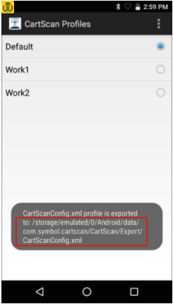

## Overview

This section explains how to configure audio and vibrate options of the device, as well as Profile settings, which control how data is manipulated before and after being sent to the PC.

-----

## Audio and Vibrate Options

CartScan provides control over audio and tactile feedback to indicate each successful scan. This allows audio feedback, for example, to be disabled on the mobile device so as not to disturb patients. The CartScan Home screen displays ON/OFF switches to set audio and vibration feedback when scanning. 

**To configure the audio and vibrate options**:

From the CartScan Home screen, tap Audio and Vibrate switches to set as desired: 

_Configure Audio and Vibrate Options_
 

**Feedback Settings**:

**Audio -** controls beep sound played with each successful scan (default = ON)

**Vibrate -** controls tactile feedback activated with each successful scan (default = OFF)

**Note**: These settings apply only to barcodes scanned with CartScan; sounds and feedback settings of other apps and the system are not effected by these controls.

-----

## Configure Profiles

CartScan behavior is controlled by Profiles, which define how acquired data is processed and delivered to a line-of-business (LOB) application. Profiles also can be used to control cursor movement. For example, the addition of a TAB keystroke at the end of an acquired data string moves the cursor to the next field after the data is deposited into the current field. See the [ADF Keystrokes](#advanceddataformatting) section of this page for more information. 

**IMPORTANT: <u>Do not modify CartScan Profile settings from within DataWedge on the mobile device</u>**. Doing so results in unpredictable CartScan behavior. 

-----

**To view/edit a Profile**:

1. On the mobile device, locate and **tap the CartScan icon**:

 
2. **Tap Menu > Profiles**. 

 
3. The Profiles list appears. 
**Tap and hold "Default"**:

 
4. For Profiles other than "Default," select "Rename" or "Delete" options as needed:

 
4. For editing, **tap "Edit Profile"** to view and/or edit the Profile settings:

 
5. **Configure Profile settings and Data Formating** as required:  

 

**Profile Settings**:

**Ignore Session Timeout -** maintain the connection indefinitely (or until the user exits the CartScan app or the mobile device moves out of range). **Disabling the session timeout is strongly discouraged**.

**Session Timeout -** sets the length of time (from 1 - 60 minutes) to maintain the Bluetooth connection between the mobile device and the PC during periods of inactivity. **Default = 2 minutes**. Active only when Ignore Session Timeout is disabled.  

**Enable/disable BT Output -** provides a measure of security by restricting delivery via Bluetooth of acquired data to the application running on a PC. If this setting is disabled, the scanned data is not delivered to the connected PC.

**Profile Notes**: 

* The Default Profile cannot be renamed or deleted
* **If** `AllowProfileEditing` **option is set to false**:
 * Profile settings can be viewed but not changed
 * Rename and Delete options are not available
* If a Profile is renamed using a name that already exists, an error occurs

-----

### Data Formatting

Data formatting provides an easy way to append or prepend acquired data with custom values or keystrokes before passing it to the LOB application on the PC. This can be useful for adding application-specific characters to acquired data or for sending an ENTER and/or TAB character after submitting the data to advance the cursor to the next field.

**IMPORTANT: <u>Do not modify CartScan Profile settings from within DataWedge on the mobile device</u>**. Doing so results in unpredictable CartScan behavior. 

**Enable/disable data formatting -** controls access to Basic or Advanced Data Formatting functions. If Data Formatting is not enabled, scanned data is passed to the LOB application without modification or extra keystrokes.

-----

### Basic Data Formatting

Appends or prepends acquired data with a simple set of values and special keystrokes. 

**Prefix to data -** adds (prepends) the specified character(s) to the beginning of the acquired data before sending.

**Suffix to data -** adds (appends) the specified character(s) to the end of the acquired data before sending.

**Send as hex -** sends the data in hexadecimal format. For example, if the acquired barcode data is 012345, this option sends the hex equivalent of 303132333435.

**Send as Upper Case -** sends the data in all caps. For example, if the acquired barcode data is abcde, this option sends the string of ABCDE. Any selected prefix and/or suffix data also is converted to upper case, as appropriate.

**Send TAB key -** appends a TAB character to the processed data.

**Send ENTER key -** appends an ENTER character to the processed data.

-----

### Advanced Data Formatting

Append or prepends acquired data with special characters and keystrokes such as functional keys, mouse clicks, spaces and num-lock characters.

**Prefix ADF Rule -** Can be configured as displayed in the following table. Keys can be selected from the scrolling list without manually entering the details.

**Suffix ADF Rule -** Can be configured as displayed in the following table. Keys can be selected from the scrolling list without manually entering the details.

**NOTE**: ADF keystrokes are visible only in the LOB application on the PC and not in the CartScan app.

-----

### Supported ADF Keystrokes

**Only the Advanced Data Formatting options listed <u>in this table</u> are supported**.

<table class=MsoNormalTable border=0 cellspacing=0 cellpadding=0
 style='margin-left:59.7pt;border-collapse:collapse'>
 <tr style='height:20.0pt'>
  <td width=224 valign=top style='width:168.0pt;border:solid black 1.0pt;
  padding:0in 0in 0in 0in;height:20.0pt'>
  
ALT 2

  </td>
  <td width=224 valign=top style='width:168.0pt;border:solid black 1.0pt;
  border-left:none;padding:0in 0in 0in 0in;height:20.0pt'>
  
LEFT ARROW
  Key

  </td>
  <td width=224 valign=top style='width:168.0pt;border:solid black 1.0pt;
  border-left:none;padding:0in 0in 0in 0in;height:20.0pt'>
  
Browser Back Key

  </td>
 </tr>
 <tr style='height:20.0pt'>
  <td width=224 valign=top style='width:168.0pt;border:solid black 1.0pt;
  border-top:none;padding:0in 0in 0in 0in;height:20.0pt'>
  
ALT [A-Z]

  </td>
  <td width=224 valign=top style='width:168.0pt;border-top:none;border-left:
  none;border-bottom:solid black 1.0pt;border-right:solid black 1.0pt;
  padding:0in 0in 0in 0in;height:20.0pt'>
  
UP ARROW
  Key

  </td>
  <td width=224 valign=top style='width:168.0pt;border-top:none;border-left:
  none;border-bottom:solid black 1.0pt;border-right:solid black 1.0pt;
  padding:0in 0in 0in 0in;height:20.0pt'>
  
Browser Refresh Key

  </td>
 </tr>
 <tr style='height:20.0pt'>
  <td width=224 valign=top style='width:168.0pt;border:solid black 1.0pt;
  border-top:none;padding:0in 0in 0in 0in;height:20.0pt'>
  
ALT [

  </td>
  <td width=224 valign=top style='width:168.0pt;border-top:none;border-left:
  none;border-bottom:solid black 1.0pt;border-right:solid black 1.0pt;
  padding:0in 0in 0in 0in;height:20.0pt'>
  
RIGHT ARROW
  Key

  </td>
  <td width=224 valign=top style='width:168.0pt;border-top:none;border-left:
  none;border-bottom:solid black 1.0pt;border-right:solid black 1.0pt;
  padding:0in 0in 0in 0in;height:20.0pt'>
  
Browser Stop Key

  </td>
 </tr>
 <tr style='height:20.05pt'>
  <td width=224 valign=top style='width:168.0pt;border:solid black 1.0pt;
  border-top:none;padding:0in 0in 0in 0in;height:20.05pt'>
  
ALT ]

  </td>
  <td width=224 valign=top style='width:168.0pt;border-top:none;border-left:
  none;border-bottom:solid black 1.0pt;border-right:solid black 1.0pt;
  padding:0in 0in 0in 0in;height:20.05pt'>
  
DOWN ARROW
  Key

  </td>
  <td width=224 valign=top style='width:168.0pt;border-top:none;border-left:
  none;border-bottom:solid black 1.0pt;border-right:solid black 1.0pt;
  padding:0in 0in 0in 0in;height:20.05pt'>
  
Browser Search
  Key

  </td>
 </tr>
 <tr style='height:20.0pt'>
  <td width=224 valign=top style='width:168.0pt;border:solid black 1.0pt;
  border-top:none;padding:0in 0in 0in 0in;height:20.0pt'>
  
Control-break processing

  </td>
  <td width=224 valign=top style='width:168.0pt;border-top:none;border-left:
  none;border-bottom:solid black 1.0pt;border-right:solid black 1.0pt;
  padding:0in 0in 0in 0in;height:20.0pt'>
  
PRINT SCREEN Key

  </td>
  <td width=224 valign=top style='width:168.0pt;border-top:none;border-left:
  none;border-bottom:solid black 1.0pt;border-right:solid black 1.0pt;
  padding:0in 0in 0in 0in;height:20.0pt'>
  
Browser Favorites Key

  </td>
 </tr>
 <tr style='height:20.0pt'>
  <td width=224 valign=top style='width:168.0pt;border:solid black 1.0pt;
  border-top:none;padding:0in 0in 0in 0in;height:20.0pt'>
  
BACKSPACE Key

  </td>
  <td width=224 valign=top style='width:168.0pt;border-top:none;border-left:
  none;border-bottom:solid black 1.0pt;border-right:solid black 1.0pt;
  padding:0in 0in 0in 0in;height:20.0pt'>
  
INS Key

  </td>
  <td width=224 valign=top style='width:168.0pt;border-top:none;border-left:
  none;border-bottom:solid black 1.0pt;border-right:solid black 1.0pt;
  padding:0in 0in 0in 0in;height:20.0pt'>
  
Browser Start
  and Home Key

  </td>
 </tr>
 <tr style='height:20.0pt'>
  <td width=224 valign=top style='width:168.0pt;border:solid black 1.0pt;
  border-top:none;padding:0in 0in 0in 0in;height:20.0pt'>
  
TAB Key

  </td>
  <td width=224 valign=top style='width:168.0pt;border-top:none;border-left:
  none;border-bottom:solid black 1.0pt;border-right:solid black 1.0pt;
  padding:0in 0in 0in 0in;height:20.0pt'>
  
DEL Key

  </td>
  <td width=224 valign=top style='width:168.0pt;border-top:none;border-left:
  none;border-bottom:solid black 1.0pt;border-right:solid black 1.0pt;
  padding:0in 0in 0in 0in;height:20.0pt'>
  
Volume Mute
  Key

  </td>
 </tr>
 <tr style='height:20.05pt'>
  <td width=224 valign=top style='width:168.0pt;border:solid black 1.0pt;
  border-top:none;padding:0in 0in 0in 0in;height:20.05pt'>
  
ENTER Key

  </td>
  <td width=224 valign=top style='width:168.0pt;border-top:none;border-left:
  none;border-bottom:solid black 1.0pt;border-right:solid black 1.0pt;
  padding:0in 0in 0in 0in;height:20.05pt'>
  
HELP Key

  </td>
  <td width=224 valign=top style='width:168.0pt;border-top:none;border-left:
  none;border-bottom:solid black 1.0pt;border-right:solid black 1.0pt;
  padding:0in 0in 0in 0in;height:20.05pt'>
  
Volume Down Key

  </td>
 </tr>
 <tr style='height:20.0pt'>
  <td width=224 valign=top style='width:168.0pt;border:solid black 1.0pt;
  border-top:none;padding:0in 0in 0in 0in;height:20.0pt'>
  
SHIFT Key

  </td>
  <td width=224 valign=top style='width:168.0pt;border-top:none;border-left:
  none;border-bottom:solid black 1.0pt;border-right:solid black 1.0pt;
  padding:0in 0in 0in 0in;height:20.0pt'>
  
Number Keys [0-9]

  </td>
  <td width=224 valign=top style='width:168.0pt;border-top:none;border-left:
  none;border-bottom:solid black 1.0pt;border-right:solid black 1.0pt;
  padding:0in 0in 0in 0in;height:20.0pt'>
  
Volume Up Key

  </td>
 </tr>
 <tr style='height:20.0pt'>
  <td width=224 valign=top style='width:168.0pt;border:solid black 1.0pt;
  border-top:none;padding:0in 0in 0in 0in;height:20.0pt'>
  
CTRL Key

  </td>
  <td width=224 valign=top style='width:168.0pt;border-top:none;border-left:
  none;border-bottom:solid black 1.0pt;border-right:solid black 1.0pt;
  padding:0in 0in 0in 0in;height:20.0pt'>
  
Alphabet Keys
  [A-Z]

  </td>
  <td width=224 valign=top style='width:168.0pt;border-top:none;border-left:
  none;border-bottom:solid black 1.0pt;border-right:solid black 1.0pt;
  padding:0in 0in 0in 0in;height:20.0pt'>
  
Next Track
  Key

  </td>
 </tr>
 <tr style='height:32.0pt'>
  <td width=224 valign=top style='width:168.0pt;border:solid black 1.0pt;
  border-top:none;padding:0in 0in 0in 0in;height:32.0pt'>
  
ALT Key

  </td>
  <td width=224 valign=top style='width:168.0pt;border-top:none;border-left:
  none;border-bottom:solid black 1.0pt;border-right:solid black 1.0pt;
  padding:0in 0in 0in 0in;height:32.0pt'>
  
Left Windows
  Key (Natural Keyboard)

  </td>
  <td width=224 valign=top style='width:168.0pt;border-top:none;border-left:
  none;border-bottom:solid black 1.0pt;border-right:solid black 1.0pt;
  padding:0in 0in 0in 0in;height:32.0pt'>
  
Previous Track Key

  </td>
<tr style='height:32.0pt'>
  <td width=224 valign=top style='width:168.0pt;border:solid black 1.0pt;
  padding:0in 0in 0in 0in;height:32.0pt'>
  
CAPS LOCK
  Key

  </td>
  <td width=224 valign=top style='width:168.0pt;border:solid black 1.0pt;
  border-left:none;padding:0in 0in 0in 0in;height:32.0pt'>
  
Right Windows Key (Natural Keyboard)

  </td>
  <td width=224 valign=top style='width:168.0pt;border:solid black 1.0pt;
  border-left:none;padding:0in 0in 0in 0in;height:32.0pt'>
  
Stop Media
  Key

  </td>
 </tr>
 <tr style='height:32.0pt'>
  <td width=224 valign=top style='width:168.0pt;border:solid black 1.0pt;
  border-top:none;padding:0in 0in 0in 0in;height:32.0pt'>
  
ESC Key

  </td>
  <td width=224 valign=top style='width:168.0pt;border-top:none;border-left:
  none;border-bottom:solid black 1.0pt;border-right:solid black 1.0pt;
  padding:0in 0in 0in 0in;height:32.0pt'>
  
Applications Key (Natural
  Keyboard)

  </td>
  <td width=224 valign=top style='width:168.0pt;border-top:none;border-left:
  none;border-bottom:solid black 1.0pt;border-right:solid black 1.0pt;
  padding:0in 0in 0in 0in;height:32.0pt'>
  
Play/Pause Media Key

  </td>
 </tr>
 <tr style='height:20.05pt'>
  <td width=224 valign=top style='width:168.0pt;border:solid black 1.0pt;
  border-top:none;padding:0in 0in 0in 0in;height:20.05pt'>
  
SPACEBAR

  </td>
  <td width=224 valign=top style='width:168.0pt;border-top:none;border-left:
  none;border-bottom:solid black 1.0pt;border-right:solid black 1.0pt;
  padding:0in 0in 0in 0in;height:20.05pt'>
  
Computer Sleep
  Key

  </td>
  <td width=224 valign=top style='width:168.0pt;border-top:none;border-left:
  none;border-bottom:solid black 1.0pt;border-right:solid black 1.0pt;
  padding:0in 0in 0in 0in;height:20.05pt'>
  
Start Mail Key

  </td>
 </tr>
 <tr style='height:20.0pt'>
  <td width=224 valign=top style='width:168.0pt;border:solid black 1.0pt;
  border-top:none;padding:0in 0in 0in 0in;height:20.0pt'>
  
PAGE UP Key

  </td>
  <td width=224 valign=top style='width:168.0pt;border-top:none;border-left:
  none;border-bottom:solid black 1.0pt;border-right:solid black 1.0pt;
  padding:0in 0in 0in 0in;height:20.0pt'>
  
Numeric Keypad [0-9]

  </td>
  <td width=224 valign=top style='width:168.0pt;border-top:none;border-left:
  none;border-bottom:solid black 1.0pt;border-right:solid black 1.0pt;
  padding:0in 0in 0in 0in;height:20.0pt'>
  
Select Media Key

  </td>
 </tr>
 <tr style='height:20.0pt'>
  <td width=224 valign=top style='width:168.0pt;border:solid black 1.0pt;
  border-top:none;padding:0in 0in 0in 0in;height:20.0pt'>
  
END Key

  </td>
  <td width=224 valign=top style='width:168.0pt;border-top:none;border-left:
  none;border-bottom:solid black 1.0pt;border-right:solid black 1.0pt;
  padding:0in 0in 0in 0in;height:20.0pt'>
  
Add Key

  </td>
  <td width=224 valign=top style='width:168.0pt;border-top:none;border-left:
  none;border-bottom:solid black 1.0pt;border-right:solid black 1.0pt;
  padding:0in 0in 0in 0in;height:20.0pt'>
  
; Key

  </td>
 </tr>
 <tr style='height:20.0pt'>
  <td width=224 valign=top style='width:168.0pt;border:solid black 1.0pt;
  border-top:none;padding:0in 0in 0in 0in;height:20.0pt'>
  
HOME Key

  </td>
  <td width=224 valign=top style='width:168.0pt;border-top:none;border-left:
  none;border-bottom:solid black 1.0pt;border-right:solid black 1.0pt;
  padding:0in 0in 0in 0in;height:20.0pt'>
  
NUM LOCK
  Key

  </td>
  <td width=224 valign=top style='width:168.0pt;border-top:none;border-left:
  none;border-bottom:solid black 1.0pt;border-right:solid black 1.0pt;
  padding:0in 0in 0in 0in;height:20.0pt'>
  
, Key

  </td>
 </tr>
 <tr style='height:20.05pt'>
  <td width=224 valign=top style='width:168.0pt;border:solid black 1.0pt;
  border-top:none;padding:0in 0in 0in 0in;height:20.05pt'>
  
Subtract Key

  </td>
  <td width=224 valign=top style='width:168.0pt;border-top:none;border-left:
  none;border-bottom:solid black 1.0pt;border-right:solid black 1.0pt;
  padding:0in 0in 0in 0in;height:20.05pt'>
  
SCROLL LOCK
  Key

  </td>
  <td width=224 valign=top style='width:168.0pt;border-top:none;border-left:
  none;border-bottom:solid black 1.0pt;border-right:solid black 1.0pt;
  padding:0in 0in 0in 0in;height:20.05pt'>
  
- Key

  </td>
 </tr>
 <tr style='height:20.0pt'>
  <td width=224 valign=top style='width:168.0pt;border:solid black 1.0pt;
  border-top:none;padding:0in 0in 0in 0in;height:20.0pt'>
  
Decimal Key

  </td>
  <td width=224 valign=top style='width:168.0pt;border-top:none;border-left:
  none;border-bottom:solid black 1.0pt;border-right:solid black 1.0pt;
  padding:0in 0in 0in 0in;height:20.0pt'>
  
Left SHIFT
  Key

  </td>
  <td width=224 valign=top style='width:168.0pt;border-top:none;border-left:
  none;border-bottom:solid black 1.0pt;border-right:solid black 1.0pt;
  padding:0in 0in 0in 0in;height:20.0pt'>
  
. Key

  </td>
 </tr>
 <tr style='height:20.0pt'>
  <td width=224 valign=top style='width:168.0pt;border:solid black 1.0pt;
  border-top:none;padding:0in 0in 0in 0in;height:20.0pt'>
  
Divide Key

  </td>
  <td width=224 valign=top style='width:168.0pt;border-top:none;border-left:
  none;border-bottom:solid black 1.0pt;border-right:solid black 1.0pt;
  padding:0in 0in 0in 0in;height:20.0pt'>
  
Right SHIFT
  Key

  </td>
  <td width=224 valign=top style='width:168.0pt;border-top:none;border-left:
  none;border-bottom:solid black 1.0pt;border-right:solid black 1.0pt;
  padding:0in 0in 0in 0in;height:20.0pt'>
  
/ Key

  </td>
 </tr>
 <tr style='height:21.65pt'>
  <td width=224 valign=top style='width:168.0pt;border:solid black 1.0pt;
  border-top:none;padding:0in 0in 0in 0in;height:21.65pt'>
  
Functional Keys
  [F1-F24]

  </td>
  <td width=224 valign=top style='width:168.0pt;border-top:none;border-left:
  none;border-bottom:solid black 1.0pt;border-right:solid black 1.0pt;
  padding:0in 0in 0in 0in;height:21.65pt'>
  
Left CONTROL Key

  </td>
  <td width=224 valign=top style='width:168.0pt;border-top:none;border-left:
  none;border-bottom:solid black 1.0pt;border-right:solid black 1.0pt;
  padding:0in 0in 0in 0in;height:21.65pt'>
  
` Key

  </td>
 </tr>
 <tr style='height:20.0pt'>
  <td width=224 valign=top style='width:168.0pt;border:solid black 1.0pt;
  border-top:none;padding:0in 0in 0in 0in;height:20.0pt'>
  
Single-quote Key

  </td>
  <td width=224 valign=top style='width:168.0pt;border-top:none;border-left:
  none;border-bottom:solid black 1.0pt;border-right:solid black 1.0pt;
  padding:0in 0in 0in 0in;height:20.0pt'>
  
Right CONTROL Key

  </td>
  <td width=224 valign=top style='width:168.0pt;border-top:none;border-left:
  none;border-bottom:solid black 1.0pt;border-right:solid black 1.0pt;
  padding:0in 0in 0in 0in;height:20.0pt'>
  
[ Key

  </td>
 </tr>
 <tr style='height:20.05pt'>
  <td width=224 valign=top style='width:168.0pt;border:solid black 1.0pt;
  border-top:none;padding:0in 0in 0in 0in;height:20.05pt'>
  
Separator Key

  </td>
  <td width=224 valign=top style='width:168.0pt;border-top:none;border-left:
  none;border-bottom:solid black 1.0pt;border-right:solid black 1.0pt;
  padding:0in 0in 0in 0in;height:20.05pt'>
  
\ Key

  </td>
  <td width=224 valign=top style='width:168.0pt;border-top:none;border-left:
  none;border-bottom:solid black 1.0pt;border-right:solid black 1.0pt;
  padding:0in 0in 0in 0in;height:20.05pt'>
  
] Key

  </td>
 </tr>
</table>

**Only the Advanced Data Formatting options listed <u>in the table above</u> are supported**.

-----

### Unsupported ADF Keystrokes

<table class=MsoNormalTable border=0 cellspacing=0 cellpadding=0
 style='margin-left:59.7pt;border-collapse:collapse'>
 <tr style='height:20.0pt'>
  <td width=224 valign=top style='width:168.0pt;border:solid black 1.0pt;
  padding:0in 0in 0in 0in;height:20.0pt'>
  
CTRL 2

  </td>
  <td width=224 valign=top style='width:168.0pt;border:solid black 1.0pt;
  border-left:none;padding:0in 0in 0in 0in;height:20.0pt'>
  
SELECT Key

  </td>
  <td width=224 valign=top style='width:168.0pt;border:solid black 1.0pt;
  border-left:none;padding:0in 0in 0in 0in;height:20.0pt'>
  
Left MENU
  Key

  </td>
 </tr>
 <tr style='height:20.0pt'>
  <td width=224 valign=top style='width:168.0pt;border:solid black 1.0pt;
  border-top:none;padding:0in 0in 0in 0in;height:20.0pt'>
  
CTRL [A-Z]

  </td>
  <td width=224 valign=top style='width:168.0pt;border-top:none;border-left:
  none;border-bottom:solid black 1.0pt;border-right:solid black 1.0pt;
  padding:0in 0in 0in 0in;height:20.0pt'>
  
PRINT Key

  </td>
  <td width=224 valign=top style='width:168.0pt;border-top:none;border-left:
  none;border-bottom:solid black 1.0pt;border-right:solid black 1.0pt;
  padding:0in 0in 0in 0in;height:20.0pt'>
  
Right MENU
  Key

  </td>
 </tr>
 <tr style='height:20.05pt'>
  <td width=224 valign=top style='width:168.0pt;border:solid black 1.0pt;
  border-top:none;padding:0in 0in 0in 0in;height:20.05pt'>
  
CTRL [

  </td>
  <td width=224 valign=top style='width:168.0pt;border-top:none;border-left:
  none;border-bottom:solid black 1.0pt;border-right:solid black 1.0pt;
  padding:0in 0in 0in 0in;height:20.05pt'>
  
EXECUTE Key

  </td>
  <td width=224 valign=top style='width:168.0pt;border-top:none;border-left:
  none;border-bottom:solid black 1.0pt;border-right:solid black 1.0pt;
  padding:0in 0in 0in 0in;height:20.05pt'>
  
Browser Forward
  Key

  </td>
 </tr>
 <tr style='height:20.0pt'>
  <td width=224 valign=top style='width:168.0pt;border:solid black 1.0pt;
  border-top:none;padding:0in 0in 0in 0in;height:20.0pt'>
  
CTRL ]

  </td>
  <td width=224 valign=top style='width:168.0pt;border-top:none;border-left:
  none;border-bottom:solid black 1.0pt;border-right:solid black 1.0pt;
  padding:0in 0in 0in 0in;height:20.0pt'>
  
Multiply Key

  </td>
  <td width=224 valign=top style='width:168.0pt;border-top:none;border-left:
  none;border-bottom:solid black 1.0pt;border-right:solid black 1.0pt;
  padding:0in 0in 0in 0in;height:20.0pt'>
  
Start Application 1 Key

  </td>
 </tr>
 <tr style='height:20.0pt'>
  <td width=224 valign=top style='width:168.0pt;border:solid black 1.0pt;
  border-top:none;padding:0in 0in 0in 0in;height:20.0pt'>
  
CTRL 6

  </td>
  <td width=224 valign=top style='width:168.0pt;border-top:none;border-left:
  none;border-bottom:solid black 1.0pt;border-right:solid black 1.0pt;
  padding:0in 0in 0in 0in;height:20.0pt'>
  
CLEAR Key

  </td>
  <td width=224 valign=top style='width:168.0pt;border-top:none;border-left:
  none;border-bottom:solid black 1.0pt;border-right:solid black 1.0pt;
  padding:0in 0in 0in 0in;height:20.0pt'>
  
Start Application 2 Key

  </td>
 </tr>
 <tr style='height:20.0pt'>
  <td width=224 valign=top style='width:168.0pt;border:solid black 1.0pt;
  border-top:none;padding:0in 0in 0in 0in;height:20.0pt'>
  
CTRL -

  </td>
  <td width=224 valign=top style='width:168.0pt;border-top:none;border-left:
  none;border-bottom:solid black 1.0pt;border-right:solid black 1.0pt;
  padding:0in 0in 0in 0in;height:20.0pt'>
  
PAUSE Key

  </td>
  <td width=224 valign=top style='width:168.0pt;border-top:none;border-left:
  none;border-bottom:solid black 1.0pt;border-right:solid black 1.0pt;
  padding:0in 0in 0in 0in;height:20.0pt'>
  
+ Key

  </td>
 </tr>
 <tr style='height:32.05pt'>
  <td width=224 valign=top style='width:168.0pt;border:solid black 1.0pt;
  border-top:none;padding:0in 0in 0in 0in;height:32.05pt'>
  
Middle mouse button (three button mouse)

  </td>
  <td width=224 valign=top style='width:168.0pt;border-top:none;border-left:
  none;border-bottom:solid black 1.0pt;border-right:solid black 1.0pt;
  padding:0in 0in 0in 0in;height:32.05pt'>
  
Left mouse button

  </td>
  <td width=224 valign=top style='width:168.0pt;border-top:none;border-left:
  none;border-bottom:solid black 1.0pt;border-right:solid black 1.0pt;
  padding:0in 0in 0in 0in;height:32.05pt'>
  
Right mouse button

  </td>
 </tr>
 <tr style='height:20.0pt'>
  <td width=224 valign=top style='width:168.0pt;border:solid black 1.0pt;
  border-top:none;padding:0in 0in 0in 0in;height:20.0pt'>
  
X1 mouse
  button

  </td>
  <td width=224 valign=top style='width:168.0pt;border-top:none;border-left:
  none;border-bottom:solid black 1.0pt;border-right:solid black 1.0pt;
  padding:0in 0in 0in 0in;height:20.0pt'>
  
X2 mouse
  button

  </td>
  <td width=224 valign=top style='width:168.0pt;border-top:none;border-left:
  none;border-bottom:solid black 1.0pt;border-right:solid black 1.0pt;
  padding:0in 0in 0in 0in;height:20.0pt'>
  
&nbsp;

  </td>
 </tr>
</table>

-----

## Mass Deployment
Once CartScan is set up and configured as desired on a device, settings can be saved to a file and distributed to other devices either manually or using a Mobile Device Management (MDM) system. Profiles created with CartScan will work on all Zebra [devices that support CartScan](../about/#systemrequirements). 

### Export Profiles
Settings for all the Profiles on a device are saved in a single file called `CartScanConfig.xml`. This file can be exported, distributed and imported onto other devices, where its settings are activated automatically. 

**To export Profile settings**:

1. On the mobile device, locate and **tap the CartScan icon**:

 
2. **Tap Menu > Profiles**.

 
3. From the Profiles screen, **Tap Menu again and Tap the "Export Profile to XML"** option:

 
4. **Place checkmark(s) next to the Profile(s) to export**. 
All selected Profiles will appear on the destination device just as they do on the source. 
**Tap "Export"** when all desired Profiles are selected.

 
5. **Make note of the file path** in the confirmation screen that appears:

 

#### Export Notes

* **The config file is saved in the path**:  
`/sdcard/Android/data/com.symbol.cartscan/CartScan/Export/CartScanConfig.xml`
* **The config file can be viewed using the File Browser on the mobile device**.
* **Exported Profiles are always stored with the following settings by default**:  
 * `AllowProfileEditing` = true
 * `RestoreToDefault` = false (see below)
* **Information about the Profile active on the mobile device is not contained in the exported file**. An imported Profile must be set as the active Profile either manually or with an intent (See [Import Notes](#importnotes), below).

-----

### Import Profiles

CartScan configuration (`.xml`) files exported from one mobile device can be imported onto other mobile devices automatically or manually after being pushed to the device using a Mobile Device Management (MDM) system or other means.

**To manually import a config file already on the device**:

1. On the mobile device, locate and **tap the CartScan icon**:

 
2. **Tap Menu > Profiles**.

 
3. From the Profiles screen, **Tap Menu again and Tap the "Import Profile From XML"** option:

 
4. Navigate to the location of the file being imported and select it. For example: 
`/storage/emulated/0/Android/data/com.symbol.cartscan/CartScan/Export/CartScanConfig.xml` 
**Confirm whether to replace the existing Profile** (if so, Tap "Yes"):

 
5. **Tap the HOME key** to quit CartScan. 

> **New settings are applied the next time CartScan is launched**. 

#### Import Notes

* **When importing an exported Profile, the following default settings are imported**: 
 * `AllowProfileEditing` = true
 * `RestoreToDefault` = false
* **`AllowProfileEditing` controls the ability of a device user to make modifications** to Profile settings of an imported file (default = false).
* **When `AllowProfileEditing` is set to FALSE, some menu items are disabled. **This can be undone only by deploying a new configuration file with `AllowProfileEditing` set to TRUE**.
* **`RestoreToDefault` (when true) replaces all existing Profiles on the mobile device** with those of the imported file and resets the default Profile to its default values without user confirmation (default = false). 
* **Remote configuration and importing a Profile XML file locally do not change the active Profile** unless the `RestoreToDefault` parameter is set to TRUE.
* **If RestoreToDefault is set to TRUE, the selected Profile replaces ALL existing Profiles** and is set as the default Profile.
* An imported Profile is not automatically selected as the active Profile.
* **If RestoreToDefault is set to FALSE, new Profiles are added** to the existing Profiles.
* If a Profile of the same name exists on the mobile device as one being imported:
 * A manual import prompts to "Replace "or "Cancel" incoming profile
 * An intent-based import replaces the existing Profile
 

See the [Intents section](#configureintents) for more information about sending and receiving intents.

-----

## Restore Factory Default Settings

To restore CartScan to the factory default settings:
1. On the mobile device, locate and **tap the CartScan icon**:

 
2. **Tap Menu > Profiles**.

 
3. From the Profiles screen, **Tap Menu again and Tap the "Reset to factory defaults"** option:

 
4. **Tap "Restore" to confirm** resetting the device to factory defaults.
5. **Tap the HOME key** to quit CartScan. 

> **New settings are applied the next time CartScan is launched**. 

-----

### Remote Deployment

A Mobile Device Management (MDM) administrator can configure CartScan settings on a device using intents. For example, the following commands push an XML file to the mobile device and start `ConfigIntentService` (using Activity Manager) with the intent extra value pair of `SET_CONFIG_FILE` and  `CartScanConfig.xml` config file itself:

#### Example
	:::term
	adb push CartScanConfig.xml /sdcard/
	adb shell am startservice -a com.symbol.cartscan.ConfigIntentService -e SET_CONFIG_FILE /sdcard/CartScanConfig.xml

**To deploy a `CartScanConfig.xml` file**:

1. **Push the config file to** `/sdcard` on the mobile device.
2. **Send intent to** `com.symbol.cartscan.ConfigIntentService` with the XML file path.
3. **Tap the HOME key** to quit CartScan. 

> **New settings are applied the next time CartScan is launched**. 

-----

## Sample Config File

A sample of the `CartScanConfig.xml` is shown below. This file can be displayed on the mobile device and viewed or edited on a PC using an ordinary text editor. **Note**: Some parameters (as indicated) are not supported in CartScan 2.1. 

	<wap-provisioningdoc>
	<characteristic type="CartScan" version="1.0">
		<parm name="AllowProfileEditing" value="true"/>
		<parm name="RestoreToDefault" value="false"/>
		<parm name=" BTTimeOut " value="1000"/>
		<parm name="EnableLogging" value="true"/> //not supported in CartScan 2.1
			<characteristic type="CartScanProfile">
				<parm name="ProfileName" value="Default"/>
				<parm name="AudioMode" value="2"/> //not supported in CartScan 2.1
				<parm name="HapticMode" value="1"/> //not supported in CartScan 2.1
				<parm name="IgnoreSessionTimeout" value="false"/>
				<parm name="TimeOut" value="2"/>
				<parm name="BTEnable" value="true"/>
				<parm name="DataFormattingEnable" value="true"/>
				<parm name="BdfPrefix" value=""/>
				<parm name="BdfSuffix" value=""/>
				<parm name="BdfSendHex" value="false"/>
				<parm name="BdfSendUpper" value="false"/>
				<parm name="BdfSendTab" value="false"/>
				<parm name="BdfSendEnter" value="false"/>
				<parm name="AdfPrefix" value=""/>
				<parm name="AdfSuffix" value=""/>
			</characteristic>
	</characteristic>

-----

## Configure Intents

A new CartScan configuration can be pushed to a device by sending an intent with the following values:

### Sending an Intent

* **Intent Type -** `StartService`
* **Package Name -** `com.symbol.cartscan`
* **Class Name -** `com.symbol.cartscan.ConfigIntentService`

**Extras**:

* **SET_CONFIG_FILE**: Configuration XML string

#### Example

	:::java
	Intent AdminStartServiceIntent = new Intent(); AdminStartServiceIntent.setComponent(new    ComponentName("com.symbol.cartscan", "com.symbol.cartscan.ConfigIntentService"));
	AdminStartServiceIntent.putExtra("SET_CONFIG_FILE", "<PATH TO CARTSCAN XML CONFIGURATION>");
	startService(AdminStartServiceIntent);

-----

### Receiving an Intent

When the processing completes (or if an error occurs during processing), a Broadcast intent is sent, and can be received by any app registered using the `com.symbol.cartscan.RESPONSE` receiver with the following values: 

* **Intent Type -** `Broadcast`
* **Action Name -** `com.symbol.cartscan.RESPONSE`

**Extras**:

* **STATUS**: Pass or Fail
* **ERROR_MESSAGE**: Error Message
* **CONFIG_XML**: Configuration XML string

#### Example

	:::Java
	<intent-filter>
	<action android:name="com.symbol.cartscan.RESPONSE"/>
	</intent-filter

#### Example

		:::Java
		public void onReceive(Context context, Intent intentReceived) {
		if ( 0 == intentReceived.getAction().compareToIgnoreCase("com.symbol.cartscan.RESPONSE")
		) {
		
		Log.d(TAG, "com.symbol.cartscan.RESPONSE: Status:" + intentReceived.getStringExtra("STATUS"));
		Log.d(TAG, "com.symbol.cartscan.RESPONSE: Error msg:" + intentReceived.getStringExtra("ERROR_MESSAGE"));
		...

-----

## See Also

* [About CartScan](../about)
* [CartScan Setup Guide](../setup)
* [CartScan Usage Guide](../usage)

