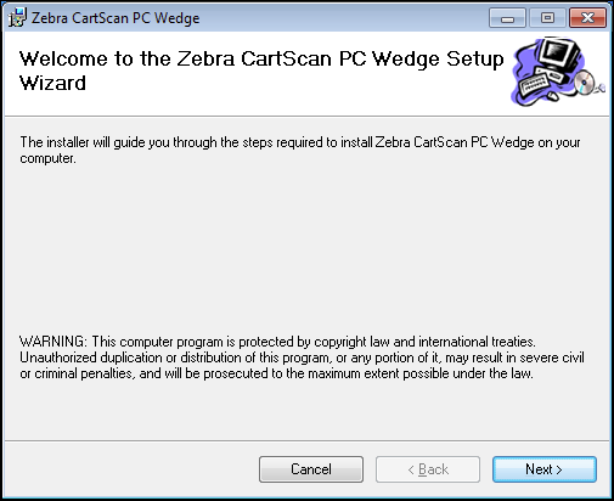
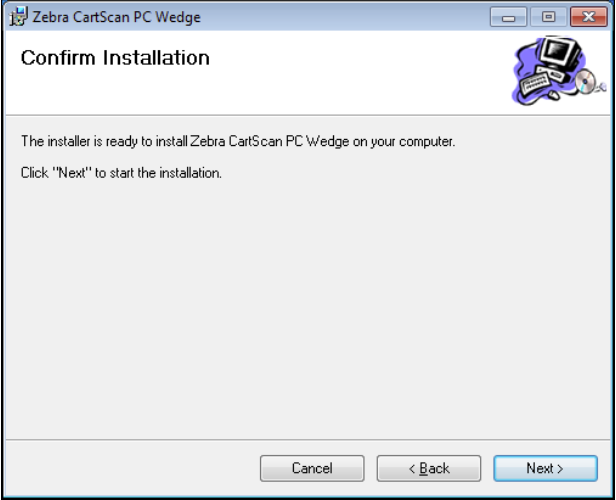
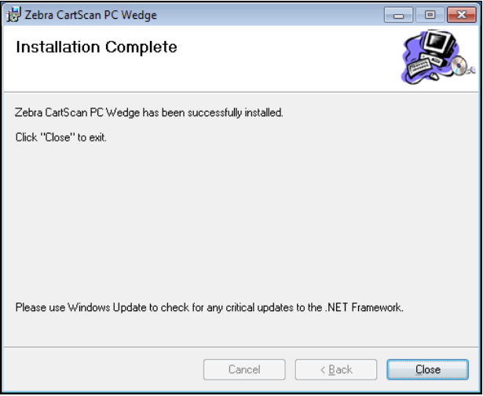
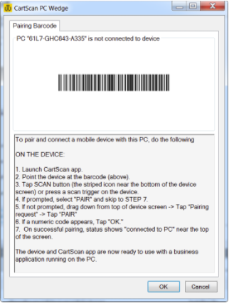
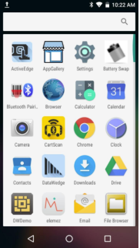
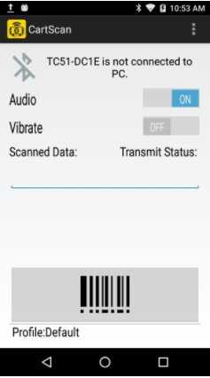
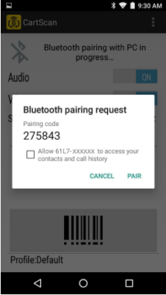
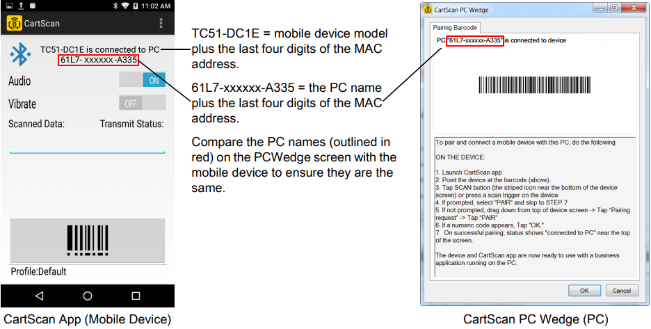

## Overview

After processing a software order, Zebra Software Distribution Services emails an activation ID and software download instructions **to the customer contact provided with the order**. The instructions apply to both CartScanPCWedge (for the PC) and the CartScan app for the Zebra Android device. 

**NOTE**: Target devices must meet the minimum [system requirements](../about/#overview). 

> **Zebra recommends that an IT associate perform first-time setup in advance**.

-----

### First-time Setup 

#### Summary

**After downloading software from the Zebra licensing server**:

1. Run `setup.exe` on Windows PC
2. Install `CartScan.apk` on Zebra mobile device
3. Enable Bluetooth and pair PC with mobile device

-----

### 1. Install on PC

**To install CartScanPCWedge on a PC**:

1. Follow the download instructions emailed by the Zebra Software Distribution Services.
2. Locate and unzip the download package, which includes a `setup.exe` installer. 
3. Launch `setup.exe` to install CartScanPCWedge on a supported PC. The Welcome screen appears:

 
4. **Click Next** to proceed to the "Select Installation Folder" screen. 
5. **Specify the installation folder** or click Browse and navigate to the desired folder. 
6. **Optional**: Select "Disk Cost..." to view the drives onto which CartScanPCWedge can be installed, along with available and required storage for each. Make desired selections and click "OK" to exit Disk Cost screen.
7. **Specify for whom to install** ZebraCartScanPCWedge ("Everyone" or "Just me"). 
8. **Click "Next" when finished** making selections:

  
9. The Confirmation screen appears. **Click "Next" to begin the installation**:

 
10. Upon successful installation, the "Installation Complete" screen appears. **Click "Close"** to dismiss the screen:

 

CartScanPCWedge installation is complete. 

-----

### 2. Install on Mobile Device

**Instructions for downloading and installing CartScan are emailed to the customer contact** provided to Zebra Software Distribution Services along with the original software order. 

**CartScan (`CartScan.apk`) can be downloaded from**:

* [Zebra AppGallery](https://appgallery.zebra.com/showcase/apps/174?type=showcase) 
* [Google Play Store](https://play.google.com/store/apps/details?id=com.symbol.cartscan&hl=en)

CartScan for Android is installed on the device using standard installation procedures. 

-----

### 3. Enable Bluetooth, Pair Devices

Before using the CartScan solution for the first time, the PC and mobile device must be known to each other. Following the initial software installation and Bluetooth activation, the mobile device initiates a Bluetooth pairing request and tries to connect to the PC. Detailed instructions are provided below. 

#### On the PC:

1. **In Windows Bluetooth settings, select "enable Bluetooth"** and **"allow Bluetooth mobile devices to connect"** options. If the PC does not have built-in Bluetooth, insert a Bluetooth dongle and follow the setup instructions that came with it. 
2. **Run the CartScanPCWedge** shortcut from the desktop or click Start > All Programs > Zebra CartScan PC Wedge > CartScanPCwedge.  Instructions appear for connecting the mobile device, including a barcode to scan. 

 
3. After running CartScanPCWedge, **skip to the mobile device instructions**.

_PC screen for pairing with a mobile device_
 

**NOTE**: For best results, remove monitor privacy screen before attempting to scan a barcode.

#### On the mobile device: 

1. From the HOME screen, **tap Settings > Bluetooth**
2. **Slide the Bluetooth switch to ON** position
3. **Tap the HOME** key
4. **Locate and Tap the CartScan app icon**:

_CartScan App icon_
 
5. Use the CartScan app to **scan the barcode displayed on the PC** by pressing the large scan button in the app (or press one of the device's scan triggers).  **NOTE**: For best results, remove monitor privacy screen before attempting to scan a barcode.

_Mobile device not yet connected to PC_
 
6. **Tap PAIR** or follow the prompts for pairing the mobile device with the PC (if connecting for the first time, as shown below).

_Pair mobile device to PC_
 

**When successfully connected, a message appears on the mobile device similar to the one pictured below, left**:

 

>**CartScan is now ready to use**. Go to [User Guide](../usage). 

-----

## Setup Notes 

* Bluetooth pairing dialog appears only if mobile device was not previously paired with that PC.
* Allowing access to contacts and call history (checkbox) is not required for CartScan.
* Multiple mobile devices can be paired via Bluetooth to an individual PC, but only one mobile device can connect to CartScanPCWedge at a time.

-----

## Admin Best Practices

#### Zebra strongly recommends the following best practices for a seamless user experience.  

1. **IMPORTANT: <u>Do not modify CartScan Profile settings from within DataWedge on the mobile device</u>**. Doing so will result in unpredictable CartScan behavior. 
2. **Analyze end-user scanning workflows and create the necessary CartScan Profile(s) in advance**. See [Settings page](../settings) for details.
3. **Before deployment, test CartScan Profile(s)** with the intended line-of-business application(s) to ensure compatibility and desired behavior.
4. **Conduct workflow testing with an end-user representative**, if possible,  
5. **Create the end-user training materials and guidelines** for proper use of CartScan, its features and functions. This minimizes errors when putting CartScan into use.
6. When staging target mobile devices, **always deploy workflow Profiles along with the CartScan app**.
7. **Pair each mobile device to its intended end-user workstation** prior to deployment to end users.  

-----

## Uninstallation

### Remove From PC

**To uninstall CartScanPCWedge from a PC**:

1. Click **Start > Control Panel > Programs**
2. On the Uninstall or change a program screen, locate **"Zebra CartScan PC Wedge" app**
3. **Right-click "Zebra CartScan PC Wedge" and select Uninstall**

### Remove from Mobile Device

**To uninstall CartScan from a mobile device**:

1. **Tap Settings > Apps**
2. **Tap "CartScan"**
3. **Tap "UNINSTALL"**
4. **Tap "OK" to confirm**

-----

## See Also

* [About CartScan](../about)
* [Administrative Guide](../settings)
* [CartScan Usage Guide](../usage)

