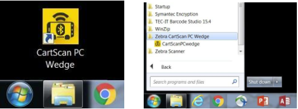

## Setup and Activation

Upon receipt and processing of a valid software order, Zebra Software Distribution Services sends an email with an activation ID and software download instructions to the customer contact provided with the order. Instructions apply to both CartScanPCWedge (for the PC) and CartScan for the Android mobile device. Target devices must meet the minimum [system requirements](../about/#systemrequirements). 

### Install on PC

**To install CartScanPCWedge on a PC**:

1. Follow the download instructions emailed by the Zebra Software Distribution Services.
2. Locate and unzip the download package, which includes a `setup.exe` installer package. 
3. Launch `setup.exe` to install CartScanPCWedge on a supported PC. The Welcome screen appears:

 
4. **Click Next** to proceed to the "Select Installation Folder" screen. 
5. **Specify the installation folder** or click Browse and navigate to the desired folder. 
6. **Optional**: Select "Disk Cost..." to view the drives to which you can install Zebra CartScanPCWedge, along with available and required storage on each drive. Make desired selections and click "OK" to exit Disk Cost screen.
7. **Specify for whom to install** ZebraCartScanPCWedge ("Everyone" or "Just me"). 
8. **Click "Next" when finished** making selections:

  
9. The Confirmation screen appears. **Click "Next" to begin the installation**:

 
10. Upon successful installation, the "Installation Complete" screen appears. **Click "Close"** to dismiss the screen:

 

CartScanPCWedge installation is complete. 

> **Proceed to next section**. 

-----

## Install on Mobile Device

**Instructions for downloading and installing CartScan are emailed to the customer contact** provided to Zebra Software Distribution Services along with the original software order. 

> **Proceed to next section**. 

-----

## Associate the Devices  

Once the CartScan software is installed on a PC and mobile device, the two must be associated before the solution can be used. The first time a mobile device makes contact with a particular PC, it initiates a Bluetooth pairing request and tries to connect. This step can take a some time and technical know-how. 

>**Zebra recommends that an IT associate perform this step ahead of time**.

**IMPORTANT**: Multiple mobile devices can be paired via Bluetooth to an individual PC, but only one mobile device can connect to CartScanPCWedge at a time.

**Associating the mobile device with the PC**

### Enable Bluetooth On PC

**On the PC**:

1. In Windows Bluetooth settings, select "enable Bluetooth" and "allow Bluetooth mobile devices to connect" to the computer. If the PC does not have built-in Bluetooth, insert a Bluetooth dongle and follow the setup instructions that came with it. 
2. Run the CartScanPCWedge application shortcut from the desktop or click Start > All Programs > Zebra CartScan PC Wedge > CartScanPCwedge:

_Run CartScan PC Wedge from Desktop Shortcut or from Start Menu_
 
3. Instructions appear for connecting the mobile device, including a barcode to scan. NOTE: For best scanning results, remove any privacy screens that cover the monitor before scanning a barcode.

_Connect Mobile Device_
 

### Enable Bluetooth On Mobile Device

**On the mobile device**: 

1. From the HOME screen, **tap Settings > Bluetooth**.
2. **Slide the Bluetooth switch to ON** position.
3. **Tap the HOME** key.
4. **Tap All Apps > CartScan**. 

_CartScan App icon_
 
5. Use the CartScan app to **scan the barcode displayed on the PC** by pressing the large scan button in the app (or one of the device's scan triggers).

_Mobile Device Not Yet Connected to PC_
 
6. **Tap PAIR** or follow the prompts for pairing the mobile device with the PC (if connecting for the first time, as shown below).

_Pair Mobile Device to PC_
 

**When successfully connected, a message appears on the mobile device similar to the one pictured below, left**:

 

>**CartScan is ready to use**.

**Notes**: 

* Bluetooth pairing dialog appears only if mobile device was not previously paired with that PC.
* Allowing access to contacts and call history (checkbox) is not required for CartScan.

-----

## Uninstallation

### Remove From PC

**To uninstall CartScanPCWedge from a PC**:

1. Click **Start > Control Panel > Programs**
2. On the Uninstall or change a program screen, locate **"Zebra CartScan PC Wedge" app**
3. **Right-click "Zebra CartScan PC Wedge" and select Uninstall**

### Remove from Mobile Device

**To uninstall CartScan from a mobile device**:

1. **Tap Settings > Apps**
2. **Tap "CartScan"**
3. **Tap "UNINSTALL"**
4. **Tap "OK" to confirm**
