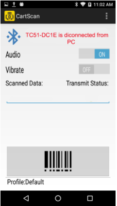
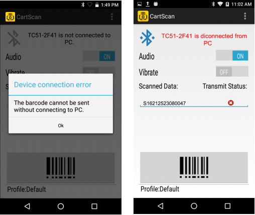

## Overview

CartScan uses Bluetooth to turn a [supported Zebra mobile device](../about/#supporteddevices) into a wireless barcode scanner, sending collected data as keystrokes to a nearby computer running a line-of-business application. CartScan was initially developed for healthcare workers, but has applications in the warehouse, transportation and logistics, and numerous other industries. 

## Using CartScan

This section explains how to use CartScan and CartScanPCWedge. Topics include connecting the mobile device to the PC, performing a successful scan, transferring data to the PC, and re-establishing a Bluetooth connection.

### Connecting the Mobile Device and PC

NOTE:  If the mobile device was not previously paired to the PC before connecting, the user is prompted to pair the mobile device. For pairing instructions, see Post Installation Tasks on page 13.

To connect the mobile device and target PC:
On the target PC, launch the CartScan PC Wedge application.
On the mobile device, launch the CartScan application.
Using the mobile device, scan the barcode displayed on the CartScanPCWedge screen. Once scanned, the mobile device attempts to establish the connection to the PC.
Figure 22	

_Connecting Screen_
 

1:21 PM
Profile selection icon Connection status

Audio/Vibrate toggle buttons

 _	Data scanned/transmit status

Scan button Profile

## Using CartScan

To use CartScan:

Ensure the mobile device and target PC are connected.
Launch the LOB application to receive the intended scan data on the target PC.
Ensure the LOB application is in the foreground (i.e., visible and in front of any other open applications) on the PC monitor.
Place the cursor in the target input field of the LOB application to which scanned data should be deposited.
On the mobile device, select the Profile to be used for the scanning workflow.

Figure 23	

_Profile Selection_
 

Profile selection icon
 
 

Data scanned/transmit status

Scan the desired workflow barcode(s) using the mobile device. The data scanned by the mobile device displays in the scan data field.

NOTE:  When a barcode is successfully decoded by the mobile device, the scanner beeps or vibrates (if enabled). A beep does not reflect the status of the transmission of the scanned data to the PC.

When data is scanned by the mobile device and received by the PC, the CartScan application displays a green check box under Transmit Status (see Figure 23).
On the PC, the user should confirm that the data scanned was delivered properly into the target application. For example, if the cursor was moved, the PC was locked, or another application appeared in the foreground (i.e., visible and in front of any other open applications) of the PC, the data cannot populate into the intended input field.
Acquired data is sent as keystrokes to the PC. The scanned data displays in the Scanned Data field of the application on the mobile device. A green check mark indicates successful transmission of the data to the PC.

Figure 24	

_Successful Scan_
 

To continue scanning data, repeat Step 6 through Step 8. Before scanning, confirm that the mobile device is still connected via Bluetooth to the target PC. If the mobile device goes out of range of the PC or loses connection due to a timeout, a message displays indicating that the mobile device is disconnected from the PC.
Figure 25	

_Mobile Device is Disconnected from PC_
 

NOTE: The disconnect message may not appear immediately. To re-connect, see Re-Establishing the Bluetooth Connection on page 35.

If a barcode is scanned without an active connection to the PC, an alert dialog displays and data is not transmitted to the PC. A red “x” indicates the failure. The scanner still beeps or vibrates (if enabled) and the scan data appears in the Mobile Device Scanned Data field only, but not on the PC.

Figure 26	

_Device Connection Error_
 

	
IMPORTANT:  When workflow scanning is complete, close the CartScan application on the mobile device.

Using CartScan PC Wedge

When CartScanPCWedge launches, the UI screen only displays the Bluetooth connection barcode, the status of the connection, and instructions to pair and connect a mobile device with the PC. When CartScanPCWedge is minimized the UI is no longer visible, even though the application is still running. To restore the UI, click the CartScan icon from the system tray.

The system administrator can enable and disable CartScan (disconnecting the mobile device from the PC), display the pairing barcode to connect (or reconnect) with a mobile device, view the app version and Bluetooth MAC address, and exit the app (and stop the service).

Figure 27	CartScan PC Wedge System Tray

_CartScan PC Wedge System Tray_
 

Click to display CartScan PC Wedge options

BT MAC:	Displays the Bluetooth MAC address of the PC.
Pairing Barcode:	Displays the CartScan UI and instructions for pairing and/or connection.
Enable/Disable CartScan:Starts/stops the CartScan PC Wedge service. When disabled, the CartScan icon turns red.
Disconnect From Device: Drops the Bluetooth connection with the mobile device.
Exit CartScan:	Exits the CartScan PC Wedge application. To re-launch, double-click the
CartScanPCwedge.exe icon on the desktop or Start menu.
About:	Shows CartScan PC Wedge version information.

Re-Establishing the Bluetooth Connection

To re-establish the Bluetooth connection:

On the PC, select the CartScan PC Wedge icon on the system tray (see Figure 27).
Select Pairing Barcode to display the barcode and pairing instructions.

Follow the instructions to connect the mobile device, displayed below the barcode.

Overview
This chapter provides best practices and troubleshooting for the Zebra CartScan and CartScan PC Wedge applications.

## Best Practices
Zebra strongly recommends that IT administrators, workflow managers (when applicable), and end users follow these suggested best practices.
Best Practices for IT Administrators and Workflow Managers

NOTE: DO NOT MODIFY CARTSCAN PROFILES FROM WITHIN DATAWEDGE ON THE MOBILE DEVICE.

Create the necessary CartScan Profile(s) required for the end user scanning workflow(s). See Configuring Profiles on page 19.

Use CartScan Profile(s) to test scanning into the target PC-based workflow applications to ensure compatibility and desired behavior.

Create the proper training materials and guidelines for end users on the proper use of CartScan, its features, and functionality. This minimizes errors when scanning with CartScan.

Deploy the CartScan application along with the required end user workflow Profiles to the target mobile devices.

Prior to deploying the mobile devices to the end user, pair each mobile device to each of the targeted end user workstations.

## Best Practices for the End User
End users should have the proper training material and guidelines to understand how CartScan operates. Below is a list of suggested end user best practices.

Always check the status of the connection before scanning workflow based data as the connection may be dropped due to a variety of reasons such as:

CartScan session timeout expired.
Bluetooth connection issue (for example, the mobile device is out of range to PC, interference, etc.).
Another user disconnected CartScan from the target PC. If the connection dropped, it is necessary to re-scan the Bluetooth Connectivity barcode displayed on the CartScanPCWedge to re-connect to the PC.
The end user should start the CartScan PC Wedge application on the target PC and place the cursor in the target input field where scanned data is deposited. Scanned data is populated into the target field selected so it is important for the end user to ensure that the selection is made properly.
A Bluetooth-connected mobile device can travel about 25 feet from the PC to which it is connected before the connection drops. The end user should confirm:
That they are still connected before they begin to scan
That the scan was transmitted when the scan is complete.
After a scanning operation is conducted using CartScan, the end user should confirm that the scan data was correctly populated into the target input field before moving on.
After connecting CartScan to a PC, the end user should be mindful that no other users interact with the PC. For example, the end user should ensure the cursor is not moved to another input location until the scanning task is complete or the CartScan connection was severed by the CartScan user.

## Troubleshooting

<table class=MsoNormalTable border=0 cellspacing=0 cellpadding=0
 style='margin-left:59.7pt;border-collapse:collapse'>
 <tr style='height:20.05pt'>
  <td width=218 valign=top style='width:163.5pt;border:solid black 1.0pt;
  background:#007BB0;padding:0in 0in 0in 0in;height:20.05pt'>
  
<b>Problem</b>

  </td>
  <td width=237 valign=top style='width:177.8pt;border:solid black 1.0pt;
  border-left:none;background:#007BB0;padding:0in 0in 0in 0in;height:20.05pt'>
  
<b>Possible</b><b> </b><b>Causes</b>

  </td>
  <td width=215 valign=top style='width:161.2pt;border:solid black 1.0pt;
  border-left:none;background:#007BB0;padding:0in 0in 0in 0in;height:20.05pt'>
  
<b>Possible</b><b> </b><b>Solutions</b>

  </td>
 </tr>
 <tr style='height:20.0pt'>
  <td width=670 colspan=3 valign=top style='width:502.5pt;border:solid black 1.0pt;
  border-top:none;padding:0in 0in 0in 0in;height:20.0pt'>
  
<b>Mobile Device</b>

  </td>
 </tr>
 <tr style='height:32.0pt'>
  <td width=218 valign=top style='width:163.5pt;border:solid black 1.0pt;
  border-top:none;padding:0in 0in 0in 0in;height:32.0pt'>
  
Unable to scan
  a barcode symbology.

  </td>
  <td width=237 valign=top style='width:177.8pt;border-top:none;border-left:
  none;border-bottom:solid black 1.0pt;border-right:solid black 1.0pt;
  padding:0in 0in 0in 0in;height:32.0pt'>
  
Invalid barcode.

  </td>
  <td width=215 valign=top style='width:161.2pt;border-top:none;border-left:
  none;border-bottom:solid black 1.0pt;border-right:solid black 1.0pt;
  padding:0in 0in 0in 0in;height:32.0pt'>
  
Check the barcode.

  </td>
 </tr>
 <tr style='height:44.0pt'>
  <td width=218 valign=top style='width:163.5pt;border:solid black 1.0pt;
  border-top:none;padding:0in 0in 0in 0in;height:44.0pt'>
  
After scanning a
  barcode there are unexpected characters in the input
  field on the PC.

  </td>
  <td width=237 valign=top style='width:177.8pt;border-top:none;border-left:
  none;border-bottom:solid black 1.0pt;border-right:solid black 1.0pt;
  padding:0in 0in 0in 0in;height:44.0pt'>
  
A prefix
  and/or suffix was possibly added.

  </td>
  <td width=215 valign=top style='width:161.2pt;border-top:none;border-left:
  none;border-bottom:solid black 1.0pt;border-right:solid black 1.0pt;
  padding:0in 0in 0in 0in;height:44.0pt'>
  
Check the Profile
  on the mobile
  device to confirm it contains the intended prefix/suffix data.

  </td>
 </tr>
 <tr style='height:60.0pt'>
  <td width=218 valign=top style='width:163.5pt;border:solid black 1.0pt;
  border-top:none;padding:0in 0in 0in 0in;height:60.0pt'>
  
After scanning a barcode no data appears in the input
  field on the PC.

  </td>
  <td width=237 valign=top style='width:177.8pt;border-top:none;border-left:
  none;border-bottom:solid black 1.0pt;border-right:solid black 1.0pt;
  padding:0in 0in 0in 0in;height:60.0pt'>
  
Bluetooth connection may be severed.

  
Mobile device
  is out of range of the PC.

  </td>
  <td width=215 valign=top style='width:161.2pt;border-top:none;border-left:
  none;border-bottom:solid black 1.0pt;border-right:solid black 1.0pt;
  padding:0in 0in 0in 0in;height:60.0pt'>
  
Check the Bluetooth connection.

  
Confirm the mobile device
  is within range
  of the PC.

  </td>
 </tr>
 <tr style='height:44.0pt'>
  <td width=218 valign=top style='width:163.5pt;border:solid black 1.0pt;
  border-top:none;padding:0in 0in 0in 0in;height:44.0pt'>
  
Barcodes are not transmitted to the PC.

  </td>
  <td width=237 valign=top style='width:177.8pt;border-top:none;border-left:
  none;border-bottom:solid black 1.0pt;border-right:solid black 1.0pt;
  padding:0in 0in 0in 0in;height:44.0pt'>
  
Bluetooth connection may be severed.

  </td>
  <td width=215 valign=top style='width:161.2pt;border-top:none;border-left:
  none;border-bottom:solid black 1.0pt;border-right:solid black 1.0pt;
  padding:0in 0in 0in 0in;height:44.0pt'>
  
The end user must scan the
  Pairing and Connectivity barcode again
  to re-connect to the PC.

  </td>
 </tr>
</table>