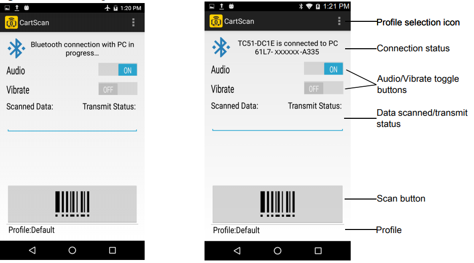
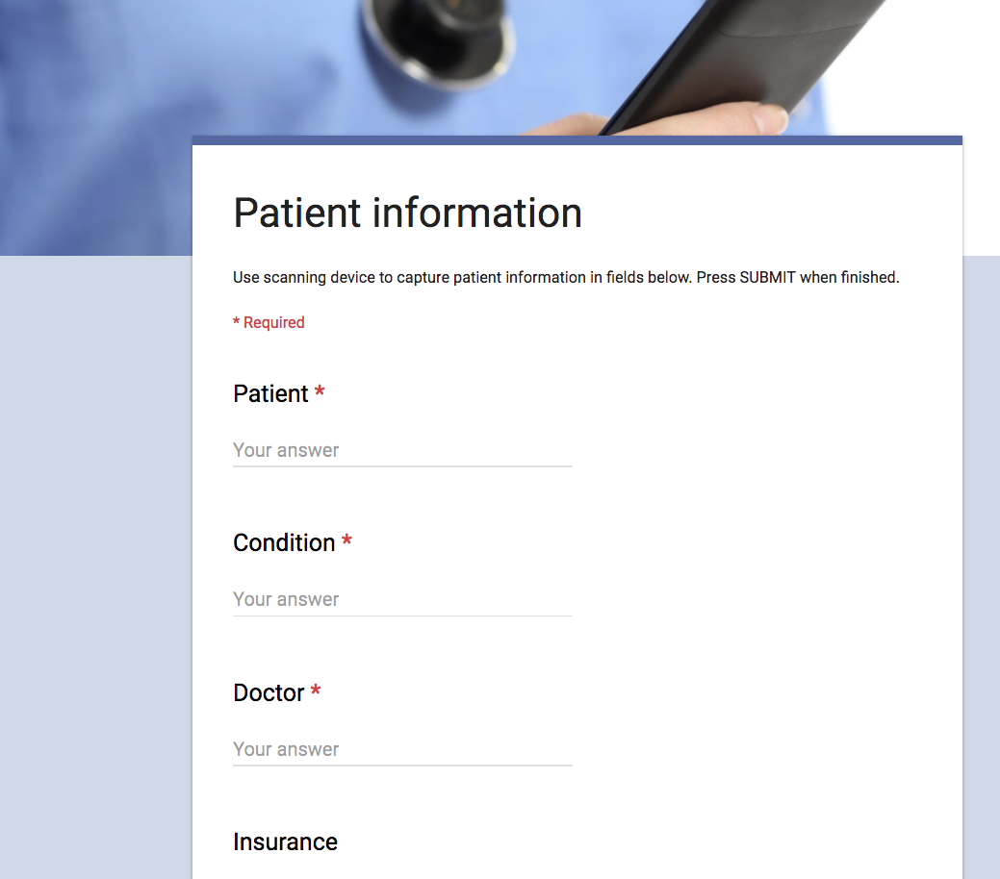
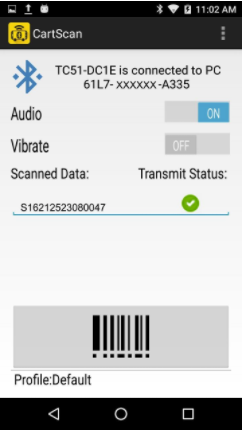
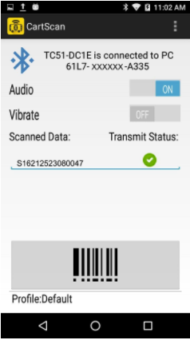
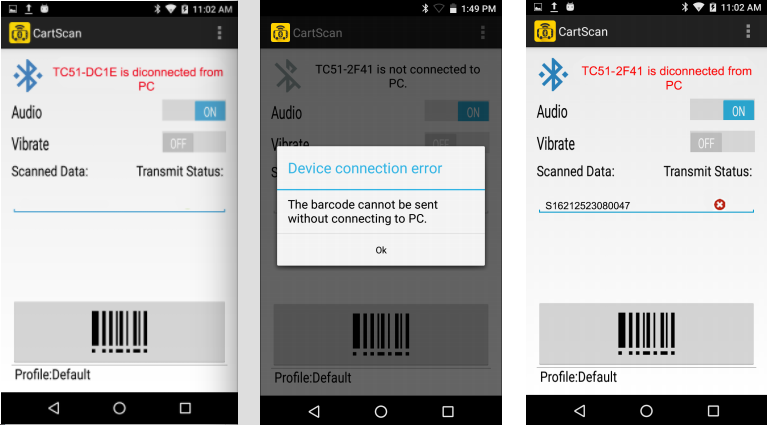
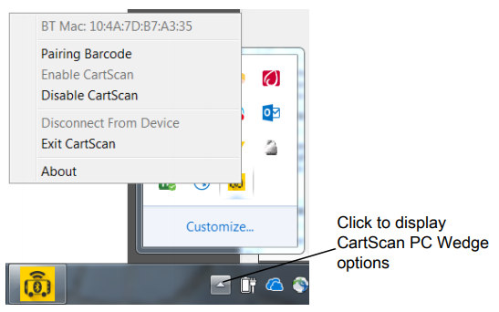
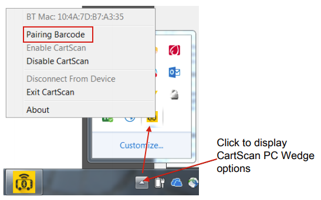

## Overview

CartScan uses Bluetooth to turn a [supported Zebra mobile device](../about/#supporteddevices) into a wireless barcode scanner, sending collected data as keystrokes to a nearby computer running a line-of-business application. CartScan was initially developed for health care workers, but has applications in warehouse, transportation, logistics and numerous other industries. 

-----

### Connecting PC to Mobile Device

**NOTE**: If the mobile device was not previously paired with the PC, see the [Setup guide](../setup/#3enablebluetoothpairdevices).

**To connect the mobile device to target PC**:

1. On the target PC, launch CartScanPCWedge.
2. On the mobile device, launch the CartScan app.
3. Using the mobile device, scan the barcode displayed on the CartScanPCWedge screen. Once scanned, the mobile device attempts to establish the connection to the PC.

_The device connecting message during (left) and after connecting with PC_
 

-----

### Using CartScan

**To use CartScan**:

With the mobile device connected to the target PC:

1. On the target PC, **launch the "line-of-business" app** intended to receive the scanned data.
2. **Place the cursor in the target input field** of the LOB app into which scanned data should be deposited:

 
3. On the mobile device, **select (or confirm) the Profile being used** for scanning:

 
4. **Scan the desired barcode(s)** using the mobile device:

 
5. **Confirm successful transmission of scanned data** to the PC by looking for a green check mark under "Transmit Status" as seen above. 
6. **Repeat Steps 4 and 5** until all data is acquired. [See Notes](#usagenotes). 
7. Close the CartScan app on the mobile device when scanning is complete. 

-----

### Usage Notes

* **When a barcode is successfully decoded by the mobile device**, the scanner beeps and/or vibrates (if enabled). 
* **A <u>beep does not reflect successful transmission</u> of the scanned data to the PC**.
* **Periodically confirm that scanned data is delivered properly** to the target application. 
* **Data will not populate into the intended input field if**: 
 * The PC cursor moves out of the target app or intended field
 * Another application appeared in the foreground
 * The device lost its connection to the PC
 * Windows or a screen saver caused the PC to lock 
* **A red "X" appears under "Transmit Status"** if a barcode is scanned without an active connection to the PC (below, right). 
* **A "&lt;DeviceName&gt; is disconnected from the PC" message appears** if the mobile device goes out of range of the PC or loses connection due to a timeout or other reason. See [reconnecting the device](#reconnectingthedevice).

_Disconnect messages might not appear immediately_
 
	
>Close the CartScan application on the mobile device when workflow scanning is complete. 

-----

## Using CartScanPCWedge

When CartScanPCWedge launches, the UI screen displays the Bluetooth connection barcode, the status of the connection and instructions to pair and connect a mobile device with the PC. When minimized, the CartScanPCWedge app continues to run in the background, and quits only after "Exit CartScan" is selected from its system tray icon. To restore the UI or change its settings, click the CartScan icon from the system tray.

 

#### CartScanPCWedge functions:

**BT Mac**:	Displays the Bluetooth MAC address of the PC.

**Pairing Barcode -** displays the barcode and instructions for connecting (or reconnecting) the PC with a device.

**Enable CartScan -** activates the CartScan service, which monitors the Bluetooth connection for incoming scanner data. 

**Disable CartScan -** Stops the CartScan service and disconnects the PC from the currently connected mobile device. When disabled, the CartScan icon turns red.

**Disconnect From Device -** severs the connection between the PC and the currently connected device. Use this feature to take one device out of service and connect with another.

**Exit CartScan -** Quits CartScanPCWedge, stops the CartScan service and disconnects the PC from the currently connected mobile device. Select this option when scanning is no longer required on the PC. To re-launch, double-click the CartScanPCWedge icon (or `CartScanPCwedge.exe`) from the desktop or Start menu.

**About -**	Displays CartScanPCWedge version information.

-----

### Reconnecting the Device

**To re-establish the Bluetooth connection**:

1. **On the PC, click the CartScanPCWedge icon** in the system tray.  
If CartScanPCWedge is not already running, launch it from the desktop or Start menu. 

 
2. **Select "Pairing Barcode"** to display the barcode and pairing instructions.
3. **Follow the instructions** in the "Pairing Barcode" window.

-----

## End-User Best Practices

Users of Zebra CartScan and CartScanPCWedge applications should have proper training, reference materials and usage guidelines to understand how CartScan works and how to use it. Below is a list of suggested end user best practices.

* **Always check the status of the connection before scanning** (look for "...connected to PC..." message). 
* **Always confirm that data was transmitted after scanning** (green checkmark in CartScan UI).
* **Periodically confirm correct placement of scanned data** into desired fields on the target PC.
* **Do not allow other users to interact with the PC or scanning device** while workflow scanning is in progress. 
* **Close the CartScan app** on the mobile device when scanning is complete.

-----

## Troubleshooting

### Scanned Data Not on PC

* **Possible cause**: Cursor is in the wrong field on PC
* **Solution**: Ensure that the target PC application is in the foreground and the cursor is placed in the target field
* **Possible cause**: BT output is disabled
* **Solution**: Request an IT administrator to check the [Profile Settings](../settings/#configureprofiles) to ensure that "Enable/disable BT Output" is enabled
* **Possible cause**: The mobile device is out of range, has timed out or otherwise lost connection to the PC
* **Solution**: See [Reconnecting the Device](#reconnectingthedevice)

-----

### Lost Connection

* **Possible causes**:
	* CartScan session has timed out
	* Device or PC has moved out of Bluetooth range (about 25 feet)
	* RF interference is blocking the Bluetooth signal 
	* Another user disconnected CartScan from the target PC
* **Solution**: See [Reconnecting the Device](#reconnectingthedevice) to rescan the pairing barcode

-----

### Unable to Scan Barcode

* **Possible cause**: Unrecognized or invalid barcode symbology
* **Solution**: Check for damage or obstructions to the barcode or its label
* **Possible cause**: Defective scanner
* **Solution**: Request an IT administrator to check the device 

-----

### Unexpected Characters in Data

* **Possible cause**: Prefix or suffix data is being added by the selected Profile
* **Solution**: Request an IT administrator to check the profile's [data formatting settings](../settings/#basicdataformatting) 

-----

## See Also

* [About CartScan](../about)
* [CartScan Setup Guide](../setup)
* [Administrative Guide](../settings)

