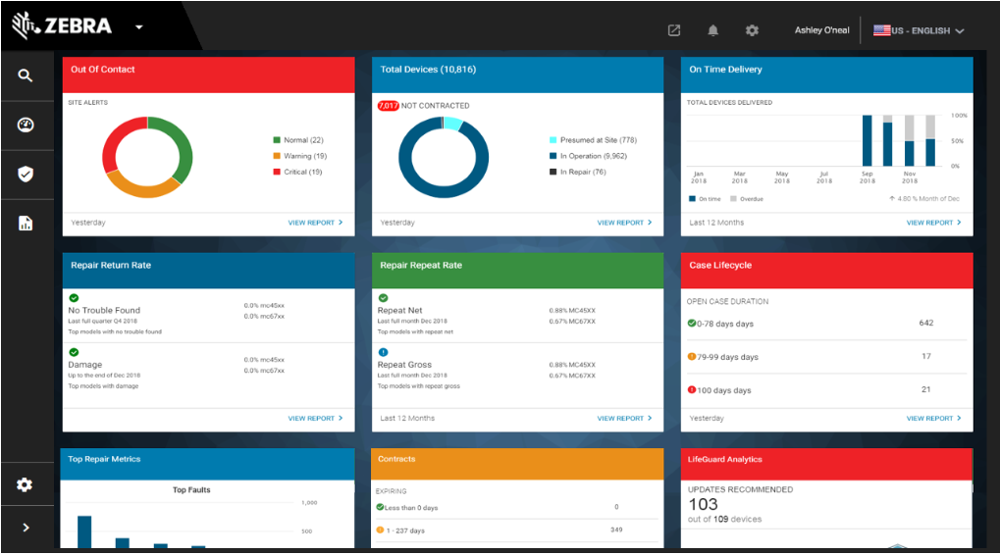
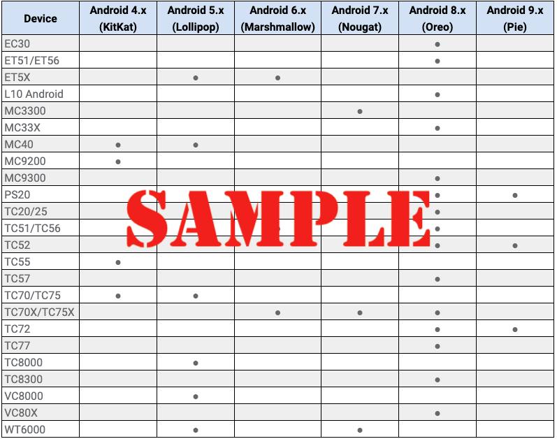

## Overview

The **Common Criteria for IT Security Evaluation** is the [ISO/IEC 15408](https://www.iso.org/standard/50341.html) specification for certifying the security of computing devices and systems. Often referred to as "Common Criteria" or simply "CC," the international standard **"establishes the general concepts and principles of IT security evaluation and specifies the general model of evaluation**," according to the ISO on its web site. It does so in the various sections of the standard, which "**in its entirety is meant to be used as the basis for evaluation of security properties of IT products**," it further states. 

In essence, **Common Criteria specifies a framework under which computing devices can be secured in a consistent way**, allowing system suppliers to credibly claim that their devices behave predictably with regard to security and vulnerability to exploits. The standard also defines terms used, establishes the concept of a **Target of Evaluation (TOE)** and its evaluation context, and describes the intended audience for the evaluation criteria. 

Other Key Concepts include **Protection Profiles**, which package security requirements and the topics of conformance, and **Security Targets**, which define statements of the security needs of a specific TOE in a specific use case. Further, companies adhering to Common Criteria can specify **Security Functional Requirements (SFAs) and **Security Assurance Requirements** (SARs) for specific Security Targets, which can then be evaluated by testing labs to determine whether they meet those claims using standardized and repeatable testing methods. 

-----

FIPS SKU of Supported Device (Android "O" or higher)

Upgrade to A10 

Load LG Patch (will contain additional functionality for CC Mode, if necessary)

Load FDE to FBE Patch:
* **[FBE Package download page](https://zebra.sharepoint.com/:f:/r/sites/SDM660Q/Shared%20Documents/FBE/v2.0?csf=1&web=1&e=xT9ucI)**
* Branch: sdm660q-product-odm
* Steps to convert to FBE:
 1. Flash the device with image from above mentioned artifactory location.
 2. Reboot the device and check the encryption type(ro.crypt.type). The value should be set to 'block'
 3. Reboot the device to recovery
 4. Install Release_FBE_recovery_package_enable_SDM660_Q.zip and reboot the device
 5. Check the encryption type. The value should be set to 'file' after conversion.

~Encrypt Enterprise Partition~ 

~Enterprise Partition Linux Folder Permissions~
F/R

~Encrypt Enterprise Partition~ 

Configure using Mx

Unmount SD Card

StageNow in Trusted mode 

Lock Down Mx

Protect USBMgr

Disable PersistMgr

Disable SDCardMgr

~Disable Batch CSP~

Protect  AccessMgr

Configure Enrollment Network

D/L, Install and Enroll DPC

Lock Down Mx (Continued)

~Disable AppMgr~

Set DPM policies as per MDFPP requirements 

~Block SD Card Access~

Disable creating users 

Enable Audit logging 

~Enable FIPS on Boring SSL~

<!-- Zebra Data Service (ZDS) agent software is a continuous background service running on all supported Zebra devices and is responsible for collecting and uploading analytics data coming from ZDS plug-ins and Zebra-authorized third-party apps. Data is uploaded to the Zebra analytics database every 24 hours by default with transport secured with HTTPS. ZDS updates itself and the ZDS Plug-ins, and can accept configuration changes such as to the upload interval and data-collection events using a barcode scanned by the device. 

_Click image to enlarge; ESC to exit_. 
 

-----

## Data Collected

* Device "Build Fingerprint" including:
 * Device model number
 * Android version
 * Build ID
* Device serial number
* Device usage data 
* OS image, LifeGuard and security patch levels applied
* Available RAM
* Device storage (flash) information and health 
* Battery information and health
* Wi-Fi (WLAN) connection events
* Cellular (WWAN) connection events (if applicable)
* **Data traffic statistics (as applicable) for**: 
 * Bluetooth
 * Cellular (WWAN)
 * Ethernet
 * Wi-Fi (WLAN)
* **Location data (as applicable) for**: 
 * Cellular 
 * GPS
 * Wi-Fi (WLAN)
* System app info and usage
* Zebra app info and usage data, including for:  
 * DataWedge
 * Enterprise Home Screen
 * EMDK for Android 
 * EMDK for Xamarin
 * MX STATS
 * SimulScan
 * StageNow
* Scanner information and usage statistics
* Reboots triggered by the system or an app
* Application Not Responding (ANR) events
 -->
-----
<!-- 
## What's New in v2.0

### Device Support

### New Features

-----

## Version History

### Added in v1.0

-----
 -->
## Supported Devices

ZDS comes preinstalled on the following supported devices with the Android versions indicated. **Devices and/or Android versions not shown here are NOT compatible with ZDS**. Some devices running KitKat require ZDS to be installed manually. Contact [Zebra Support](https://www.zebra.com/us/en/about-zebra/contact-zebra/contact-tech-support.html) for more information.

_Click image to enlarge; ESC to exit_. 
 

-----

## See Also

* **[FAQ](../faq)** | Frequently asked questions about ZDS
* **[ZDS Setup Guide](../setup)** | How to check whether ZDS is enabled
* **[Visibility IQ info page](https://www.zebra.com/us/en/blog/posts/2019/zebra-operational-visibility-services-is-now-visibilityiq-foresight.html)** | Sign up for regular updates

<!-- 
menu:
  items:
    - title: About
      url: /oemconfig/9-3/about
    - title: Setup
      url: /oemconfig/9-3/setup
    - title: FAQs
      url: /oemconfig/9-3/faq
    - title: Managed Configurations
      url: /oemconfig/9-3/mc
    - icon: fa fa-search
      url: /oemconfig/9-3/search -->