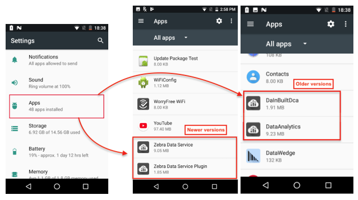

## Overview

The following is a generalized list of the steps required to bring a Zebra device into Common Criteria compliance. **For detailed procedures, please refer to the Zebra [Administrative Guidance Documentation (`.pdf`)](agd.pdf)**. 

0. Upgrade the device to Android 10 (if necessary)
1. Create a StageNow profile to: 
 * Apply the LG Patch for CC compliance 
 * Apply the FDE-to-FBE patch to migrate device from full-disk to file-based encryption
2. Generate and scan barcodes to execute Profiles and apply patches on device
3. Create a second StageNow profile to set device according to CC specifications: 
 * Disable external storage
 * Enable Trusted Staging
 * Protect above settings from changes
 * Download and install Device Policy Controller on device 
 * Launch DPC app and enroll as Device Owner
4. Disable "add new user" function in DPC app
5. Additional device settings for CC compliance: 
 * Require lock screen
 * Disable "Smart Lock"
 * Disable debugging features
 * Disable "app installation from unknown sources"
 * Enable and route all network traffic through a VPN
 * Enable audit logging

### Prerequisites
The following are required to bring a Zebra device into CC state: 

* **One or more [supported devices](#supporteddevices) running Android 10** and with support for Federal Information Processing Standard (FIPS)
* Windows computer with Zebra StageNow 4.2 (or later) installed [go to download page](https://www.zebra.com/us/en/support-downloads/software/utilities/stagenow.html) 
* LifeGuard patch for CC compliance 
* FDE to FBE conversion package

-----

### Supported Devices
The following Zebra devices running Android 10 (kernel 4.4.205) have been brought to a CC-compliant state by Zebra engineers: 

* MC9300 
* TC52
* TC57

The following devices have equivalent hardware to those above and are expected to be capable of CC compliance: 

* CC600
* CC605
* CC610
* CC6000
* EC30
* EC30PR
* EC300K
* ET51
* ET56
* L10A
* L10AW
* MC3300x
* MC3300xR
* MC3300xC
* PS20J
* TC57X
* TC72
* TC77
* TC8300
* TC97
* VC8300 

-----

<!-- devices per input doc:
- TC52, TC72 and MC93 A10 SDM660 FIPS devices
- define FDE and FBE
- 

 -->

<!-- 
FIPS SKU of Supported Device (Android "O" or higher)

Upgrade to A10 

Load LG Patch (will contain additional functionality for CC Mode, if necessary)

Load FDE to FBE Patch:
* **[FBE Package download page](https://zebra.sharepoint.com/:f:/r/sites/SDM660Q/Shared%20Documents/FBE/v2.0?csf=1&web=1&e=xT9ucI)**
* Branch: sdm660q-product-odm
* Steps to convert to FBE:
 1. Flash the device with image from above mentioned artifactory location.
 2. Reboot the device and check the encryption type(ro.crypt.type). The value should be set to 'block'
 3. Reboot the device to recovery
 4. Install Release_FBE_recovery_package_enable_SDM660_Q.zip and reboot the device
 5. Check the encryption type. The value should be set to 'file' after conversion.

~Encrypt Enterprise Partition~ 

~Enterprise Partition Linux Folder Permissions~
F/R

~Encrypt Enterprise Partition~ 

Configure using Mx

Unmount SD Card

StageNow in Trusted mode 

Lock Down Mx

Protect USBMgr

Disable PersistMgr

Disable SDCardMgr

~Disable Batch CSP~

Protect  AccessMgr

Configure Enrollment Network

D/L, Install and Enroll DPC

Lock Down Mx (Continued)

~Disable AppMgr~

Set DPM policies as per MDFPP requirements 

~Block SD Card Access~

Disable creating users 

Enable Audit logging 

~Enable FIPS on Boring SSL~
-->

<!-- 
ZDS comes preinstalled on ***most*** [supported devices and Android versions](../about/#supporteddevices) (some devices running KitKat require ZDS to be installed manually). On factory-fresh devices (or immediately following a [Factory Reset](https://techdocs.zebra.com/mx/powermgr/#enterprisereset)), the Zebra Data Service (ZDA) End-user License Agreement (EULA) wizard appears after the Android Setup Wizard, and in most cases allows ZDS to be turned off (see [Check ZDS Status](#checkzdsstatus) below). To confirm installation and activation, use the instructions below. Contact [Zebra Support](https://www.zebra.com/us/en/about-zebra/contact-zebra/contact-tech-support.html) for information about manual ZDS installation. 

> `IMPORTANT:` **[Bypassing the Android Setup Wizard](https://techdocs.zebra.com/stagenow/latest/Profiles/wipedevice/#setupwizardmanualbypass) also bypasses the EULA Setup Wizard**.

### Data Access

Data is collected and can be viewed by **participating Zebra customers and partners in the form of [Zebra Foresight](https://www.zebra.com/us/en/services/visibilityiq/foresight.html) reports if <u>ALL FOUR</u> of the following requirements are met on all relevant Zebra Android devices**:

* **ELIGIBILITY -** Device(s) must support ZDS agent software. Most Zebra Android devices with
KitKat (or later) come with ZDS preinstalled. See [all supported devices](../about/#supporteddevices).
* **ENABLEMENT -** ZDS agent software must be enabled on the device. Eligible devices are
shipped with ZDS enabled by default. See the [Setup guide](../setup) for more info.
* **CONNECTIVITY -** Device(s) must be connected to the internet at least once every 24 hours to allow data upload.
* **PERMISSION -** The organization's firewall must allow communication with the Zebra data collection server at [analytics.zebra.com](http://analytics.zebra.com) using only `104.198.59.61` on server port 443.

**NOTE**: If Foresight reports appear blank or devices are missing from the reports, confirm that ***ALL***
of the above requirements are met.

-----

## Check ZDS Status 

**Zebra Data Service agent software is enabled by default** on all devices on which it is preinstalled. To confirm that the agent is present and running on a device, display the ZDS toggle (On/Off) switch or display a list of all running apps and services and select the agent to view its status. Instructions for both methods are below. 

### Access ZDS toggle switch 

1. In the Settings panel, **locate and tap the "Zebra" button**.  
This brings up the ZDS info screen: 

_Click image to enlarge; ESC to exit_. 
 
2. **Set the toggle switch as desired** ("On" is shown at right, above). 
 **NOTE**: Data collection cannot be disabled on some devices, including the TC20 and TC25. 
3. If desired, **scroll down to see the last upload event** and a partial list of the data being collected: 

_Click image to enlarge; ESC to exit_. 
 
4. **Tap the left-pointing arrow** to exit the panel. 

> **NOTE**: **<u>Data collection cannot be disabled on some devices</u>**, including the TC20 and TC25. 

-----

### List all running services 

1. In the Settings panel, **locate and tap the "Apps" button**.  
 This displays a list of all apps and services on the device: 
 
 _Zebra Data Services as they appear in Settings > Apps > on older (center) and newer devices_.  
 _Click image to enlarge; ESC to exit_. 
  
2. **Scroll the list until the ZDS components are shown** (as shown above). 
3. **Tap on a service** to view its status and options:  
 
 _Click image to enlarge; ESC to exit_. 
  
4. **Tap on an option to view (or change, if supported) settings** as described below: 
 * **Storage -** Display current usage of agent and device data. **Options**: Clear data, Clear cache.
 * **Data Usage -** Display total, foreground and background data usage. **Options**: Enable/disable: background usage of cellular data, unrestricted data usage when Data Saver is enabled. 
 * **Permissions - Options**: Enable/disable use of device storage. **Plug-in options**: Enable use of Camera, Location, Phone, Storage 
 * **Notifications - Options**: Enable/disable agent notifications; Show notifications without sound and vibration; Override Do Not Disturb setting. 
 * **Open by default -** Reserved for future use. 
 * **Battery -** Display usage statistics. 
 * **Memory -** Display average and current memory usage. 
 * **App details -** Display app origin.  

##### To exit panel, tap left-facing arrow. 
 -->
-----