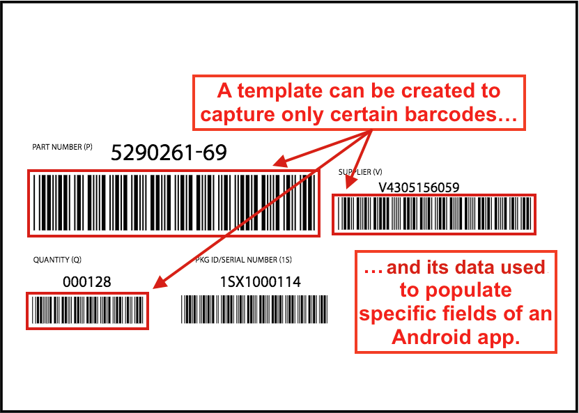
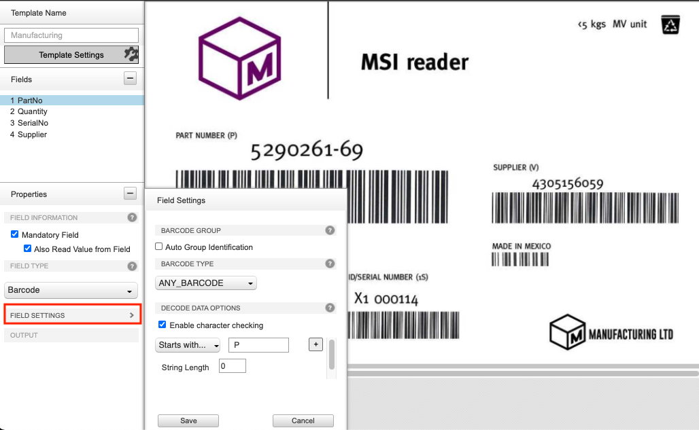
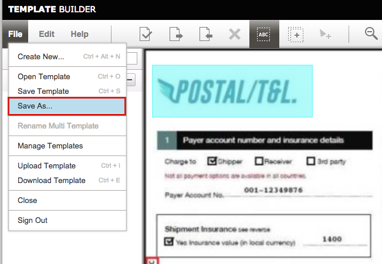

## Overview

Template Builder is a web-based tool for creating templates, which define the information acquired from the DataWedge feature [Document Capture](../input/barcode/#documentselectiondocumentcapturedocumentcapture) and determine how the acquired data will be processed and made available for consumption by applications. When scanning a document with Document Capture, specific data from the document can be acquired based on the defined template.

Document Capture, as part of [NextGen (NG) SimulScan](../input/barcode/#nextgensimulscanconfiguration), is a data capture solution for retrieving data from documents, forms, and labels by scanning barcodes or capturing partial or entire documents as images. Templates are the key to controlling Document Capture features and for processing the acquired data so it can be consumed by an application. Each template is associated with a target document (e.g. shipping receipt, part label) to capture and process as part of a workflow.

This guide provides step-by-step instructions for using the interface of Template Builder to [create Templates](#usingtemplatebuilder) and deploy them to devices.

---

## Requirements

- A Zebra TC51/TC56, TC55, TC70/TC75, TC70x/TC75x, TC8000 device running Android ??
- Camera or supported 2D imager
- DataWedge v8.0.28 or higher configured to access [NG SimulScan](../input/barcode/#nextgensimulscanconfiguration)
- Device with [Mobility DNA license](/licensing), required for NG SimulScan's Document Capture feature

---

## Prerequisites

Before attempting to create a Template, the following assets are required:

- **Sample(s) of the Document(s)** (forms, labels, etc.) for which the Template(s) are being created
- **Photos or image scans** of those same documents (for upload)
- An **account on the [Template Builder web site](https://ng-simulscan.zebra.com)**
- **Camera or 2D Imager is selected under [Scanner Selection](../input/barcode/#scannerselection) in the DataWedge profile** for the Template
- A familiarity with [Template concepts](#abouttemplates)

---

## About Templates

Most acquisition tasks involve capturing data from printed documents, forms or labels. These "target" documents often vary in size, shape and layout, and present a challenge for accurate data acquisition. Templates solve this problem by "teaching" NG SimulScan about the documents it will encounter, and defining how to scan and process data for each instance of that target document.

_Sample document showing Form Region of Interest and Field Region(s) of Interest / Fields_

A Template is associated with a "target" document (e.g. shipping receipt or shipping label) that can contain multiple types of data: barcodes, text fields, images, etc. "Form Region of Interest" defines the border that encompasses all the data on the entire form. "Fields" are defined to identify specific "Field Region(s) of Interest" on the form from which data is to be extracted from. These Fields can contain different types of data (barcode, text, picture, etc.) to be extracted.

The Template is generated based on two types of documents, described in the following subsections:

- **[Image Capture](#imagecapture)**
- **[MultiBarcode](#multibarcode)**

A Template is output as an .xml file containing details about the data to extract and other parameters. They are saved on the Template Builder server, unless downloaded to the local host.

> **Warning: Do not attempt to modify the Template file by hand**. Templates contain machine-generated XML stored in Base64-encoded files, and are not intended to be edited manually.

Using [DataWedge Mgr CSP](/mx/datawedgemgr), templates can be mass deployed to Zebra mobile computers for use by the end-user application employing NG SimulScan.

For step-by-step instructions on Template creation, see [Using Template Builder](#usingtemplatebuilder) below.

### Image Capture

**Image Capture** is used to acquire mixed types of data at once (barcodes, text, images, etc.) when the document to be scanned ("Target") has a fixed layout - the _**location**_ and _**type**_ of data in each field of a Target remain consistent whenever the form is used, and **only the data** changes with each new instance of the form. By creating a Template to uniquely identify each region and data type, NG SimulScan learns what to expect from each region of a form, which allows the developer to map the data from each region to specific fields of an application.

Image Capture Templates are used to:

- **Scan barcodes**, text and other data types from a single form
- **Acquire mixed types of data at once** (barcodes, text, images, signatures, etc.)
- **Capture an image** of the entire form or a region on the form, such as a photo, signature, etc.
- **Detect for presence of a handwritten signature** on the form

Field Types supported for Image Capture:

- **Barcode -** scan single or multiple barcodes in the field of view
- **Picture -** capture signature(s), photo(s), or entire document(s) as an image.

_Example of an Image Capture-type document_.

For example, a company that uses a fixed-format form such as the Postal/T&L example (shown above) would create an Image Capture template to identify the location of each field to be captured and the type of data to be processed from each identified field.
 

### MultiBarcode

**MultiBarcode** is used to acquire data from forms that contain barcodes. This applies to cases where multiple barcodes are required to be captured simultaneously, or specific barcode(s) need to be read from a multitude of barcodes. For the latter, a template can be generated to capture only certain barcode(s) from that form, and use the data captured to populate specific fields within an application.

Scanning performance and workflow can be improved by creating a Template that is configured only for the specific types of barcodes it receives on a regular basis. **MultiBarcode** can simultaneously handle a large number of 1D/2D barcodes of the same or differing symbologies, but works most efficiently if the symbologies are narrowed to just a few.

MultiBarcode Templates are used to:

- **Scan barcode(s)** from a form that can contain multiple barcodes.
- **Scan multiple barcodes simultaneously**
- **Scan a specific barcode** from a multitude of barcodes.
- **Automatically group barcodes** based on a common pattern identified, e.g. same decoder, same data length, same first 1 or 2 characters of data

Field Type supported for MultiBarcode:

- **Barcode -** scan single or multiple barcodes in the field of view

_Example of a MultiBarcode form._
 

For example, a company that receives regular shipments accompanied with a label (like the one above) could create a MultiBarcode Template to map the part number and supplier number from the barcodes in the upper row, and the quantity-received information from the lower row to the corresponding fields of an application.

---

## Using Template Builder

Template Builder is free for Zebra partners and other registered users. Existing Zebra customers, partners and ISVs with access to Partner Central can use their existing credentials to gain access to Template Builder. Others must register using the instructions below. <!-- Credentials are generally sent within one or two business days. -->

### Procedure Overview

Below is a summary of the steps for creating a Template. The process is explained in detail in the sections that follow.

1. **Log in** to the [Template Builder web site](https://ng-simulscan.zebra.com).
2. **Select the Document Type** required and **upload an image** of the Target Document to be scanned (.bmp, .jpg, .png or .pdf; 5MB max.).
3. **Identify Fields** of the Document and the data types (barcode, image) of each.
4. **Configure Field and Template settings**.
5. **Validate the Template** to verify the Fields and properties are set properly.
6. **Save and download** the completed Template(s) to the local host computer.
7. **Copy or deploy Template(s) to the device** that will be performing the scans.
8. **Configure DataWedge** to setup the data so it can be consumed by the application.

---

### 1. Create an Account, Log In

Visit the **[Zebra NG SimulScan registration page](https://signup.zebra.com/register.html?appId=SIMS).** Follow prompts to create a free account and enter all requested information. Once an account is created, Zebra administrators will send login information to the registered address. Zebra recommends planning ahead; this process could take several days.

In a browser, go to the **NG SimulScan Template Builder site: [ng-simulscan.zebra.com](https://ng-simulscan.zebra.com)**. Enter the login credentials. A screen appears similar to the image below:

_Template Builder login screen_
 

<!--

 
-->

---

### 2. Upload Image for Template and Create Fields

Prior to uploading the image for the template, make sure the image was taken with the document placed flat against a constrasting background with the camera perpendicular to the surface, and make sure the image was captured without any shape distortion.

To upload the image for the template:

1. **Select a Document Type**:
   - **[Image Capture](#imagecapture) -** for layouts that do not change from one instance to another and contain different types of data (barcodes, text, images, etc.)
   - **[MultiBarcode](#multibarcode) -** decode multiple barcodes simultaneously or read specific barcode(s) from a multitude of barcodes on the form
2. An Open... dialog appears. Select and **upload an image of the Target Document** for which to create the Template, observing the following parameters:
   - **Supported file types:** .bmp, .jpg, .png or .pdf
   - **Min. resolution:** 640x480
   - **Max. resolution:** 6000x6000
   - **Max. file size:** 5MB
   - **MP size:** 2 MP for MultiBarcode or 3 MP for Image Capture
     For a .pdf, select page number from the drop-down (if necessary)  
     Confirm that the **AutoCrop** feature (enabled by default) has accurately identified the Document boundaries. If boundary adjustments are necessary, click **Disable AutoCrop** and set the blue bounding box so that it is just outside the borders of the Document.
3. Click **OK** when done. The "Form Region of Interest" for the Document is created. After saving the new Template, the uploaded image appears.
4. **Create the Field Regions of Interest, also known as Fields,** by using the mouse cursor crosshair to drag a box from the <u>upper-left corner to the lower-right corner</u> over each region of the Document that contains data to be acquired. Field restrictions:
   - **Image Capture:** maximum of 3 Fields
   - **MultiBarcode:** maximum of 20 Fields
     - **Auto Group Identification:** If one of the MultiBarcode Fields is set with **Auto Group Identification**, this restricts the maximum Fields to 10. _Only 1 Field can be set with **Auto Group Identification**._ If more than 1 Field is set, an error will occur.

**NOTE: Barcode Regions must <u>include only the bars and spaces</u>** - no surrounding characters should be included.

_Example uploading image and designating Fields for Image Capture._
 

**Alternative ways to create Fields**:

- From the menu, select **Edit > Create New Field**. Enter a name for the field and draw a box around the corresponding Region.
- Right-click in the Fields panel and select **Create New Field**. Enter a name for the field and draw a box around the corresponding Region.

_Add a Field to the Template by right-clicking in the Fields panel._
 

---

### 3. Configure Settings

Configure the following settings:

1. **Field Settings -** Provide (or confirm) the following required settings for each Field:
   - A name for the field, if desired
   - Field Information (identify form, mandatory, read value from Field)
   - Field Type (barcode, picture)
   - Field Settings - specific processing-mode settings (decoder type, decoder data options, image adjustments, etc.)
     Available options are described in the following subsections and differ depending on the Document Type: [Image Capture](#imagecapturefieldsettings) or [MultiBarcode](#multibarcodefieldsettings).
2. **Template Settings -** Select the appropriate [Template Settings](#templatesettings) based on the document type: Image Capture or MultiBarcode. Any data related settings apply to all data from the Template.
3. **Save the template** after configuring the settings, select **File > Save Template**. **Save work often!** Unsaved changes could be lost if the screen is dismissed or a session timeout is reached.

<!--

_Click image to enlarge_
 
-->

---

#### Image Capture Field Settings

The Field Properties panel is visible in the far-left column, and presents the Properties of the selected Field. Image Capture is _restricted to a maximum of 3 Fields._
 

##### Field Information

- **Use Field to Identify Form -** designate the Field as an Anchor element, a unique attribute of a Document to positively identify it and determine its orientation relative to the scanner (ie. whether it is upside down). Anchor elements in a given Document remain in the same location and are fixed (do not change), such as a company logo or static text. Enabling this option aids in increasing the accuracy in reading the form in different conditions, e.g. lighting.
  - **Also Read Value from Field -** sets the Template to acquire data from a Field that is designated as an Anchor element (**Use Field to Identify Form** is checked). Enabled by default.
     

##### Field Type: Barcode (used to scan single or multiple barcodes)

- **Field Settings:**
  _ **Barcode Type -** select the barcode decoder. Zebra recommends to select the appropriate decoder to filter out other symbologies and prevent them from being scanned, thus improving performance. If the decoder is not known, select ANY_BARCODE. If a specific decoder is selected, the corresponding decoder options are displayed and the option **Barcode location is fixed** appears.
  _ **Barcode location is fixed -** sets the barcode as an Anchor element to identify the form if the form does not contain a border. See [Template Settings](#templatesettings).
  _ **Enable Character Checking -** enable this to use the barcode data to aid in identification of the barcode with one or more of the following criteria:
  _ **Starts With -** enter character(s) to check for barcodes that begin with the specified character(s) of the acquired barcode data. Leave blank if not needed.
  _ **Contains -** enter character(s) to accept barcodes that contain the specified character(s) at the index position specified in the **at** field (index 0 = the first character).
  _ **String Length -** enter the number of characters the barcode data must contain. Leave blank if not needed.
  _ **Barcode Orientation -** select one of the following if the barcode is known to be rotated in a position other than the default position (0° Portrait):
  _ **0° -** the barcode is right-side up on the form.
  _ **90° -** the barcode is rotated 90 degrees to the left (counterclockwise).
  _ **180° -** the barcode is upside down. \* **270° -** the barcode is rotated 270 degrees to the left (counterclockwise).
   
  
  _Image Capture Field Settings for Barcode._
   

##### Field Type: Picture (used to capture signatures, photos, or entire documents as images)

- **Field Settings (Image Adjustments):**
  - **Brighten Selection -** increase the brightness of the image
  - **Sharpen Selection -** increase the contrast between light and dark regions to bring out features.
  - **Normalize Selection -** change the range of pixel intensity values to increase the contrast, e.g. in cases of poor contrast due to glare
  - **Compress output image -** enter the percentage to compress the file
- **Signature Presence -** detect for the presence of a handwritten signature
- **Output:** select the orientation to rotate the output of the region:
  _ **0° -** the barcode is right-side up on the form
  _ **90° -** the barcode is rotated 90 degrees to the left (counterclockwise)
  _ **180° -** the barcode is upside down
  _ **270° -** the barcode is rotated 270 degrees to the left (counterclockwise)
   
  
  _Image Capture Field Settings for Picture._
   

---

#### MultiBarcode Field Settings

MultiBarcode is _restricted to a maximum of 20 Fields._ If one of the MultiBarcode Fields is set with **Auto Group Identification**, this restricts the maximum Fields to 10. _Only 1 Field can be set with **Auto Group Identification**._ If more than 1 Field is set, an error will occur.

##### Field Information

- **Mandatory Field -** the barcode field must be present on the Target document. Enabled by default. Disable this option if the barcode field is not required to be present.
  - **Also Read Value from Field -** sets the Template to acquire data from a Field that is designated as a **Mandatory Field**.

##### Field Type: Barcode (used to scan single or multiple barcodes)

- **Auto Group Identification -** rather than defining the decode data options of the group (e.g. Starts With or Contains), NG SimulScan can automatically group (n) number of barcodes when a common pattern is detected, such as same decoder, same first 1 or 2 characters of data, and same string length. _Restricted to a maximum of 10 Fields per group._ The quantity (n) of the group of common barcodes is not fixed; the quantity will change but is dictated by one of the following quantity options:
  - **Barcode -** a separate mandatory “Quantity Barcode”, specifying the quantity of barcodes to capture, must be present on the Document along with the data barcode. The Quantity Barcode must: 1) start with the letter "Q" or "q", and 2) barcode length must be 3 digits or less.
  - **Return quantity barcode data with results -** the quantity of barcodes is output along with the scanned barcode data
  - **User/System Defined -** set the quantity through the DataWedge UI under [Template params](../input/barcode/#eautogroupidentification) or with DataWedge [SetConfig](../api/setconfig) intent API by setting common_barcode_dynamic_quantity to the desired quantity.
- **Barcode Type -** select the barcode decoder. Zebra recommends to select the appropriate decoder to filter out other symbologies and prevent them from being scanned, thus improving performance. If the decoder is not known, select ANY_BARCODE. If a specific decoder is selected, the corresponding decoder options are displayed.
- **Enable Character Checking -** uses the barcode data to aid in identification of the barcode with the following option(s):
  - **Starts With -** enter character(s) to check for barcodes that begin with the specified character(s) of the acquired barcode data. Leave blank if not needed.
  - **Contains -** Enter character(s) to accept barcodes that contain the specified character(s)
  - **String Length -** Enter the number of characters the barcode data must contain. Leave blank if not needed.

_MultiBarcode Field Settings._
 

---

#### Template Settings

The Template Settings panel is used to configure settings such as form identifier, output, image correction and other settings that apply generally across the Template.

**To access the Template Settings panel**:

1. Log into the [Template Builder web site](https://ng-simulscan.zebra.com).
2. Open the Template in need of settings adjustment.
3. Click on **Template Settings** or from the top menu select **Edit > Template Settings.**
4. Adjust settings as needed according to descriptions that follow depending on the Document Type of the Template.
    

##### Image Capture Template Settings

- **Form Identifier -** determines how the form is identified, based on the presence of:

  - **Border -** detects if the form has an enclosed border; a border line is present, enclosing the contents of the form. The form must have black borders surrounding all four sides or be bordered by a contrasting background, otherwise the document cannot be captured.
  - **Anchor Barcode -** detects for the presence of an Anchor Barcode, a barcode that is located in a fixed location across different types of the same form (yet can contain different data). Other Fields on the form (e.g. signature, address) are output as cropped images.

- **Output Entire Form -** output the entire form as an image, along with the extracted data. Enabling this option affects scanning performance.

  - **Output Form As Region -** the entire form is output as a region. ?? Use cases? [May not be used by DW. Wajra to check.]
  - **Normalize -** change the range of pixel intensity values to increase the contrast, e.g. in cases of poor contrast due to glare, prior to outputting the entire form
  - **Advanced Image Correction –** enable image correction to parse targets that are slightly curved or crumpled.

- **Reset all Settings -** reset all template settings to the default settings.
    

_Template Settings for Image Capture._
 

##### MultiBarcode Template Settings

- **Data Formatting:**

  - **Prefix to Data -** enter alphanumeric character to prepend to each data captured prior to output
  - **Suffix to Data -** enter alphanumeric character to append to each data captured prior to output

- **Variable Field Presence Template Timeout -** applies to barcodes that are optional and not required to be present in the form (Mandatory Field is disabled). If the mandatory barcode is present with an optional barcode, then both are decoded. If the mandatory barcode is present without an optional barcode, then the mandatory barcode is decoded. After all mandatory barcodes are scanned, optional barcodes are then scanned, for which more time is required to process whether or not these optional barcodes are present. Select one of the following time-out levels:
    <ul>
    <li><b>Low -</b> least amount of time to scan for optional barcodes. For example, 5 barcodes or less are present on the form, and the barcodes are close to each other and can be decoded in a single field of view without the need to move the device to decode.</li>
    <li><b>Medium -</b> in-between the least and most amount of time to scan for optional barcodes. For example, 10 barcodes or less are present on the form, and the barcodes are close to each other and cannot be decoded in a single field of view, requiring the device to be physically moved slightly while aiming to capture all Fields of interest.</li>
    <li><b>High -</b> mount amount of time to scan for optional barcodes. For example, 20 barcodes or less are present on the form and the barcodes are located far from each other, requiring the device to be physically moved significantly while aiming to capture each barcode.</li>
    </ul>

_Template Settings for MultiBarcode._

---

### 4. Validate Template

Template Builder provides a Validation feature, which verifies template Fields and returns useful information about Field properties and settings prior to actual use.

**To Validate Template**:

Open the Template to be validated and select **Edit > Validate Template.**

A Validation Summary is displayed with one of more of the following messages:

**Form Decoded:**

- The Template successfully identified the target Document.
- At least two Fields have been designated "Use field to identify the form" to identify the document.
- Barcode Field(s) designated as “Use field to identify the form" use a supported decoder and its length is within the supported range.
- The uploaded image of the target Document is clear and its resolution is correct (2 MP for MultiBarcode, 3 MP for Image Capture).

**Key field(s) identified in template**:

- Required attribute(s) (e.g. name, number) found for each marked region.

**Final result**:

- (√) = "Success!"
- (X) = "Error!"

_Validation Summary showing success._
 

---

#### Validation Preview

Following validation, test results can be reviewed by clicking on **View Preview** button as in the image below.

The image below shows a validation preview. Clicking on any Field in the image area displays in the left-hand column the data that is parsed by that Field.

_Validation Preview of an Image Capture sample._

<!-- 
  -->

---

#### Validation Troublshooting

The Validation process may fail due to any of the following reasons, based on the template type.
  

##### Image Capture Templates

For Anchor Barcode-based forms:

- **Error Message:** "Anchor barcode orientation is not properly set." 
  **Suggested Solution:** Properly set the orientation of the anchor barcode.
- **Error Message:** "Contents are widely spread." 
  **Suggested Solution:** If the contents on the form are widely spread apart, one Anchor barcode may not be sufficient. More than one Anchor barcode would be required.

For Border-based forms:

- **Error Message:** "Form image is not cropped properly." 
  **Suggested Solution:** If **Auto Crop** does not crop the image of the form properly, disable **Auto Crop** and manually crop the image.
    

##### MultiBarcode Templates

- **Error Message:** "Image Resolution is too poor for barcodes fields to be processed/decoded." 
  **Suggested Solution:** Download the template to the device and perform a test with a physical label. If it fails, try recreating the template with a better image resolution.
- **Error Message:** "At least one Template Field cannot be found (i.e. it is looking for a barcode with character checking and it is not found)." 
  **Suggested Solution:** Decode each barcode individually on the form to ensure that all the rules of the template can be met. If at least one field is missing, then the Template will not work.
- **Error Message:** "One or more Barcodes are damaged and cannot be decoded." 
  **Suggested Solution:** Ensure that each barcode can be decoded with the mobile computer. Once validated, the template should work successfully on the device. If the barcode cannot be decoded on the device, then try another label that can be decoded.
   

---

### 5. Deploy Templates

After settings are configured and validated, select **File > Download Template** to download a copy to the local host. **Zebra recommends testing all Templates before deployment to devices** to ensure proper operation.

Once downloaded, the Template can be deployed to mobile computer devices. [DataWedge Mgr CSP](/mx/datawedgemgr) generates the XML file to be used by [StageNow](../../../../stagenow) or an EMM (Enterprise Mobile Management) system to deploy to the devices. Refer to:

- [Import NextGen SimulScan Templates](../admin/#importnextgensimulscantemplates)
- [NG SimulScan Template Action](/mx/datawedgemgr/#ng-simulscan-template-action)

---

### 6. Configure DataWedge

Configure the DataWedge profile for the Template as follows:

- Ensure Camera or 2D Imager is selected under [Scanner Selection](../input/barcode/#scannerselection).
- [NextGen SimulScan Configuration](../input/barcode/#nextgensimulscanconfiguration) is configured properly.
  _ **[Document Selection](../input/barcode/#documentselectiondocumentcapture)** displays the desired Template file.
  _ **[Scanning Mode](../input/barcode/#scanningmodes)** is set to MultiBarcode or Document Capture, depending on the template in use.
  _ If known, select the appropriate **[Decoders](../input/barcode/#decoderselection)** and corresponding parameters to improve scanning performance.
  _ For MultiBarcode templates, set the desired **[MultiBarcode Params](../input/barcode/#multibarcodeparams)**. \* Set other parameters as needed, e.g. UPC/EAN params, Reader params, etc.
  The Template is ready to be used.

---

## Modify a Template

Existing Templates can be modified to address changes that occur to incoming Documents, to allow for workflow changes, to make adjustments to settings based on input from the field, or for any other reason.

> **Warning: Do not attempt to modify the Template file by hand**. Templates contain machine-generated XML stored in Base64-encoded files, and are not intended to be edited manually.

**To modify an existing Template**:

1. Log into the [Template Builder web site](https://ng-simulscan.zebra.com).
2. Click the **Open Template button** or select **File > Open Template** to Open the template to be modified.
3. Edit Template settings as required.
4. Save using **File > Save Template** or **File > Save As...** to create a new version.
5. Test, Validate and Deploy as explained above.

<!--

_Save Template after making modifications._
-->
 

---

**Related Guides**:

- [DataWedge](../../../../datawedge)
