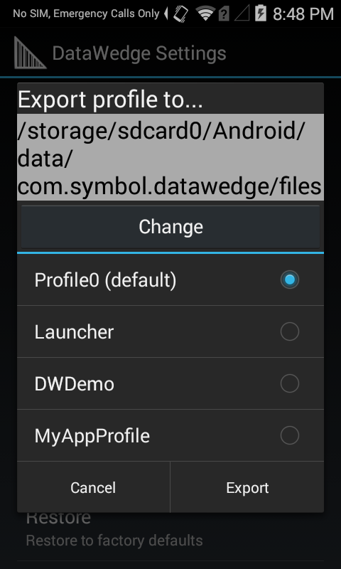

## Overview
This guide covers advanced DataWedge features such as the Import and Export of Profiles and DataWedge configuration files, mass deployment of DataWedge settings to an enterprise, and Advanced Data Formatting, which allows acquired data to be manipulated based on its contents. 

For this guide, a basic knowledge of DataWedge Profiles, Plug-ins and other concepts is required. Please see the [About](..about) and [Setup](../setup) guides for more information.	

## DataWedge Settings Panel
Most of the functionality referenced here is accessed through the DataWedge Settings panel. 

To access DataWedge Settings: 

&49;. From the Profiles screen, **tap the "hamburger" menu and select Settings**. The DataWedge Settings panel appears as in Step 2. 

 

&50;. 

 

**DataWedge enabled -** Controls the DataWedge service. Uncheck this box to disable DataWedge and return control of scanning hardware to the system.

**Enable logging -** Enables DataWedge to output logs for viewing in Logcat, Android Studio or a compatible viewer.

**Import -** Imports a DataWedge configuration file from device Storage, replacing the current configuration.

**Export -** Exports the current DataWedge configuration to device storage.

**Import Profile -** Imports an individual DataWedge Profile from device storage. If a Profile of the same name already exists in DataWedge, it will be replaced by the imported one. 

**Export Profile -** Exports an individual DataWedge profile to device storage.

**Restore -** Returns DataWedge on the device to factory default settings. 

### Logging
DataWedge provides the option of outputting system log messages to the device for viewing through the Logcat command line tool, Android Studio or another compatible viewer, usually over a USB connection. 

**To Enable/Disable logging**: 

&#50;. From the DataWedge Settings panel, **tap Enable Logging** to enable or disdable logging as desired. 

 

### Import Configuration
DataWedge can accept settings created on another device and distributed throughout an entperirse by importing a DataWedge Configuration file. This file contain Profiles, Plug-ins and other DataWedge settings stored on the device in a file called `datawedge.db`.  

**To Import a DataWedge Confoguration file**:    

&#49;. From the DataWedge Settings panel, **tap Import**. A screen appears similar to the one in Step 2, below. 

 

&#50;. **Navigate to the imported file** on device storage using the interface provided:  

Imported settings take effect immediately and overwrite all prior settings.   
 

### Export Configuration
Once DataWedge is set up and configured as desired on a device, its settings file can be exported, distributed to other devices, imported automatically and activated immediately (or manually, as above). 

**To Export a DataWedge Configuration file**: 

&#49;. From the DataWedge Settings panel, **tap Export** as highlighted below. A screen appears similar to the one in Step 2. 

 

&#50;. If more than one storage device exists, **navigate to the desired storage device and tap Export**. Only the storage device may be selected; the path will be inserted automatically.  

 

Exported file can now be distributed to other devices manually or by using a Mobile Device Management (MDM) system. 

### Import a Profile
describe the value

&#49;. From the

 

&#50;. From the

 

### Export a Profile
describe the value

&#49;. From the

 
&#50;. From the

 

### Export a Profile
describe the value 

**This action cannot be undone**. 

&#49;. From the

 

&#50;. From the

 

Touch  Menu > Settings.

DataWedge Settings Screen
Figure 21. DataWedge Settings Window

Import Configuration File
To import a DataWedge configuration file:

Copy the configuration file to a location in the file system.

Touch  Home > DataWedge.

Touch  Menu > Settings > Import.

Select "datawedge.db" file if it is exist in the files browser dialog. Use ., .. and folder entries to browse and select the required DataWedge configuration file. The configuration file (datawedge.db) is imported and replaces the current configuration.

Export Configuration File
To export a DataWedge configuration file:

Touch  Home > DataWedge.

Touch  Menu > Settings > Export.

Touch Export button to export the DataWedge configuration file to the predefined location(s) in the device. Default location is /storage/sdcard0/Android/data/com.symbol.datawedge/files. If the external SD card is available the second location will be listed: /storage/sdcard1/Android/data/com.symbol.datawedge/files.

Import Profile Configuration File
To import a DataWedge profile configuration file:

Copy the profile configuration file to the root of the mobile computer device Storage.

Touch  Home > DataWedge.

Touch  Menu > Settings > Import Profile.

Select the profile configuration file (dwprofile_xxx.db) in the file selection dialog. Use ., .., and Folder entries to browse to the required file in the file system. button to export the DataWedge configuration file (datawedge.db) to to the selected location in the folder browser dialog. Select ., .. and Folders list to select the desired folder to export the configuration.

Note    Profile configuration file must have the dwprofile_ prefix followed by the profile name and the file extention should .db.
Export Profile Configuration File
To export a DataWedge profile configuration file:

Touch  Home > DataWedge.

Touch  Menu > Settings > Export Profile.

Select the profile from the profile list and press Export button to export the profile file to the predefined location(s) in the device. Default location is /storage/sdcard0/Android/data/com.symbol.datawedge/files. If the external SD card is available the second location will be listed: /storage/sdcard1/Android/data/com.symbol.datawedge/files. The profile configuration will be exported to the selected location with the file name dwprofile_profilename.db.

Restore DataWedge
To restore DataWedge to the factory default configuration:

Touch  Home > DataWedge >  Menu > Settings > Restore.

Touch Yes.

## Generating Advanced Data Formatting Rules

The ADF plug-in applies rules (actions to be performed based on defined criteria) to the data received via the Input plug-in before sending it to the Output plug-in.

Rules - The ADF process plug-in consists of one or more rules. DataWedge formats the output data according to the first matching rule. A rule is a combination of criteria and a set of actions to be performed, upon fulfillment of the criteria set in the rule.

Criteria - Criteria can be set according to Input plug-in, symbology, matching string within the data (at the specified position) and/or data length. Received data must match the defined criteria in order for the data to be processed.

Actions - A set of procedures defined to format data. There are four types of actions which are for formatting cursor movement, data modification, data sending and delay specifications. An action can be defined to send the first number of characters to the Output plug-in, pad the output data with spaces or zeros, remove spaces in data, etc.

Configuring ADF Plug-in
Configuring the ADF plug-in consists of creating a rule, defining the criteria and defining the actions.

Touch  Home > DataWedge.

Touch a DataWedge profile.

In Keystroke output, touch Advanced data formatting.

Advanced Data Formatting Screen
Figure 14. Advanced Data Formatting Screen
Touch the Enable checkbox to enable ADF.

Creating a Rule

By default, Rule0, is the only rule in the Rules list. To add a new rule:

Touch  Menu > New rule.

Touch the Enter rule name text box. In the text box, enter a name for the new rule and then touch Done.

Touch OK.

To define the rule:

Touch the newly created rule in the Rules List.

Rule Screen
Figure 15. Rule Screen
Touch the Rule enabled checkbox to enable the current rule.

Defining Criteria

To define a criteria:

Touch Criteria. The Criteria screen appears.

Criteria Screen
Figure 16. Criteria Screen
Touch String to check for option to specify the string that must be present in the data.

In the Enter the string to check for dialog box, enter the string and then touch Done.

Touch OK.

Touch String position option to specify the position of the string specified in the String to check for option. The ADF rule is only applied if the specific string in String to check for is found at the specified String position location.

Touch the + or - to change the value.

Touch OK.

Touch String length option to specify a length for the received data. The ADF rule only applies to the bar code data with that specified length.

Touch the + or - to change the value.

Touch OK.

Touch Source criteria option to associate an input device to an ADF rule. The ADF rule only applies to data received from associated input devices.

Touch Barcode input or MSR input. Options vary depending upon the device configuration.

Touch the Source enabled checkbox to accept data from this source.

ADF Barcode Input Screen
Figure 17. Barcode Input Screen
For Barcode inputs, touch the All decoders enabled checkbox to select all bar code symbologies. Deselect the All decoders enabled checkbox and then individually select the symbologies.

Touch  Back until the Rule screen appears.

If required, repeat steps to create another rule.

Touch  Back until the Rule screen appears.

Define an Action

By default the Send remaining action is in the Actions list. To add an action:

Touch  Menu > New action.

In the New action menu, select an action to add to the Actions list. The table below lists the supported ADF actions.

Some Actions require additional information. Touch the Action to display additional information fields.

Repeat steps to create more actions.

Touch  Back .

Touch  Back .

Delete a Rule

To delete an existing rule:

Touch and hold on a rule until the context menu appears.

Touch Delete to delete the rule from the Rules list.

Note    When there is no rule available for ADF plug-in or all rules are disabled, DataWedge passes decoded data to the output plug-in without processing the data.
Order Rules List

Rules are processed in top-down order. The rules that are on top of the list are processed first. Use the icon next to the rule to move it to another position in the list.

<caption class="title">Table 2. ADF Supported Actions</caption>
<col width="22%" />
<col width="22%" />
<col width="55%" />
<thead>
<tr>
<th align="left" valign="top">Type</th>
<th align="left" valign="top">Actions</th>
<th align="left" valign="top">Description</th>
</tr>
</thead>
<tbody>
<tr>
<td rowspan="5" align="left" valign="top">
Cursor Movement
</td>
<td align="left" valign="top">
Skip ahead
</td>
<td align="left" valign="top">
Moves the cursor forward by a specified number of characters. Enter the number of characters to move the cursor ahead.
</td>
</tr>
<tr>
<td align="left" valign="top">
Skip back
</td>
<td align="left" valign="top">
Moves the cursor back by a specified number of characters. Enter the number of characters to move the cursor back.
</td>
</tr>
<tr>
<td align="left" valign="top">
Skip to start
</td>
<td align="left" valign="top">
Moves the cursor to the beginning of the data.
</td>
</tr>
<tr>
<td align="left" valign="top">
Move to
</td>
<td align="left" valign="top">
Moves the cursor forward until the specified string is found. Enter the string in the data field.
</td>
</tr>
<tr>
<td align="left" valign="top">
Move past
</td>
<td align="left" valign="top">

Moves the cursor forward past the specified string. Enter the string in the data field.

</td>
</tr>
<tr>
<td rowspan="10" align="left" valign="top">
Data Modification
</td>
<td align="left" valign="top">
Crunch spaces
</td>
<td align="left" valign="top">
Remove spaces between words to one and remove all spaces at the beginning and end of the data.
</td>
</tr>
<tr>
<td align="left" valign="top">
Stop space crunch
</td>
<td align="left" valign="top">
Stops space crunching. This disables the last <strong>Crunch spaces</strong> action.
</td>
</tr>
<tr>
<td align="left" valign="top">
Remove all spaces
</td>
<td align="left" valign="top">
Remove all spaces in the data.
</td>
</tr>
<tr>
<td align="left" valign="top">
Stop space removal
</td>
<td align="left" valign="top">
Stop removing spaces. This disables the last <strong>Remove all spaces</strong> action.
</td>
</tr>
<tr>
<td align="left" valign="top">
Remove leading zeros
</td>
<td align="left" valign="top">
Remove all zeros at the beginning of data.
</td>
</tr>
<tr>
<td align="left" valign="top">
Stop zero removal
</td>
<td align="left" valign="top">
Stop removing zeros at the beginning of data. This disables the previous <strong>Remove leading zeros</strong> action.
</td>
</tr>
<tr>
<td align="left" valign="top">
Pad with zeros
</td>
<td align="left" valign="top">
Left pad data with zeros to meet the specified length. Enter the number zeros to pad.
</td>
</tr>
<tr>
<td align="left" valign="top">
Stop pad zeros
</td>
<td align="left" valign="top">
Stop padding with zeros. This disables the previous <strong>Pad with zeros</strong> action.
</td>
</tr>
<tr>
<td align="left" valign="top">
Replace string
</td>
<td align="left" valign="top">
Replaces a specified string with a new string. Enter the string to replace and the string to replace it with.
</td>
</tr>
<tr>
<td align="left" valign="top">
Stop all replace string
</td>
<td align="left" valign="top">
Stop all <strong>Replace string</strong> actions.
</td>
</tr>
<tr>
<td rowspan="6" align="left" valign="top">
Data Sending
</td>
<td align="left" valign="top">
Send next
</td>
<td align="left" valign="top">
Sends the specified number of characters from the current cursor position. Enter the number of characters to send.
</td>
</tr>
<tr>
<td align="left" valign="top">
Send remaining
</td>
<td align="left" valign="top">
Sends all data that remains from the current cursor position.
</td>
</tr>
<tr>
<td align="left" valign="top">
Send up to
</td>
<td align="left" valign="top">
Sends all data up to a specified string. Enter the string.
</td>
</tr>
<tr>
<td align="left" valign="top">
Send pause
</td>
<td align="left" valign="top">
Pauses the specified number of milliseconds before continuing the next action. Enter the amount of time in milliseconds.
</td>
</tr>
<tr>
<td align="left" valign="top">
Send string
</td>
<td align="left" valign="top">
Sends a specified string. Enter the string to send.
</td>
</tr>
<tr>
<td align="left" valign="top">
Send char
</td>
<td align="left" valign="top">
Sends a specified ASCII/ Unicode character. Enter a character value. The maximum Unicode character value can be entered is U-10FFFF (= 1114111 in decimal).
</td>
</tr>
</tbody>
</table>

Note    It is recommended to add Send pause action with 50ms after Send string or Send char actions were used to send enter, line feed or tab characters to avoid any data loss.
Delete an Action

To delete an action from the Actions list, touch and hold the action name and select Delete action from the context menu.

ADF Example

The following illustrates an example of creating advanced data formatting:

When a user scans a bar code with the following criteria:

Code 39 bar code

length of 12 characters

contains 129 at the start position

DataWedge format the data:

Pad all sends with zeros to length 8

send all data up to character X

send a space character.

To create an ADF rule for the above example:

Touch  Home > DataWedge > Profile0.

Touch Advanced data formatting.

Touch Enable.

Touch Rule0.

Touch Criteria.

Touch String to check for.

In the Enter the string to check for text box, enter 129 and then touch OK.

Touch String position.

Change value to 0 and then touch OK.

Touch String length.

Change value to 12 and then touch OK.

Touch Source criteria.

Touch Barcode input.

Touch All decoders enabled to disable all decoders.

Touch Code 39.

Touch  Back three times.

Touch and hold on the Send remaining rule until a menu appears.

Touch Delete action.

Touch  Menu > New action.

Select Pad with zeros. The Pad with zeros rule appears in the Actions list.

Touch the Pad with zeros rule.

Touch How many.

Change value to 8 and then touch OK.

Touch  Back .

Touch  Menu > New action.

Select Send up to. The Send up to rule appears in the Action list.

Touch Send up to rule.

Touch String.

In the Enter a string text box, enter X and then touch OK.

Touch  Back .

Touch  Menu > New action.

Select Send char. The Send char to rule appears in the Action list.

Touch Send char rule.

Touch Character code.

In the Enter character code text box, enter 32 and then touch OK.

Touch  Back .

ADF Sample Screen
Figure 18. ADF Sample Screen
Ensure that an application is open on the mobile computer and a text field is in focus (text cursor in text field).

Aim the exit window at the bar code.

Sample Barcode
Figure 19. Sample Barcode
Press and hold the Right Scan/Action button. The red laser aiming pattern turns on to assist in aiming. Ensure that the bar code is within the area formed by the aiming pattern. The Left and Right LEDs light red to indicate that data capture is in process.

The Left and Right LEDs light green, a beep sounds and the mobile computer vibrates, by default, to indicate the bar code was decoded successfully. The formatted data 000129X<space> appears in the text field. Scanning a Code 39 bar code of 1299X15598 does not transmit data (rule is ignored) because the bar code data did not meet the length criteria.

Formatted Data
Figure 20. Formatted Data
Note    
When ADF data processing needs to find or replace non printable characters such as control characters or extended ASCII characters \xNN can be used to specify hex value of the character or \uNNNN can be used to specify the Unicode value of the character to be processed by the ADF. Ex: If the captured data contains the GS character (\x1D) and data needs to be separated by the GS character following ADF actions can be added to the ADF rule.

Data :
8100712345(GS)2112345678

Actions :
Send upto (\x1D)

Skip ahead (1)

Send remaining.

## Configuration File Management

The configuration settings for DataWedge can be saved to a file for distribution to other mobile computers.

After making configuration changes, export the new configuration to the root of the On-device Storage. The file created is automatically named datawedge.db. This datawedge.db file can then the copied to the On-device Storage of other devices and imported into DataWedge on those devices. Importing a configuration replaces the existing configuration.

Enterprise Folder
Internal storage contains the Enterprise folder (/enterprise). The Enterprise folder is persistent and maintains data after an Enterprise reset. After an Enterprise Reset, DataWedge checks folder /enterprise/device/settings/datawedge/enterprisereset/ for a configuration file, datawedge.db. If the file is found, it imports the file to replace any existing configuration. Additionally if there are any DataWedge profile configuration files they also get imported to DataWedge configuration.

Note    A DataWedge Restore operation will delete the working db file and if a datawedge.db file exists in enterprisereset folder DataWedge will copy it as the new working db.
Note    A Factory Reset deletes all files in the Enterprise folder.
Auto Import
DataWedge supports remote deployment of a configuration to the mobile computer, using tools such as MSP. DataWedge monitors the /enterprise/device/settings/datawedge/autoimport folder for the DataWedge configuration file datawedge.db file or profile configuration files dwprofile_profilename.db. When DataWedge launches it checks the folder. If a datawedge.db or profile configuration files are found, it imports the files to replace any existing configuration. Once files are imported they are deleted from the folder.

While DataWedge is running it receives a notification from the system that a datawedge.db or DataWedge profile configuration (dwprofile_profilename.db) file is placed into the /enterprise/device/settings/datawedge/autoimport folder. When this occurs, DataWedge imports this new configuration, replacing the existing one and delete the datawedge.db or the DataWedge profile configuration file (dwprofile_profilename.db). DataWedge begins using the imported configuration immediately.

Note    It is strongly recommended that the user exits DataWedge before remotely deploying any configuration. Devices which does not show contents under enterprise folder user may have to programatically write files to enterprisereset folder and to autoimport folder.
Note    DataWedge will try to consume the “.db” files as soon as they are copied to the autoimport folder. Therefore it is possible that DataWedge and the application which copies the db file trying to access the file at the same time. To avoid such race condition it is recommended to write the file with a different extension such as ".tmp" and once the file copy is completed rename it back to the correct extension. It is also recommended to apply file permission explicitly to the file such that the DataWedge will be able to consume the file.

    //NOTE: Below code is for demo purpose only, has no error checks
    InputStream fis = null;
    FileOutputStream fos = null;
    String autoImportDir = "/enterprise/device/settings/datawedge/autoimport/"
    String temporaryFileName = "datawedge.tmp";
    String finalFileName = "datawedge.db";
    // Open your db as the input stream
    fis = context.getAssets().open("datawedge.db");
    // create a File object for the parent directory
    File outputDirectory = new File(autoImportDir);
    // create a temporary File object for the output file
    File outputFile = new File(outputDirectory,temporaryFileName);
    File finalFile = new File(outputDirectory, finalFileName);
    // attach the OutputStream to the file object
    fos = new FileOutputStream(outputFile);
    // transfer bytes from the input file to the output file
    byte[] buffer = new byte[1024];
    int length;
    int tot = 0;
    while ((length = fis.read(buffer)) > 0) {
            fos.write(buffer, 0, length);
            tot+= length;
    }
    Log.d("DEMO",tot+" bytes copied");
    //flush the buffers
    fos.flush();
    //release resources
    try {
            fos.close();
    }catch (Exception e){
    }finally {
            fos = null;
            //set permission to the file to read, write and exec.
            outputFile.setExecutable(true, false);
            outputFile.setReadable(true, false);
            outputFile.setWritable(true, false);
            //rename the file
            outputFile.renameTo(finalFile);
    }

## Programming Notes

Overriding Trigger Key in an Application
To override the trigger key in an application, create a profile for the application that disables the Barcode input. In the application, use standard APIs, such as onKeyDown() to listen for the KEYCODE_BUTTON_L1 and KEYCODE_BUTTON_R1 presses.

Capture Data and Taking a Photo in the Same Application
To be able to capture bar code data and take a photo in the same application:

Add two Activities in your application for barcode scanning and picture taking actions respectively. Create a DataWedge profile associated to the picture taking Activity in your application and disable scanning and use standard Android SDK APIs to control the Camera.

The default DataWedge profile takes care of the scanning when other activities in your application comes foreground. You might want to create another DataWedge profile that caters to any specific scanning needs, and associate it to the barcode scanning activity of your application.

Disable DataWedge on mobile computer and Mass Deploy
To disable DataWedge and deploy onto multiple mobile computers:

Touch  Home > DataWedge >  Menu > Settings.

Unselect the DataWedge enabled check box.

Export the DataWedge configuration. See Export Configuration File above for instructions.

See Configuration File Management above for instructions for using the auto import feature.

