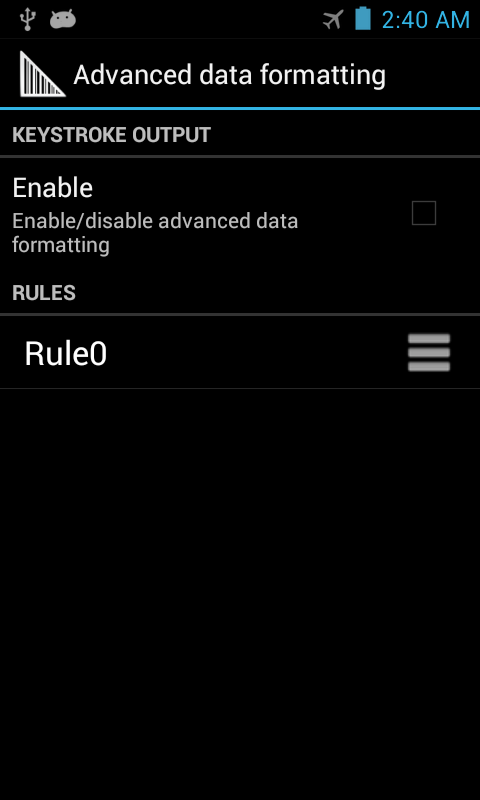

## Overview
This guide covers advanced DataWedge features such as the importing and exporting of Profiles and Configuration files, mass deployment of those files, and Advanced Data Formatting, which allows acquired data to be manipulated based on its contents. 

For this guide, a basic knowledge of DataWedge Profiles, Plug-ins and other concepts is required. If necessary, please see the [About](../about) and [Setup](../setup) guides for additional information. 

## DataWedge Settings
Most of the functionality referenced in this guide will be accessed through the DataWedge Settings panel. 

**To access DataWedge Settings**: 

&#49;. From the Profiles screen, **tap the "hamburger" menu** and **select Settings** as hightlighted below. The DataWedge Settings panel appears similar to the image in Step 2. 

_Access the DataWedge Settings panel from the Profiles screen_. 
 

&#50;. **Tap the desired feature** to invoke or change its status. 

_The DataWedge Settings panel_. 
 

**Functions of the DataWedge Settings panel**: 

* **DataWedge enabled -** Controls the DataWedge service. Uncheck this box to disable DataWedge and return control of scanning hardware to the system.

* **Enable logging -** Enables DataWedge to output logs for viewing in Logcat, Android Studio or a compatible viewer.

* **Import -** Invokes navigation for importing a DataWedge configuration file from device storage. This action replaces the current configuration.

* **Export -** Exports the current DataWedge configuration to device storage. 

* **Import Profile -** Invokes navigation for importing a DataWedge Profile from device storage. If a Profile of the same name already exists in DataWedge, it     will be replaced by the imported one. 

* **Export Profile -** Exports an individual DataWedge profile to device storage.

* **Restore -** Returns DataWedge on the device to factory default settings. 

### Logging
DataWedge provides the option of outputting system log messages for viewing through the Logcat command line tool, Android Studio or another compatible viewer, usually over a USB connection. 

**To Enable/Disable logging**: 

From the DataWedge Settings panel, **tap Enable Logging** to enable or disdable logging as desired. 

 

### Import Configuration
DataWedge can accept settings created on another device and distributed throughout an enterprise by importing a DataWedge Configuration file. This file contains Profiles, Plug-ins and other DataWedge settings stored on the device. 

The DataWedge configuration file is always called `datawedge.db`.  

**To Import a DataWedge Configuration file**:    

&#49;. From the DataWedge Settings panel, **tap Import**. A screen appears similar to the one in Step 2, below. 

 

&#50;. **Navigate to the imported file** on device storage using the interface provided:  

Imported settings take effect immediately and overwrite all prior settings.   
 

### Export Configuration
Once DataWedge is set up and configured as desired on a device, its settings file can be exported, distributed to other devices, imported and activated automatically (or imported manually, as above). 

**To Export a DataWedge Configuration file**: 

&#49;. From the DataWedge Settings panel, **tap Export** as highlighted below. A screen appears similar to the one in Step 2. 

 

&#50;. If more than one storage device exists, **tap the desired storage device, then tap Export**. Only the storage device may be selected; the path will be inserted automatically.  

 

The default path and filename of an exported configuration file is:
`/storage/sdcard0/Android/data/com.symbol.datawedge/files/datawedge.db` 

If an external SD card is installed, an alternate path can be selected: 
`/storage/sdcard1/Android/data/com.symbol.datawedge/files/datawedge.db`

&#51;. **Retrieve the file `datawedge.db` from the device** and distribute to other devices manually or through a Mobile Device Management (MDM) system. 

### Import a Profile
Importing a Profile enables settings created elsewhere to quickly be activated on a device. This enables organizations to develop and fine-tune Profiles in a test lab, for example, before exporting and deploying them to the field. For more information, see Export a Profile, below.  

While the Profile importing _process_ is similar to that of the Configuration file, and both replace what came before, the Profile _itself_ is very different. A Profile contains settings that control how DataWedge will behave with one or more specific applications. A Config file might contain numerous Profiles as well as other DataWedge settings, and when imported, **overwrites all previous DataWedge settings and Profiles**. 

**To Import a DataWedge Profile**:  

&#49;. From the DataWedge Settings panel, **tap Import Profile** as highlighted below. A screen appears similar to the one in Step 2. 

 

&#50;. **Navigate to the file being imported** from device storage using the interface provided: 

**Warning**: If a Profile of the same name already exists on the device, it will be replaced by the imported one. 
 

### Export a Profile
Once a DataWedge Profile is set up and configured as desired on a device, it can be exported and distributed for use on other devices throughout an enterprise. This enables a company to fine-tune settings for the acquisition, manipulation and disposition of data for specific applications(s), and easily propogate those settings to others in the organization.  

If more than one Profile is to be created, exported and distributed at the same time, it might be beneficial to create and export the Profiles together as a single DataWedge Configuration file. 

**To Export a Profile**: 

&#49;. From the DataWedge Settings panel, **tap Export Profile** as highlighted below. A list of Profiles on the device appears similar to the image in Step 2.

 

&#50;. If more than one storage device exists, **tap the desired storage device, then the name of the Profile to be exported, then tap Export**. Only the storage device and Profile may be selected; the path will be inserted automatically.

 

The default path and filename of an exported Profile is:
`/storage/sdcard0/Android/data/com.symbol.datawedge/files/dwprofile_profilename.db` 

If an external SD card is installed, an alternate path can be selected: 
`/storage/sdcard1/Android/data/com.symbol.datawedge/files/dwprofile_profilename.db`

&#51;. **Retrieve the exported file from the device** and distribute to other devices manually or through a Mobile Device Management (MDM) system. 

**Warning: If a Profile exists on the device with the same name as one being imported, the existing profile will be overwritten by the imported one**. 

### Restore (defaults)
DataWedge has the ability to reset all user-configured settings and restore them to their original factory defaults. **This action cannot be undone**. 

**To Restore DataWedge to its factory-default settings**:

&#49;. From the DataWedge Settings panel, **tap Restore** as highlighted below. A confirmation screen appears similar to the image in Step 2.

 

&#50;. **Tap Yes to Restore factory defaults** or No to cancel. 

 

## Advanced Data Formatting
DataWedge permits data acquired from barcode scanning, magstripe reading or other methods to be manipulated based on the data content. The Advanced Data Formatting (ADF) Process Plug-in can be configured to determine whether and how the data should be altered according to rules that perform actions based on specific criteria relating to the data itself. For example, a rule might be created to check the first four digits of any 16-digit number to determine if it's from a credit card affiliated with a specific bank. 

>>> EDIT THESE: 

**Rules -** The ADF Process Plug-in consists of one or more rules. DataWedge formats the output data according to the first matching rule. A rule is a combination of criteria and a set of actions to be performed, upon fulfillment of the criteria set in the rule.

**Criteria -** Criteria can be set according to Input plug-in, symbology, matching string within the data (at the specified position) and/or data length. Received data must match the defined criteria in order for the data to be processed.

**Actions -** A set of procedures defined to format data. There are four types of actions which are for formatting cursor movement, data modification, data sending and delay specifications. An action can be defined to send the first number of characters to the Output plug-in, pad the output data with spaces or zeros, remove spaces in data, etc.

### Configuring the ADF Plug-in
Setting up Advanced Data Formatting is done in three basic steps: 

1. Create a Rule
2. Define Criteria to activate the Rule
3. Define the Action(s) to be executed by the Rule

These steps are all carried out within the Advanced Data Formatting Process Plug-in, which is part of every DataWedge Output Plug-in. For further details, see the Plug-ins section of the [DataWedge Setup Guide](../setup). 

**To Create an ADF Rule**: 

&#49;. In the Profile that requires ADF, **tap on Advanced data formatting** as highlighted below. A screen appears similar to the image in Step 2.

 

&#50;. **Tap the "hamburger" menu, select New rule** and enter a name for the rule. The new Rule appears with other Rules in the Output Plug-in screen similar to the image in Step 3, below.   

 

&#51;. **Tap the new Rule** to access its settings. A screen appears similar to the image in Step 4.  

 

&#52;. **Tap Criteria** as highlighted below to enter the criteria that will activate the Rule.  

 

&#53;. From the Criteria screen, **enter the criteria that will activate the Rule** based on the options below.  

 

**Action Criteria**:

* **String to check for -** Allows a string to be entered that will initiate the action(s) when present anywhere in the acquired data.

* **String position -** An optional parameter that allows a character offset (+ or -) to be entered before or after which the "String to check for" must be present. For example, the target String "text" with a String position offset of +2 would invoke action(s) only if a string such as "00text" was acquired. 

* **String length -**  An optional parameter that allows a specific length (in characters) to be entered before action(s) will be invoked. For example, if scanning Social Security numbers, a String length of nine (9) might be used as a means of initial validation. 

* **Source criteria -** An optional parameter that can invoke action(s) only when data is acquired by means of a barcode scanner (through which specific decoders can be further selected or excluded), or through SimulScan. 

&#54;. **Tap the BACK button** to save and return to the Rule screen.

 

&#55;. From the Rule screen, **tap the "hamburger" menu and select New action** as highlighted below. A  scrollable list of Actions appears similar to the image in Step 8.

 

&#56;. **Select an Action from the Actions list**, scrolling as necessary. **Tap BACK** to save and return to the Rule screen. For more information about Actions, see the table below. 

_**Note**: To help minimize data loss, **Zebra recommends sending a Pause Action** of 50 ms after using a Send String and/or Send Char Action to send ENTER, LINEFEED or TAB characters._

<table rules="all"
width="100%"
frame="border"
cellspacing="0" cellpadding="4">
<caption class="title">ADF Supported Actions</caption>
<col width="22%" />
<col width="22%" />
<col width="55%" />
<thead>
<tr>
<th align="left" valign="top">Type</th>
<th align="left" valign="top">Actions</th>
<th align="left" valign="top">Description</th>
</tr>
</thead>
<tbody>
<tr>
<td rowspan="5" align="left" valign="top">
Cursor Movement
</td>
<td align="left" valign="top">
Skip ahead
</td>
<td align="left" valign="top">
Moves the cursor forward by the specified number of characters.
</td>
</tr>
<tr>
<td align="left" valign="top">
Skip back
</td>
<td align="left" valign="top">
Moves the cursor back by the specified number of characters.
</td>
</tr>
<tr>
<td align="left" valign="top">
Skip to start
</td>
<td align="left" valign="top">
Moves the cursor to the beginning of the data.
</td>
</tr>
<tr>
<td align="left" valign="top">
Move to
</td>
<td align="left" valign="top">
Moves the cursor forward until the string specified in the data field is found.
</td>
</tr>
<tr>
<td align="left" valign="top">
Move past
</td>
<td align="left" valign="top">

Moves the cursor forward past the string specified in the data field.

</td>
</tr>
<tr>
<td rowspan="10" align="left" valign="top">
Data Modification
</td>
<td align="left" valign="top">
Crunch spaces
</td>
<td align="left" valign="top">
Reduce spaces between words to one and remove all spaces at the beginning and end of the data.
</td>
</tr>
<tr>
<td align="left" valign="top">
Stop space crunch
</td>
<td align="left" valign="top">
Disables the last <strong>Crunch spaces</strong> action.
</td>
</tr>
<tr>
<td align="left" valign="top">
Remove all spaces
</td>
<td align="left" valign="top">
Remove all spaces in the data.
</td>
</tr>
<tr>
<td align="left" valign="top">
Stop space removal
</td>
<td align="left" valign="top">
Disables the last <strong>Remove all spaces</strong> action.
</td>
</tr>
<tr>
<td align="left" valign="top">
Remove leading zeros
</td>
<td align="left" valign="top">
Remove all zeros at the beginning of data.
</td>
</tr>
<tr>
<td align="left" valign="top">
Stop zero removal
</td>
<td align="left" valign="top">
Disables the previous <strong>Remove leading zeros</strong> action.
</td>
</tr>
<tr>
<td align="left" valign="top">
Pad with zeros
</td>
<td align="left" valign="top">
Left-pad data with the specified number of zeros.
</td>
</tr>
<tr>
<td align="left" valign="top">
Stop pad zeros
</td>
<td align="left" valign="top">
Disables the previous <strong>Pad with zeros</strong> action.
</td>
</tr>
<tr>
<td align="left" valign="top">
Replace string
</td>
<td align="left" valign="top">
Replaces a specified string with a new specified string. Both must be specified.
</td>
</tr>
<tr>
<td align="left" valign="top">
Stop all replace string
</td>
<td align="left" valign="top">
Stop all <strong>Replace string</strong> actions.
</td>
</tr>
<tr>
<td rowspan="6" align="left" valign="top">
Data Sending
</td>
<td align="left" valign="top">
Send next
</td>
<td align="left" valign="top">
Sends the specified number of characters from the current cursor position.
</td>
</tr>
<tr>
<td align="left" valign="top">
Send remaining
</td>
<td align="left" valign="top">
Sends all data that remains from the current cursor position.
</td>
</tr>
<tr>
<td align="left" valign="top">
Send up to
</td>
<td align="left" valign="top">
Sends all data up to the specified string.
</td>
</tr>
<tr>
<td align="left" valign="top">
Send pause
</td>
<td align="left" valign="top">
Pauses the specified number of milliseconds before continuing the next action.
</td>
</tr>
<tr>
<td align="left" valign="top">
Send string
</td>
<td align="left" valign="top">
Sends the specified string.
</td>
</tr>
<tr>
<td align="left" valign="top">
Send char
</td>
<td align="left" valign="top">
Sends the specified ASCII/ Unicode character. The maximum Unicode character value can be entered is U-10FFFF (= 1114111 in decimal).
</td>
</tr>
</tbody>
</table>

_**Note**: To help minimize data loss, **Zebra recommends sending a Pause Action** of 50 ms after using a Send String and/or Send Char Action to send ENTER, LINE FEED or TAB characters._

&#56;. **Repeat Step 8 until all required Actions are created**. 

 

**Action Notes**: 
* Actions are processed from the top of the list downward to the bottom. 
* To reposition an Action, drag the Action by its handle (to the right of its name). 
* To delete an Action, long-press the Action name. 

**Rules Notes**: 
* Once a Rule is enabled (with a checkmark in its Rule screen), a Rule will apply whenever its parent Profile is used. 
* All data acquired through the Profile will be processed according to the Actions defined in the Rule before being tranferred to the selected Output Plug-in. 
* If no ADF rule is enabled or defined, DataWedge passes decoded data to the Output Plug-in without processing.

## ADF Example
The following is an example of the creation process for an Advanced Data Formatting Rule that might be typical for data processing scenarios. 

**Barcode scanning criteria**:
* Barcode: Code39
* Decoded Length: 12 characters
* Start Position contents: "129" 

**DataWedge format the data**:
* Pad all sends with zeros to a length of 8
* Send all data up to character X
* Send a space character.

**To create an ADF rule for this example**:
1. Tap **HOME -> DataWedge -> Profile0**.
1. Tap **Advanced data formatting**.
1. Tap **Enable**.
1. Tap **Rule0**.
1. Tap **Criteria**.
1. Tap **String to check for**. In the text box, **enter 129** and **Tap OK**.
1. Tap **String position**. Change value to 0 and **Tap OK**.
1. Tap **String length**. Change value to 12 and **Tap OK**.
1. Tap **Source criteria**.
1. Tap **Barcode input**.
1. Tap **All decoders enabled** to uncheck and disable all decoders.
1. Tap **Code39** to enable the Code39 decoder only. 
1. Tap **BACK** three times.
1. Tap and hold the **Send remaining rule** until a menu appears.
1. Tap **Delete action**.
1. Tap **Menu -> New action**. Select Pad with zeros. The Pad with zeros rule appears in the Actions list.
1. Tap the **Pad with zeros** rule.
1. Tap **How many**. Change value to 8 and Tap OK.
1. Tap **BACK**.
1. Tap **Menu -> New action**. Select **Send up to**. The Send up to rule appears in the Action list.
1. Tap **Send up to** rule.
1. Tap **String**. In the text box, **enter X** and **Tap OK**.
1. Tap **BACK**.
1. Tap **Menu -> New action**. Select **Send char**. The Send char Action appears in the Action list.
1. Tap **Send char** Action.
1. Tap **Character code**. In the text box, **enter 32** and **Tap OK**.
1. Tap **BACK**.

The Rule0 screen should appear similar to the image below. 

 

To test the new ADF rule, open any app on the device that has a text field capable of accepting input and click in the field. Then scan the barcode below: 
 

A Code39 barcode with "129" in the starting position. 
 

Figure_20_FormattedData

 

Aim the exit window at the bar code.

Sample Barcode
Figure 19. Sample Barcode
Press and hold the Right Scan/Action button. The red laser aiming pattern turns on to assist in aiming. Ensure that the bar code is within the area formed by the aiming pattern. The Left and Right LEDs light red to indicate that data capture is in process.

The Left and Right LEDs light green, a beep sounds and the mobile computer vibrates, by default, to indicate the bar code was decoded successfully. The formatted data 000129X<space> appears in the text field. Scanning a Code 39 bar code of 1299X15598 does not transmit data (rule is ignored) because the bar code data did not meet the length criteria.

Formatted Data
Figure 20. Formatted Data
Note    
When ADF data processing needs to find or replace non printable characters such as control characters or extended ASCII characters \xNN can be used to specify hex value of the character or \uNNNN can be used to specify the Unicode value of the character to be processed by the ADF. Ex: If the captured data contains the GS character (\x1D) and data needs to be separated by the GS character following ADF actions can be added to the ADF rule.

Data :
8100712345(GS)2112345678

Actions :
Send upto (\x1D)

Skip ahead (1)

Send remaining.

## Configuration File Management

The configuration settings for DataWedge can be saved to a file for distribution to other mobile computers.

After making configuration changes, export the new configuration to the root of the On-device Storage. The file created is automatically named datawedge.db. This datawedge.db file can then the copied to the On-device Storage of other devices and imported into DataWedge on those devices. Importing a configuration replaces the existing configuration.

Enterprise Folder
Internal storage contains the Enterprise folder (/enterprise). The Enterprise folder is persistent and maintains data after an Enterprise reset. After an Enterprise Reset, DataWedge checks folder /enterprise/device/settings/datawedge/enterprisereset/ for a configuration file, datawedge.db. If the file is found, it imports the file to replace any existing configuration. Additionally if there are any DataWedge profile configuration files they also get imported to DataWedge configuration.

Note    A DataWedge Restore operation will delete the working db file and if a datawedge.db file exists in enterprisereset folder DataWedge will copy it as the new working db.
Note    A Factory Reset deletes all files in the Enterprise folder.
Auto Import
DataWedge supports remote deployment of a configuration to the mobile computer, using tools such as MSP. DataWedge monitors the /enterprise/device/settings/datawedge/autoimport folder for the DataWedge configuration file datawedge.db file or profile configuration files dwprofile_profilename.db. When DataWedge launches it checks the folder. If a datawedge.db or profile configuration files are found, it imports the files to replace any existing configuration. Once files are imported they are deleted from the folder.

While DataWedge is running it receives a notification from the system that a datawedge.db or DataWedge profile configuration (dwprofile_profilename.db) file is placed into the /enterprise/device/settings/datawedge/autoimport folder. When this occurs, DataWedge imports this new configuration, replacing the existing one and delete the datawedge.db or the DataWedge profile configuration file (dwprofile_profilename.db). DataWedge begins using the imported configuration immediately.

Note    It is strongly recommended that the user exits DataWedge before remotely deploying any configuration. Devices which does not show contents under enterprise folder user may have to programatically write files to enterprisereset folder and to autoimport folder.
Note    DataWedge will try to consume the “.db” files as soon as they are copied to the autoimport folder. Therefore it is possible that DataWedge and the application which copies the db file trying to access the file at the same time. To avoid such race condition it is recommended to write the file with a different extension such as ".tmp" and once the file copy is completed rename it back to the correct extension. It is also recommended to apply file permission explicitly to the file such that the DataWedge will be able to consume the file.

    //NOTE: Below code is for demo purpose only, has no error checks
    InputStream fis = null;
    FileOutputStream fos = null;
    String autoImportDir = "/enterprise/device/settings/datawedge/autoimport/"
    String temporaryFileName = "datawedge.tmp";
    String finalFileName = "datawedge.db";
    // Open your db as the input stream
    fis = context.getAssets().open("datawedge.db");
    // create a File object for the parent directory
    File outputDirectory = new File(autoImportDir);
    // create a temporary File object for the output file
    File outputFile = new File(outputDirectory,temporaryFileName);
    File finalFile = new File(outputDirectory, finalFileName);
    // attach the OutputStream to the file object
    fos = new FileOutputStream(outputFile);
    // transfer bytes from the input file to the output file
    byte[] buffer = new byte[1024];
    int length;
    int tot = 0;
    while ((length = fis.read(buffer)) > 0) {
            fos.write(buffer, 0, length);
            tot+= length;
    }
    Log.d("DEMO",tot+" bytes copied");
    //flush the buffers
    fos.flush();
    //release resources
    try {
            fos.close();
    }catch (Exception e){
    }finally {
            fos = null;
            //set permission to the file to read, write and exec.
            outputFile.setExecutable(true, false);
            outputFile.setReadable(true, false);
            outputFile.setWritable(true, false);
            //rename the file
            outputFile.renameTo(finalFile);
    }

## Programming Notes

Overriding Trigger Key in an Application
To override the trigger key in an application, create a profile for the application that disables the Barcode input. In the application, use standard APIs, such as onKeyDown() to listen for the KEYCODE_BUTTON_L1 and KEYCODE_BUTTON_R1 presses.

Capture Data and Taking a Photo in the Same Application
To be able to capture bar code data and take a photo in the same application:

Add two Activities in your application for barcode scanning and picture taking actions respectively. Create a DataWedge profile associated to the picture taking Activity in your application and disable scanning and use standard Android SDK APIs to control the Camera.

The default DataWedge profile takes care of the scanning when other activities in your application comes foreground. You might want to create another DataWedge profile that caters to any specific scanning needs, and associate it to the barcode scanning activity of your application.

Disable DataWedge on mobile computer and Mass Deploy
To disable DataWedge and deploy onto multiple mobile computers:

Touch  Home > DataWedge >  Menu > Settings.

Unselect the DataWedge enabled check box.

Export the DataWedge configuration. See Export Configuration File above for instructions.

See Configuration File Management above for instructions for using the auto import feature.

