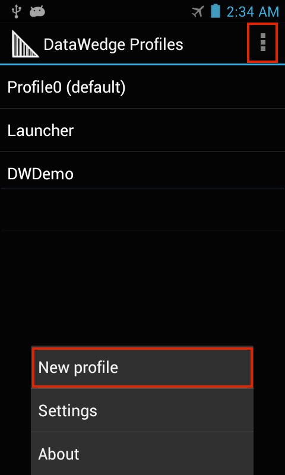

## Overview

**Profiles and Plug-ins** form the basis of most DataWedge functionality. Profiles include all the information about how DataWedge should behave when providing scanning services for a particular application. Much of that information comes from Plug-ins, which determine how the data will be input, processed and output.

Each Profile generally contains four elements: 
* **An Input Plug-in -** to determine how data will be acquired (i.e. a barcode scanner)
* **A Process Plug-in -** to specify how the acquired data should be manipulated 
* **An Output Plug-in -** to control the passing of data to an application
* **An Associated application -** (or activity) with which to link DataWedge actions

When associated with an app, DataWedge can be invoked to scan and acquire (input) the data, format or append (process) it in a specified way, and pass (output) it to the associated app when the app comes to the foreground. DataWedge also includes Profile0, which works with any application currently in the foreground and contains baseline settings that can be tailored to individual needs. This allows DataWedge to be used out of the box with no little or no pre-configuration required. 
 
**Note: This guide describes DataWedge for Android. Features and usage of Windows verions may vary slightly**.

##Profiles
Profiles contain information about how DataWedge should behave with an associated application, and provide a means to allow different apps that might be acquiring the same data to do different things with it. For example, while "App A" might require that a TAB be sent after each dataset is passed from DataWedge, "App B" might require the ENTER key to be pressed instead. Through Profiles, DataWedge can be configured to process the same set of captured data according to the requirements of any number of individual applications. A single Profile also can be created to handle data in the same way for a group of applications. 

DataWedge includes a number of pre-configured Profiles for general needs or to support specific apps that are built into every device. Some of these, such as Profile0, are visible to the user and can be edited as needed. Others contain fixed parameters and are not visible or configurable. 

#### Visible Profiles
* **Profile0 -** is a generic that takes effect for any unassociated foreground app. 
* **Launcher -** is used when the Launcher screen is in the foreground.
* **DWDemo -** is used with DWDemo, the [DataWedge Demo app](../demo) app. When DWDemo comes to the foreground, data captured with DataWedge is handed to the DWDemo application.
* **User-defined -** profiles are always visible and available for editing. 

#### Hidden Profiles
* **RD Client -** provides support for Zebra's Rapid Deploy app and third-party MDM solutions.
* **MSP Agent -** provides support for Zebra's legacy Mobility Services Platform (MSP).
* **MspUserAttribute -** provides additional support for MSP.
* **Camera -** disables scanning when the default camera application is in the foreground.
* **RhoElements -** disables scanning when RhoElements is in the foreground.

### Profile0
Profile0 is a generic Profile that automatically takes effect for any app that comes to the foreground that has not been associated with DataWedge. This can be useful for quickly acquiring data using an app that has just been installed, for example, or when using an app that has not yet been configured by an administrator for use with DataWedge. All parameters of Profile0 can be edited except its association. 

**Profile0 also can be disabled within a Profile**. This provides a measure of security by restricting output to applications or servers to which DataWedge has been specifically associated. 

## Plug-ins
Plug-ins extend DataWedge functionality to support device hardware, peripherals, data processing and transport. Plug-ins are used to configure how data will be acquired by DataWedge, manipulated or altered for an app, and output to an app or server.

**Input Plug-ins specify**:
* Barcode scanners (laser, imager, camera)
* SimulScan hardware

**Process Plug-ins specify**: 
* Basic data formatting (append with keystrokes, prefix, suffix, etc.)
* Advanced data formatting (rules-based data manipulation)

**Output Plug-ins specify**:
* Keystrokes (emulates manual keyboard input)
* Intent (programmatic hand-off of data)
* IP Output (saving data to a server)

### Input Plug-ins
Input Plug-ins specify the device hardware to be used to acquire the data before sending it for processing. Those included with DataWedge are explained below. **DataWedge also provides beep sounds and other feedback to alert the user of scanning results and barcode type. Refer to Scanner Parameters section for more information**. 

**The Barcode Scanner Input Plug-in** reads data from the integrated barcode scanner built into the device, attached by cable or implemented as a snap-on module. This Plug-in supports laser, imager and internal cameras. The raw barcode data that's acquired is processed or formatted as required using Process Plug-ins. 

**The MSR Input Plug-in** is for magnetic stripe reader modules. This plug-in reads data from an integrated MSR reader or attached Scan/MSR Module, after which the raw data from the reader can be processed or formatted as required using Process Plug-ins.

**The SimulScan Input Plug-in** permits simultaneous capture of barcodes, images, text, signatures, phone numbers and other data on multi-part forms. The SimulScan Input Plug-in adds this capability to DataWedge. When form data is captured according to a designated SimulScan template, data can be processed or formatted as required using Process Plug-ins.

**Note**: DataWedge concatenates all text captured through SimulScan into a single string, and performs processing on the concatenated string.

### Process Plug-ins
Process Plug-ins manipulate the acquired data in a specified way before sending to the associated application or server via the Output Plug-in. Those included with DataWedge are explained below. 

**The Basic Format Process Plug-in** allows DataWedge to add a prefix and/or a suffix to captured data before passing it to an Output Plug-in. It also permits the insertion of TAB and ENTER keystrokes as well as conversion of data to hex. 

**The Advanced Format Process Plug-in** allows DataWedge to add a prefix and/or a suffix to the captured data before passing it to an Output Plug-in.

### Output Plug-ins
Output Plug-ins send the processed data to the associated application or server. Those included with DataWedge are explained below. 

**The Keystroke Output Plug-in** collects the processed data and sends it to the associated application as a series of keystrokes, emulating the actions of a user pressing the keys.

**The Intent Output Plug-in** sends the processed data to the associated foreground application as payload within an Android Intent.

**The IP Output Plug-in** allows captured data to be sent to a specified IP address and port using either TCP or UDP transport protocols to a Windows server running Zebra IPWedge software. Please refer to the [IP Output Guide](../ipoutput) for further information. 

## Create a Profile
This section provides step-by-step instructions for creating a DataWedge Profile, which includes plug-ins for input, processing and output, plus association with an app. Use these steps for every app that will call on DataWedge for scanning services. 

### Quick Steps
To enable DataWedge scanning services for an app, perform the following steps on an Android device:

1. **Install the app** that will use DataWedge for scanning. 
2. **Start DataWedge** app and navigate to the Profiles list (if not shown by default).  
3. Tap on the Profiles screen's "hamburger" menu and **select -> New profile**. 
4. **Enter a name for the Profile and tap OK**. The new Profile appears in the Profiles list. 
5. Tap on the new profile.
6. **Select Associated Apps** from the Applications section.
7. In the Hamburger menu, **select -> New app/activity**. A list of installed apps appears. 
8. Select your app's package name (scrolling down, if necessary).
9. **Tap the asterisk** (*) to associate all of your app's activities with DataWedge. 
10. Tap the device's Back button until the new Profile's Settings screen appears.
11. Confirm that the "Profile enabled" checkbox is checked. 
12. As needed, **confirm that the Barcode Input and Keystroke Output checkboxes are checked**. 

Test and adjust input, processing (data formatting) and output parameters as necessary. 

The app will now use DataWedge for barcode data acquisition. 

### Detailed Steps

####Create a New Profile:

&#49;. Locate and <b>tap the DataWedge icon</b> from the Launcher or App Drawer to launch it:  

 

On newly installed devices, the DataWedge Profiles screen similar to the image below appears, showing the three included (visible) Profiles. White text indicates enabled Profiles. Also shown is a fourth, disabled Profile (grey text). 

**Note**: If DataWedge had been opened previously, it will reopen to the last used screen. If necessary, press BACK until the Profiles screen appears.  
 

&#50;. **Tap the "hamburger"** menu and **select -> New profile**.  

 

&#51;.  **Enter a name** for the new Profile and **tap OK**. The Profiles list appears, similar to the image in Step 4, below.  

Zebra recommends that Profile names be unique and made up of alpha-numeric characters only.
 

#### Associate the Profile with App(s) and/or Activities: 

&#52;. **Tap the Profile** to be associated: 

 

&#53;. In the Profile screen, **tap the "Profile enabled" checkbox** to enable it, then **tap "Associated apps"** to link it with an app or activity:

 

&#54;. **Tap the menu** and **select -> New app/activity**. A list appears with all apps and activities installed on the device. 

 

&#55;. From the device apps/activities list, **select the app or activity to associate** with the Profile being edited. When an app is selected, its activities list appears (see Step 8). 

 

&#56;. From the app activities list, **tap the asterisk to associate all app activities** with the Profile, or tap on an indvidual activity to use DataWedge for **that specific activity only**:

 

&#57;. The app now appears in the Profile associations list. **Repeat Steps 6-8** until all desired apps and/or activities are associated. 

When finished adding associations, **Tap the BACK button** to return to the Profile screen. 
 
 

#### Configure Plug-ins for Input, Processing and Output:

&#49;&#48;. From the Profile screen, **enable the desired Input Plug-in** (scrolling down as necessary). For example, the Barcode Input displays an option for Scanner selection: 

 

&#49;&#49;. From the Scanner selection screen, **select the desired scanner** or imager. **Tap BACK** to return to the Input Plug-in screen. 

**Note: Lists such as the one above display only devices that are present on (or connected to) the unit being configured**. 
 

&#49;&#50;. From the Decoders screen (accessible from the Input Plug-in screen), **select only the decoders required by the application** to optimize scanning performance. **Tap BACK** to return to the Input Plug-in screen. 

For more information about configuring Decoder parameters, see the [Decoder Guide](../decoders). 
 

&#49;&#51;. From the Profile screen, **select the desired Output Plug-in** (scrolling down as necessary). For example, the image below shows that the Keystroke Output Plug-in is enabled: 

**Note**: Output Plug-in sections contain selectors for configuring "Basic data formatting" and "Advanced data formatting"; **these are the Process Plug-ins**.  
 

&#49;&#52;. **Select the Basic data formatting** options** for inserting special keystrokes or adding text before (prefix) and/or after (suffix) the collected data:  

See Basic data formatting elsewhere in this guide for more information. For Advanced data formatting options, see the [Advanced Data Formatting Guide](../advanced)
 

&#49;&#53;. 

&#49;&#54;. 

&#49;&#55;. 

&#49;&#56;. 

## Scanner Selection
For the Input Plug-in, the Scanner selection panel determines which scanning device will be used for data capture. The list of available scanners will be based devices that are present on (or connected to) the unit being configured. 

 
The "Auto" option will automatically determine the best scanning device from the list of installed devices based on the rules below. 

**Auto Scanner Selection Rules**:
* If a Zebra Scan Module or Scan/MSR Module is installed, the 2D imager will be selected. 
* If no Scan Module is installed, the camera will be selected. 
* When the camera is selected, scanning is performed with the rear-facing camera.
* When 2D Imager is selected, scanning is performed using the installed Scan or Scan/MSR module.

#### Bluetooth Scanners
DataWedge supports the Zebra RS507 Cordless Bluetooth Ring Scanner according to the following rules:

* To initially configure RS507 in a Profile, the scanner must be paired and connected.
* After initial configuration, the Bluetooth scanner can be enabled and disabled in the Profile even if it is disconnected from the device. However, to configure reader parameters, decoders and other scanner settings, the Bluetooth scanner must be connected.
* DataWedge will not automatically recorrect to a Bluetooth scanner if that scanner is connected while DataWedge is using a different auto-selected scanner. To re-enable a Bluetooth scanner, connect the scanner and select it in the Profile or re-choose the Auto select option.

#### Auto Scanner Selection and Battery Swap

* If Scanner selection is set to Auto and the RS507 was enabled prior to a battery swap, DataWedge will continue working with that RS507 scanner upon reconnection after the battery swap. If the RS507 does not get connected with the mobile computer after the battery swap, DataWedge will continue to work with the current default scanner.

#### Keep Enabled on Suspend

This feature is enabled only for the RS507 scanner. If enabled, DataWedge will keep it enabled during the device suspend. If the feature is not supported for the selected scanner the option will be disabled. When the RS507 trigger is pressed the device will wake from the suspend.

Note    
Enabling this option could drain the device battery faster when device is in the suspended mode.

MSR Input
Use MSR Input options to configure the MSR Input Plug-in for the profile.

Enabled

Enables or disables this plug-in. A check in the checkbox indicates that the plug-in is enabled.

SimulScan Input
SimulScan Input plug-in can be used to capture data in documents using SimulScan capability available in the Symbol Technologies devices. Use the SimulScan Input options to configure the SimulScan Input Plug-in for the profile.

SimulScan Preferences
Figure 13. SimulScan Preferences
Enabled

Enables or disables this plug-in. A check in the checkbox indicates that the plug-in is enabled. When SimulScan plug-in enabled Barcode Input plug-in gets disabled if it is already enabled in the profile configuration.

Template selection

Template selection option can be use to set the required SimulScan template for the profile configuration. There will be four templates included with DataWedge. Default template for SimulScan input plug-in is "Default Default-DocCap+Optional-Barcode.xml".

Default-DocCap+Optional-Barcode.xml(default) - Capture the form as a picture and optionally decode a barcode if available in the form.

Default-DocCap+Required-Barcode.xml - Capture the form and decode available barcode.

Default-One-Barcode.xml - Decode a single barcode in the form and returns a single data region as the output.

Default-Two-Barcodes.xml - Decode two barcodes in a form and return the data as two data regions.

To use customized templates, template xmls must be copied to the /enterprise/device/settings/datawedge/templates directory. Templates modified after the configuration is done.

Region separator

Region separator option can be used to configure a separator character for SimulScan region data. When there are multiple text regions the region separator will be inserted between two data strings. By default no separator will be set. Possible values for region separator are None, Tab, Line feed and Carriage return. Region separator can be used with the Keystrokes plug-in Action key character setting to dispatch SimulScan region data to separate text fields.

Note    Barcode, OCR and OMR regions are considered as text regions in DataWedge. When using keystroke output and IP output, only text region data will get dispatched to the foreground application and the remote server respectively.
Note    Picture region data can only be retrieved through Intent output plug-in.
Keystroke Output
Use to configure the Keystroke Output Plug-in for the profile.

Enabled - Enables or disables this plug-in. A check in the checkbox indicates that the plug-in is enabled.

Action key character - Enabled decoding a special characters embedded within a bar code or MSR data.

Multi byte character delay - Inter character delay for multi byte characters specified in milliseconds. This parameter is introduced to avoid some problems occurred while sending Unicode and multi byte characters to Android web browser. The value is set to zero by default. If you see any errors in the delivery of keystrokes adjust the delay to a higher value e.g. 100 ms.

None - action key not injected

Tab - inject action key in place of a ASCII Tab (0x09) character

Line feed - inject action key in place of ASCII LF (0x0A) character

Carriage return - inject action key in place of ASCII CR (0x0D) character

Advanced data formatting - is a way to customizing data before transmission. Use advanced data formatting (ADF) to edit scan data to suit requirements.

Enable - Enables or disables ADF. A check in the checkbox indicates that ADF is enabled (default - disabled).

Rules - ADF uses rules to customize data. These rules perform detailed actions when the data meets certain criteria. One rule may consist of single or multiple criteria applied to single or multiple actions. See Generating Advanced Data Formatting Rules below for more information.

Basic data formatting - allows configuration of any data formatting for the related Output Plug-in for the profile. When the plug-in is disabled any data is passed on without modification.

Enabled - Enables or disables Basic Data Formatting. A check in the checkbox indicates that it is enabled (default - enabled).

Prefix to data - Add characters to the beginning of the data when sent.

Suffix to data - Add characters to the end of the data when sent.

Send data - Set to transfer the captured data to the foreground application. Disabling this option prevents the actual data from being transmitted. However, the prefix and suffix strings, if present, are still transmitted even when this option is disabled (default - enabled).

Send as hex - Set to send the data in hexadecimal format. A check in the checkbox indicates that this setting is enabled (default - disabled).

Send TAB key - Set to append a tab character to the end of the processed data. A check in the checkbox indicates that this setting is enabled (default - disabled).

Send ENTER key - Set to append an Enter character to the end of the processed data. A check in the checkbox indicates that this setting is enabled (default - disabled).

Intent Output
Allows configuration of the Intent Output Plug-in for the profile. The Intent Output Plug-in allows the captured data to be sent to an application in the form of an implicit Intent. Refer to the Android Developer web site for more information, http://developer.android.com.

Enabled - Enables or disables this plug-in. A check in the checkbox indicates that the plug-in is enabled (default - disabled).

Intent action - Enter the Intent Action name (required).

Intent category - Enter the Intent Category name (required).

Intent delivery - Select the method by which the intent is delivered:

Send via StartActivity

Send via startService

Broadcast intent

Receiver foreground flag - Set receiver foreground flag (Intent.FLAG_RECEIVER_FOREGROUND) in the broadcast intent. This flag can be set only when Intent delivery is set to Broadcast intent. NOTE: This flag needs to be enabled when broadcast intents are not received to the application for sometime after rebooting the device.

Advanced data formatting - is a way to customizing data before transmission. Use advanced data formatting (ADF) to edit scan data to suit requirements.

Enable - Enables or disables ADF. A check in the checkbox indicates that ADF is enabled (default - disabled).

Rules - ADF uses rules to customize data. These rules perform detailed actions when the data meets certain criteria. One rule may consist of single or multiple criteria applied to single or multiple actions. See Generating Advanced Data Formatting Rules below for more information.

Basic data formatting - allows configuration of any data formatting for the related Output Plug-in for the profile. When the plug-in is disabled any data is passed on without modification.

Enabled - Enables or disables Basic Data Formatting. A check in the checkbox indicates that it is enabled (default - enabled).

Prefix to data - Add characters to the beginning of the data when sent.

Suffix to data - Add characters to the end of the data when sent.

Send data - Set to transfer the captured data to the foreground application. Disabling this option prevents the actual data from being transmitted. However, the prefix and suffix strings, if present, are still transmitted even when this option is disabled (default - enabled).

Send as hex - Set to send the data in hexadecimal format. A check in the checkbox indicates that this setting is enabled (default - disabled).

Send TAB key - Set to append a tab character to the end of the processed data. A check in the checkbox indicates that this setting is enabled (default - disabled).

Send ENTER key - Set to append an Enter character to the end of the processed data. A check in the checkbox indicates that this setting is enabled (default - disabled).

Intent Overview

The core components of an application (its activities, services, and broadcast receivers) are activated by intents. An intent is a bundle of information (an Intent object) describing a desired action - including the data to be acted upon, the category of component that should perform the action, and other pertinent instructions. Android locates an appropriate component to respond to the intent, launches a new instance of the component if one is needed, and passes it the Intent object.

Components advertise their capabilities, the kinds of intents they can respond to, through intent filters. Since the Android system must learn which intents a component can handle before it launches the component, intent filters are specified in the manifest as <intent-filter> elements. A component may have any number of filters, each one describing a different capability.

For example, if the manifest contains the following:

<intent-filter . . . >
        <action android:name="android.intent.action.DEFAULT" />
        <category android:name="android.intent.category.MAIN" />
          . . .
</intent-filter>
In the Intent output plug-in configuration, the Intent action would be:

android.intent.category.DEFAULT
and the Intent category would be:

android.intent.category.MAIN
The Intent delivery option allows the method by which the intent is delivered to be specified. The delivery mechanisms are Send via startActivity, Send via startService or Broadcast intent.

The decode related data added to the Intent's bundle can be retrieved using the Intent.geStringtExtra() and Intent.getSerializableExtra() calls, using the following String tags:

String LABEL_TYPE_TAG = "com.symbol.datawedge.label_type";
String contains the label type of the bar code.

String DATA_STRING_TAG = "com.symbol.datawedge.data_string";
String contains the output data as a String. In the case of concatenated barcodes, the decode data is concatenated and sent out as a single string.

String DECODE_DATA_TAG = "com.symbol.datawedge.decode_data";
Decode data is returned as a list of byte arrays. In most cases there will be one byte array per decode. For barcode symbologies that support concatenation e.g. Codabar, Code128, MicroPDF, etc., the decoded data is stored in multiple byte arrays (one byte array per bar code). Clients can get data in each byte array by passing an index.

The MSR related data added to the Intent’s bundle can be retrieved using the Intent.getStringtExtra() and Intent.getSerializableExtra() calls, using the following String tags:

String MSR_DATA_TAG = "com.symbol.datawedge.msr_data";
The data from the MSR tracks is concatenated and sent out as a byte array. The Start/end sentinels and track separators are included as configured.

String MSR_TRACK1_TAG = "com.symbol.datawedge.msr_track1";
MSR track 1 data is returned as a byte array.

String MSR_TRACK2_TAG = "com.symbol.datawedge.msr_track2";
MSR track 2 data is returned as a byte array.

String MSR_TRACK3_TAG = "com.symbol.datawedge.msr_track3";
MSR track 3 data is returned as a byte array.

String MSR_TRACK1_STATUS_TAG = "com.symbol.datawedge.msr_track1_status";
MSR track 1 decode status as an Integer where 0 indicates a successful decode.

String MSR_TRACK2_STATUS_TAG = "com.symbol.datawedge.msr_track2_status";
MSR track 2 decode status as an Integer where 0 indicates a successful decode.

String MSR_TRACK3_STATUS_TAG = "com.symbol.datawedge.msr_track3_status";
MSR track 3 decode status as an Integer where 0 indicates a successful decode.

The SimulScan related data added to the Intent’s bundle can be retrieved using the Intent.getStringtExtra(), Intent.getSerializableExtra(), Intent. getParcelableArrayListExtra(), Bundle.getInt(), Bundle.getString(), and Bundle.getByteArray() calls, using the following String tags:

String SIMULSCAN_TEMPLATE_NAME_TAG = "com.symbol.datawedge.simulscan_template_name";
The name of the template which used by SimulScan to capture the form.

String SIMULSCAN_REGIONS_BUNDLE_TAG= "com.symbol.datawedge.simulscan_region_data";
Return an array of Bundles where each bundle contains data and information about a region and the form.

String SIMULSCAN_REGION_NAME_TAG = "com.symbol.datawedge.simulscan_region_name";
Returns the region name of the bundle object for reach region. To get the region name Bundle.getString() should be called.

String SIMULSCAN_REGION_ID_TAG = "com.symbol.datawedge.simulscan_region_id";
Returns the region id of the bundle object for reach region. Region id is an integer and can be retrieved by calling Bundle.getInt ().

String SIMULSCAN_REGION_TYPE_TAG = "com.symbol.datawedge.simulscan_region_type";
Returns the region type of the bundle object for reach region. Region type is an string and can be retrieved by calling Bundle.getString (). Possible return values are barcode, ocr, omr, picture and form.

barcode - region is a barcode

ocr - region is an OCR (Optical Character Recognition) region. i.e name or address

omr - region is an OMR (Optical Mark Recognition ) region. i.e checkbox, radio button.

picture - region is a picture. Picture data will be in the JPEG format.

form - form type specify that the bundle contains the picture of the captured form. Form image will be in the JPEG format.

String SIMULSCAN_REGION_STRING_DATA= "com.symbol.datawedge.simulscan_region_string_data";
Returns the string data of the region. String data comes with barcode, ocr and omr data.

String SIMULSCAN_REGION_BINARY_DATA= "com.symbol.datawedge.simulscan_region_string_data";
Returns the data of the region in the form of byte array. Binary data comes only for picture regions and the form image. Both picture and form data can be load in to a bitmap and display in the application.

Most scanning applications might want the user to be able to decode data and for that decode data to be sent to the current activity but not necessarily displayed. If this is the case, then the activity needs to be marked as "singleTop" in its AndroidManifest.xml file. If your activity is not defined as singleTop, then on every decode, the system will create another copy of your Activity and send the decode data to this second copy.

Finally there will be a configuration option for each process plug-in so that the process plug-in can be configured specifically for the intent output, which in this case is the basic data formatting process plug-in.

IP Output
Use the IP Output options to configure the IP Output Plug-in for the profile.

Enabled - Enables or disables this plug-in. A check in the checkbox indicates that the plug-in is enabled (default - disabled).

Remote Wedge - Enables this plug-in to be used with IPWedge. Make sure this option is unchecked when not using IPWedge. See IPWedge below. (default - enabled).

Protocol - Select the transport protocol (default - TCP)

TCP

UDP

IP address - Enter the IP address of the host (default - 0.0.0.0)

Port - Enter the port number (default - 58627)

IPWedge

IPWedge is a PC application that can be easily configured to retrieve data sent over a network by the DataWedge IP Output Plug-in on a Symbol device.

If you intend to use IP output in conjunction with IPWedge, download the IPWedge installation package from Symbol’s Enterprise Mobility support site at http://support.symbol.com/support/product/DEV_SW_TOOLS.html to the host PC.

Please see the IPWedge user manual on how to install and configure on a PC.

Using IP output with IPWedge

In order to get IP output to send captured data to a remote computer that is installed with IPWedge configure following items:

Touch  Home > DataWedge.

Touch a DataWedge profile.

In IP output, touch Enabled.

Touch Protocol. Select the desired transport protocol.

Touch IP address. Enter the IP address of the host computer and then touch OK.

Touch Port. Enter the port number and then touch OK.

Using IP Output Plug-in without IPWedge

IP output plug-in can be used to send captured data from DataWedge application to remote device or PC without IPWedge. At the data receiving end, the PC or Mobile device should have a client application, that listens to TCP or UDP data comes from configured port and IP address in IP Output plug-in. In order to get IP output plug-in configured to send captured data to a remote computer or device, follow these steps.

Touch  Home > DataWedge.

Touch a DataWedge profile.

In IP output, touch Enabled.

Touch Remote Wedge to disable the Remote Wedge option.

Touch Protocol. Select the desired transport protocol.

Touch IP address. Enter the IP address of the host computer and then touch OK.

Touch Port. Enter the port number and then touch OK.

**Note: Control of barcode scanning hardware is exclusive**. When DataWedge is active, Scanner and Barcode APIs of apps such as Enterprise Browser and others will be inoperative. Likewise, when an app such as Enterprise Browser controls the scanning hardware, other apps (including DataWedge) are locked out. It is therefore important to understand how to take control of a device's scanner hardware and, if necessary, release it to other apps when scanning is complete. This guide includes instructions for such operations. 

Other DataWedge guides: 
* [DataWedge IP Output](../ipoutput)
* [DataWedge API for Android](../androidapi)
* [DataWedge Capture API](../capture)

FROM ABOVE:

## Data Capture Plus (DCP)
Data Capture Plus (formerly "Data Capture Panel") enables scanner triggering by tapping on a designated part of the device screen. DataWedge will respond as it would to a button-press or other hardware trigger.

The DataWedge Profile configuration screen allows the user to configure how the DCP should appear on the screen once the particular profile is loaded. The DCP is in the disabled status by default. If the user checks the option to enable the DCP it will add five additional parameters to the preference screen for configuring the DCP as shown in following figure.

DCP Preferences
Figure 10. DCP Preferences
Following are the configurable parameters for the profile:

Dock button on - Allowed floating DCP docking policy. Restricted to the right hand side, to the left hand side or allowed in both sides of the screen are the available options.

Start in - Initial DCP appearance mode. Button mode, full screen mode or button only mode are the available options.

Top of button range - The top of the range the user is allowed to move the DCP, given as a percent of the screen height.

Bottom of button range - The bottom of the range the user is allowed to move the DCP, given as a percent of the screen height.

Drag Detect Time - The DCP wait interval in milliseconds before firing the scanner. This allows the user to drag the button without firing the trigger.

These parameters can be customized to change the look and feel of the DCP.

Note    
For the users who are familiar with the Data Capture Panel in previous DataWedge versions, the corresponding new parameters of Data Capture Plus are shown in the below table. Some parameters are not migrated to the new component.

Table 1. Mapping
<caption class="title">Table 1. Mapping</caption>
<col width="50%" />
<col width="50%" />
<thead>
<tr>
<th align="left" valign="top">Old Parameter</th>
<th align="left" valign="top">New Parameter</th>
</tr>
</thead>
<tbody>
<tr>
<td align="left" valign="top">
Show
</td>
<td align="left" valign="top">
Enabled
</td>
</tr>
<tr>
<td align="left" valign="top">
Start state
</td>
<td align="left" valign="top">
Start in
</td>
</tr>
</tbody>
</table>

</td>
</tr></table>

Note    The DCP will not appear during the profile load if the scanner is disabled for the profile even though the enabled option is set.
Minimized DCP in DataWedge Demo app
Figure 11. Minimized DCP in DataWedge Demo app
Changing Settings At Runtime

The DCP can be maximized by dragging if it is pre-configured to minimized state. Changing the state at runtime does not save it to the profile. Also the vertical position and the docking side in device screen can be adjusted by dragging the minimized DCP. Note that these two settings will be saved for the given profile when changed at the runtime.

Maximized DCP in DataWedge Demo app
Figure 12. Maximized DCP in DataWedge Demo app
Start scanning with DCP
To scan a barcode DCP should be touched and hold to emit the scan beam or start the camera viewfinder. Releasing the DCP will stop the scan beam or close the viewfinder.

Note    When using camera scanner in some instances quick touch and release on the DCP could start the viewfinder. Press the back button could close the viewfinder if it was not intended.
Barcode Input
Use the Bar Code Input options to configure the Bar Code Scanner Input Plug-in for the profile.

Enabled

Enables or disables this plug-in. A check in the checkbox indicates that the plug-in is enabled.

## Launcher

DWDemo

Profile0 is the default profile and is used when no other profile can be applied.

DataWedge Profiles Screen
Figure 1. DataWedge Profiles Screen
Profile names are color coded. Enabled profiles are white and disabled profiles are gray.

To configure a profile touch the profile name.

Profile Context Menu
Touch and hold a profile to open a context menu that allows additional actions to be performed on the selected profile.

Profile Context Menu
Figure 2. Profile Context Menu
The profile context menu allows the profile to be edited (same as just touching a profile), renamed, deleted or cloned.

Note    When a profile is cloned the application association will be empty in the new profile. This is according to the rule that two profiles cannot be associated with same application. All other settings will be identical.
Options Menu
Touch  Menu to open the options menu.

DataWedge Options Menu
Figure 3. DataWedge Options Menu
The menu provides options to create a new profiles, access to general DataWedge settings and DataWedge version information.

Disabling DataWedge
To disable DataWedge:

Touch  Home > DataWedge

Touch  Menu > Settings

Touch DataWedge enabled. The green check disappears from the checkbox indicating that DataWedge is disabled.

