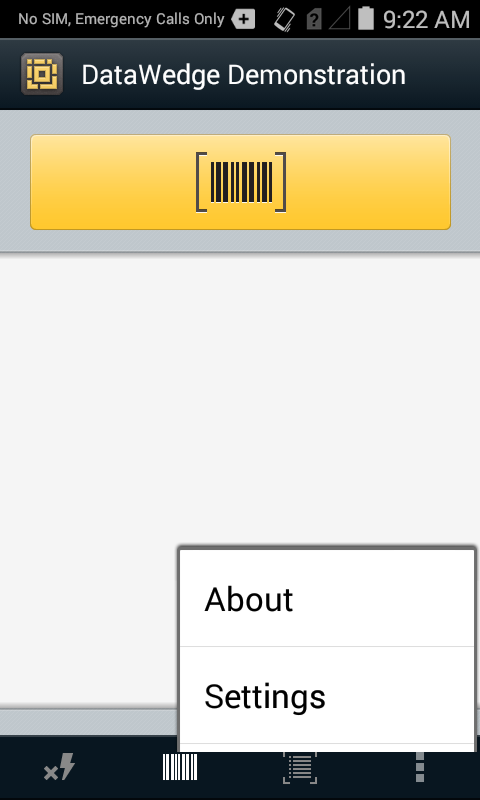

## DWDemo App
DWDemo demonstrates how data is acquired by an application using DataWedge. The DataWedge Profile "DWDemo" comes with DataWedge and is associated with the demo app, but is disabled by default. If user launches DWDemo application from the Launcher screen, barcode scanning will get enabled. Pressing the trigger, or pressing the Scan button on the DWDemo will allow to scan a barcode. The decoded data will be displayed in the screen. DWDemo also can be used to try our MSR. Swiping a card with a magnetic stripe will display the card data in the DWDemo screen.

_The DWDemo app as it appears in the Android App Drawer_. 
 

DWDemo has provided options to change some of the scanner settings from the DWDemo, and it can also have option to open the complete DWDemo profile configuration and do the necessary changes.

####Device Selector

 
**Device controls, from left to right**:
* **Lightning Bolt -** Toggles the Flash on and off (active when Camera is selected). 
* **Input Device -** Permits selection of Camera, Scanner or Bluetooth device (if no Bluetooth device is connected, selecting Bluetooth will attempt to pair). 
* **Camera input type -** Toggles between image and barcode data capture (active when Camera is selected).
* **DWDemo "Hamburger" menu -** invokes "About" panel and DWDemo Profile (see below).

####DWDemo Settings

 
The Hamburger menu provides access to the About panel and DWDemo app Profile settings. To activate scanning capabilities for the DWDemo app, **the "Profile enabled" checkbox must be checked** (as below). 

For information about Profile settings, see the [DataWedge Setup Guide](../setup).  

_DWDemo Profile screen showing that the Profile is enabled_.
 

**To test the scanning capability**:

1. While pointing at the object to be scanned, **tap the orange Scan button** or the device Scan trigger. Acquired data appears in the window, as below.

_The DWDemo app after successfully acquiring data_. 
 

## Programming Notes

###Overriding the Trigger Key
To override the trigger key in an application, create a profile for the application that disables the Barcode input. In the application, use standard APIs, such as onKeyDown() to listen for the KEYCODE_BUTTON_L1 and KEYCODE_BUTTON_R1 presses.

Capture Data and Taking a Photo in the Same Application
To be able to capture bar code data and take a photo in the same application:

Add two Activities in your application for barcode scanning and picture taking actions respectively. Create a DataWedge profile associated to the picture taking Activity in your application and disable scanning and use standard Android SDK APIs to control the Camera.

The default DataWedge profile takes care of the scanning when other activities in your application comes foreground. You might want to create another DataWedge profile that caters to any specific scanning needs, and associate it to the barcode scanning activity of your application.

Disable DataWedge on mobile computer and Mass Deploy
To disable DataWedge and deploy onto multiple mobile computers:

Touch  Home > DataWedge >  Menu > Settings.

Unselect the DataWedge enabled check box.

Export the DataWedge configuration. See Export Configuration File above for instructions.

See Configuration File Management above for instructions for using the auto import feature.

