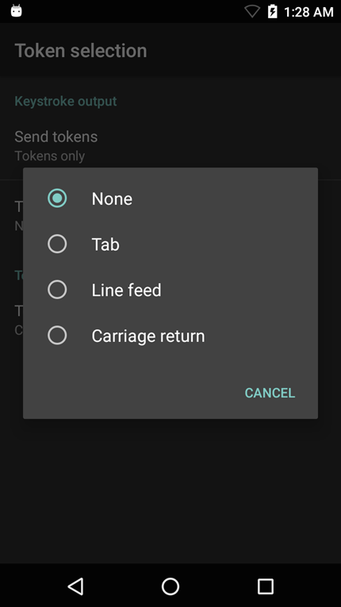

## Overview
Keystroke Output collects the processed data and sends it to the associated application as a series of keystrokes, emulating the actions of a user pressing keys on the device. DataWedge supports TAB, ENTER and other special characters that might be required by an application to submit acquired data for further processing, to advance the cursor to another input field or for other reasons. Special characters are added to acquired data by using the Action key character (shown below) and in the [Basic Data Formatting](../../process/bdf) or [Advanced Data Formatting](../../process/bdf) Process functions. 

-----

## Keystroke Output Setup
To enable Keystroke output for a Profile, place a check in the checkbox:

_Keystroke Output options_
 

**Action key character -** enables injection of a special character embedded within barcode or MSR data. Possible values:

* **None -** inject no action key
* **Tab -** inject action key in place of a ASCII Tab (0x09) character
* **Line feed -** inject action key in place of ASCII LF (0x0A) character
* **Carriage return -** inject action key in place of ASCII CR (0x0D) character

**Multi byte character delay -** used to set an inter-character delay (in ms) for sending multi-byte characters. This parameter can help avoid problems that arise when sending Unicode and multi-byte characters to the Android browser. Value is set to zero by default. If experiencing errors in the delivery of keystrokes, increase the delay value in increments of 100 ms.

**Key event delay -** used to set a delay (in ms) for dispatching control characters as keystrokes to the foreground application.

-----

### UDI Data Output
This setting applies when the Scanning mode in [Barcode Reader Params](../../input/barcode/#readerparams) is set to UDI, which acquires multiple data points (tokens) as specified in the Universal Device Identifier parameter(s) selected in the above-referenced section. 

**Token selection -** allows the output order of acquired UDI data to be adjusted and the optional insertion of a Tab, Line Feed or Carriage Return character between tokens, if required.

**To adjust UDI Token settings**: 

**&#49;. Tap "Send tokens" to select the desired output** for acquired UDI data. 

**Tokens only -** DataWedge parses the UDI data into separate Tokens for output (separated by a separator character, if selected).

**Barcodes and tokens -** DataWedge sends the barcode string appended by the tokenized data. If no separator character is selected (see Step 2), DataWedge sends two instances of the same data.

**&#50;. Tap "Token separator" to select a separator character** to insert between Tokens, if desired. If Barcode and token mode is selected, this character is also inserted between the two. 

_This setting is not available if "Send tokens" is disabled_.
 

**&#51;. Tap "Token order" to include/exclude Tokens** from the output and adjust their output order. 

 

<!-- 
Send data - Set to transfer the captured data to the foreground application. Disabling this option prevents the actual data from being transmitted. However, the prefix and suffix strings, if present, are still transmitted even when this option is disabled (default - enabled).
-->

------

**Other DataWedge Output Options**:

* **[Intent](../intent) -** programmatic data hand-off
* **[Internet Protocol](../ip) -** network output via TCP or UDP

**Related guides**:

* [DataWedge Profiles](../../profiles)
* [DataWedge APIs](../../api) 

