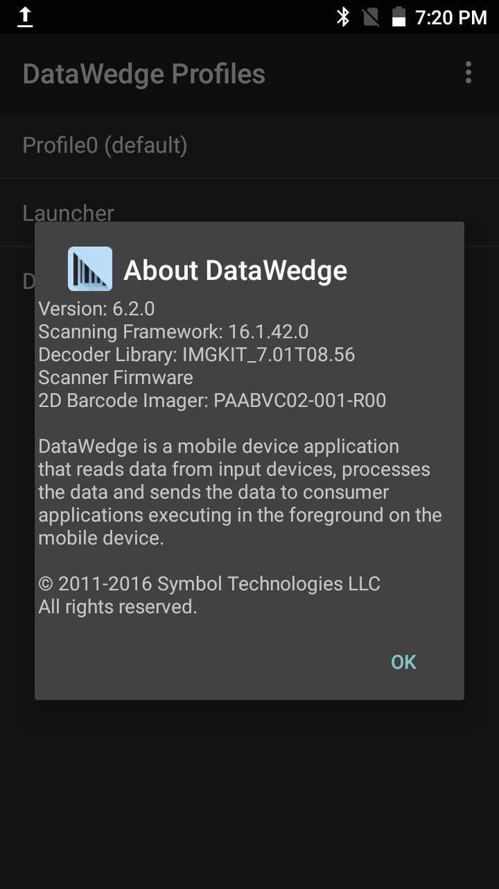

## Overview

DataWedge provides barcode scanning and processing services for Zebra devices running Android. Included with every Zebra device, DataWedge enables all apps on the device (whether stock or added later) to acquire scanned data without using scanner APIs directly. DataWedge can be easily configured to automatically provide scanning services whenever a particular app is launched; to use a particular scanner, reader or other sensor; and to manipulate acquired data according to simple options or complex rules. 

### Language Support

DataWedge has been approved to run on device operating systems localized for the following languages:

* English
* French
* German
* Italian
* Spanish
* Simplified Chinese
* Traditional Chinese

For more information about approved languages or to download a localized operating system, please [contact Zebra Technical Support](https://www.zebra.com/us/en/about-zebra/contact-zebra/contact-tech-support.html).

-----

#### This document applies to:
* **DataWedge 6.6.x**, which requires:

OLD OLD OLD:
* **Scanner Framework 5.1.0** or higher, and
* **SimulScan 1.9 or higher** (on [devices that support SimulScan](../../../../simulscan))

To learn more about DataWedge APIs, read [DataWedge APIs - Benefits & Usage Scenarios](https://developer.zebra.com/community/android/android-forums/android-blogs/blog/2017/06/27/datawedge-apis-benefits-challenges) by Zebra engineer Darryn Campbell. 

-----

### New in DataWedge 6.6

OLD OLD OLD:
**Improved Profile Exporting** 

DataWedge 6.5 improves compatibility of exported Config files and Profiles for deployment to dissimilar devices. Previous versions of DataWedge support deployment of exported Profiles only to devices that are functionally equivalent to the device that created original Profile. Now, Config files and Profiles created with DataWedge 6.5 will work on any Zebra device model running DataWedge 6.5 or higher. See the [Cross-Device Import](../settings/#crossdeviceimport) section of the DataWedge Settings guide for more information. 

**New APIs**

* **[GET_DISABLED_APP_LIST](../api/getdisabledapplist) -** returns the list of apps prohibited from using DataWedge. 
* **[GET_CONFIG](../api/getconfig) -** returns a list of parameter settings in the specified Profile.
* **[SET_DISABLED_APP_LIST](../api/setdisabledapplist) -** allows updates to the Disabled Apps List, which specifies apps prohibited from using DataWedge. 
* **[SWITCH_SCANNER](../api/switchscanner) -** allows an app to select from multiple connected scanners at runtime. 
* **[SWITCH_SCANNER_PARAMS](../api/switchscannerparams) -** allows an app to set scanner parameters at runtime without persisting those settings. 

**Updated APIs**

These APIs have been enhanced to support [RESULT_INFO](../api/resultinfo) feedback mechanism for intents and include result codes. 

* [CLONE_PROFILE](../api/cloneprofile)
* [CREATE_PROFILE](../api/createprofile)
* [DELETE_PROFILE](../api/deleteprofile)
* [ENABLE_DATAWEDGE](../api/enabledatawedge)
* [RENAME_PROFILE](../api/renameprofile)
* [RESET_DEFAULT_PROFILE](../api/resetdefaultprofile)
* [RESTORE_CONFIG](../api/restoreconfig)
* [SCANNER_INPUT_PLUGIN](../api/scannerinputplugin)
* [SET_DEFAULT_PROFILE](../api/setdefaultprofile)
* [SOFTSCAN_TRIGGER](../api/softscantrigger)
* [SWITCH_TO_PROFILE](../api/switchtoprofile)

**DataWedge 6.5 continues to enhance its intent launching structure**, which can launch multiple intents (as extras) in a single intent action. DataWedge continues to support all original commands using their original syntax. For details, see the [DataWedge API guide](../api/overview).

-----

### Main Functionality
The version of DataWedge documented in this guide provides the following primary functions and options: 

* Scan and process all [major barcode symbologies](../input/barcode/#decoderselection)
* Acquire barcodes, images, text, phone numbers, mag-stripe and other data
* Set DataWedge to acquire scanned data for one or more apps
* Create Profiles to implement specific DataWedge features for individual apps 
* Enable/Disable decoding of individual symbologies to improve speed
* Set parameters for individual barcodes, scanners and readers
* Format output according to simple or custom rules
* Use plug-ins for data input, output and processing
* Import and export settings 
* Remotely configure and mass-deploy settings via MDM  
* Restore settings to factory defaults
* Apply remote settings changes immediately 
* Handle escape characters with "string at" criteria in Advanced Data Formatting rules

Availability and operation of DataWedge features varies by device and operating system (which determine the DataWedge version installed on the device). 

<!-- _**This guide describes DataWedge for Android. Features and usage of Windows versions may vary slightly. Please refer to Windows documentation**_. 10/20/16- Windows reference removed per eng. --> 

> Ready to get started? Go to the [DataWedge Setup guide](../setup).

### Which Version is Installed? 

**To determine which DataWedge version is installed on a device**:

<!--

_Launcher icon for DataWedge 3.x_
 
-->

&#49;. On the device, locate and **tap the DataWedge icon** in the Launcher screen or App Drawer: 

_Launcher icon for DataWedge 6.x_
 

&#50;. **Tap the "hamburger" menu**. The DataWedge menu appears: 

 

&#51;. **Tap About**. The "About DataWedge" screen appears. The DataWedge version number is highlighted in the image below. Notice that the Scanner Framework version also is shown.     

_The "About DataWedge" box showing version numbers_ 
 

&#52;. If the DataWedge version on the device is different than that of this guide, visit the [Zebra support site](https://www.zebra.com/us/en/support-downloads.html) and download a device-specific Integrator Guide for reference. 

<!--
#### Download an Integrator Guide
For each of its devices, Zebra publishes an Integrator Guide containing information specific to that device. For products that include DataWedge, **the Integrator Guide includes a chapter covering only those DataWedge capabilities available on the device**. A search for the term "integrator" at the [Zebra Support Portal](https://portal.motorolasolutions.com/Support/US-EN/Search?searchType=simple&searchTerm=integrator) yields a result similar to the image below. Narrow the seach by adding the device model. 
 
 

_The Zebra Support Central site showing search results for the search term "integrator_" 
 

#### Update DataWedge (Windows only)
**DataWedge is part of the device OS image** and relies on specific components built into that image. It cannot be downloaded separately or updated without also updating the entire device, a process that **can result in loss of user data and/or user-installed applications**. It should therefore be considered only after all other options have been eliminated. **Zebra recommends consulting with a Zebra partner before upgrading a device OS image**. 

**This option is not available for Android devices**. 
-->

-----

Related Guides: 

* [DataWedge Setup Guide](../setup)
* [DataWedge Demo app](../demo)
