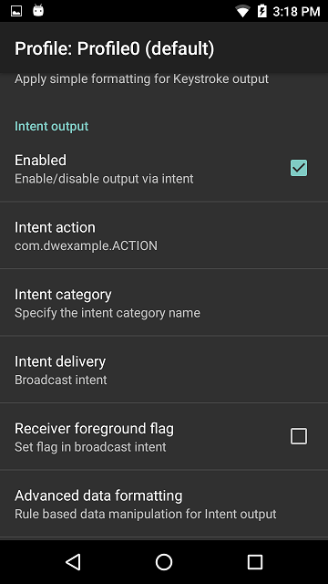
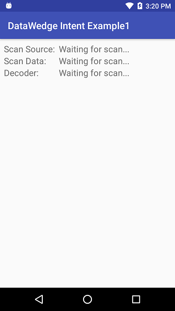

## Overview
This example includes a simplified application that shows how to use the DataWedge service on Zebra mobile computing devices to receive scanned barcode data via an intent. 

-----

### Configure DataWedge

**Configure DataWedge to output scans via intent**: 

&#49;. **Launch DataWedge** via Applications --> DataWedge

&#50;. **Select a Profile** (Profile0 is used by DataWedge for all apps not explicitly assigned a Profile)

&#51;. Confirm the following **Profile settings**:
  * The Profile is **enabled**
  * Barcode input is **enabled**
  * Intent output is **enabled**

&#52;. **Configure the intent output** as follows:
  * Intent action: **com.dwexample.ACTION** (to match value defined in [strings.xml](https://github.com/darryncampbell/DataWedge-Intent-Example-1/blob/master/app/src/main/res/values/strings.xml))
  * Intent category: (**leave blank**)
  * Intent delivery: **Broadcast intent**

The image below shows the correct Profile settings:
  

-----

### Run Application

&#49;. Visit the [project page](https://github.com/darryncampbell/DataWedge-Intent-Example-1) and download, build and launch the sample app. 
 

&#50;. **Upon first launch**, a screen appears similar to the image below: 

 

&#51;. **After scanning a barcode**, fields are populated as pictured below:

 

-----

## Source Code
Below is the sourcecode for the main activity of the sample app.  
For the `build.gradle` and other resources, visit the [app's project page on github](https://github.com/darryncampbell/DataWedge-Intent-Example-1).

		:::java
		//
		// WARNING: This app is for demonstration purposes only.
		// It is not intended for use in a production environment
		//
		package com.darryncampbell.datawedgeintentexample1;

		import android.content.BroadcastReceiver;
		import android.content.Context;
		import android.content.Intent;
		import android.content.IntentFilter;
		import android.support.v7.app.AppCompatActivity;
		import android.os.Bundle;
		import android.util.Log;
		import android.widget.ArrayAdapter;
		import android.widget.Spinner;
		import android.widget.TextView;
		import android.widget.Toast;

		import java.util.ArrayList;

		public class MainActivity extends AppCompatActivity {

	    @Override
	    protected void onCreate(Bundle savedInstanceState) {
	        super.onCreate(savedInstanceState);
	        setContentView(R.layout.activity_main);

	        IntentFilter filter = new IntentFilter();
	        filter.addCategory(Intent.CATEGORY_DEFAULT);
	        filter.addAction(getResources().getString(R.string.activity_intent_filter_action));
	        registerReceiver(myBroadcastReceiver, filter);
	    }

	    @Override
	    protected void onDestroy()
	    {
	        super.onDestroy();
	        unregisterReceiver(myBroadcastReceiver);
	    }

	    private BroadcastReceiver myBroadcastReceiver = new BroadcastReceiver() {
	        @Override
	        public void onReceive(Context context, Intent intent) {
	            String action = intent.getAction();
	            Bundle b = intent.getExtras();
	            
	            //
	            // The following is useful for debugging to verify
	            // the format of received intents from DataWedge...
	            //
	            // for (String key : b.keySet())
	            // {
	            //   Log.v(LOG_TAG, key);
	            // }
	            //

	            if (action.equals(getResources().getString(R.string.activity_intent_filter_action))) {
	                //
	                //  Received a barcode scan
	                //
	                try {
	                    displayScanResult(intent, "via Broadcast");
	                } catch (Exception e) {
	                    //
	                    // Catch if the UI does not exist when broadcast is received 
	                    //
	                }
	            }
	        }
	    };

	    private void displayScanResult(Intent initiatingIntent, String howDataReceived)
	    {
	        String decodedSource = initiatingIntent.getStringExtra(getResources().getString(R.string.datawedge_intent_key_source));
	        String decodedData = initiatingIntent.getStringExtra(getResources().getString(R.string.datawedge_intent_key_data));
	        String decodedLabelType = initiatingIntent.getStringExtra(getResources().getString(R.string.datawedge_intent_key_label_type));

	        final TextView lblScanSource = (TextView) findViewById(R.id.lblScanSource);
	        final TextView lblScanData = (TextView) findViewById(R.id.lblScanData);
	        final TextView lblScanLabelType = (TextView) findViewById(R.id.lblScanDecoder);
	        lblScanSource.setText(decodedSource + " " + howDataReceived);
	        lblScanData.setText(decodedData);
	        lblScanLabelType.setText(decodedLabelType);
	    }
	}
