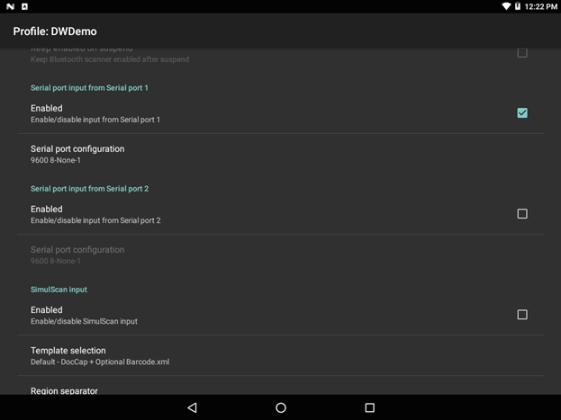

## Overview

Serial Input options are used to specify communications parameters for a scanner or other device connected to a serial port that will be used to acquire data. In the DataWedge UI, the number of serial ports availabile for selection varies according to the number of serial ports on the host device. **Note: DataWedge provides audio and other feedback to alert the user of scanning results and barcode type. See the [Scanner Parameters](#scanparams) section for more information**. 

-----

### Serial Port Configuration 

_Input enabled on Serial port 1 of a Zebra VC80x; second serial port (disabled) also shown._
 

**Baud rate -** specifies the modulation rate of the connected serial device. 

**Data bits -** specifies the number of data bits in a serial frame (data bits per byte). 

**Parity -** specifies the parity bits using one of the following values: 

* None: No parity check
* Odd: Sets the parity bit so the count of bits set is an odd number
* Even: Sets the parity bit so the count of bits set is an even number
* Mark: Leaves the parity bit set to 1
* Space: Leaves the parity bit set to 0

**Stop bits -** specifies the number of stop bits to use.  

_Tapping on a setting displays a dialog box for changing its value._
 

<!-- 
DW_serial_04.png (baud rate)
DW_serial_05.png (data bits)
DW_serial_06.png (parity) 
DW_serial_07.png (stop bits)
 -->

For more information about serial communication values, please refer to documentation that accompanied the peripheral being connected.

-----

### Output Using Intents

How to read Serial input data when using Intent Output bundle?
Update this section under Intent output plugin or where ever you think suits this.
Serial input data uses few new bundle extras as well as existing bundle extra names to fill the intent data bundle. 

Extra name
Type
Description

**Extra Name** com.symbol.datawedge.device_id
String extra 
Device identifier. This is usually the port name.

com.symbol.datawedge.device_name
String extra
Friendly name of the port

com.symbol.datawedge.data_raw
Byte Array extra
Byte array which contains the raw data. 

com.symbol.datawedge.data_string
String extra
UTF8 encoded string data.

com.symbol.datawedge.source
String extra 
Value will be always “serial”

**Important**: For some scanning applications, it might be preferable for decoded data to be sent directly to the current activity and not necessarily displayed. For such instances, the activity must be designated as "singleTop" in its `AndroidManifest.xml` file. Failure to designate an activity in this way will cause an instance of the activity to be launched on every decode, and the data sent to each newly spawned copy. 

For more information about Android Intents, please refer to the [Android Developer site](https://developer.android.com/guide/components/intents-filters.html).

------

**Related guides**:

* [DataWedge Intent APIs](../../api) 
* [DataWedge Profiles](../../profiles)

