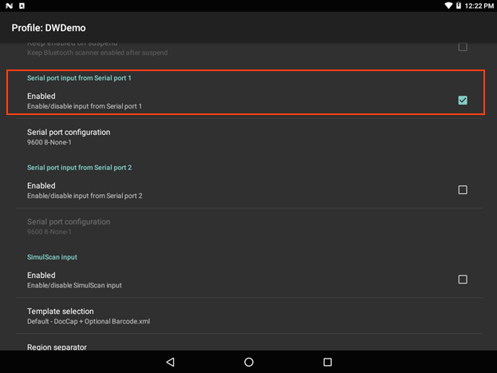

## Overview
The 

_Serial port input enabled_
 

DW_serial_03.png
DW_serial_04.png
DW_serial_05.png
DW_serial_06.png
DW_serial_07.png

**Device Selection -** permits selection between the device camera and the default scanning device set by the system (recommended).

**Template selection -** sets a SimulScan template for the Profile being configured. **Templates included with DataWedge**:

Custom template XML files copied to the `/enterprise/device/settings/datawedge/templates` directory are added to the list above and available for selection. 

**Note: Files and folders in the** `/enterprise` **directory are <u>invisible</u> to the Android File Browser**; they can be made visible in File Browser by manually inputting the path.

Zebra partners and other authorized users can create custom templates online using Zebra's [SimulScan Template Builder](../../../../../simulscan/1-1/guide/templatebuilder). 

**Region separator -** used to configure a separator character for SimulScan text-region data (see Notes, below). When multiple text regions exist, the region separator will be inserted between the data strings from each region on the acquisition form. Region separators can be used with the [Keystroke Output Action key](../../output/keystroke) character settings to dispatch SimulScan region data to separate text fields.

**Possible values**:
* None (default)
* Tab
* Line feed 
* Carriage return 

### SimulScan Notes 

* **DataWedge concatenates all text captured through SimulScan** into a single string and performs processing on that string. 
* **Barcode, OCR and OMR regions** are considered text regions. When using keystroke output and/or IP output, only text-region data will be dispatched to the foreground application or to a remote server.
* **Picture-region data** (images) can be retrieved only through Intent Output.
* **Text captured through SimulScan** is concatenated into a single string and processing is performed on that string.
* **If Barcode Input is enabled in a Profile**, enabling SimulScan in that Profile will cause the Barcode Input Plug-in to be disabled. 

-----

### SimulScan-related Data

The SimulScan-related data added to an Intent bundle can be retrieved using the following calls: 

* `Intent.getStringtExtra()`
* `Intent. getParcelableArrayListExtra()`
* `Bundle.getInt()`
* `Bundle.getString()`
* `Bundle.getByteArray()`
<!-- * `Intent.getSerializableExtra()` -->

The calls above can use the following String tags:

* **String SIMULSCAN_TEMPLATE_NAME_TAG = "com.symbol.datawedge.simulscan_template_name"**; The name of the template which used by SimulScan to capture the form.

Possible return values for the region type:

* **Barcode -** Region is a barcode.
* **OCR -** Region is an Optical Character Recognition (OCR) region (i.e name or address). 
* **OMR -** Region is an Optical Mark Recognition (OMR) region (i.e checkbox, radio button).
* **Picture -** Region is a picture; data will be in the JPEG format.
* **Form -** Form type to specify that the bundle contains a picture of the captured form. Form image will be in the JPEG format.

**Important**: For some scanning applications, it might be preferable for decoded data to be sent directly to the current activity and not necessarily displayed. For such instances, the activity must be designated  as "singleTop" in its AndroidManifest.xml file. Failure to designate an activity in this way will cause an instance of the activity to be launched on every decode, and the data sent to each newly spawned copy. 

For more information about Android Intents, please refer to the [Android Developer site](https://developer.android.com/guide/components/intents-filters.html).

------

**Related guides**:

* [DataWedge Profiles](../../profiles)
* [DataWedge APIs](../../api) 

