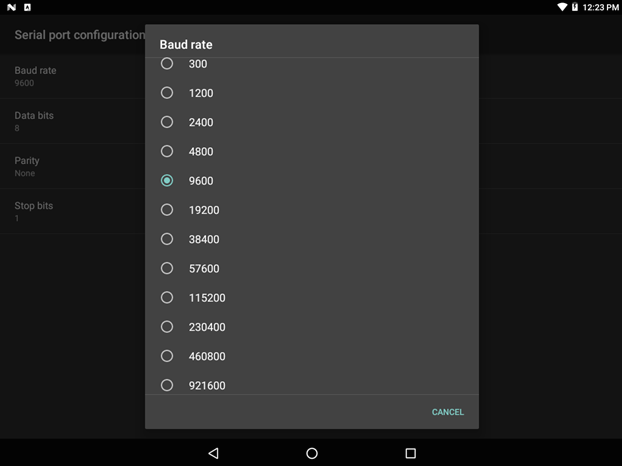

## Overview

Serial Input options are used to specify communications parameters for a scanner or other device connected to a serial port that will be used to acquire data. In the DataWedge UI, the number of serial ports availabile for selection varies according to the number of serial ports on the host device.

<!-- 2/28/18- Removed per eng. 
**Note: DataWedge provides audio and other feedback to alert the user of scanning results and barcode type. See the [Scanner Parameters](#scanparams) section for more information**. 
 -->

-----

### Serial Port Configuration 
**_Applies only to devices running Android N and higher_**. _Pre-N versions offer Enable/Disable function only_.

_Input enabled on Serial port 1 of a Zebra VC80x; second serial port (disabled) also shown._
 

**Baud rate -** specifies the modulation rate of the connected serial device. 

**Data bits -** specifies the number of data bits in a serial frame (data bits per byte). 

**Parity -** specifies the parity bits using one of the following values: 

* None: No parity check
* Odd: Sets the parity bit so the count of bits set is an odd number
* Even: Sets the parity bit so the count of bits set is an even number
* Mark: Leaves the parity bit set to 1
* Space: Leaves the parity bit set to 0

**Stop bits -** specifies the number of stop bits to use.  

_Tapping on a setting displays a dialog box for changing its value._
 

**Note: Serial port configuration is available only on devices running Android N and higher**. For prior versions, only the Enable/Disable options are available for serial ports.

<!-- 
DW_serial_04.png (baud rate)
DW_serial_05.png (data bits)
DW_serial_06.png (parity) 
DW_serial_07.png (stop bits)
 -->

For more information about required serial communication settings, please refer to documentation that accompanied the peripheral being connected.

-----

### Output Using Intents

Rather than displaying decoded data on the screen, it might be preferable for some scanning apps to output acquired data directly to an app activity. This is done using Android intents. See [SET_CONFIG](../../api/setconfig) and [GET_CONFIG](../../api/getconfig) APIs for parameters and sample code. 

**SEE ALSO**:
* **[Intent Output guide](../../output/intent)** | Information and important warnings about intents
* **[Android Developer site](https://developer.android.com/guide/components/intents-filters.html)** | General information about Android intents 

------

**Related guides**:

* [DataWedge Intent APIs](../../api) 
* [DataWedge Profiles](../../profiles)

