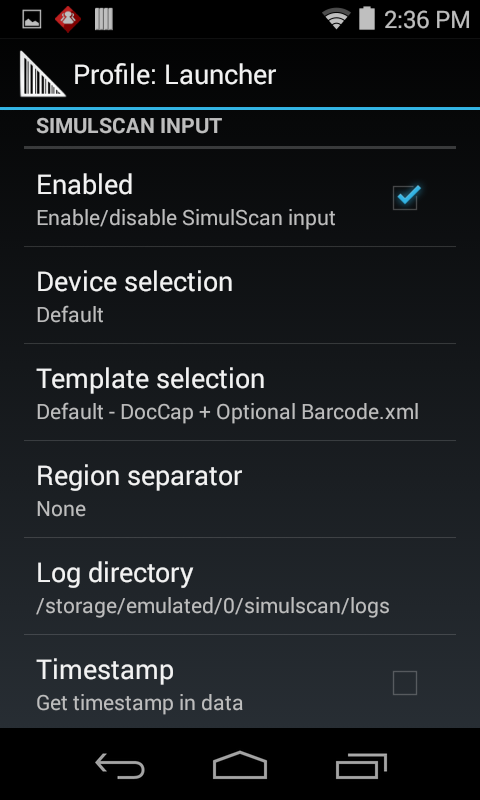

## Overview
The [Zebra SimulScan](../../../../../simulscan) app permits simultaneous capture of barcodes, images, text, signatures, phone numbers and other data from a scan target in a single pass. A SimulScan Input option adds this capability to DataWedge. When form data is captured according to a designated SimulScan template, data can be processed or formatted as required using Process Plug-ins. For more information, refer to the [SimulScan User Guide](../../../../../simulscan). 

> This feature can be used only on [devices that support SimulScan](../../../../../simulscan). 

_SimulScan Input options_
 

**Device Selection -** permits selection between the device camera and the default scanning device set by the system (recommended).

**Template selection -** sets a SimulScan template for the Profile being configured. **Templates included with DataWedge**:

 * **BankCheck.xml -** captures the account number and routing number from the machine-readable zone (MRZ) of a check.
 * **Barcode1.xml -** decodes a single barcode of any symbology.
 * **Barcode2.xml -** decodes two barcodes of the same or differing symbologies.
 * **Barcode4.xml -** decodes four barcodes of the same or differing symbologies.
 * **Barcode5.xml -** decodes five barcodes of the same or differing symbologies.
 * **Barcode10.xml -** decodes 10 barcodes of the same or differing symbologies.
 * **BookNumber.xml -** decodes 10- or 13-digit [ISBN codes](http://www.isbn.org/faqs_general_questions).
 * **DocCap+Optional-Barcode.xml -** captures the form as an image and optionally decodes a barcode, if present. **This is the default form if none is selected**.
 * **DocCap+Required-Barcode.xml -** captures the form and decodes any available barcode.
 * **TravelDoc.xml -** captures information from the machine-readable zone (MRZ) of a travel document such as a passport.
 * **Unstructured Multi-Line.xml -** uses OCR to acquire multiple lines of alpha/numeric text.
 * **Unstructured Single Line.xml -** uses OCR to acquire a single line of alpha/numeric text.

_The names of all Templates included with SimulScan are preceded by the word "Default" plus a hyphen_.

Custom template XML files copied to the `/enterprise/device/settings/datawedge/templates` directory are added to the list above and available for selection. 

**Note: Files and folders in the** `/enterprise` **directory are <u>invisible</u> to the Android File Browser**; they can be made visible in File Browser by manually inputting the path.

Zebra partners and other authorized users can create custom templates online using Zebra's [SimulScan Template Builder](../../../../../simulscan/1-1/guide/templatebuilder). 

**Dynamic Template Params –** permits the configuration of parameters when using Dynamic Templates, which are created using [Template Builder](http://simulscan.zebra.com/). Currently supports Dynamic Quantity, the specification of the number of barcodes (from 1-99; default=5) to be decoded on a form. 

<!-- 
_Dynamic Barcode Quantity_
 
 -->
**Region separator -** used to configure a separator character for SimulScan text-region data (see Notes, below). When multiple text regions exist, the region separator will be inserted between the data strings from each region on the acquisition form. Region separators can be used with the [Keystroke Output Action key](../../output/keystroke) character settings to dispatch SimulScan region data to separate text fields.

**Possible values**:
* None (default)
* Tab
* Line feed 
* Carriage return 

### SimulScan Notes 

* **DataWedge concatenates all text captured through SimulScan** into a single string and performs processing on that string. 
* **Barcode, OCR and OMR regions** are considered text regions. When using keystroke output and/or IP output, only text-region data will be dispatched to the foreground application or to a remote server.
* **Picture-region data** (images) can be retrieved only through Intent Output.
* **Text captured through SimulScan** is concatenated into a single string and processing is performed on that string.
* **If Barcode Input is enabled in a Profile**, enabling SimulScan in that Profile will cause the Barcode Input Plug-in to be disabled. 

-----

### SimulScan-related Data

The SimulScan-related data added to an Intent bundle can be retrieved using the following calls: 

* `Intent.getStringtExtra()`
* `Intent. getParcelableArrayListExtra()`
* `Bundle.getInt()`
* `Bundle.getString()`
* `Bundle.getByteArray()`
<!-- * `Intent.getSerializableExtra()` -->

The calls above can use the following String tags:

* **String SIMULSCAN_TEMPLATE_NAME_TAG = "com.symbol.datawedge.simulscan_template_name"**; The name of the template which used by SimulScan to capture the form.

* **String SIMULSCAN_REGIONS_BUNDLE_TAG= "com.symbol.datawedge.simulscan_region_data"**; Return an array of Bundles where each bundle contains data and information about a region and the form.

* **String SIMULSCAN_REGION_NAME_TAG = "com.symbol.datawedge.simulscan_region_name"**; Returns the region name of the bundle object for reach region. To get the region name `Bundle.getString()` should be called.

* **String SIMULSCAN_REGION_ID_TAG = "com.symbol.datawedge.simulscan_region_id"**; Returns the region id of the bundle object for reach region. Region id is an integer and can be retrieved by calling `Bundle.getInt ()`.

* **String SIMULSCAN_REGION_STRING_DATA= "com.symbol.datawedge.simulscan_region_string_data"**; Returns the string data of the region. String data comes with barcode, OCR and OMR data.

* **String SIMULSCAN_REGION_BINARY_DATA= "com.symbol.datawedge.simulscan_region_string_data"**;
Returns the data of the region in the form of byte array. Binary data comes only for picture regions and the form image. Both picture and form data can be load in to a bitmap and display in the application.

* **String SIMULSCAN_REGION_TYPE_TAG = "com.symbol.datawedge.simulscan_region_type"**; Returns the region type of the bundle object for reach region. Region type is a string and can be retrieved by calling `Bundle.getString ()`. 

Possible return values for the region type:

* **Barcode -** Region is a barcode.
* **OCR -** Region is an Optical Character Recognition (OCR) region (i.e name or address). 
* **OMR -** Region is an Optical Mark Recognition (OMR) region (i.e checkbox, radio button).
* **Picture -** Region is a picture; data will be in the JPEG format.
* **Form -** Form type to specify that the bundle contains a picture of the captured form. Form image will be in the JPEG format.

**Important**: For some scanning applications, it might be preferable for decoded data to be sent directly to the current activity and not necessarily displayed. For such instances, the activity must be designated  as "singleTop" in its AndroidManifest.xml file. Failure to designate an activity in this way will cause an instance of the activity to be launched on every decode, and the data sent to each newly spawned copy. 

For more information about Android Intents, please refer to the [Android Developer site](https://developer.android.com/guide/components/intents-filters.html).

------

**Related guides**:

* [SimulScan User Guide](../../../../../simulscan) 
* [DataWedge Profiles](../../profiles)
* [DataWedge APIs](../../api) 

