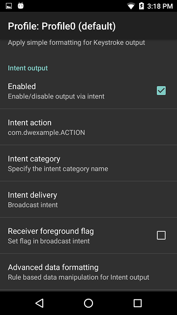
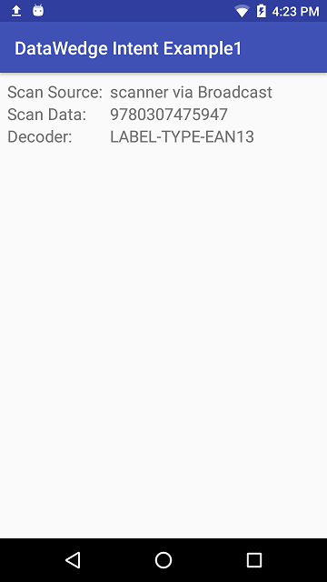

## Overview
The DataWedge service comes preinstalled on all Zebra mobile devices running Android and can add scanning capabilities to virtually any app on the device. This example describes a simplified application that demonstrates how to use DataWedge to receive scanned barcode data through an Android intent. 

In essence, the process boils down to this:

1. **Deploy the target Android app** (on which to enable scanning) to a Zebra device.  
2. **Launch DataWedge** on the device.
3. **Configure DataWedge INPUT (barcode scanner) and OUTPUT (Intent)**.
4. **Optional: Create a Profile** to associate with the target app. If no Profile is created and assigned, DataWedge will use Profile0, a built-in Profile designed for this purpose. 

Details and source code follow. 

-----

### Configure DataWedge

**Configure DataWedge to output scans via intent**: 

&#49;. **Launch DataWedge** via Applications --> DataWedge

&#50;. **Select a Profile** (Profile0 is used by DataWedge for all apps not explicitly assigned a Profile)

&#51;. Confirm the following **Profile settings**:
  * The Profile is **enabled**
  * Barcode input is **enabled**
  * Intent output is **enabled**

&#52;. **Configure the intent output** as follows:
  * Intent action: **com.dwexample.ACTION** (to match value defined in the `strings.xml` file) <!-- [strings.xml](https://github.com/darryncampbell/DataWedge-Intent-Example-1/blob/master/app/src/main/res/values/strings.xml)) -->
  * Intent category: (**leave blank**)
  * Intent delivery: **Broadcast intent**

The image below shows the correct Profile settings:
  

See the DataWedge [Intent Output guide](../../output/intent) for more information about these settings. 

<!-- 
### NOTES

**Intent action -** an implicit intent sent by DataWedge. The target app must be configured to receive this intent. For the purposes of this tutorial, "com.dwexample.ACTION" can be specified.
**Intent category -** is associated with the intent sent by DataWedge following each scan.
**Intent delivery -** can be one of:
 * “Send via StartActivity” is analogous to calling [Context.startActivity](https://developer.android.com/reference/android/content/Context.html#startActivity(android.content.Intent))
 * “Send via StartService” is analogous to calling [Context.startService](https://developer.android.com/reference/android/content/Context.html#startService(android.content.Intent))
 * “Broadcast intent” is analogous to calling [Context.sendBroadcast](https://developer.android.com/reference/android/content/Context.html#sendBroadcast(android.content.Intent))
 -->

-----

### Run Application

&#49;. Visit the [project page](https://github.com/darryncampbell/DataWedge-Intent-Example-1) and download, build and launch the sample app. 
 

&#50;. **Upon first launch**, a screen appears similar to the image below: 

 

&#51;. **After scanning a barcode**, fields are populated as pictured below:

 

-----

## Source Code

### Main Activity

Below is the sourcecode for the MainActivity.java of the sample app.  
For the `build.gradle` and other resources, visit the [app's project page on github](https://github.com/darryncampbell/DataWedge-Intent-Example-1).

		:::java
		//
		// WARNING: This app is for demonstration purposes only.
		// It is not intended for use in a production environment
		//
		package com.darryncampbell.datawedgeintentexample1;

		import android.content.BroadcastReceiver;
		import android.content.Context;
		import android.content.Intent;
		import android.content.IntentFilter;
		import android.support.v7.app.AppCompatActivity;
		import android.os.Bundle;
		import android.util.Log;
		import android.widget.ArrayAdapter;
		import android.widget.Spinner;
		import android.widget.TextView;
		import android.widget.Toast;

		import java.util.ArrayList;

		public class MainActivity extends AppCompatActivity {

		// 
		// The section snippet below registers to receive the data broadcast from the
		// DataWedge intent output. In the example, a dynamic broadcast receiver is 
		// registered in the onCreate() call of the target app. Notice that the filtered action 
		// matches the "Intent action" specified in the DataWedge Intent Output configuration.
		// 
		// For a production app, a more efficient way to the register and unregister the receiver 
		// might be to use the onResume() and onPause() calls. 

		// Note: If DataWedge had been configured to start an activity (instead of a broadcast), 
		// the intent could be handled in the app's manifest by calling getIntent() in onCreate(). 
		// If configured as startService, then a service must be created to receive the intent.
		//

	    @Override
	    protected void onCreate(Bundle savedInstanceState) {
	        super.onCreate(savedInstanceState);
	        setContentView(R.layout.activity_main);

	        IntentFilter filter = new IntentFilter();
	        filter.addCategory(Intent.CATEGORY_DEFAULT);
	        filter.addAction(getResources().getString(R.string.activity_intent_filter_action));
	        registerReceiver(myBroadcastReceiver, filter);
	    }

	    @Override
	    protected void onDestroy()
	    {
	        super.onDestroy();
	        unregisterReceiver(myBroadcastReceiver);
	    }
	    //
	    // After registering the broadcast receiver, the next step (below) is to define it.  
	    // Here it's done in the MainActivity.java, but also can be handled by a separate class.
	    // The logic of extracting the scanned data and displaying it on the screen 
	    // is executed in its own method (later in the code). Note the use of the 
	    // extra keys defined in the strings.xml file.  
	    //  
	    private BroadcastReceiver myBroadcastReceiver = new BroadcastReceiver() {
	        @Override
	        public void onReceive(Context context, Intent intent) {
	            String action = intent.getAction();
	            Bundle b = intent.getExtras();
	            
	            //
	            // The following is useful for debugging to verify
	            // the format of received intents from DataWedge:
	            //
	            // for (String key : b.keySet())
	            // {
	            //   Log.v(LOG_TAG, key);
	            // }
	            //

	            if (action.equals(getResources().getString(R.string.activity_intent_filter_action))) {
	                //
	                //  Received a barcode scan
	                //
	                
	                try {
	                    displayScanResult(intent, "via Broadcast");
	                } catch (Exception e) {
	                
	                //
	                // Catch if the UI does not exist when broadcast is received 
	                //
	                }
	            }
	        }
	    };
	    //
	    // The section below assumes that a UI exists in which to place the data. A production 
	    // application would be driving much of the behavior following a scan.
	    //
	    private void displayScanResult(Intent initiatingIntent, String howDataReceived)
	    {
	        String decodedSource = initiatingIntent.getStringExtra(getResources().getString(R.string.datawedge_intent_key_source));
	        String decodedData = initiatingIntent.getStringExtra(getResources().getString(R.string.datawedge_intent_key_data));
	        String decodedLabelType = initiatingIntent.getStringExtra(getResources().getString(R.string.datawedge_intent_key_label_type));

	        final TextView lblScanSource = (TextView) findViewById(R.id.lblScanSource);
	        final TextView lblScanData = (TextView) findViewById(R.id.lblScanData);
	        final TextView lblScanLabelType = (TextView) findViewById(R.id.lblScanDecoder);
	        lblScanSource.setText(decodedSource + " " + howDataReceived);
	        lblScanData.setText(decodedData);
	        lblScanLabelType.setText(decodedLabelType);
	    }
	}

### Strings.xml

Predefining some of the strings simplifies the process of receiving and extracting the scanned data in the target app. When received, the intent’s action (`com.dwexample.ACTION`) will contain extras with the scanned data for source, type and data as described in the DataWedge [Intent Output guide](../../output/intent/#singledecodemode). 

	:::xml
	<resources>
	    <string name="dw_action">com.dwexample.ACTION</string>
	    <string name="datawedge_intent_key_source">com.symbol.datawedge.source</string>
	    <string name="datawedge_intent_key_label_type">com.symbol.datawedge.label_type</string>
	    <string name="datawedge_intent_key_data">com.symbol.datawedge.data_string</string>
	</resources>

<!-- Notes integrated into Main Activity

### Register broadcast receiver

The snippet below is the section of the main activity (above) that registers to receive the data broadcast from the DataWedge intent output. In the example, a dynamic broadcast receiver is registered in the `onCreate()` call of the target app. For a production app, a more efficient way to the register and unregister the receiver might be to use the `onResume()` and `onPause()` calls. Notice that the filtered action matches the "Intent action" specified in [Step 4](#configuredatawedge), above.

**Note**: If DataWedge had been configured to start an activity (instead of a broadcast), it could be handled in the app's manifest by calling `getIntent()` in `onCreate()`. If configured as startService, then a service must be created to receive the intent.

	:::java
	@Override
	protected void onCreate(Bundle savedInstanceState) {
	    ...
	    IntentFilter filter = new IntentFilter();
	    filter.addCategory(Intent.CATEGORY_DEFAULT);
	    filter.addAction(getResources().getString(R.string.dw_action));
	    registerReceiver(myBroadcastReceiver, filter);
	}

 -->

-----

## Related Guides

* [The original tutorial](http://www.darryncampbell.co.uk/2017/12/13/tutorial-scan-with-datawedge-intent-output-on-zebra-devices/) | by Zebra engineer Darryn Campbell
* DataWedge [Intent Output guide](../../output/intent) | for usage settings and details
* [DataWedge APIs](../) | for intent-based functions

