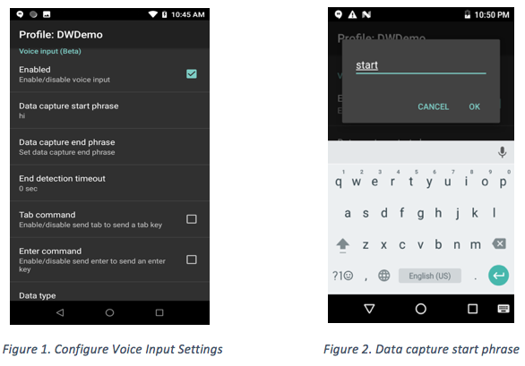
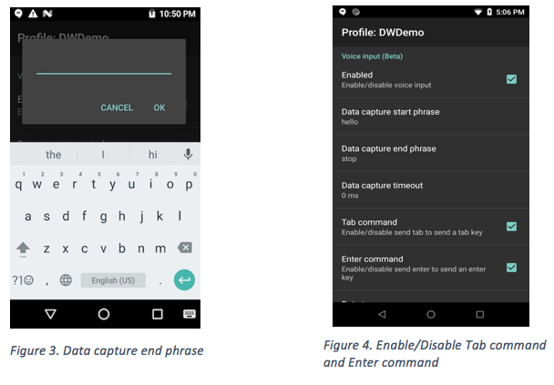
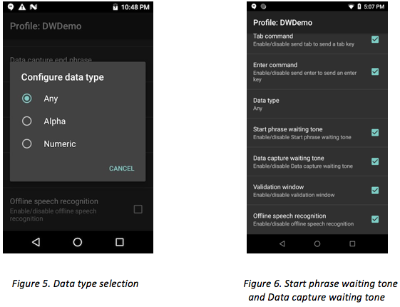
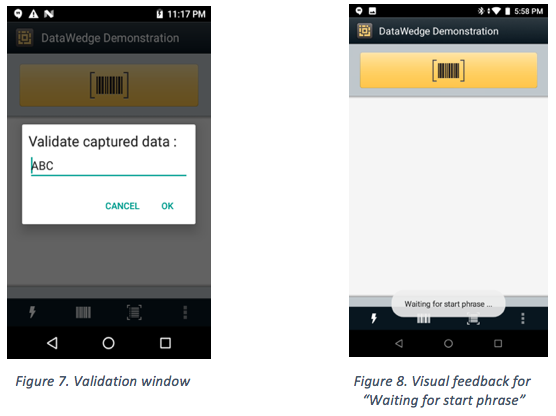
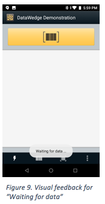

## Overview
With Voice Input, DataWedge has extended automated data capture to user applications through voice by utilizing the built-in Google speech recognition engine.  This capability enhances DataWedge support beyond keystroke output (which collects the processed data and sends it to the foreground application as a series of keystrokes without writing any code) and intents (where user applications can consume captured data in their application using this well-known Android component). 

>This feature is only supported on Zebra GMS devices.

Voice data capture begins after speaking the predefined "start phrase" and the capture stops after speaking the data. If an "end phrase" is defined, voice data capture terminates after speaking the "end phrase".

Other options available to fine-tune Voice Input capture:
* Terminate voice capture by setting a timeout value rather than using an end phrase.
* Send a "tab" when speaking the "send tab" command.
* Send an "enter" when speaking the "send enter" command.
* Configure the character data type returned to alpha, numeric, or both.
* Allow for device audio feedback when waiting for a start phrase or waiting for data capture.
* Allow for validation of the spoken data and for editing the data if needed.
* Allow for offline speech recognition.

##Voice Input Features

* **Enabled** - This checkbox option enables voice input. _Refer to Figure 1 below._

* **Data capture start phrase** - This phrase is mandatory to start the data capture. The default value is "start". _Refer to Figure 2 below._

* **Data capture end phrase** - This phrase ends the data capture. It is not mandatory and may be left blank. There is no default value. _Refer to Figure 1 and 3 below._

* **End detection timeout** - This option sets the timeout value (in seconds) for the data capture during the “waiting for data” state. The default value is "0". If the value is set to "0" and the end phrase is defined, it waits infinitely for the data capture. Whereas, when the end phrase is not defined, data is returned immediately. This timeout is approximate, as it may encounter a 1 to 2 second delay. _Refer to Figure 1 below._

* **Tab command** - This checkbox option enables the feature to send a tab key when speaking the command "send tab". This command is supported only when the device is at the state "waiting for start phrase". _Refer to Figure 4 below._

* **Enter command** - This checkbox option enables the feature to send an enter key when speaking the command "send enter". _Refer to Figure 4 below._

* **Data type** - This option configures the data type to be returned, with selections of: Any, Alpha, or Numeric. The data type is required to limit data capture according to the preferences. _Refer to Figure 5 below._
Data type selections:
<ul style="margin-left: 16px;">
  <li>Any - All scanned data is returned. For example, if the barcode ABC123 is scanned, it will return ABC123 as is. </li>
  <li>Alpha - Only alpha characters are returned. For example, if the barcode ABC123 is scanned, it will return ABC only. </li>
  <li>Numeric - Only digits are returned. For example, if the barcode ABC123 is scanned, it will return 123 only. </li>
</ul>

* **Start phrase waiting tone** - This option controls the start phrase waiting tone. It enables/disables the audio feedback for “waiting for start”, notifying that the device is waiting to start the speech engine in case the toast message notification is missed and there is a change in “waiting for data” state. _Refer to Figure 6 below._

* **Data capture waiting tone** - This option controls the data capture waiting tone. It enables/disables audio feedback for “waiting for data”, notifying that the device is waiting to capture data in case the toast message notification is missed. _Refer to Figure 6 below._

* **Validation window** - This option allows to validate the result after speaking.  It displays the data spoken and allows for editing the data on the same screen, if modification is needed. This is very useful when used in offline mode, since the results received in this mode are not as accurate. _Refer to Figure 7 below._

* **Offline speech recognition** - This checkbox option enables offline speech recognition when there is no access to the internet. This uses an offline recognition speech engine to detect the data spoken. _Refer to Figure 6 below._

> See Limitations below.

##User Interface
 
 

 

 

 

 

##Configuration

###Voice Input Parameters

Refer to DataWedge Voice Input Plugin in [Set Config API](../../api/setconfig) to configure the following Voice Input parameters:

<table class="facelift" style="width:60%" border="1" padding="5px">
  <tr bgcolor="#dce8ef" align="center">
    <th>Param Name</th> 
    <th>Param Values</th> 
  </tr>

  <tr>
    <td>voice_input_enabled</td>
    <td>true, false</td>
  </tr>
  <tr>
    <td>voice_data_capture_start_phrase</td>
    <td>start (default value)</td>
  </tr>
  <tr>
    <td>voice_data_capture_end_phrase</td>
    <td>[blank] (default value)</td>
  </tr>
  <tr>
    <td>voice_end_detection_timeout</td>
    <td>0-30</td>
  </tr>
  <tr>
    <td>voice_tab_command</td>
    <td>true, false</td>
  </tr>
  <tr>
    <td>voice_enter_command</td>
    <td>true, false</td>
  </tr>
  <tr>
    <td>voice_data_type</td>
    <td>Any, Alpha, Numeric</td>
  </tr>
  <tr>
    <td>voice_start_phrase_waiting_tone</td>
    <td>true, false</td>
  </tr>
  <tr>
    <td>voice_data_capture_waiting_tone</td>
    <td>true, false</td>
  </tr>
  <tr>
    <td>voice_validation_window</td>
    <td>true, false</td>
  </tr>
  <tr>
    <td>voice_data_capture_waiting_tone</td>
    <td>true, false</td>
  </tr>
  <tr>
    <td>voice_offline_speech</td>
    <td>true, false</td>
  </tr>
</table>

###Set Voice Input Configuration Sample

Refer to DataWedge [Set Config API](../../api/setconfig).

    Bundle bMain = new Bundle();
    bMain.putString("PROFILE_NAME", "DWDemo");
    bMain.putString("PROFILE_ENABLED", "true");
    bMain.putString("CONFIG_MODE", "CREATE_IF_NOT_EXIST");

    Bundle bConfig = new Bundle();
    bConfig.putString("PLUGIN_NAME","VOICE");
    bConfig.putString("RESET_CONFIG","false");

    Bundle bParams = new Bundle();
    bParams.putString("voice_input_enabled","true"); // Supported Values: true, false
    bParams.putString("voice_data_capture_start_phrase","hi");
    bParams.putString("voice_data_capture_end_phrase","end");
    bParams.putString("voice_end_detection_timeout","3");
    bParams.putString("voice_tab_command","true"); // Supported Values: true, false
    bParams.putString("voice_enter_command","true"); // Supported Values: true, false
    bParams.putString("voice_data_type","1");
    bParams.putString("voice_start_phrase_waiting_tone","true"); // Supported Values: true, false
    bParams.putString("voice_data_capture_waiting_tone","false"); // Supported Values: true, false
    bParams.putString("voice_validation_window","true"); // Supported Values: true, false
    bParams.putString("voice_offline_speech","true"); // Supported Values: true, false

    bConfig.putBundle("PARAM_LIST", bParams);

    bMain.putBundle("PLUGIN_CONFIG", bConfig); //true, false

    Intent i = new Intent();
    i.setAction("com.symbol.datawedge.api.ACTION");
    i.putExtra("com.symbol.datawedge.api.SET_CONFIG", bMain);
    i.putExtra("SEND_RESULT", "true");
    i.putExtra("COMMAND_IDENTIFIER", "SET_CONFIG");
    this.sendBroadcast(i);

##Limitations
* Do not use Google Assistant while DataWedge Voice Input is in use, as it may lead to undesirable behavior. 
* Providing numbers and other special characters as part of the data capture start phrase is not supported.
* Voice Input is not supported if Enterprise Home Screen (EHS) is in restricted mode. However, enabling all the privilege settings in EHS will reinstate Voice Input in DataWedge.  
* Voice Input is supported only in English.

------

**Related guides**:

* [Profiles/Plug-ins](../../profiles)
* [DataWedge APIs](../../api) 