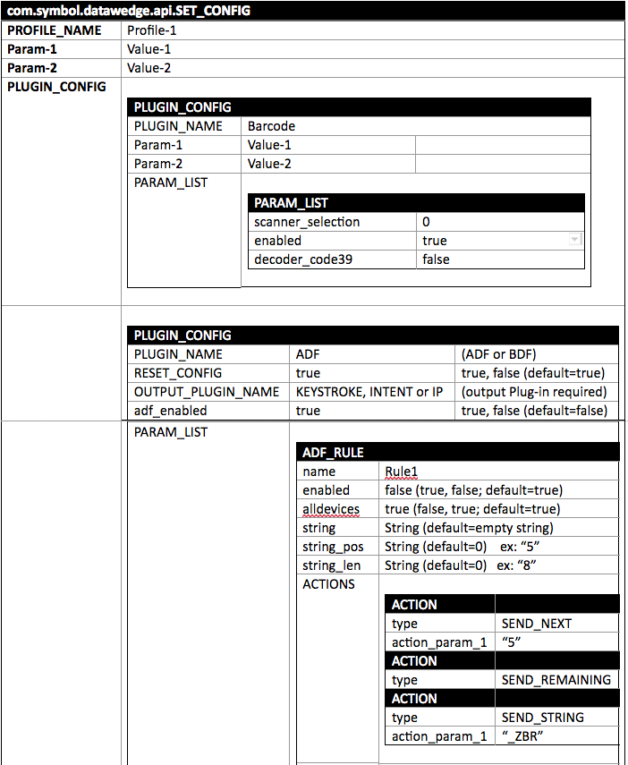
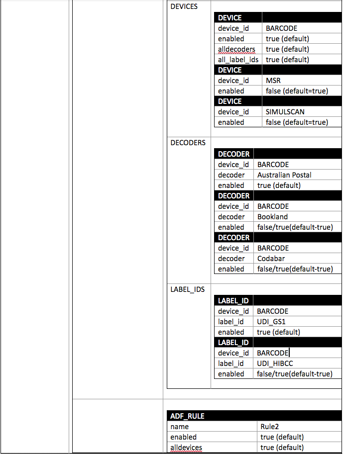

## SET_CONFIG
Used to create, update or replace a DataWedge Profile and its settings, and can configure multiple Plug-ins with a single intent action. 

This API implements [nested bundles](../overview/#nestedbundles), which contain multiple configuration parameters in a single data field. 

 

To create a Profile without configuring its settings parameters, use [CREATE_PROFILE](../createprofile).

### Version History
* **DataWedge 6.4 -** API introduced
* **DataWedge 6.6 -** Added support for configuring multiple Plug-ins with a single Action
* **DataWedge 6.7 -** Enhanced inter-character delay feature [(More info)](../../output/keystroke/#keystrokeoutputsetup)
* **DataWedge 6.8 -** Support for ADF settings: 
 * **New ADF_RULE bundle** with Action, Device, Decoder and Label_ID sub-bundles
 * **New result code**: RESULT_ACTION_RESULT_CODE_EMPTY_RULE_NAME
* **DataWedge 6.9/7.0 -** Added support for Voice Input and Global Scanner Configuration.

### Function Prototype

	Intent i = new Intent();
	i.setAction("com.symbol.datawedge.api.ACTION");
	i.putExtra("com.symbol.datawedge.api.SET_CONFIG", <mainbundle>);

### Parameters

**ACTION** [String]: "com.symbol.datawedge.api.ACTION"

**EXTRA_DATA** [String]: "com.symbol.datawedge.api.SET_CONFIG"

**BUNDLE**: &lt;mainbundle&gt; (see parameters below)

#### MAIN BUNDLE
The main `SET_CONFIG` bundle includes the following properties:

* **PROFILE_NAME** [String]: The name of the Profile on which to perform action(s)
* **CONFIG_MODE** [String]: (Default=OVERWRITE)
 * **CREATE_IF_NOT_EXIST**: Creates the Profile if string in PROFILE_NAME is not present on device 
 * **OVERWRITE**: If Profile exists, resets all options to default, then configures specified settings
 * **UPDATE**: Updates only specified settings
* **PROFILE_ENABLED** [String]: Optional; Controls whether to enable (true) or disable (false) a Profile (default=true). If not specified, no change is made to the Profile state.
* **PLUGIN_CONFIG** [Bundle[ ]]: A bundle array (nested within the main bundle) that contains settings of each Plug-in
* **APP_LIST** [Array]: List of applications and/or activities to associate with the Profile

#### PLUGIN_CONFIG BUNDLE
The `PLUGIN_CONFIG` bundle is configured using the following properties:

* **RESET_CONFIG** [String]: Optional. When used, takes the following values: 
 * **True (Default) –** Clear any existing configuration and create a new configuration with the specified parameter values  
 * **False –** Update the existing values and add values not already in the configuration

**PLUGIN_NAME** [String]: Name of the Plug-in to configure:
 * **BARCODE** input
 * **SERIAL** input
 * **VOICE** input
 * **INTENT** output
 * **KEYSTROKE** output
 * **BDF** (basic data formatting) processing
 * **ADF** (advanced data formatting) processing

**Notes**: 
* Plug-in names are case sensitive.
* For DataWedge 6.5 and below, each intent involving a Plug-in requires a separate intent Action.
* See tables below for `PARAM_LIST` values. 

**PARAM_LIST** [Bundle]: A parameter list bundle nested within the `PLUGIN_CONFIG` bundle. Includes the list of parameters to be updated under the specified Plug-in. **Setting an empty string in any parameter value resets that parameter to its default setting**. 

_A visual representation of nested SET_CONFIG bundles. [See example code](#examplecode)._ 
 

#### PARAM_LIST BUNDLE
The `PARAM_LIST` bundle is configured by specifying the parameter name and value from the table below. Applies to parameters matching the `PLUGIN_NAME` specified in `PLUGIN_CONFIG` bundle. 

* **BARCODE –** takes a value from the [Scanner Input Parameters](#scannerinputparameters) table below; specify decoder and other input settings as `EXTRA_DATA` in the `PARAM_LIST` nested bundle.
 * `scanner_selection_by_identifier` [string]- takes a value from the list of [Scanner Identifiers](#scanneridentifiers) below.
 * `configure_all_scanners` [string]- true/false
  
 If set to “true”, the parameter `scanner_selection_by_identifier` is ignored and the configuration is saved as a Global Scanner Configuration. If there is any previous configuration for any individual scanners, they will be replaced with the new global configuration.  
 If set to "false", the configuration will be saved for the individual selected scanner only. In the event the scanner selection is set to “Auto”, the current default scanner configuration is updated.

* **SERIAL -** takes values as indicated below: 
 
 * `serial_port_id` [string] - 0&ndash;n (must be a valid port index)
 * `serial_input_enabled` [string] - true/false
 * `serial_baudrate` [string] - 300, 1200, 2400, 4800, 9600, 19200, 38400, 57600, 115200, 230400, 460800 or 921600
 * `serial_databits` [string] - 7 or 8
 * `serial_parity` [string] - NONE, ODD, EVEN, MARK or SPACE
 * `serial_stopbits` [string] - 1 or 2
 * `serial_flow` [string] - FLOW_NONE, FLOW_RTS_CTS or FLOW_XON_XOFF

* **VOICE -** takes values as indicated below: 
 
 * `voice_input_enabled` [string] - true/false
 * `voice_data_capture_start_phrase` [string] - start (default value)
 * `voice_data_capture_end_phrase` [string] - [blank] (default value)
 * `voice_tab_command` [string] - true/false
 * `voice_enter_command` [string] - true/false
 * `voice_data_type` [string] - 0 - Any, 1- Alpha, 2 - Numeric
 * `voice_start_phrase_waiting_tone` [string] - true/false
 * `voice_data_capture_waiting_tone` [string] - true/false
 * `voice_validation_window` [string] - true/false
 * `voice_offline_speech` [string] - true/false

* **INTENT -** takes values as indicated below: 
 
 * `intent_output_enabled` [string]- true/false
 * `intent_action` [string] - exact name of the action
 * `intent_category` [string] - exact name of the category
 * `intent_delivery` [string]:
 	* 0 - Start Activity
 	* 1 - Start Service
 	* 2 - Broadcast

<!-- `intent_flag_receiver_foreground` [string] &lt;true/false&gt; -->

* **KEYSTROKE -** takes a value from the [Keystroke Output Parameters](#keystrokeoutputparameters) table below; specify output settings as `EXTRA_DATA` in the `PARAM_LIST` nested bundle.

* **BDF -** Applies [Basic Data Formatting](../../process/bdf) rules to the acquired data. Takes values: 
 * `bdf_enabled` [string]- true/false

 * `bdf_prefix` [string]- prepend acquired data

 * `bdf_suffix` [string]- append acquired data

 * `bdf_send_data` [string]- true/false

 * `bdf_send_hex` [string]- true/false

 * `bdf_send_tab` [string]- true/false

 * `bdf_send_enter` [string]- true/false

* **ADF -** Applies [Advanced Data Formatting](../../process/adf) rules to the acquired data. This bundle contains Action, Device, Decoder and Label_ID sub-bundles, and takes values:
 * `adf_enabled` [string] – true/false (default=false)

 * `ADF_RULE` [bundle] - Takes values:
	* `name` [string] – Name of the ADF rule to use
	* `enabled` [string] – Rule enabled; true/false (default=true)
	* `alldevices` [string] – Accept data from all supported input sources; true/false (default=true)	
	* `string` [string] – String to check for (default=empty string)
	* `string_pos` [string] – String position (default=0)
	* `string_len` [string] - String length (default=0)
	* `ACTIONS` [bundle] - Accepts multiple instances. Takes value(s): 
		* `type` [string] - Name of Action from [ADF Actions table](#adfactions)
		* `action_param_1`, `action_param_2`... (as determined by ADF Action; see table)

 * `DEVICES` [bundle] - Accepts multiple instances. Takes values:
		* `device_id` [string] - Name of the input source: BARCODE, MSR, SIMULSCAN or SERIAL
		* `enabled` [string] - Accept data from specified device ID: true/false (default=true)
		* `alldecoders` [string] - Allow all barcode symbologies: true/false (default=true)
		* `all_label_ids` [string] - Allow all UDI label IDs: true/false (default=true)

 * `DECODERS` [bundle] - Accepts multiple instances. Takes values:
		* `device_id` [string] - BARCODE, MSR, SERIAL or SIMULSCAN
		* `decoder` [string] - (i.e. "Australian Postal")
		* `enabled` [string] - true/false (default=true)

 * `LABEL_IDS` [bundle] - Accepts multiple instances. Takes values:
		* `device_id` [string] - BARCODE, MSR, SERIAL or SIMULSCAN
		* `label_id` [string] - UDI_GS1, UDI_HIBCC or UDI_ICCBBA
		* `enabled` [string] - true/false (default=true)

**IMPORTANT**: 

* **If a Profile is created without at least one Rule**, DataWedge creates a "Rule0" with a single action to "SEND_REMAINING" data without modification. 
* **If values in one or more newly created Rules are missing or invalid**, DataWedge uses default values. 
* **To update one or more Actions in an existing Profile** using an intent, all Actions in the Profile must be included in the intent. 

### ADF ACTIONS

<table rules="all"
width="100%"
frame="border"
cellspacing="0" cellpadding="4">
<caption class="title"></caption>
<col width="22%" />
<col width="22%" />
<col width="55%" />
<thead>
<tr>
<th align="left" valign="top">Category</th>
<th align="left" valign="top">Action Type Parameter(s) (if any)</th>
<th align="left" valign="top">Description</th>
</tr>
</thead>
<tbody>
<tr>
<td rowspan="5" align="left" valign="top">
<strong>Cursor Movement</strong>
</td>
<td align="left" valign="top">
SKIP_AHEAD action _param_1
</td>
<td align="left" valign="top">
Moves the cursor forward by the specified number of characters (default=1)
</td>
</tr>
<tr>
<td align="left" valign="top">
SKIP_BACK action _param_1
</td>
<td align="left" valign="top">
Moves the cursor back by the specified number of characters (default=1)
</td>
</tr>
<tr>
<td align="left" valign="top">
SKIP_TO_START
</td>
<td align="left" valign="top">
Moves the cursor to the beginning of the data
</td>
</tr>
<tr>
<td align="left" valign="top">
MOVE_AHEAD_TO action_param_1
</td>
<td align="left" valign="top">
Known as "Move to" in the DataWedge UI, advances the cursor until the specified string is found
</td>
</tr>
<tr>
<td align="left" valign="top">
MOVE_PAST_A action_param_1
</td>
<td align="left" valign="top">

Moves the cursor forward past the specified string

</td>
</tr>
<tr>
<td rowspan="14" align="left" valign="top">
<strong>Data Modification</strong>
</td>
<td align="left" valign="top">
CRUNCH_SPACES
</td>
<td align="left" valign="top">
Reduces spaces between words to one, and removes all spaces at the beginning and end of the data
</td>
</tr>
<tr>
<td align="left" valign="top">
STOP_CRUNCH_SPACE
</td>
<td align="left" valign="top">
Disables the last <strong>Crunch spaces</strong> action
</td>
</tr>
<tr>
<td align="left" valign="top">
REMOVE_SPACES
</td>
<td align="left" valign="top">
Known as "Remove all spaces" in the DataWedge UI, removes all spaces in the data
</td>
</tr>
<tr>
<td align="left" valign="top">
STOP_REMOVE_SPACES
</td>
<td align="left" valign="top">
Disables the last <strong>REMOVE_SPACES</strong> action
</td>
</tr>
<tr>
<td align="left" valign="top">
TRIM_LEFT_ZEROS
</td>
<td align="left" valign="top">
Known as "Remove leading zeros" in the DataWedge UI, removes all zeros at the beginning of the data
</td>
</tr>
<tr>
<td align="left" valign="top">
STOP_TRIM_LEFT_ZEROS
</td>
<td align="left" valign="top">
Disables the previous <strong>TRIM_LEFT_ZEROS</strong> action
</td>
</tr>
<tr>
<td align="left" valign="top">
PAD_LEFT_ZEROS action_param_1
</td>
<td align="left" valign="top">
Known as "Pad with zeros" in the DataWedge UI, left-pads the data with the specified number of zeros (default=0)
</td>
</tr>
<tr>
<td align="left" valign="top">
STOP_PAD_LEFT_ZEROS
</td>
<td align="left" valign="top">
Disables the previous <strong>PAD_LEFT_ZEROS</strong> action
</td>
</tr>
<tr>
<td align="left" valign="top">
PAD_LEFT_SPACES action_param_1
</td>
<td align="left" valign="top">
Known as "Pad with spaces" in the DataWedge UI, left-pads the data with the specified number of spaces (default=0)
</td>
</tr>
<tr>
<td align="left" valign="top">
STOP_PAD_LEFT_SPACES
</td>
<td align="left" valign="top">
Disables the previous <strong>PAD_LEFT_SPACES</strong> action
</td>
</tr>
<tr>
<td align="left" valign="top">
REPLACE_STRING action_param_1   action_param_2
</td>
<td align="left" valign="top">
Replaces a specified string (action_param_1) with a new specified string (action_param_2). Both must be specified (default=empty)
</td>
</tr>
<tr>
<td align="left" valign="top">
STOP_REPLACE_ALL
</td>
<td align="left" valign="top">
Known as "Stop all replace string" in the DataWedge UI, stops all <strong>REPLACE_STRING</strong> actions
</td>
</tr>
<tr>
<td align="left" valign="top">
REMOVE_CHARACTERS action_param_1 action_param_2 action_param_3
</td>
<td align="left" valign="top">
Removes the number of characters specified in given positions when send actions are executed action_param_1: (0=front (default); 1=in between; 2=end; 3=center) action_param_2: start position (default=0) action_param_3: number of characters (default=0)
</td>
</tr>
<tr>
<td align="left" valign="top">
STOP_REMOVE_CHARS
</td>
<td align="left" valign="top">
Stops removing characters from subsequent send actions
</td>
</tr>
<tr>
<td rowspan="6" align="left" valign="top">
<strong>Data Sending</strong>
</td>
<td align="left" valign="top">
SEND_NEXT action_param_1
</td>
<td align="left" valign="top">
Sends the specified number of characters from the current cursor position (default=0)
</td>
</tr>
<tr>
<td align="left" valign="top">
SEND_REMAINING
</td>
<td align="left" valign="top">
Sends all data that remains from the current cursor position
</td>
</tr>
<tr>
<td align="left" valign="top">
SEND_UP_TO action_param_1
</td>
<td align="left" valign="top">
Sends all data up to the specified string
</td>
</tr>
<tr>
<td align="left" valign="top">
DELAY
</td>
<td align="left" valign="top">
Known as "Send pause" in the DataWedge UI, pauses the specified number of milliseconds (default = 0; max. = 120000) before executing the next action. <strong>Zebra recommends pausing 50 ms after sending any ENTER, LINE FEED or TAB character</strong>.
</td>
</tr>
<tr>
<td align="left" valign="top">
SEND_STRING action_param_1
</td>
<td align="left" valign="top">
Sends the specified string
</td>
</tr>
<tr>
<td align="left" valign="top">
SEND_CHAR action_param_1
</td>
<td align="left" valign="top">
Sends the specified ASCII/ Unicode character. The maximum Unicode character value is U-10FFFF (1114111 in decimal)
</td>
</tr>
</tbody>
</table>

**Notes**:
* **Default action_param values are 0, empty or none** unless otherwise noted.
* **To help minimize data loss**, Zebra recommends sending a DELAY of 50 ms after sending any ENTER, LINE FEED or TAB character.

-----

#### APP_LIST
An array of bundles that contains a set of `PACKAGE_NAMES` and an `ACTIVITY_LIST` to be associated with the Profile. 

##### APP_LIST BUNDLE
Contains the following properties:

**PACKAGE_NAME** [String]: ex: "com.symbol.emdk.barcodesample1" or a wildcard (&#42;) character 

**ACTIVITY_LIST** [List]: A list of activities for the `PACKAGE_NAME`. Wildcard (&#42;) character also supported.

-----

### Scanner Identifiers
The scanner identifier (introduced in DataWedge 6.5) permits scanners to be identified by a friendly name rather than an index number. 

**SCANNER_IDENTIFIER** [String]: Present in each scanner info bundle for each scanner supported in the device. Index and identifier parameters are both supported in DataWedge and higher; the scanner identifier value takes precedence if an index also is referenced in the code.  

**Possible values**:

* **AUTO** - Automatic scanner selection
* **INTERNAL_IMAGER** - Built-in imager scanner
* **INTERNAL_LASER** - Built-in laser scanner
* **INTERNAL_CAMERA** - Built-in camera scanner
* **SERIAL_SSI** - Pluggable Z-back scanner for ET50/ET55 
* **BLUETOOTH_SSI** - RS507 Bluetooth scanner
* **BLUETOOTH_RS6000** - RS6000 Bluetooth scanner
* **BLUETOOTH_DS2278** - DS2278 Bluetooth scanner
* **BLUETOOTH_DS3678** - DS3678 Bluetooth scanner
* **PLUGABLE_SSI** - Serial SSI scanner RS429 (for use with WT6000)
* **PLUGABLE_SSI_RS5000** - Serial SSI scanner RS5000 (for use with WT6000)
* **USB_SSI_DS3608** - DS3608 pluggable USB scanner

-----

### Result Codes

DataWedge returns the following error codes if the app includes the intent extras `RECEIVE_RESULT` and `COMMAND_IDENTIFIER` to enable the app to get results using the DataWedge result intent mechanism. See [Example](#example), below. 

* **PLUGIN_NOT_SUPPORTED -** An attempt was made to configure a plug-in that is not supported by DataWedge intent APIs
* **BUNDLE_EMPTY -** The bundle contains no data 
* **PROFILE_NAME_EMPTY -** An attempt was made to configure a Profile name with no data
* **PROFILE_NOT_FOUND -** An attempt was made to perform an operation on a Profile that does not exist
* **PLUGIN_BUNDLE_INVALID -** A passed plug-in parameter bundle is empty or contains insufficient information
* **PARAMETER_INVALID -** The passed parameters were empty, null or invalid 
* **APP_ALREADY_ASSOCIATED -** An attempt was made to associate an app that was already associated with another Profile
* **OPERATION_NOT_ALLOWED -** An attempt was made to rename or delete a protected Profile or to associate an app with Profile0
* **RESULT_ACTION_RESULT_CODE_EMPTY_RULE_NAME -** Rule name empty or undefined in `ADF_RULE` bundle

Also see the [Result Codes guide](../resultinfo) for more information.  

### Return Values

Error and debug messages are logged to the Android logging system, which can be viewed and filtered by the logcat command. Use logcat from an ADB shell to view the log messages:

	:::term
	$ adb logcat -s DWAPI

Error messages are logged for invalid actions and parameters

-----

## Scanner Input Parameters 

**Important**: Support for decode parameters can vary depending on the selected scanning device. For device-specific support notes, please refer to the [Integrator Guide](https://www.zebra.com/us/en/sitesearch.html?q=integrator) that accompanied the unit. 

> All parameters are case sensitive.

<table class="facelift" style="width:100%" border="1" padding="5px">
  <tr bgcolor="#dce8ef">
    <th>Decoders</th>
    <th>Decoder State</th>
    <th>Decoder Parameters</th>
    <th>Parameter Values</th>
  </tr>

  <tr>
    <td rowspan="3">decoder_code11</td>
	<td rowspan="3">True   False</td>
    <td>decoder_code11_length1  decoder_code11_length2</td>
    <td>Integer from 0–55</td>
  </tr>
  <tr>
	<td>decoder_code11_redundancy  decoder_code11_report_check_digit</td>
	<td>True False</td>
  </tr>
  <tr>
	<td>decoder_code11_verify_check_digit</td>
	<td>0 - No Check Digit 1 - 1 Check Digit 2 - 2 Check Digits</td>
  </tr>

  <tr>
    <td rowspan="6">decoder_code128</td>
	<td rowspan="6">True   False</td>
    <td>decoder_code128_length1  decoder_code128_length2</td>
    <td>Integer from 0–55</td>
  </tr>
  <tr>
	<td>decoder_code128_redundancy  decoder_code128_enable_plain decoder_code128_enable_ean128 decoder_code128_enable_isbt128 decoder_code128_check_isbt_table</td>
	<td>True False</td>
  </tr>
  <tr>
	<td>decoder_code128_isbt128_concat_mode</td>
	<td>0 - Concat Mode Never 1 - Concat Mode Always 2 - Concat Mode Auto</td>
  </tr>
  <tr>
	<td>decoder_code128_security_level</td>
	<td>0 - Security Level 0 1 - Security Level 1 2 - Security Level 2 3 - Security Level 3</td>
  </tr>
  <tr>
	<td>decoder_code128_enable_marginless_decode</td>
	<td>True False</td>
  </tr>
  <tr>
	<td>decoder_code128_ignore_fnc4</td>
	<td>True False</td>
  </tr>

  <tr>
    <td rowspan="3">decoder_code39</td>
	<td rowspan="3">True   False</td>
    <td>decoder_code39_length1 decoder_code39_length2</td>
    <td>Integer from 0–55</td>
  </tr>
  <tr>
	<td>decoder_code39_verify_check_digit  decoder_code39_report_check_digit decoder_code39_full_ascii decoder_code39_redundancy decoder_code39_convert_to_code32 decoder_code39_report_code32_prefix decoder_code39_enable_marginless_decode</td>
	<td>True False</td>
  </tr>
  <tr>
	<td>decoder_code39_security_level</td>
	<td>0 - Security Level 0 1 - Security Level 1 2 - Security Level 2 3 - Security Level 3</td>
  </tr>

  <tr>
	<td>decoder_ean13</td>
	<td>True False</td>
	<td>N/A</td>
	<td>N/A</td>
  </tr>

  <tr>
	<td>decoder_ean8</td>
	<td>True False</td>
	<td>decoder_ean8_convert_to_ean13</td>
	<td>True False</td>
  </tr>

  <tr>
	<td>decoder_korean_3of5</td>
	<td>True False</td>
	<td>N/A</td>
	<td>N/A</td>
  </tr>

  <tr>
	<td>decoder_chinese_2of5</td>
	<td>True False</td>
	<td>N/A</td>
	<td>N/A</td>
  </tr>

  <tr>
	<td rowspan="2">decoder_d2of5</td>
	<td rowspan="2">True False</td>
	<td>decoder_d2of5_length1 decoder_d2of5_length2</td>
	<td>Integer from 0–55</td>
  </tr>

  <tr>
    <td>decoder_d2of5_redundancy</td>
	<td>True False</td>
  </tr>

  <tr>
	<td>decoder_trioptic39</td>
	<td>True False</td>
	<td>decoder_trioptic39_redundancy</td>
	<td>True False</td>
  </tr>

  <tr>
	<td rowspan="2">decoder_code93</td>
	<td rowspan="2">True False</td>
	<td>decoder_code93_length1 decoder_code93_length2</td>
	<td>Integer from 0–55</td>
  </tr>

  <tr>
    <td>decoder_code93_redundancy</td>
	<td>True False</td>
  </tr>

  <tr>
    <td rowspan="4">decoder_msi</td>
	<td rowspan="4">True   False</td>
    <td>decoder_msi_length1  decoder_msi_length1</td>
    <td>Integer from 0–55</td>
  </tr>
  <tr>
	<td>decoder_msi_redundancy  decoder_msi_report_check_digit</td>
	<td>True False</td>
  </tr>
  <tr>
	<td>decoder_msi_check_digit</td>
	<td>0- 1 Check Digit 1 - 2 Check Digits</td>
  </tr> 
  <tr>
	<td>decoder_msi_check_digit_scheme</td>
	<td>0 - Mod-11-10 1 - Mod-10-10</td>
  </tr> 

  <tr>
	<td rowspan="2">decoder_codabar</td>
	<td rowspan="2">True False</td>
	<td>decoder_codabar_length1 decoder_codabar_length2</td>
	<td>Integer from 0–55</td>
  </tr>
  <tr>
    <td>decoder_codabar_redundancy decoder_codabar_clsi_editing decoder_codabar_notis_editing</td>
	<td>True False</td>
  </tr>

  <tr>
    <td rowspan="3">decoder_upce0</td>
	<td rowspan="3">True   False</td>
    <td>decoder_upce0_report_check_digit</td>
    <td>True False</td>
  </tr>
  <tr>
	<td>decoder_upce0_preamble</td>
	<td>0 - Preamble None 1 - Preamble Sys Char 2 - Preamble Country and Sys Char</td>
  </tr>
  <tr>
	<td>decoder_upce0_convert_to_upca</td>
	<td>True False</td>
  </tr> 

  <tr>
	<td rowspan="2">decoder_upce1</td>
	<td rowspan="2">True False</td>
	<td>decoder_upce1_report_check_digit decoder_upce1_convert_to_upca</td>
	<td>True False</td>
  </tr>
  <tr>
    <td>decoder_upce1_preamble</td>
	<td>0 - Preamble None 1 - Preamble Sys Char 2 - Preamble Country and Sys Char</td>
  </tr>

  <tr>
	<td rowspan="2">decoder_upca</td>
	<td rowspan="2">True False</td>
	<td>decoder_upca_report_check_digit</td>
	<td>True False</td>
  </tr>
  <tr>
    <td>decoder_upca_preamble</td>
	<td>0 - Preamble None 1 - Preamble Sys Char 2 - Preamble Country and Sys Char</td>
  </tr>

  <tr>
	<td>decoder_us4state</td>
	<td>True False</td>
	<td>decoder_us4state_fics</td>
	<td>True False</td>
  </tr>

  <tr>
	<td>decoder_tlc39</td>
	<td>True False</td>
	<td>N/A</td>
	<td>N/A</td>
  </tr>

  <tr>
	<td>decoder_mailmark</td>
	<td>True False</td>
	<td>N/A</td>
	<td>N/A</td>
  </tr>

  <tr>
	<td>decoder_hanxin</td>
	<td>True False</td>
	<td>decoder_hanxin_inverse</td>
	<td>0 - Disable 1 - Enable 2 - Auto</td>
  </tr>

  <tr>
	<td>decoder_signature</td>
	<td>True False</td>
	<td>N/A</td>
	<td>N/A</td>
  </tr>

  <tr>
	<td>decoder_webcode</td>
	<td>True False</td>
	<td>N/A</td>
	<td>N/A</td>
  </tr>

  <tr>
	<td rowspan="2">decoder_matrix_2of5</td>
	<td rowspan="2">True False</td>
	<td>decoder_matrix_2of5_length1 decoder_matrix_2of5_length2</td>
	<td>Integer from 0–55</td>
  </tr>
  <tr>
    <td>decoder_matrix_2of5_redundancy decoder_matrix_2of5_report_check_digit decoder_matrix_2of5_verify_check_digit</td>
	<td>True False</td>
  </tr>

  <tr>
    <td rowspan="4">decoder_i2of5</td>
	<td rowspan="4">True  False</td>
    <td>decoder_i2of5_length1  decoder_i2of5_length2</td>
    <td>Integer from 0–55</td>
  </tr>
  <tr>
	<td>decoder_i2of5_redundancy  decoder_i2of5_report_check_digit decoder_i2of5_report_check_digit decoder_i2of5_convert_to_ean13 i20f5_enable_marginless_decode</td>
	<td>True False</td>
  </tr>
  <tr>
	<td>decoder_i2of5_check_digit</td>
	<td>0 - No Check Digit 1 - USS Check Digit 2 - OPCC Check Digit</td>
  </tr> 
  <tr>
	<td>decoder_i2of5_security_level</td>
	<td>0 - Security Level 0 1 - Security Level 1 2 - Security Level 2 3 - Security Level 3</td>
  </tr> 

  <tr>
	<td>decoder_gs1_databar</td>
	<td>True False</td>
	<td>decoder_gs1_databar_lim decoder_gs1_databar_exp</td>
	<td>True False</td>
  </tr>

  <tr>
	<td>decoder_datamatrix</td>
	<td>True False</td>
	<td>N/A</td>
	<td>N/A</td>
  </tr>

  <tr>
	<td>decoder_qrcode</td>
	<td>True False</td>
	<td>N/A</td>
	<td>N/A</td>
  </tr>

  <tr>
	<td>decoder_gs1_datamatrix</td>
	<td>N/A</td>
	<td>N/A</td>
	<td>N/A</td>
  </tr>

  <tr>
	<td>decoder_gs1_qrcode</td>
	<td>N/A</td>
	<td>N/A</td>
	<td>N/A</td>
  </tr>

  <tr>
	<td>decoder_pdf417</td>
	<td>True False</td>
	<td>N/A</td>
	<td>N/A</td>
  </tr>

  <tr>
	<td>decoder_pdf417</td>
	<td>True False</td>
	<td>N/A</td>
	<td>N/A</td>
  </tr>

  <tr>
	<td>decoder_composite_ab</td>
	<td>True False</td>
	<td>decoder_composite_ab_ucc_link_mode</td>
	<td>0 - Link Flag Ignored 1 - Always Linked 2 - Auto Discriminate</td>
  </tr>

  <tr>
	<td>decoder_composite_c</td>
	<td>True False</td>
	<td>N/A</td>
	<td>N/A</td>
  </tr>

  <tr>
	<td>decoder_microqr</td>
	<td>True False</td>
	<td>N/A</td>
	<td>N/A</td>
  </tr>

  <tr>
	<td>decoder_aztec</td>
	<td>True False</td>
	<td>N/A</td>
	<td>N/A</td>
  </tr>

  <tr>
	<td>decoder_maxicode</td>
	<td>True False</td>
	<td>N/A</td>
	<td>N/A</td>
  </tr>

  <tr>
	<td>decoder_micropdf</td>
	<td>True False</td>
	<td>N/A</td>
	<td>N/A</td>
  </tr>

  <tr>
	<td>decoder_uspostnet</td>
	<td>True False</td>
	<td>N/A</td>
	<td>N/A</td>
  </tr>

  <tr>
	<td>decoder_usplanet</td>
	<td>True False</td>
	<td>decoder_usplanet_report_check_digit</td>
	<td>True False</td>
  </tr>

  <tr>
	<td>decoder_australian_postal</td>
	<td>true false</td>
	<td>N/A</td>
	<td>N/A</td>
  </tr>
  
  <tr>
	<td>decoder_uk_postal</td>
	<td>True False</td>
	<td>decoder_uk_postal_report_check_digit</td>
	<td>True False</td>
  </tr>

  <tr>
	<td>decoder_japanese_postal</td>
	<td>True False</td>
	<td>N/A</td>
	<td>N/A</td>
  </tr>

  <tr>
	<td>decoder_canadian_postal</td>
	<td>True False</td>
	<td>N/A</td>
	<td>N/A</td>
  </tr>

  <tr>
	<td>decoder_dutch_postal</td>
	<td>True False</td>
	<td>N/A</td>
	<td>N/A</td>
  </tr>

  <tr>
	<td>decoder_gs1_lim_security_level</td>
	<td>1 - Security Level 1 2 - Security Level 2 3 - Security Level 3 4 - Security Level 4</td>
	<td>N/A</td>
	<td>N/A</td>
  </tr>

  <tr>
	<td>Upcean_security_level</td>
	<td>0 - Level 0 1 - Level 1 2 - Level 2 3 - Level 3</td>
	<td>N/A</td>
	<td>N/A</td>
  </tr>

  <tr>
	<td>upcean_supplemental2</td>
	<td>True False</td>
	<td>N/A</td>
	<td>N/A</td>
  </tr>

  <tr>
	<td>upcean_supplemental5</td>
	<td>True False</td>
	<td>N/A</td>
	<td>N/A</td>
  </tr>

  <tr>
	<td>upcean_supplemental_mode</td>
	<td>0 - No Supplementals 1 - Supplemental Always 2 - Supplemental Auto 3 - Supplemental Smart 4 - Supplemental 378-379 5 - Supplemental 978-979 6 - Supplemental 414-419-434-439 7 - Supplemental 977</td>
	<td>N/A</td>
	<td>N/A</td>
  </tr>

  <tr>
	<td>upcean_retry_count</td>
	<td>Integer from 2 to 20</td>
	<td>N/A</td>
	<td>N/A</td>
  </tr>

  <tr>
	<td>upcean_random_weight_check_digit</td>
	<td>True False</td>
	<td>N/A</td>
	<td>N/A</td>
  </tr>

  <tr>
	<td>upcean_linear_decode</td>
	<td>True False</td>
	<td>N/A</td>
	<td>N/A</td>
  </tr>

  <tr>
	<td>upcean_bookland</td>
	<td>True False</td>
	<td>N/A</td>
	<td>N/A</td>
  </tr>

  <tr>
	<td>upcean_coupon</td>
	<td>True False</td>
	<td>N/A</td>
	<td>N/A</td>
  </tr>

  <tr>
	<td>upcean_coupon_report</td>
	<td>0 - Old Coupon Report Mode 1 - New Coupon Report Mode 2 - Both Coupon Report Modes</td>
	<td>N/A</td>
	<td>N/A</td>
  </tr>

  <tr>
	<td>upcean_ean_zero_extend</td>
	<td>True False</td>
	<td>N/A</td>
	<td>N/A</td>
  </tr>

  <tr>
	<td>upcean_bookland_format</td>
	<td>0 - Format ISBN-10 1 - Format ISBN-13</td>
	<td>N/A</td>
	<td>N/A</td>
  </tr>

</table>

 

### UDI Parameters

For more information, see [Barcode Input](../../input/barcode#udiparams).

<table class="facelift" style="width:60%" border="1" padding="5px">
  <tr bgcolor="#dce8ef">
    <th>Parameter Name</th>
    <th>Parameter Value</th>
  </tr>

  <tr>
   	<td>enable_udi_gs1</td>
	<td>true false</td>
  </tr>

  <tr>
   	<td>enable_udi_hibcc</td>
	<td>true false</td>
  </tr>

  <tr>
   	<td>enable_udi_iccbba</td>
	<td>true false</td>
  </tr>
</table>

### Other Scanner Input Parameters:

<table class="facelift" style="width:70%" border="1" padding="5px">
  <tr bgcolor="#dce8ef">
    <th>Parameter Name</th>
    <th>Parameter Value</th>
  </tr>

  <tr>
    <td>auto_switch_to_default_on_event</td>
	<td>0 - Disabled  1 - On connect 2 - On disconnect 3 - On connect/disconnect <a href="../../input/barcode/#autoswitchtodefaultonevent">More info</a></td>
  </tr>

  <tr>
	<td>digimarc_decoding</td>
	<td>True False</td>
  </tr>

  <tr>
	<td>scanning_mode</td>
	<td>1 - Single 2 - UDI 3 - MultiBarcode</td>
  </tr>
 
   <tr>
	<td>multi_barcode_count</td>
	<td>Integer from 2–10</td>
  </tr>

  <tr>
	<td></td>
	<td>True False</td>
  </tr>

  <tr>
	<td>scanner_selection_by_identifier</td>
	<td>See <a href="#scanneridentifiers">Scanner Identifiers</a> table</td>
  </tr>

  <tr>
	<td>trigger-wakeup</td>
	<td>True False</td>
  </tr>

  <tr>
	<td>scanner_input_enabled</td>
	<td>True False</td>
  </tr>

  <tr>
	<td>scanner_selection</td>
	<td>auto 0-n (valid scanner index from <a href="../enumeratescanners">ENUMERATE_SCANNERS API</a>)</td>
  </tr>

  <tr>
	<td>databar_to_upc_ean</td>
	<td>True False</td>
  </tr>

  <tr>
	<td>upc_enable_marginless_decode</td>
	<td>True False</td>
  </tr>

  <tr>
	<td>aim_mode</td>
	<td>on - On off - Off</td>
  </tr>

  <tr>
	<td>beam_timer</td>
	<td>Integer from 0–60000</td>
  </tr>

  <tr>
	<td>Adaptive_Scanning</td>
	<td>0 - Enable 1 - Disable</td>
  </tr>

  <tr>
	<td>Beam_Width</td>
	<td>0 - Narrow 1 - Normal 2 - Wide</td>
  </tr>

  <tr>
	<td>power_mode</td>
	<td>0 - Low Power Mode 1 - Optimized Power Mode 2 - High Power Mode 3 - Always On</td>
  </tr>

  <tr>
	<td>mpd_mode</td>
	<td>0 - Disable Mobile Phone Display Mode 3 - Enable Mobile Phone Display Mode</td>
  </tr>

  <tr>
	<td>reader_mode</td>
	<td>0 - Triggered Mode 7 - Presentation Mode</td>
  </tr>

  <tr>
	<td>linear_security_level</td>
	<td>1 - Security Short Or Codabar 2 - Security All Twice 3 - Security Long And Short 4 - Security All Thrice</td>
  </tr>

  <tr>
	<td>picklist</td>
	<td>0 - Disabled 1 – Enabled/HW picklist 2 – Software Picklist</td>
  </tr>

  <tr>
	<td>aim_type</td>
	<td>0 - Trigger 1 - Timed Hold 2 - Timed Release 3 - Press And Release 5 - Continuous Read 6 - Press and Sustain</td>
  </tr>

  <tr>
	<td>aim_timer</td>
	<td>Integer from 0–60000</td>
  </tr>

  <tr>
	<td>same_barcode_timeout</td>
	<td>Integer from 0–5000</td>
  </tr>

  <tr>
	<td>different_barcode_timeout</td>
	<td>Integer from 0–5000</td>
  </tr>

  <tr>
	<td>illumination_mode</td>
	<td>off - Off torch - On</td>
  </tr>

  <tr>
	<td>cd_mode</td>
	<td>0 - Disabled 3 - Enabled</td>
  </tr>

  <tr>
	<td>low_power_timeout</td>
	<td>Integer from 0–1000</td>
  </tr>

  <tr>
	<td>delay_to_low_power_mode</td>
	<td>16 - 1 Second 29 - 30 Seconds 32 - 1 Minute 37 - 5 Minutes</td>
  </tr>

  <tr>
	<td>illumination_brightness</td>
	<td>Integer from 0–10</td>
  </tr>

  <tr>
	<td>inverse_1d_mode</td>
	<td>0 - Disable 1 - Enable 2 - Auto</td>
  </tr>

  <tr>
	<td>viewfinder_size</td>
	<td>Integer from 0–100</td>
  </tr>

  <tr>
	<td>viewfinder_posx</td>
	<td>Integer from 0–100</td>
  </tr>

  <tr>
	<td>viewfinder_posy</td>
	<td>Integer from 0–100</td>
  </tr>

  <tr>
	<td>1d_marginless_decode_effort_level</td>
	<td>0 - Level 0 1 - Level 1 2 - Level 2 3 - Level 3</td>
  </tr>

  <tr>
	<td>poor_quality_bcdecode_effort_level</td>
	<td>0 - Level 0 1 - Level 1 2 - Level 2 3 - Level 3</td>
  </tr>

  <tr>
	<td>charset_name</td>
	<td>ISO-8859-1 - ISO-8859-1 Shift_JIS - Shift_JIS UTF-8 - UTF-8</td>
  </tr>

  <tr>
	<td>viewfinder_mode</td>
	<td>1 - Viewfinder Enabled 2 - Static Reticle</td>
  </tr>

  <tr>
	<td>code_id_type</td>
	<td>0 - Code Id Type None 1 - Code Id Type Aim 2 - Code Id Type Symbol</td>
  </tr>

  <tr>
	<td>volume_slider_type</td>
	<td>0 - Ringer 1 - Music and Media 2 - Alarms 3 - Notification</td>
  </tr>

  <tr>
	<td>decode_audio_feedback_uri</td>
	<td>URI – Can be a query of the available URIs from RingToneManager</td>
  </tr>

  <tr>
	<td>decode_haptic_feedback</td>
	<td>True False</td>
  </tr>

  <tr>
	<td>bt_disconnect_on_exit</td>
	<td>True False</td>
  </tr>

  <tr>
	<td>connection_idle_time</td>
	<td>Integer from 0–1800</td>
  </tr>

  <tr>
	<td>establish_connection_time</td>
	<td>Integer from 30–60</td>
  </tr>

  <tr>
	<td>remote_scanner_audio_feedback_mode</td>
	<td>Integer from 0–3</td>
  </tr>

  <tr>
	<td>remote_scanner_led_feedback_mode</td>
	<td>Integer from 0–3</td>
  </tr>

  <tr>
	<td>display_bt_address_barcode</td>
	<td>True False</td>
  </tr>

  <tr>
	<td>good_decode_led_timer</td>
	<td>Integer from 0–1000</td>
  </tr>

  <tr>
	<td>decoding_led_feedback</td>
	<td>True False</td>
  </tr>

  <tr>
	<td>decoder_usplanet_report_check_digit</td>
	<td>True False</td>
  </tr>
	<tr>
	<td>keep_pairing_info_after_reboot</td>
	<td>Enable/disable automatic re-connection to the connected Bluetooth scanner after device reboot. Applies only to connected Bluetooth scanners:   0 - Disable 1 - Enable</td>
	</tr>

</table>

<!--

<table class="c19">
<tbody>
<tr class="c6" bgcolor="#e0e0eb">
<td class="c20" colspan="1" rowspan="1">

<u><strong>Param name</strong></u>

</td>
<td class="c14" colspan="1" rowspan="1">

 <u><strong>Param values</strong></u>

</td>
</tr>
<tr class="c3" bgcolor="#e0e0eb"><td class="c4" colspan="1" rowspan="1">
configure_all_scanners
</td><td class="c2" colspan="1" rowspan="1">
false (default)

true

<a href="../../input/barcode/#globalscannerconfiguration">More info</a>

</td>
</tr>
<tr class="c3"><td class="c4" colspan="1" rowspan="1">
auto_switch_to_default_on_event
</td><td class="c2" colspan="1" rowspan="1">
0 - Disabled

1 - On connect

2 - On disconnect

3 - On connect/disconnect

<a href="../../input/barcode/#autoswitchtodefaultonevent">More info</a>
</td>
</tr>
<tr class="c3" bgcolor="#e0e0eb"><td class="c4" colspan="1" rowspan="1">
digimarc_decoding
</td><td class="c2" colspan="1" rowspan="1">
false

true

</td>
</tr>
<tr class="c3"><td class="c4" colspan="1" rowspan="1">
scanning_mode
</td><td class="c2" colspan="1" rowspan="1">
1 - Single

2 - UDI

3 - MultiBarcode
</td>
</tr>
<tr class="c3" bgcolor="#e0e0eb"><td class="c4" colspan="1" rowspan="1">
multi_barcode_count
</td><td class="c2" colspan="1" rowspan="1">
integer from 2&ndash;10
</td>
</tr>
<tr class="c3"><td class="c4" colspan="1" rowspan="1">
scanner_selection_by_identifier
</td><td class="c2" colspan="1" rowspan="1">
See <a href="#scanneridentifiers">Scanner Identifiers</a> table
</td>
</tr>
<tr class="c3" bgcolor="#e0e0eb"><td class="c4" colspan="1" rowspan="1">
trigger-wakeup
</td><td class="c2" colspan="1" rowspan="1">
false

true
</td>
</tr>
<tr class="c3"><td class="c4" colspan="1" rowspan="1">
scanner_input_enabled
</td><td class="c2" colspan="1" rowspan="1">
false

true
</td>
</tr>
<tr class="c3" bgcolor="#e0e0eb"><td class="c4" colspan="1" rowspan="1">
trigger-wakeup
</td><td class="c2" colspan="1" rowspan="1">
false

true
</td>
</tr>
<tr class="c3"><td class="c4" colspan="1" rowspan="1">
scanner_selection
</td><td class="c2" colspan="1" rowspan="1">
auto

0&ndash;n (valid scanner index from <a href="../enumeratescanners">ENUMERATE_SCANNERS API</a>)
</td>
</tr>
<tr class="c3" bgcolor="#e0e0eb"><td class="c4" colspan="1" rowspan="1">
decoder_upca
</td><td class="c2" colspan="1" rowspan="1">
false

true
</td>
</tr>
<tr class="c3"><td class="c4" colspan="1" rowspan="1">
decoder_upce0
</td><td class="c2" colspan="1" rowspan="1">
false

true
</td>
</tr>
<tr class="c3" bgcolor="#e0e0eb"><td class="c4" colspan="1" rowspan="1">
decoder_ean13
</td><td class="c2" colspan="1" rowspan="1">
false

true
</td>
</tr>
<tr class="c3"><td class="c4" colspan="1" rowspan="1">
decoder_ean8
</td><td class="c2" colspan="1" rowspan="1">
false

true
</td>
</tr>
<tr class="c3" bgcolor="#e0e0eb"><td class="c4" colspan="1" rowspan="1">
decoder_code128
</td><td class="c2" colspan="1" rowspan="1">
false

true
</td>
</tr>
<tr class="c3"><td class="c4" colspan="1" rowspan="1">
decoder_code39
</td><td class="c2" colspan="1" rowspan="1">
false

true
</td>
</tr>
<tr class="c3" bgcolor="#e0e0eb"><td class="c4" colspan="1" rowspan="1">
decoder_i2of5
</td><td class="c2" colspan="1" rowspan="1">
false

true
</td>
</tr>
<tr class="c3"><td class="c4" colspan="1" rowspan="1">
decoder_gs1_databar
</td><td class="c2" colspan="1" rowspan="1">
false

true
</td>
</tr>
<tr class="c3" bgcolor="#e0e0eb"><td class="c4" colspan="1" rowspan="1">
decoder_gs1_databar_lim
</td><td class="c2" colspan="1" rowspan="1">
false

true
</td>
</tr>
<tr class="c3"><td class="c4" colspan="1" rowspan="1">
decoder_gs1_databar_exp
</td><td class="c2" colspan="1" rowspan="1">
false

true
</td>
</tr>
<tr class="c3" bgcolor="#e0e0eb"><td class="c4" colspan="1" rowspan="1">
decoder_datamatrix
</td><td class="c2" colspan="1" rowspan="1">
false

true
</td>
</tr>
<tr class="c3"><td class="c4" colspan="1" rowspan="1">
decoder_gs1_datamatrix
</td><td class="c2" colspan="1" rowspan="1">
false

true
</td>
</tr>
<tr class="c3" bgcolor="#e0e0eb"><td class="c4" colspan="1" rowspan="1">
decoder_qrcode
</td><td class="c2" colspan="1" rowspan="1">
false

true
</td>
</tr>
<tr class="c3"><td class="c4" colspan="1" rowspan="1">
decoder_gs1_qrcode
</td><td class="c2" colspan="1" rowspan="1">
false

true
</td>
</tr>
<tr class="c3" bgcolor="#e0e0eb"><td class="c4" colspan="1" rowspan="1">
decoder_pdf417
</td><td class="c2" colspan="1" rowspan="1">
false

true
</td>
</tr>
<tr class="c3"><td class="c4" colspan="1" rowspan="1">
decoder_composite_ab
</td><td class="c2" colspan="1" rowspan="1">
false

true
</td>
</tr>
<tr class="c3" bgcolor="#e0e0eb"><td class="c4" colspan="1" rowspan="1">
decoder_composite_c
</td><td class="c2" colspan="1" rowspan="1">
false

true
</td>
</tr>
<tr class="c3"><td class="c4" colspan="1" rowspan="1">
decoder_microqr
</td><td class="c2" colspan="1" rowspan="1">
false

true
</td>
</tr>
<tr class="c3" bgcolor="#e0e0eb"><td class="c4" colspan="1" rowspan="1">
decoder_aztec
</td><td class="c2" colspan="1" rowspan="1">
false

true
</td>
</tr>
<tr class="c3"><td class="c4" colspan="1" rowspan="1">
decoder_maxicode
</td><td class="c2" colspan="1" rowspan="1">
false

true
</td>
</tr>
<tr class="c3" bgcolor="#e0e0eb"><td class="c4" colspan="1" rowspan="1">
decoder_micropdf
</td><td class="c2" colspan="1" rowspan="1">
false

true
</td>
</tr>
<tr class="c3"><td class="c4" colspan="1" rowspan="1">
decoder_uspostnet
</td><td class="c2" colspan="1" rowspan="1">
false

true
</td>
</tr>
<tr class="c3" bgcolor="#e0e0eb"><td class="c4" colspan="1" rowspan="1">
decoder_usplanet
</td><td class="c2" colspan="1" rowspan="1">
false

true
</td>
</tr>
<tr class="c3"><td class="c4" colspan="1" rowspan="1">
decoder_uk_postal
</td><td class="c2" colspan="1" rowspan="1">
false

true
</td>
</tr>
<tr class="c3" bgcolor="#e0e0eb"><td class="c4" colspan="1" rowspan="1">
decoder_japanese_postal
</td><td class="c2" colspan="1" rowspan="1">
false

true
</td>
</tr>
<tr class="c3"><td class="c4" colspan="1" rowspan="1">
decoder_australian_postal
</td><td class="c2" colspan="1" rowspan="1">
false

true
</td>
</tr>
<tr class="c3" bgcolor="#e0e0eb"><td class="c4" colspan="1" rowspan="1">
decoder_canadian_postal
</td><td class="c2" colspan="1" rowspan="1">
false

true
</td>
</tr>
<tr class="c3"><td class="c4" colspan="1" rowspan="1">
decoder_dutch_postal
</td><td class="c2" colspan="1" rowspan="1">
false

true
</td>
</tr>
<tr class="c3" bgcolor="#e0e0eb"><td class="c4" colspan="1" rowspan="1">
decoder_us4state
</td><td class="c2" colspan="1" rowspan="1">
false

true
</td>
</tr>
<tr class="c3"><td class="c4" colspan="1" rowspan="1">
decoder_us4state_fics
</td><td class="c2" colspan="1" rowspan="1">
false

true
</td>
</tr>
<tr class="c3" bgcolor="#e0e0eb"><td class="c4" colspan="1" rowspan="1">
decoder_codabar
</td><td class="c2" colspan="1" rowspan="1">
false

true
</td>
</tr>
<tr class="c3"><td class="c4" colspan="1" rowspan="1">
decoder_msi
</td><td class="c2" colspan="1" rowspan="1">
false

true
</td>
</tr>
<tr class="c3" bgcolor="#e0e0eb"><td class="c4" colspan="1" rowspan="1">
decoder_code93
</td><td class="c2" colspan="1" rowspan="1">
false

true
</td>
</tr>
<tr class="c3"><td class="c4" colspan="1" rowspan="1">
decoder_trioptic39
</td><td class="c2" colspan="1" rowspan="1">
false

true
</td>
</tr>
<tr class="c3" bgcolor="#e0e0eb"><td class="c4" colspan="1" rowspan="1">
decoder_d2of5
</td><td class="c2" colspan="1" rowspan="1">
false

true
</td>
</tr>
<tr class="c3"><td class="c4" colspan="1" rowspan="1">
decoder_chinese_2of5
</td><td class="c2" colspan="1" rowspan="1">
false

true
</td>
</tr>

<tr class="c3" bgcolor="#e0e0eb"><td class="c4" colspan="1" rowspan="1">
decoder_korean_3of5
</td><td class="c2" colspan="1" rowspan="1">
false

true
</td>
</tr>
<tr class="c3"><td class="c4" colspan="1" rowspan="1">
decoder_code11
</td><td class="c2" colspan="1" rowspan="1">
false

true
</td>
</tr>
<tr class="c3" bgcolor="#e0e0eb"><td class="c4" colspan="1" rowspan="1">
decoder_tlc39
</td><td class="c2" colspan="1" rowspan="1">
false

true
</td>
</tr>
<tr class="c3"><td class="c4" colspan="1" rowspan="1">
decoder_mailmark
</td><td class="c2" colspan="1" rowspan="1">
false

true
</td>
</tr>
<tr class="c3" bgcolor="#e0e0eb"><td class="c4" colspan="1" rowspan="1">
decoder_hanxin
</td><td class="c2" colspan="1" rowspan="1">
false

true
</td>
</tr>
<tr class="c3"><td class="c4" colspan="1" rowspan="1">
decoder_signature
</td><td class="c2" colspan="1" rowspan="1">
false

true
</td>
</tr>
<tr class="c3" bgcolor="#e0e0eb"><td class="c4" colspan="1" rowspan="1">
decoder_webcode
</td><td class="c2" colspan="1" rowspan="1">
false

true
</td>
</tr>
<tr class="c3"><td class="c4" colspan="1" rowspan="1">
decoder_matrix_2of5
</td><td class="c2" colspan="1" rowspan="1">
false

true
</td>
</tr>
<tr class="c3" bgcolor="#e0e0eb"><td class="c4" colspan="1" rowspan="1">
decoder_upce1
</td><td class="c2" colspan="1" rowspan="1">
false

true
</td>
</tr>
<tr class="c3"><td class="c4" colspan="1" rowspan="1">
decoder_upca_report_check_digit
</td><td class="c2" colspan="1" rowspan="1">
false

true
</td>
</tr>
<tr class="c5" bgcolor="#e0e0eb"><td class="c4" colspan="1" rowspan="1">
decoder_upca_preamble
</td><td class="c2" colspan="1" rowspan="1">
0 - Preamble None

1 - Preamble Sys Char

2 - Preamble Country and Sys Char
</td>
</tr>
<tr class="c3"><td class="c4" colspan="1" rowspan="1">
decoder_upce0_report_check_digit
</td><td class="c2" colspan="1" rowspan="1">
false

true
</td>
</tr>
<tr class="c5" bgcolor="#e0e0eb"><td class="c4" colspan="1" rowspan="1">
decoder_upce0_preamble
</td><td class="c2" colspan="1" rowspan="1">
0 - Preamble None

1 - Preamble Sys Char

2 - Preamble Country and Sys Char
</td>
</tr>
<tr class="c3"><td class="c4" colspan="1" rowspan="1">
decoder_upce0_convert_to_upca
</td><td class="c2" colspan="1" rowspan="1">
false

true
</td>
</tr>
<tr class="c3" bgcolor="#e0e0eb"><td class="c4" colspan="1" rowspan="1">
decoder_ean8_convert_to_ean13
</td><td class="c2" colspan="1" rowspan="1">
false

true
</td>
</tr>
<tr class="c6"><td class="c4" colspan="1" rowspan="1">
decoder_code128_length1
</td><td class="c2" colspan="1" rowspan="1">
Integer from 0&ndash;55
</td>
</tr>
<tr class="c6" bgcolor="#e0e0eb"><td class="c4" colspan="1" rowspan="1">
decoder_code128_length2
</td><td class="c2" colspan="1" rowspan="1">
Integer from 0&ndash;55
</td>
</tr>
<tr class="c3"><td class="c4" colspan="1" rowspan="1">
decoder_code128_redundancy
</td><td class="c2" colspan="1" rowspan="1">
false

true
</td>
</tr>
<tr class="c3" bgcolor="#e0e0eb"><td class="c4" colspan="1" rowspan="1">
decoder_code128_enable_plain
</td><td class="c2" colspan="1" rowspan="1">
false

true
</td>
</tr>
<tr class="c3"><td class="c4" colspan="1" rowspan="1">
decoder_code128_enable_ean128
</td><td class="c2" colspan="1" rowspan="1">
false

true
</td>
</tr>
<tr class="c3" bgcolor="#e0e0eb"><td class="c4" colspan="1" rowspan="1">
decoder_code128_enable_isbt128
</td><td class="c2" colspan="1" rowspan="1">
false

true
</td>
</tr>
<tr class="c5"><td class="c4" colspan="1" rowspan="1">
decoder_code128_isbt128_concat_mode
</td><td class="c2" colspan="1" rowspan="1">
0 - Concat Mode Never

1 - Concat Mode Always

2 - Concat Mode Auto
</td>
</tr>
<tr class="c3" bgcolor="#e0e0eb"><td class="c4" colspan="1" rowspan="1">
decoder_code128_check_isbt_table
</td><td class="c2" colspan="1" rowspan="1">
false

true
</td>
</tr>
<tr class="c10"><td class="c4" colspan="1" rowspan="1">
decoder_code128_security_level
</td><td class="c2" colspan="1" rowspan="1">
0 - Security Level 0

1 - Security Level 1

2 - Security Level 2

3 - Security Level 3
</td>
</tr>
<tr class="c3" bgcolor="#e0e0eb"><td class="c4" colspan="1" rowspan="1">
code128_enable_marginless_decode
</td><td class="c2" colspan="1" rowspan="1">
false

true
</td>
</tr>
<tr class="c3"><td class="c4" colspan="1" rowspan="1">
code128_ignore_fnc4
</td><td class="c2" colspan="1" rowspan="1">
false

true
</td>
</tr>
<tr class="c6" bgcolor="#e0e0eb"><td class="c4" colspan="1" rowspan="1">
decoder_code39_length1
</td><td class="c2" colspan="1" rowspan="1">
Integer from 0&ndash;55
</td>
</tr>
<tr class="c6"><td class="c4" colspan="1" rowspan="1">
decoder_code39_length2
</td><td class="c2" colspan="1" rowspan="1">
Integer from 0&ndash;55
</td>
</tr>
<tr class="c3" bgcolor="#e0e0eb"><td class="c4" colspan="1" rowspan="1">
decoder_code39_verify_check_digit
</td><td class="c2" colspan="1" rowspan="1">
false

true
</td>
</tr>
<tr class="c3"><td class="c4" colspan="1" rowspan="1">
decoder_code39_report_check_digit
</td><td class="c2" colspan="1" rowspan="1">
false

true
</td>
</tr>
<tr class="c3" bgcolor="#e0e0eb"><td class="c4" colspan="1" rowspan="1">
decoder_code39_full_ascii
</td><td class="c2" colspan="1" rowspan="1">
false

true
</td>
</tr>
<tr class="c3"><td class="c4" colspan="1" rowspan="1">
decoder_code39_redundancy
</td><td class="c2" colspan="1" rowspan="1">
false

true
</td>
</tr>
<tr class="c3" bgcolor="#e0e0eb"><td class="c4" colspan="1" rowspan="1">
decoder_code39_convert_to_code32
</td><td class="c2" colspan="1" rowspan="1">
false

true
</td>
</tr>
<tr class="c3"><td class="c4" colspan="1" rowspan="1">
decoder_code39_report_code32_prefix
</td><td class="c2" colspan="1" rowspan="1">
false

true
</td>
</tr>
<tr class="c10" bgcolor="#e0e0eb"><td class="c4" colspan="1" rowspan="1">
decoder_code39_security_level
</td><td class="c2" colspan="1" rowspan="1">
0 - Security Level 0

1 - Security Level 1

2 - Security Level 2

3 - Security Level 3
</td>
</tr>
<tr class="c3"><td class="c4" colspan="1" rowspan="1">
code39_enable_marginless_decode
</td><td class="c2" colspan="1" rowspan="1">
false

true
</td>
</tr>
<tr class="c6" bgcolor="#e0e0eb"><td class="c4" colspan="1" rowspan="1">
decoder_i2of5_length1
</td><td class="c2" colspan="1" rowspan="1">
Integer from 0&ndash;55
</td>
</tr>
<tr class="c6"><td class="c4" colspan="1" rowspan="1">
decoder_i2of5_length2
</td><td class="c2" colspan="1" rowspan="1">
Integer from 0&ndash;55
</td>
</tr>
<tr class="c3" bgcolor="#e0e0eb"><td class="c4" colspan="1" rowspan="1">
decoder_i2of5_redundancy
</td><td class="c2" colspan="1" rowspan="1">
false

true
</td>
</tr>
<tr class="c5"><td class="c4" colspan="1" rowspan="1">
decoder_i2of5_check_digit
</td><td class="c2" colspan="1" rowspan="1">
0 - No Check Digit

1 - USS Check Digit

2 - OPCC Check Digit
</td>
</tr>
<tr class="c3" bgcolor="#e0e0eb"><td class="c4" colspan="1" rowspan="1">
decoder_i2of5_report_check_digit
</td><td class="c2" colspan="1" rowspan="1">
false

true
</td>
</tr>
<tr class="c3"><td class="c4" colspan="1" rowspan="1">
decoder_itf14_convert_to_ean13
</td><td class="c2" colspan="1" rowspan="1">
false

true
</td>
</tr>
<tr class="c10" bgcolor="#e0e0eb"><td class="c4" colspan="1" rowspan="1">
decoder_i2of5_security_level
</td><td class="c2" colspan="1" rowspan="1">
0 - Security Level 0

1 - Security Level 1

2 - Security Level 2

3 - Security Level 3
</td>
</tr>
<tr class="c3"><td class="c4" colspan="1" rowspan="1">
i20f5_enable_marginless_decode
</td><td class="c2" colspan="1" rowspan="1">
false

true
</td>
</tr>
<tr class="c10" bgcolor="#e0e0eb"><td class="c4" colspan="1" rowspan="1">
decoder_gs1_lim_security_level
</td><td class="c2" colspan="1" rowspan="1">
1 - Security Level 1

2 - Security Level 2

3 - Security Level 3

4 - Security Level 4
</td>
</tr>
<tr class="c5"><td class="c4" colspan="1" rowspan="1">
decoder_composite_ab_ucc_link_mode
</td><td class="c2" colspan="1" rowspan="1">
0 - Link Flag Ignored

1 - Always Linked

2 - Auto Discriminate
</td>
</tr>
<tr class="c3" bgcolor="#e0e0eb"><td class="c4" colspan="1" rowspan="1">
decoder_uk_postal_report_check_digit
</td><td class="c2" colspan="1" rowspan="1">
false

true
</td>
</tr>
<tr class="c6"><td class="c4" colspan="1" rowspan="1">
decoder_codabar_length1
</td><td class="c2" colspan="1" rowspan="1">
Integer from 0&ndash;55
</td>
</tr>
<tr class="c6" bgcolor="#e0e0eb"><td class="c4" colspan="1" rowspan="1">
decoder_codabar_length2
</td><td class="c2" colspan="1" rowspan="1">
Integer from 0&ndash;55
</td>
</tr>
<tr class="c3"><td class="c4" colspan="1" rowspan="1">
decoder_codabar_redundancy
</td><td class="c2" colspan="1" rowspan="1">
false

true
</td>
</tr>
<tr class="c3" bgcolor="#e0e0eb"><td class="c4" colspan="1" rowspan="1">
decoder_codabar_clsi_editing
</td><td class="c2" colspan="1" rowspan="1">
false

true
</td>
</tr>
<tr class="c3"><td class="c4" colspan="1" rowspan="1">
decoder_codabar_notis_editing
</td><td class="c2" colspan="1" rowspan="1">
false

true
</td>
</tr>
<tr class="c6" bgcolor="#e0e0eb"><td class="c4" colspan="1" rowspan="1">
decoder_msi_length1
</td><td class="c2" colspan="1" rowspan="1">
Integer from 0&ndash;55
</td>
</tr>
<tr class="c6"><td class="c4" colspan="1" rowspan="1">
decoder_msi_length2
</td><td class="c2" colspan="1" rowspan="1">
Integer from 0&ndash;55
</td>
</tr>
<tr class="c3" bgcolor="#e0e0eb"><td class="c4" colspan="1" rowspan="1">
decoder_msi_redundancy
</td><td class="c2" colspan="1" rowspan="1">
false

true
</td>
</tr>
<tr class="c3"><td class="c4" colspan="1" rowspan="1">
decoder_msi_check_digit
</td><td class="c2" colspan="1" rowspan="1">
0 - One Check Digit

1 - Two Check Digit
</td>
</tr>
<tr class="c3" bgcolor="#e0e0eb"><td class="c4" colspan="1" rowspan="1">
decoder_msi_check_digit_scheme
</td><td class="c2" colspan="1" rowspan="1">
0 - Mod-11-10

1 - Mod-10-10
</td>
</tr>
<tr class="c3"><td class="c4" colspan="1" rowspan="1">
decoder_msi_report_check_digit
</td><td class="c2" colspan="1" rowspan="1">
false

true
</td>
</tr>
<tr class="c6" bgcolor="#e0e0eb"><td class="c4" colspan="1" rowspan="1">
decoder_code93_length1
</td><td class="c2" colspan="1" rowspan="1">
Integer from 0&ndash;55
</td>
</tr>
<tr class="c6"><td class="c4" colspan="1" rowspan="1">
decoder_code93_length2
</td><td class="c2" colspan="1" rowspan="1">
Integer from 0&ndash;55
</td>
</tr>
<tr class="c3" bgcolor="#e0e0eb"><td class="c4" colspan="1" rowspan="1">
decoder_code93_redundancy
</td><td class="c2" colspan="1" rowspan="1">
false

true
</td>
</tr>
<tr class="c3"><td class="c4" colspan="1" rowspan="1">
decoder_trioptic39_redundancy
</td><td class="c2" colspan="1" rowspan="1">
false

true
</td>
</tr>
<tr class="c6" bgcolor="#e0e0eb"><td class="c4" colspan="1" rowspan="1">
decoder_d2of5_length1
</td><td class="c2" colspan="1" rowspan="1">
Integer from 0&ndash;55
</td>
</tr>
<tr class="c6"><td class="c4" colspan="1" rowspan="1">
decoder_d2of5_length2
</td><td class="c2" colspan="1" rowspan="1">
Integer from 0&ndash;55
</td>
</tr>
<tr class="c3" bgcolor="#e0e0eb"><td class="c4" colspan="1" rowspan="1">
decoder_d2of5_redundancy
</td><td class="c2" colspan="1" rowspan="1">
false

true
</td>
</tr>
<tr class="c6"><td class="c4" colspan="1" rowspan="1">
decoder_code11_length1
</td><td class="c2" colspan="1" rowspan="1">
Integer from 0&ndash;55
</td>
</tr>
<tr class="c6" bgcolor="#e0e0eb"><td class="c4" colspan="1" rowspan="1">
decoder_code11_length2
</td><td class="c2" colspan="1" rowspan="1">
Integer from 0&ndash;55
</td>
</tr>
<tr class="c3"><td class="c4" colspan="1" rowspan="1">
decoder_code11_redundancy
</td><td class="c2" colspan="1" rowspan="1">
false

true
</td>
</tr>
<tr class="c5" bgcolor="#e0e0eb"><td class="c4" colspan="1" rowspan="1">
decoder_code11_verify_check_digit
</td><td class="c2" colspan="1" rowspan="1">
0 - No Check Digit

1 - 1 Check Digit

2 - 2 Check Digits
</td>
</tr>
<tr class="c3"><td class="c4" colspan="1" rowspan="1">
decoder_code11_report_check_digit
</td><td class="c2" colspan="1" rowspan="1">
false

true
</td>
</tr>
<tr class="c5" bgcolor="#e0e0eb"><td class="c4" colspan="1" rowspan="1">
decoder_hanxin_inverse
</td><td class="c2" colspan="1" rowspan="1">
0 - Disable

1 - Enable

2 - Auto
</td>
</tr>
<tr class="c6"><td class="c4" colspan="1" rowspan="1">
decoder_matrix_2of5_length1
</td><td class="c2" colspan="1" rowspan="1">
Integer from 0&ndash;55
</td>
</tr>
<tr class="c6" bgcolor="#e0e0eb"><td class="c4" colspan="1" rowspan="1">
decoder_matrix_2of5_length2
</td><td class="c2" colspan="1" rowspan="1">
Integer from 0&ndash;55
</td>
</tr>
<tr class="c3"><td class="c4" colspan="1" rowspan="1">
decoder_matrix_2of5_redundancy
</td><td class="c2" colspan="1" rowspan="1">
false

true
</td>
</tr>
<tr class="c3" bgcolor="#e0e0eb"><td class="c4" colspan="1" rowspan="1">
decoder_matrix_2of5_report_check_digit
</td><td class="c2" colspan="1" rowspan="1">
false

true
</td>
</tr>
<tr class="c3"><td class="c4" colspan="1" rowspan="1">
decoder_matrix_2of5_verify_check_digit
</td><td class="c2" colspan="1" rowspan="1">
false

true
</td>
</tr>
<tr class="c3" bgcolor="#e0e0eb"><td class="c4" colspan="1" rowspan="1">
decoder_upce1_report_check_digit
</td><td class="c2" colspan="1" rowspan="1">
false

true
</td>
</tr>
<tr class="c5"><td class="c4" colspan="1" rowspan="1">
decoder_upce1_preamble
</td><td class="c2" colspan="1" rowspan="1">
0 - Preamble None

1 - Preamble Sys Char

2 - Preamble Country and Sys Char
</td>
</tr>
<tr class="c3" bgcolor="#e0e0eb"><td class="c4" colspan="1" rowspan="1">
decoder_upce1_convert_to_upca
</td><td class="c2" colspan="1" rowspan="1">
false

true
</td>
</tr>
<tr class="c10"><td class="c4" colspan="1" rowspan="1">
upcean_security_level
</td><td class="c2" colspan="1" rowspan="1">
0 - Level 0

1 - Level 1

2 - Level 2

3 - Level 3
</td>
</tr>
<tr class="c3" bgcolor="#e0e0eb"><td class="c4" colspan="1" rowspan="1">
upcean_supplemental2
</td><td class="c2" colspan="1" rowspan="1">
false

true
</td>
</tr>
<tr class="c3"><td class="c4" colspan="1" rowspan="1">
upcean_supplemental5
</td><td class="c2" colspan="1" rowspan="1">
false

true
</td>
</tr>
<tr class="c11" bgcolor="#e0e0eb"><td class="c4" colspan="1" rowspan="1">
upcean_supplemental_mode
</td><td class="c2" colspan="1" rowspan="1">
0 - No Supplementals

1 - Supplemental Always

2 - Supplemental Auto

3 - Supplemental Smart

4 - Supplemental 378-379

5 - Supplemental 978-979

6 - Supplemental 414-419-434-439

7 - Supplemental 977
</td>
</tr>
<tr class="c6"><td class="c4" colspan="1" rowspan="1">
upcean_retry_count
</td><td class="c2" colspan="1" rowspan="1">
Integer from 2 to 20
</td>
</tr>
<tr class="c3" bgcolor="#e0e0eb"><td class="c4" colspan="1" rowspan="1">
upcean_random_weight_check_digit
</td><td class="c2" colspan="1" rowspan="1">
false

true
</td>
</tr>
<tr class="c3"><td class="c4" colspan="1" rowspan="1">
upcean_linear_decode
</td><td class="c2" colspan="1" rowspan="1">
false

true
</td>
</tr>
<tr class="c3" bgcolor="#e0e0eb"><td class="c4" colspan="1" rowspan="1">
upcean_bookland
</td><td class="c2" colspan="1" rowspan="1">
false

true
</td>
</tr>
<tr class="c3"><td class="c4" colspan="1" rowspan="1">
upcean_coupon
</td><td class="c2" colspan="1" rowspan="1">
false

true
</td>
</tr>
<tr class="c5" bgcolor="#e0e0eb"><td class="c4" colspan="1" rowspan="1">
upcean_coupon_report
</td><td class="c2" colspan="1" rowspan="1">
0 - Old Coupon Report Mode

1 - New Coupon Report Mode

2 - Both Coupon Report Modes
</td>
</tr>
<tr class="c3"><td class="c4" colspan="1" rowspan="1">
upcean_ean_zero_extend
</td><td class="c2" colspan="1" rowspan="1">
false

true
</td>
</tr>
<tr class="c3" bgcolor="#e0e0eb"><td class="c4" colspan="1" rowspan="1">
upcean_bookland_format
</td><td class="c2" colspan="1" rowspan="1">
0 - Format ISBN-10

1 - Format ISBN-13
</td>
</tr>
<tr class="c3"><td class="c4" colspan="1" rowspan="1">
databar_to_upc_ean
</td><td class="c2" colspan="1" rowspan="1">
false

true
</td>
</tr>
<tr class="c3" bgcolor="#e0e0eb"><td class="c4" colspan="1" rowspan="1">
upc_enable_marginless_decode
</td><td class="c2" colspan="1" rowspan="1">
false

true
</td>
</tr>
<tr class="c3"><td class="c4" colspan="1" rowspan="1">
aim_mode
</td><td class="c2" colspan="1" rowspan="1">
on - On

off - Off
</td>
</tr>
<tr class="c6" bgcolor="#e0e0eb"><td class="c4" colspan="1" rowspan="1">
beam_timer
</td><td class="c2" colspan="1" rowspan="1">
Integer from 0&ndash;60000
</td>
</tr>
<tr class="c3"><td class="c4" colspan="1" rowspan="1">
Adaptive_Scanning
</td><td class="c2" colspan="1" rowspan="1">
1 - Disable

0 - Enable
</td>
</tr>
<tr class="c5" bgcolor="#e0e0eb"><td class="c4" colspan="1" rowspan="1">
Beam_Width
</td><td class="c2" colspan="1" rowspan="1">
0 - Narrow

1 - Normal

2 - Wide
</td>
</tr>
<tr class="c10"><td class="c4" colspan="1" rowspan="1">
power_mode
</td><td class="c2" colspan="1" rowspan="1">
0 - Low Power Mode

1 - Optimized Power Mode

2 - High Power Mode

3 - Always On
</td>
</tr>
<tr class="c3" bgcolor="#e0e0eb"><td class="c4" colspan="1" rowspan="1">
mpd_mode
</td><td class="c2" colspan="1" rowspan="1">
0 - Disable Mobile Phone Display Mode

3 - Enable Mobile Phone Display Mode
</td>
</tr>
<tr class="c3"><td class="c4" colspan="1" rowspan="1">
reader_mode
</td><td class="c2" colspan="1" rowspan="1">
7 - Presentation Mode

0 - Triggered Mode
</td>
</tr>
<tr class="c10" bgcolor="#e0e0eb"><td class="c4" colspan="1" rowspan="1">
linear_security_level
</td><td class="c2" colspan="1" rowspan="1">
1 - Security Short Or Codabar

2 - Security All Twice

3 - Security Long And Short

4 - Security All Thrice
</td>
</tr>
<tr class="c5"><td class="c4" colspan="1" rowspan="1">
picklist
</td><td class="c2" colspan="1" rowspan="1">
0 - Disabled

1 &ndash; Enabled/HW picklist

2 &ndash; Software Picklist
</td>
</tr>
<tr class="c18" bgcolor="#e0e0eb"><td class="c4" colspan="1" rowspan="1">
aim_type
</td><td class="c2" colspan="1" rowspan="1">
0 - Trigger

1 - Timed Hold

2 - Timed Release

3 - Press And Release

5 - Continuous Read

6 - Press and Sustain
</td>
</tr>
<tr class="c6"><td class="c4" colspan="1" rowspan="1">
aim_timer
</td><td class="c2" colspan="1" rowspan="1">
Integer from 0&ndash;60000
</td>
</tr>
<tr class="c6" bgcolor="#e0e0eb"><td class="c4" colspan="1" rowspan="1">
same_barcode_timeout
</td><td class="c2" colspan="1" rowspan="1">
Integer from 0&ndash;5000
</td>
</tr>
<tr class="c6"><td class="c4" colspan="1" rowspan="1">
different_barcode_timeout
</td><td class="c2" colspan="1" rowspan="1">
Integer from 0&ndash;5000
</td>
</tr>
<tr class="c3" bgcolor="#e0e0eb"><td class="c4" colspan="1" rowspan="1">
illumination_mode
</td><td class="c2" colspan="1" rowspan="1">
off - Off

torch - On
</td>
</tr>
<tr class="c3"><td class="c4" colspan="1" rowspan="1">
lcd_mode
</td><td class="c2" colspan="1" rowspan="1">
0 - Disabled

3 - Enabled
</td>
</tr>
<tr class="c6" bgcolor="#e0e0eb"><td class="c4" colspan="1" rowspan="1">
low_power_timeout
</td><td class="c2" colspan="1" rowspan="1">
Integer from 0&ndash;1000
</td>
</tr>
<tr class="c10"><td class="c4" colspan="1" rowspan="1">
delay_to_low_power_mode
</td><td class="c2" colspan="1" rowspan="1">
16 - 1 Second

29 - 30 Seconds

32 - 1 Minute

37 - 5 Minutes
</td>
</tr>
<tr class="c6" bgcolor="#e0e0eb"><td class="c4" colspan="1" rowspan="1">
illumination_brightness
</td><td class="c2" colspan="1" rowspan="1">
Integer from 0&ndash;10
</td>
</tr>
<tr class="c5"><td class="c4" colspan="1" rowspan="1">
inverse_1d_mode
</td><td class="c2" colspan="1" rowspan="1">
0 - Disable

1 - Enable

2 - Auto
</td>
</tr>
<tr class="c6" bgcolor="#e0e0eb"><td class="c4" colspan="1" rowspan="1">
viewfinder_size
</td><td class="c2" colspan="1" rowspan="1">
Integer from 0&ndash;100
</td>
</tr>
<tr class="c6"><td class="c4" colspan="1" rowspan="1">
viewfinder_posx
</td><td class="c2" colspan="1" rowspan="1">
Integer from 0&ndash;100
</td>
</tr>
<tr class="c6" bgcolor="#e0e0eb"><td class="c4" colspan="1" rowspan="1">
viewfinder_posy
</td><td class="c2" colspan="1" rowspan="1">
Integer from 0&ndash;100
</td>
</tr>
<tr class="c10"><td class="c4" colspan="1" rowspan="1">
1d_marginless_decode_effort_level
</td><td class="c2" colspan="1" rowspan="1">
0 - Level 0

1 - Level 1

2 - Level 2

3 - Level 3
</td>
</tr>
<tr class="c10" bgcolor="#e0e0eb"><td class="c4" colspan="1" rowspan="1">
poor_quality_bcdecode_effort_level
</td><td class="c2" colspan="1" rowspan="1">
0 - Level 0

1 - Level 1

2 - Level 2

3 - Level 3
</td>
</tr>
<tr class="c5"><td class="c4" colspan="1" rowspan="1">
charset_name
</td><td class="c2" colspan="1" rowspan="1">
ISO-8859-1 - ISO-8859-1

Shift_JIS - Shift_JIS

UTF-8 - UTF-8
</td>
</tr>
<tr class="c3" bgcolor="#e0e0eb"><td class="c4" colspan="1" rowspan="1">
viewfinder_mode
</td><td class="c2" colspan="1" rowspan="1">
1 - Viewfinder Enabled

2 - Static Reticle
</td>
</tr>
<tr class="c5"><td class="c4" colspan="1" rowspan="1">
code_id_type
</td><td class="c2" colspan="1" rowspan="1">
0 - Code Id Type None

1 - Code Id Type Aim

2 - Code Id Type Symbol
</td>
</tr>
<tr class="c10" bgcolor="#e0e0eb"><td class="c4" colspan="1" rowspan="1">
volume_slider_type
</td><td class="c2" colspan="1" rowspan="1">
0 - Ringer

1 - Music and Media

2 - Alarms

3 - Notification
</td>
</tr>
<tr class="c3"><td class="c4" colspan="1" rowspan="1">
decode_audio_feedback_uri
</td><td class="c2" colspan="1" rowspan="1">
URI &ndash; Can be a query of the available URIs from RingToneManager
</td>
</tr>
<tr class="c3" bgcolor="#e0e0eb"><td class="c4" colspan="1" rowspan="1">
decode_haptic_feedback
</td><td class="c2" colspan="1" rowspan="1">
false

true
</td>
</tr>
<tr class="c3"><td class="c4" colspan="1" rowspan="1">
bt_disconnect_on_exit
</td><td class="c2" colspan="1" rowspan="1">
false

true
</td>
</tr>
<tr class="c6" bgcolor="#e0e0eb"><td class="c4" colspan="1" rowspan="1">
connection_idle_time
</td><td class="c2" colspan="1" rowspan="1">
Integer from 0&ndash;1800
</td>
</tr>
<tr class="c6"><td class="c4" colspan="1" rowspan="1">
establish_connection_time
</td><td class="c2" colspan="1" rowspan="1">
Integer from 30&ndash;60
</td>
</tr>
<tr class="c6" bgcolor="#e0e0eb"><td class="c4" colspan="1" rowspan="1">
remote_scanner_audio_feedback_mode
</td><td class="c2" colspan="1" rowspan="1">
Integer from 0&ndash;3
</td>
</tr>
<tr class="c6"><td class="c4" colspan="1" rowspan="1">
remote_scanner_led_feedback_mode
</td><td class="c2" colspan="1" rowspan="1">
Integer from 0&ndash;3
</td>
</tr>
<tr class="c3" bgcolor="#e0e0eb"><td class="c4" colspan="1" rowspan="1">
display_bt_address_barcode
</td><td class="c2" colspan="1" rowspan="1">
false

true
</td>
</tr>
<tr class="c6"><td class="c4" colspan="1" rowspan="1">
good_decode_led_timer
</td><td class="c2" colspan="1" rowspan="1">
Integer from 0&ndash;1000
</td>
</tr>
<tr class="c3" bgcolor="#e0e0eb"><td class="c4" colspan="1" rowspan="1">
decoding_led_feedback
</td><td class="c2" colspan="1" rowspan="1">
false

true
</td>
</tr>
<tr class="c17"><td class="c4" colspan="1" rowspan="1">
decoder_usplanet_report_check_digit
</td><td class="c2" colspan="1" rowspan="1">
false

true

</td>
</tr>
</tbody>
</table>

**Important**: Support for decode parameters can vary depending on the scanning device selected. For device-specific support notes, please refer to the [Integrator Guide](https://www.zebra.com/us/en/sitesearch.html?q=integrator) that accompanied the unit. 

-->
-----

## Serial Input Parameters 

**Important**: Support for serial parameters varies by device. For device-specific support notes, please refer to the [Integrator Guide](https://www.zebra.com/us/en/sitesearch.html?q=integrator) that accompanied the unit. 

> All parameters are case sensitive.

<table class="c19">
<tbody>
<tr class="c6" bgcolor="#e0e0eb">
<td class="c20" colspan="1" rowspan="1">

<u><strong>Param name</strong></u>

</td>
<td class="c14" colspan="1" rowspan="1">

 <u><strong>Param values</strong></u>

</td>
</tr>
<tr class="c3" bgcolor="#e0e0eb"><td class="c4" colspan="1" rowspan="1">
serial_port_id
</td><td class="c2" colspan="1" rowspan="1">
0&ndash;n (must be a valid index)

</td>
<tr class="c3"><td class="c4" colspan="1" rowspan="1">
serial_input_enabled
</td><td class="c2" colspan="1" rowspan="1">
false

true

</td>
<tr class="c3" bgcolor="#e0e0eb"><td class="c4" colspan="1" rowspan="1">
serial_baudrate
</td><td class="c2" colspan="1" rowspan="1">
300, 1200, 2400, 4800, 9600, 19200, 38400, 57600, 115200, 230400, 460800 or 921600

</td>
<tr class="c3"><td class="c4" colspan="1" rowspan="1">
serial_databits
</td><td class="c2" colspan="1" rowspan="1">
7 or 8

</td>
<tr class="c3" bgcolor="#e0e0eb"><td class="c4" colspan="1" rowspan="1">
serial_parity
</td><td class="c2" colspan="1" rowspan="1">
NONE, ODD, EVEN, MARK or SPACE

</td>
<tr class="c3"><td class="c4" colspan="1" rowspan="1">
serial_stopbits
</td><td class="c2" colspan="1" rowspan="1">
1 or 2

</td>
<tr class="c3" bgcolor="#e0e0eb"><td class="c4" colspan="1" rowspan="1">
serial_flow
</td><td class="c2" colspan="1" rowspan="1">
FLOW_NONE, FLOW_RTS_CTS or FLOW_XON_XOFF

</td>
</tbody>
</table>

-----

## Keystroke Output Parameters 

> All parameters are case sensitive.

<table class="c19">
<tbody>
<tr class="c6" bgcolor="#e0e0eb">
<td class="c20" colspan="1" rowspan="1">

<strong>Param name</strong>

</td>
<td class="c14" colspan="1" rowspan="1">

 <strong>Param values</strong>

</td>
</tr>
<tr class="c3"><td class="c4" colspan="1" rowspan="1">
keystroke_output_enabled
</td><td class="c2" colspan="1" rowspan="1">
false

true
</td>
</tr>
<tr class="c10" bgcolor="#e0e0eb"><td class="c4" colspan="1" rowspan="1">
keystroke_action_char
</td><td class="c2" colspan="1" rowspan="1">
NONE - ASCII_NO_VALUE

TAB - ASCII_TAB_VALUE

LF - ASCII_LF_VALUE

CR - ASCII_CR_VALUE
</td>
</tr>
<tr class="c13"><td class="c4" colspan="1" rowspan="1">

keystroke_delay_extended_ascii (deprecated)
</td><td class="c2" colspan="1" rowspan="1">
Integer from 0&ndash;1000
</td>
</tr>
<tr class="c13" bgcolor="#e0e0eb"><td class="c4" colspan="1" rowspan="1">

keystroke_delay_control_chars
</td><td class="c2" colspan="1" rowspan="1">
Integer from 0&ndash;1000
</td>
</tr>
<tr class="c13"><td class="c4" colspan="1" rowspan="1">

keystroke_character_delay
</td><td class="c2" colspan="1" rowspan="1">
Integer from 0&ndash;1000
</td>
</tr>
<tr class="c13" bgcolor="#e0e0eb"><td class="c4" colspan="1" rowspan="1">

keystroke_delay_multibyte_chars_only
</td><td class="c2" colspan="1" rowspan="1">
false

true
</td>
</tr>
</tbody>
</table>

### Keystroke Delay Notes

* The `keystroke_delay_extended_ascii` parameter is deprecated. 
* If a Keystroke Plug-in bundle uses the `keystroke_delay_extended_ascii` parameter, DataWedge sets the `keystroke_delay_multibyte_chars_only` parameter to true. 
* If both the `keystroke_delay_extended_ascii` and `keystroke_character_delay` parameters are sent: 
 * The `keystroke_character_delay` value is retained.
 * The `keystroke_delay_extended_ascii` value is ignored. 
 * If available, the `keystroke_delay_multibyte_chars_only` value is saved; it is otherwise considered false.

-----
## Example Code

### Nested bundles

	// MAIN BUNDLE PROPERTIES
		Bundle bMain = new Bundle();
		bMain.putString("PROFILE_NAME","Profile12"); 			// <- "Profile12" is a bundle
		bMain.putString("PROFILE_ENABLED","true"); 				// <- that will be enabled
		bMain.putString("CONFIG_MODE","CREATE_IF_NOT_EXIST"); 	// <- or created if necessary.

	// PLUGIN_CONFIG BUNDLE PROPERTIES
		Bundle bConfig = new Bundle();
		bConfig.putString("PLUGIN_NAME","BARCODE");
		bConfig.putString("RESET_CONFIG","true"); 

	// PARAM_LIST BUNDLE PROPERTIES
		Bundle bParams = new Bundle();
		bParams.putString("scanner_selection","auto");
		bParams.putString("scanner_input_enabled","true");
	// 
	// NOTE: The "scanner_selection" parameter (above) supports "auto" selection
	// --OR-- the assignment of a scanner device index, which is obtained by 
	// using the ENUMERATE_SCANNERS API.  
	//
	// 		Syntax for scanner index:
	//
	// 				Bundle bParams = new Bundle();
	// 		diff-->	bParams.putString("current-device-id","0");
	// 				bParams.putString("scanner_input_enabled","true");
	//
	// 
	// NEST THE BUNDLE "bParams" WITHIN THE BUNDLE "bConfig"
		bConfig.putBundle("PARAM_LIST", bParams);

	// THEN NEST THE "bConfig" BUNDLE WITHIN THE MAIN BUNDLE "bMain"
		bMain.putBundle("PLUGIN_CONFIG", bConfig);

	// CREATE APP_LIST BUNDLES (apps and/or activities to be associated with the Profile)
		Bundle bundleApp1 = new Bundle();
		bundleApp1.putString("PACKAGE_NAME","com.symbol.emdk.simulscansample1");
		bundleApp1.putStringArray("ACTIVITY_LIST", new String[]{
		        "com.symbol.emdk.simulscansample1.DeviceControl",
		        "com.symbol.emdk.simulscansample1.MainActivity",
		        "com.symbol.emdk.simulscansample1.ResultsActivity.*",
		        "com.symbol.emdk.simulscansample1.ResultsActivity2",
		        "com.symbol.emdk.simulscansample1.SettingsFragment1"});

		Bundle bundleApp2 = new Bundle();
		bundleApp2.putString("PACKAGE_NAME","com.example.intents.datawedgeintent");
		bundleApp2.putStringArray("ACTIVITY_LIST", new String[]{
		        "com.example.intents.datawedgeintent.DeviceControl",
		        "com.example.intents.datawedgeintent.MainActivity",
		        "com.example.intents.datawedgeintent.ResultsActivity",
		        "com.example.intents.datawedgeintent.SettingsFragment1"});

		Bundle bundleApp3 = new Bundle();
		bundleApp3.putString("PACKAGE_NAME","*");
		bundleApp3.putStringArray("ACTIVITY_LIST", new String[]{"*"});

		Bundle bundleApp4 = new Bundle();
		bundleApp4.putString("PACKAGE_NAME","com.symbol.myzebraapp");
		bundleApp4.putStringArray("ACTIVITY_LIST", new String[]{"*"});

	// NEXT APP_LIST BUNDLE(S) INTO THE MAIN BUNDLE
		bMain.putParcelableArray("APP_LIST", new Bundle[]{
		        bundleApp1
		        ,bundleApp2
		        ,bundleApp3
		        ,bundleApp4
		});

		Intent i = new Intent();
		i.setAction("com.symbol.datawedge.api.ACTION");
		i.putExtra("com.symbol.datawedge.api.SET_CONFIG", bMain);

		this.sendBroadcast(i);

### Set Serial Input Configuration

	//
	// Port 1 Configuration [Start]
	//
	Bundle bPort1 = new Bundle();
	bPort1.putString("serial_port_id", "0"); //Supported Values: 0,1
	bPort1.putString("serial_input_enabled", "true"); // Supported Values: true, false
	bPort1.putString("serial_baudrate", "1200"); // Supported Values (some): 300, 1200, 2400, 4800, 19200, and more
	bPort1.putString("serial_databits", "8"); //Supported Values: 8, 7
	bPort1.putString("serial_parity", "ODD"); //Supported Values: NONE, ODD, EVEN, MARK, SPACE
	bPort1.putString("serial_stopbits", "1"); //Supported Values: 1, 2
	bPort1.putString("serial_flow", "FLOW_RTS_CTS"); //Supported Values: FLOW_NONE, FLOW_RTS_CTS, FLOW_DSR_DTR, FLOW_XON_XOFF
	//
	// Port 1 Configuration [End]
	//
	// Port 2 Configuration [Start]
	//
	Bundle bPort2 = new Bundle();
	bPort2.putString("serial_port_id", "1");
	bPort2.putString("serial_input_enabled", "true");
	bPort2.putString("serial_baudrate", "300");
	bPort2.putString("serial_databits", "7");
	//bPort2.putString("abc", "123");
	bPort2.putString("serial_stopbits", "2");
	bPort2.putString("serial_flow", "FLOW_DSR_DTR");
	bPort2.putString("serial_parity", "EVEN");
	//
	// Port 2 Configuration [End]
	//
	Bundle bConfig = new Bundle();
	bConfig.putString("RESET_CONFIG", "false");
	bConfig.putString("PLUGIN_NAME", "SERIAL");
	bConfig.putParcelableArray("DEVICE_LIST", new Bundle[]{
	        bPort1, bPort2
	});

	Bundle bMain = new Bundle();
	bMain.putString("PROFILE_NAME", "Profile0 (default)");
	bMain.putString("CONFIG_MODE", "UPDATE");
	bMain.putBundle("PLUGIN_CONFIG", bConfig);

	Intent i = new Intent();
	i.setAction("com.symbol.datawedge.api.ACTION");
	i.putExtra("com.symbol.datawedge.api.SET_CONFIG", bMain);
	i.putExtra("SEND_RESULT", "true");
	i.putExtra("com.symbol.datawedge.api.RESULT_CATEGORY", DEFAULT_CATEGORY);
	i.putExtra("COMMAND_IDENTIFIER", "DW_SERIAL_COMMAND");

	this.sendBroadcast(i);

### Set KEYSTROKE Output 

	@Override
	protected void onCreate(Bundle savedInstanceState) {
	    super.onCreate(savedInstanceState);
	    setContentView(R.layout.activity_main);
	    registerReceivers();
	}

	@Override
	protected void onResume() {
	    super.onResume();
	    setKeystrokeOutputPluginConfiguration();
	}

	private void registerReceivers() {
	    IntentFilter filter = new IntentFilter();
	    filter.addAction("com.symbol.datawedge.api.RESULT_ACTION");
	    filter.addCategory("android.intent.category.DEFAULT");
	    registerReceiver(datawedgeKeystrokeNIntentStatusBR, filter);
	}

	private BroadcastReceiver datawedgeKeystrokeNIntentStatusBR = new BroadcastReceiver() {
	    @Override
	    public void onReceive(Context context, Intent intent) {
	        String command = intent.getStringExtra("COMMAND").equals("") ? "EMPTY" : intent.getStringExtra("COMMAND");
	        String commandIdentifier = intent.getStringExtra("COMMAND_IDENTIFIER").equals("") ? "EMPTY" : intent.getStringExtra("COMMAND_IDENTIFIER");
	        String result = intent.getStringExtra("RESULT").equals("") ? "EMPTY" : intent.getStringExtra("RESULT");

	        Bundle bundle;
	        String resultInfo = "";
	        if (intent.hasExtra("RESULT_INFO")) {
	            bundle = intent.getBundleExtra("RESULT_INFO");
	            Set<String> keys = bundle.keySet();
	            for (String key : keys) {
	                resultInfo += key + ": " + bundle.getString(key) + "\n";
	            }
	        }

	         String text="\n"+"Command:      " + command + "\n" +
	                          "Result:       " + result + "\n" +
	                          "Result Info:  " + resultInfo + "\n" +
	                          "CID:          " + commandIdentifier;

	        Log.d("TAG”,text);
	    }
	};

	public void setKeystrokeOutputPluginConfiguration() {

	    Bundle configBundle = new Bundle();
	    configBundle.putString("PROFILE_NAME","UserProfile");
	    configBundle.putString("PROFILE_ENABLED","true");
	    configBundle.putString("CONFIG_MODE","CREATE_IF_NOT_EXIST");

	    Bundle bConfig = new Bundle();

	    bConfig.putString("PLUGIN_NAME", "KEYSTROKE");
	    Bundle bParams = new Bundle();
	    bParams.putString("keystroke_output_enabled","true");
	    bParams.putString("keystroke_action_char","9"); // 0, 9 , 10, 13
	    bParams.putString("keystroke_delay_extended_ascii","500");
	    bParams.putString("keystroke_delay_control_chars","800");
	    bConfig.putBundle("PARAM_LIST", bParams);

	    configBundle.putBundle("PLUGIN_CONFIG", bConfig);

	    Intent i = new Intent();
	    i.setAction("com.symbol.datawedge.api.ACTION");
	    i.putExtra("com.symbol.datawedge.api.SET_CONFIG", configBundle);
	    i.putExtra("SEND_RESULT", "true");
	    i.putExtra("COMMAND_IDENTIFIER", "KEYSTROKE_API");
	    this.sendBroadcast(i);
	}

	@Override
	protected void onDestroy() {
	    super.onDestroy();
	    unregisterReceiver(datawedgeKeystrokeNIntentStatusBR);
	}

### Set INTENT Output

	@Override
	protected void onCreate(Bundle savedInstanceState) {
	    super.onCreate(savedInstanceState);
	    setContentView(R.layout.activity_main);
	    registerReceivers();
	}

	@Override
	protected void onResume() {
	    super.onResume();
	    setIntentOutputPluginConfiguration();
	}

	private void registerReceivers() {
	    IntentFilter filter = new IntentFilter();
	    filter.addAction("com.symbol.datawedge.api.RESULT_ACTION");
	    filter.addCategory("android.intent.category.DEFAULT");
	    registerReceiver(datawedgeKeystrokeNIntentStatusBR, filter);
	}

	private BroadcastReceiver datawedgeKeystrokeNIntentStatusBR = new BroadcastReceiver() {
	    @Override
	    public void onReceive(Context context, Intent intent) {
	        String command = intent.getStringExtra("COMMAND").equals("") ? "EMPTY" : intent.getStringExtra("COMMAND");
	        String commandIdentifier = intent.getStringExtra("COMMAND_IDENTIFIER").equals("") ? "EMPTY" : intent.getStringExtra("COMMAND_IDENTIFIER");
	        String result = intent.getStringExtra("RESULT").equals("") ? "EMPTY" : intent.getStringExtra("RESULT");

	        Bundle bundle;
	        String resultInfo = "";
	        if (intent.hasExtra("RESULT_INFO")) {
	            bundle = intent.getBundleExtra("RESULT_INFO");
	            Set<String> keys = bundle.keySet();
	            for (String key : keys) {
	                resultInfo += key + ": " + bundle.getString(key) + "\n";
	            }
	        }
	        String text ="\n" + "Command:      " + command + "\n" +
	                            "Result:       " + result + "\n" +
	                            "Result Info:  " + resultInfo + "\n" +
	                            "CID:          " + commandIdentifier;
	        Log.d("TAG”,text);
	    }
	};

	public void setIntentOutputPluginConfiguration() {

	    Bundle bMain = new Bundle();
	    Bundle bConfig = new Bundle();
	    Bundle bParams = new Bundle();

	    bParams.putString("intent_output_enabled","true");
	    bParams.putString("intent_action","com.symbol.dwudiusertokens.udi");
	    bParams.putString("intent_category","zebra.intent.dwudiusertokens.UDI");
	    bParams.putInt("intent_delivery",2); //Use "0" for Start Activity, "1" for Start Service, "2" for Broadcast

	    bConfig.putString("PLUGIN_NAME", "INTENT");
	    bConfig.putString("RESET_CONFIG","false");
	    bConfig.putBundle("PARAM_LIST", bParams);

	    bMain.putBundle("PLUGIN_CONFIG", bConfig);
	    bMain.putString("PROFILE_NAME","UserProfile");
	    bMain.putString("PROFILE_ENABLED","true");
	    bMain.putString("CONFIG_MODE","CREATE_IF_NOT_EXIST");

	    Intent i = new Intent();
	    i.setAction("com.symbol.datawedge.api.ACTION");
	    i.putExtra("com.symbol.datawedge.api.SET_CONFIG",bMain);
	    i.putExtra("SEND_RESULT", "true");
	    i.putExtra("COMMAND_IDENTIFIER", "INTENT_API");
	    this.sendBroadcast(i);
	}

	@Override
	protected void onDestroy() {
	    super.onDestroy();
	    unregisterReceiver(datawedgeKeystrokeNIntentStatusBR);
	}

### Set BDF processing
Process Plug-ins manipulate the acquired data in a specified way before sending it to the associated app via the Output Plug-in. [About BDF](../../process/bdf). [About ADF](../../process/adf). 

	// Main bundle properties
		Bundle bMain = new Bundle();
		bMain.putString("PROFILE_NAME","Profile12");
		bMain.putString("PROFILE_ENABLED","true");
		bMain.putString("CONFIG_MODE","CREATE_IF_NOT_EXIST");

	// plugin_config bundle properties
		Bundle bConfig = new Bundle();
		bConfig.putString("PLUGIN_NAME","BDF");
		bConfig.putString("RESET_CONFIG","true");
		bConfig.putString("OUTPUT_PLUGIN_NAME","KEYSTROKE");

	// param_list bundle properties
		Bundle bParams = new Bundle();
		bParams.putString("bdf_enabled","true");
		bParams.putString("bdf_prefix","AAA");
		bParams.putString("bdf_send_enter","true");

		bConfig.putBundle("PARAM_LIST", bParams);

		bMain.putBundle("PLUGIN_CONFIG", bConfig);

		Intent i = new Intent();
		i.setAction("com.symbol.datawedge.api.ACTION");
		i.putExtra("com.symbol.datawedge.api.SET_CONFIG", bMain);
		this.sendBroadcast(i);

### Set ADF processing

	//MAIN BUNDLE PROPERTIES
	Bundle bMain = new Bundle();
	bMain.putString("PROFILE_NAME","ProfileTest");
	bMain.putString("PROFILE_ENABLED","true");
	bMain.putString("CONFIG_MODE","CREATE_IF_NOT_EXIST");

	//PLUGIN_CONFIG BUNDLE PROPERTIES
	Bundle bConfig = new Bundle();
	bConfig.putString("PLUGIN_NAME","ADF");
	bConfig.putString("RESET_CONFIG","true");
	bConfig.putString("OUTPUT_PLUGIN_NAME","KEYSTROKE");
	bConfig.putString("adf_enabled","true");

	//PARAM_LIST BUNDLE PROPERTIES
	//RULE BUNDLE PROPERTIES
	Bundle bParamsRule1 = new Bundle();
	bParamsRule1.putString("name","Rule1");
	bParamsRule1.putString("enabled","true");
	bParamsRule1.putString("alldevices","true");
	bParamsRule1.putString("string","abc");
	bParamsRule1.putString("string_pos","2");
	bParamsRule1.putString("string_len","4");

	//ACTION BUNDLE PROPERTIES
	Bundle bParamsAction1 = new Bundle();
	bParamsAction1.putString("type","SEND_NEXT");
	bParamsAction1.putString("action_param_1","5");

	//ACTION BUNDLE PROPERTIES
	Bundle bParamsAction2 = new Bundle();
	bParamsAction2.putString("type","SKIP_BACK");

	//DEVICE BUNDLE PROPERTIES
	Bundle bParamsDevice1 = new Bundle();
	bParamsDevice1.putString("device_id","BARCODE");
	bParamsDevice1.putString("enabled","true");
	bParamsDevice1.putString("alldecoders","false");
	bParamsDevice1.putString("all_label_ids","false");

	//DEVICE BUNDLE PROPERTIES
	Bundle bParamsDevice2 = new Bundle();
	bParamsDevice2.putString("device_id","MSR");
	bParamsDevice2.putString("enabled","true");

	//DEVICE BUNDLE PROPERTIES
	Bundle bParamsDevice3 = new Bundle();
	bParamsDevice3.putString("device_id","SIMULSCAN");
	bParamsDevice3.putString("enabled","true");

	//DECODER BUNDLE PROPERTIES
	Bundle bParamsDecoders1 = new Bundle();
	bParamsDecoders1.putString("device_id","BARCODE");
	bParamsDecoders1.putString("decoder","Australian Postal");
	bParamsDecoders1.putString("enabled","true");

	//DECODER BUNDLE PROPERTIES
	Bundle bParamsDecoders2 = new Bundle();
	bParamsDecoders2.putString("device_id","BARCODE");
	bParamsDecoders2.putString("decoder","Bookland");
	bParamsDecoders2.putString("enabled","false");

	//DECODER BUNDLE PROPERTIES
	Bundle bParamsDecoders3 = new Bundle();
	bParamsDecoders3.putString("device_id","BARCODE");
	bParamsDecoders3.putString("decoder","Codebar");
	bParamsDecoders3.putString("enabled","true");

	//LABEL ID BUNDLE PROPERTIES
	Bundle bParamsLabelID1 = new Bundle();
	bParamsLabelID1.putString("device_id","BARCODE");
	bParamsLabelID1.putString("label_id","UDI_GS1");
	bParamsLabelID1.putString("enabled","true");

	//LABEL ID BUNDLE PROPERTIES
	Bundle bParamsLabelID2 = new Bundle();
	bParamsLabelID2.putString("device_id","BARCODE");
	bParamsLabelID2.putString("label_id","UDI_HIBCC");
	bParamsLabelID2.putString("enabled","true");

	ArrayList<Bundle> bParamsActionList = new ArrayList<Bundle>();
	bParamsActionList.add(bParamsAction1);
	bParamsActionList.add(bParamsAction2);

	ArrayList<Bundle> bParamsDeviceList = new ArrayList<Bundle>();
	bParamsDeviceList.add(bParamsDevice1);
	bParamsDeviceList.add(bParamsDevice2);
	bParamsDeviceList.add(bParamsDevice3);

	ArrayList<Bundle> bParamsDecoderList = new ArrayList<Bundle>();
	bParamsDecoderList.add(bParamsDecoders1);
	bParamsDecoderList.add(bParamsDecoders2);
	bParamsDecoderList.add(bParamsDecoders3);

	ArrayList<Bundle> bParamsLabelIDList = new ArrayList<Bundle>();
	bParamsLabelIDList.add(bParamsLabelID1);
	bParamsLabelIDList.add(bParamsLabelID2);

	bParamsRule1.putParcelableArrayList("ACTIONS",bParamsActionList);
	bParamsRule1.putParcelableArrayList("DEVICES",bParamsDeviceList);
	bParamsRule1.putParcelableArrayList("DECODERS",bParamsDecoderList);
	bParamsRule1.putParcelableArrayList("LABEL_IDS",bParamsLabelIDList);

	Bundle bParamsRule2 = new Bundle();
	bParamsRule2.putString("name","Rule30");
	bParamsRule2.putString("enabled","true");
	bParamsRule2.putString("alldevices","true");
	bParamsRule2.putString("string","cde");
	bParamsRule2.putString("string_pos","3");
	bParamsRule2.putString("string_len","5");

	ArrayList<Bundle> bParamsList = new ArrayList<Bundle>();
	bParamsList.add(bParamsRule1);
	bParamsList.add(bParamsRule2);

	bConfig.putParcelableArrayList("PARAM_LIST", bParamsList);

	bMain.putBundle("PLUGIN_CONFIG", bConfig);

	Intent i = new Intent();
	i.setAction("com.symbol.datawedge.api.ACTION");
	i.putExtra("com.symbol.datawedge.api.SET_CONFIG", bMain);
	i.putExtra("SEND_RESULT", "true");
	i.putExtra("COMMAND_IDENTIFIER", "ADF_API");
	this.sendBroadcast(i);

	// GET RESULT CODE
	public void onReceive(Context context, Intent intent){

    String command = intent.getStringExtra("COMMAND");
    String commandidentifier = intent.getStringExtra("COMMAND_IDENTIFIER");
    String result = intent.getStringExtra("RESULT");

    Bundle bundle = new Bundle();
    String resultInfo = "";
    if(intent.hasExtra("RESULT_INFO")){
        bundle = intent.getBundleExtra("RESULT_INFO");
        Set<String> keys = bundle.keySet();
        for (String key: keys) {
            resultInfo += key + ": "+bundle.getString(key) + "\n";
        }
    }

    String text = "Command: "+command+"\n" +
            "Result: " +result+"\n" +
            "Result Info: " +resultInfo + "\n" +
            "CID:"+commandidentifier;
    Toast.makeText(context, text, Toast.LENGTH_LONG).show();
	};
 

### Set/Get Result Codes
Command and configuration intent parameters determine whether to send result codes (disabled by default). When using `SEND_RESULT`, the `COMMAND_IDENTIFIER` is used to match the result code with the originating intent. Sample usage of these parameters is shown below. 

**Note: This <u>generic code must be modified</u> to match the API being used**.  

	// send the intent
		Intent i = new Intent();
		i.setAction(ACTION);
		i.putExtra("com.symbol.datawedge.api.CREATE_PROFILE", "Profile1");

	// request and identify the result code
		i.putExtra("SEND_RESULT","true");
		i.putExtra("COMMAND_IDENTIFIER","123456789");
		this.sendBroadcast(i);

	// register to receive the result
		public void onReceive(Context context, Intent intent){

		    String command = intent.getStringExtra("COMMAND");
		    String commandidentifier = intent.getStringExtra("COMMAND_IDENTIFIER");
		    String result = intent.getStringExtra("RESULT");

		    Bundle bundle = new Bundle();
		    String resultInfo = "";
		    if(intent.hasExtra("RESULT_INFO")){
		        bundle = intent.getBundleExtra("RESULT_INFO");
		        Set<String> keys = bundle.keySet();
		        for (String key: keys) {
		            resultInfo += key + ": "+bundle.getString(key) + "\n";
		        }
		    }

		    String text = "Command: "+command+"\n" +
		                  "Result: " +result+"\n" +
		                  "Result Info: " +resultInfo + "\n" +
		                  "CID:"+commandidentifier;
		    
		    Toast.makeText(context, text, Toast.LENGTH_LONG).show();

		};

### Use the internal imager for scanning

	Bundle bConfig = new Bundle();

	bConfig.putString("PLUGIN_NAME","BARCODE");

	Bundle bParams = new Bundle();
	bParams.putString("scanner_input_enabled", "true");
	//
	// auto or valid scanner identifier:
	//
	bParams.putString("scanner_selection_by_identifier", "INTERNAL_IMAGER");
	bConfig.putBundle("PARAM_LIST",bParams);

### Configure an inter-character delay

	private Integer ctrlCharacterDelayValue;
	private Integer genericCharacterDelayValue;
	private Boolean flagExtendedASCIIOnly;

	@Override
	protected void onCreate(Bundle savedInstanceState) {
	    super.onCreate(savedInstanceState);
	    setContentView(R.layout.activity_main);

	    registerReceivers();
	    ctrlCharacterDelayValue = null;
	    genericCharacterDelayValue = null;
	    flagExtendedASCIIOnly = null;
	}

	private void registerReceivers() {
	    IntentFilter filter = new IntentFilter();
	    filter.addAction("com.symbol.datawedge.api.RESULT_ACTION");
	    filter.addCategory(Intent.CATEGORY_DEFAULT);
	    registerReceiver(broadcastReceiver, filter);
	}

	@Override
	protected void onDestroy() {
	    super.onDestroy();
	    unregisterReceiver(broadcastReceiver);
	}

	//Set configuration
	public void setKeystrokeOutputPluginConfiguration(View v) {

	    Bundle configBundle = new Bundle();
	    configBundle.putString("PROFILE_NAME","Profile0 (default)");
	    configBundle.putString("PROFILE_ENABLED","true");
	    configBundle.putString("CONFIG_MODE","UPDATE");

	    Bundle bConfig = new Bundle();

	    bConfig.putString("PLUGIN_NAME", "KEYSTROKE");
	    Bundle bParams = new Bundle();
	    bParams.putString("keystroke_output_enabled","true");
	    if(ctrlCharacterDelayValue!=null){
	        bParams.putString("keystroke_delay_control_chars",ctrlCharacterDelayValue+"");
	    }
	    if(genericCharacterDelayValue !=null){
	        bParams.putString("keystroke_character_delay", genericCharacterDelayValue +"");
	    }
	    if(flagExtendedASCIIOnly!=null){
	        bParams.putString("keystroke_delay_multibyte_chars_only", flagExtendedASCIIOnly +"");
	    }

	    bConfig.putBundle("PARAM_LIST", bParams);
	    configBundle.putBundle("PLUGIN_CONFIG", bConfig);

	    Intent i = new Intent();
	    i.setAction("com.symbol.datawedge.api.ACTION");
	    i.putExtra("com.symbol.datawedge.api.SET_CONFIG", configBundle);
	    i.putExtra("SEND_RESULT", "true");
	    i.putExtra("COMMAND_IDENTIFIER", "KEYSTROKE_API");
	    this.sendBroadcast(i);
		}

	//broadcast receiver
	private BroadcastReceiver broadcastReceiver = new BroadcastReceiver() {
	    @Override
	    public void onReceive(Context context, Intent intent) {
	        String action = intent.getAction();
	        Log.d(TAG, "#DataWedge-APP# Action: " + action);

		//result of set config
	        if(action.equals("com.symbol.datawedge.api.RESULT_ACTION")){
	            Bundle extrasBundle = intent.getExtras();
	            Set<String> keys = extrasBundle.keySet();
	            if(keys!=null&&keys.contains("RESULT")){
	                String result = (String)extrasBundle.get("RESULT");
	                Log.d(TAG,"Result:"+result);
	                //get additional info
	                Bundle resultInforBundle = (Bundle) extrasBundle.get("RESULT_INFO");
	                Object resultCode = resultInforBundle.get("RESULT_CODE");
	                if(resultCode instanceof String){
	                    String code = (String)resultCode;
	                    Log.d(TAG,"Code:"+code);
	                }else if(resultCode instanceof String[]){
	                    String[] codesArray = (String[])resultCode;
	                    if(codesArray!=null){
	                        for(String code : codesArray){
	                            Log.d(TAG,"Code:"+code);
	                        }
	                    }
	                }
	            }

	        }//end result of set config
	    }//end onReceive
	};

###Set Voice Input Configuration

    Bundle bMain = new Bundle();
    bMain.putString("PROFILE_NAME", "DWDemo");
    bMain.putString("PROFILE_ENABLED", "true");
    bMain.putString("CONFIG_MODE", "CREATE_IF_NOT_EXIST");

    Bundle bConfig = new Bundle();
    bConfig.putString("PLUGIN_NAME","VOICE");
    bConfig.putString("RESET_CONFIG","false");

    Bundle bParams = new Bundle();
    bParams.putString("voice_input_enabled","true"); // Supported Values: true, false
    bParams.putString("voice_data_capture_start_phrase","hi");
    bParams.putString("voice_data_capture_end_phrase","end");
    bParams.putString("voice_end_detection_timeout","3");
    bParams.putString("voice_tab_command","true"); // Supported Values: true, false
    bParams.putString("voice_enter_command","true"); // Supported Values: true, false
    bParams.putString("voice_data_type","1");
    bParams.putString("voice_start_phrase_waiting_tone","true"); // Supported Values: true, false
    bParams.putString("voice_data_capture_waiting_tone","false"); // Supported Values: true, false
    bParams.putString("voice_validation_window","true"); // Supported Values: true, false
    bParams.putString("voice_offline_speech","true"); // Supported Values: true, false

    bConfig.putBundle("PARAM_LIST", bParams);

    bMain.putBundle("PLUGIN_CONFIG", bConfig); //true, false

    Intent i = new Intent();
    i.setAction("com.symbol.datawedge.api.ACTION");
    i.putExtra("com.symbol.datawedge.api.SET_CONFIG", bMain);
    i.putExtra("SEND_RESULT", "true");
    i.putExtra("COMMAND_IDENTIFIER", "SET_CONFIG");
    this.sendBroadcast(i);

###Set Global Scanner Configuration

	Bundle bConfig = new Bundle();
	bConfig.putString("PLUGIN_NAME","BARCODE");

	Bundle bParams = new Bundle();
	bParams.putString("scanner_input_enabled", "true");
	bParams.putString("configure_all_scanners", "true"); // configure for all scanners
	bConfig.putBundle("PARAM_LIST", bParams);

-----

**SEE ALSO**:

[Zebra Support Central](https://www.zebra.com/us/en/support-downloads.html) | Integrator Guides, Product Manuals, Software Downloads and Support

[LaunchPad](https://developer.zebra.com/welcome) | Zebra Developer Community

[Intent](https://developer.android.com/reference/android/content/Intent.html) | Android Developers

[Intents and Intent Filters](http://developer.android.com/guide/components/intents-filters.html) | Android Developers

[Android Intents](http://www.vogella.com/tutorials/AndroidIntent/article.html) | Tutorial
