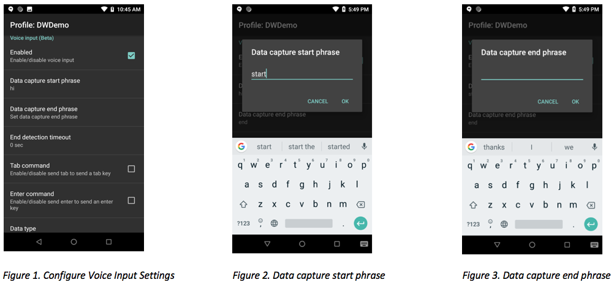
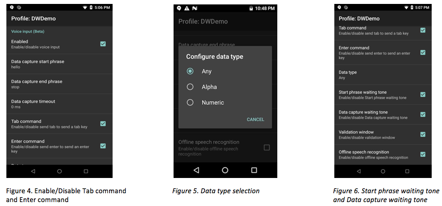
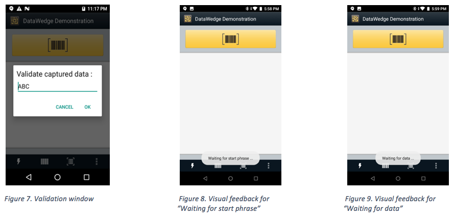

> A beta version of Voice Input is provided for early access to this new DataWedge feature. Zebra welcomes feedback at the Developer Portal's [DataWedge Forum](https://developer.zebra.com/community/home/discussions/datawedge).

## Overview
Voice Input enables DataWedge to convert spoken entries into keystrokes as if they were typed or acquired from a scan. Voice Input uses the Google speech recognition engine included on GMS devices. Voice-to-data capture can be useful in cases when a barcode is wet, damaged, covered with stray markings or otherwise cannot be scanned. 

Voice Input options:
* Terminate voice capture with a phrase or timeout value
* Send a TAB character when speaking the "send tab" command
* Send an ENTER character when speaking the "send enter" command
* Limit returned data to alpha or numeric characters
* Play an audio prompt when waiting for a start phrase or data capture
* Validate spoken data, edit acquired data as needed
* Works offline

>This feature is supported only on Zebra Android Oreo GMS devices.

Watch the DevTalk presentation on DataWedge Voice Input:

<iframe width="430" height="308" src="https://www.youtube.com/embed/Hp_Z24WSrUg" frameborder="0" allow="accelerometer; autoplay; encrypted-media; gyroscope; picture-in-picture" allowfullscreen></iframe> 

##How it Works

Voice Input relies on DataWedge profiles for configuration. Ensure that the application to receive the voice captured data is associated to the profile. The Voice Input section in the profile provides the options that control the voice data capture. See _Main Features_ section below.

When running, Voice Input is placed in the state "waiting for start phrase" (_see Figure 8_). Voice data capture begins after speaking the predefined "start phrase", which then changes the state to "waiting for data" (_see Figure 9_). Voice capture stops automatically after speaking the data or after speaking an optional "end phrase", if defined. The data source can be identified as voice input to process the voice data according to any application requirements. Barcode scanning and voice input can exist in the same DataWedge profile so both data capture methods may be used interchangeably.

Watch a demo on the basics of Voice Input with DWDemo app:  
<iframe width="300" height="613" src="https://www.useloom.com/embed/92684a9ded8e44eca2a08cd4472d1fa3" frameborder="0" webkitallowfullscreen mozallowfullscreen allowfullscreen></iframe>

Watch a demo showcasing the **Send Enter** command for multiple field entries:  

<iframe width="300" height="632" src="https://www.useloom.com/embed/e351721223ec4b3b96e0a383cd392fdf" frameborder="0" webkitallowfullscreen mozallowfullscreen allowfullscreen></iframe>

##Main Features

Voice Input features are accessible from the DataWege profile.

 
 
* **Enabled** - Enables voice input. _See Figure 1._

* **Data capture start phrase** - Required phrase to start the data capture. **The default value is "start."** Numbers and special characters are not supported as part of the start phrase. _See Figure 1 and 2._

* **Data capture end phrase** - Optional phrase that ends the data capture. There is no default value. _See Figures 1 and 3._

* **End detection timeout** - Sets the timeout value (in seconds) for the data capture during the “waiting for data” state. **The default value is "0."** If the value is set to "0" and the end phrase is defined, it waits infinitely for the data capture. Whereas, when the end phrase is not defined, data is returned immediately. This timeout is approximate, as it may encounter a 1 to 2 second delay. _See Figure 1._

 
 

* **Tab command** - Sends a tab key when speaking the command "send tab". This command is supported only when the device is at the "waiting for start phrase" state. _See Figure 4._

* **Enter command** - Sends an enter key when speaking the command "send enter." This command is supported only when the device is at the "waiting for start phrase" state. _See Figure 4._

* **Data type** - Configures the data type to be returned, with selections of: Any, Alpha, or Numeric. The data type is required to restrict data captured according to the preferences. _See Figure 5._
Data type selections:
<ul style="margin-left: 16px;">
  <li>Any - All scanned data is returned. For example, if the barcode ABC123 is scanned, it will return ABC123 as is. </li>
  <li>Alpha - Only alpha characters are returned. For example, if the barcode ABC123 is scanned, it will return ABC only. </li>
  <li>Numeric - Only digits are returned. For example, if the barcode ABC123 is scanned, it will return 123 only. </li>
</ul>

* **Start phrase waiting tone** - Controls the start phrase waiting tone. It enables/disables the audio feedback for “waiting for start”, notifying that the device is waiting to start the speech engine in case the toast message notification is missed and there is a change in “waiting for data” state. _See Figure 6._

* **Data capture waiting tone** - Controls the data capture waiting tone. It enables/disables audio feedback for “waiting for data”, notifying that the device is waiting to capture data in case the toast message notification is missed. _See Figure 6._

* **Offline speech recognition** - Enables offline speech recognition when there is no access to the internet. This uses an offline recognition speech engine to detect the data spoken. _See Figure 6._

 
 

* **Validation window** - Validates the result after speaking, displaying the spoken data and provides for editing the data on the same screen, if needed. This is useful in offline mode, since the results received in this mode might not be accurate. _See Figure 7._

> See Limitations below.

##Configuration

###Voice Input Parameters

DataWedge Voice Input can be controlled programmatically with DataWedge APIs. Refer to DataWedge Voice Input Plugin in [Set Config API](../../api/setconfig) to configure the following Voice Input parameters:

<table class="facelift" style="width:60%" border="1" padding="5px">
  <tr bgcolor="#dce8ef" align="center">
    <th>Param Name</th> 
    <th>Param Values</th> 
  </tr>

  <tr>
    <td>voice_input_enabled</td>
    <td>true, false</td>
  </tr>
  <tr>
    <td>voice_data_capture_start_phrase</td>
    <td>start (default value)</td>
  </tr>
  <tr>
    <td>voice_data_capture_end_phrase</td>
    <td>[blank] (default value)</td>
  </tr>
  <!--
  <tr>
    <td>voice_end_detection_timeout</td>
    <td>0-30</td>
  </tr>
  -->
  <tr>
    <td>voice_tab_command</td>
    <td>true, false</td>
  </tr>
  <tr>
    <td>voice_enter_command</td>
    <td>true, false</td>
  </tr>
  <tr>
    <td>voice_data_type</td>
    <td>0 - Any, 1 - Alpha, 2 - Numeric</td>
  </tr>
  <tr>
    <td>voice_start_phrase_waiting_tone</td>
    <td>true, false</td>
  </tr>
  <tr>
    <td>voice_data_capture_waiting_tone</td>
    <td>true, false</td>
  </tr>
  <tr>
    <td>voice_validation_window</td>
    <td>true, false</td>
  </tr>
  <tr>
    <td>voice_data_capture_waiting_tone</td>
    <td>true, false</td>
  </tr>
  <tr>
    <td>voice_offline_speech</td>
    <td>true, false</td>
  </tr>
</table>

###Set Voice Input Configuration Sample

Refer to DataWedge [Set Config API](../../api/setconfig).

##Limitations
* Voice Input is validated only with English.
* Offline speech recognition provides lower accuracy levels.
* In GMS Restricted mode with the use of [App Manager's DisableGMSApps action](/mx/appmgr/#action), Voice Input will not work since it relies on Google speech recognition. 
* Do not use Google Assistant while DataWedge Voice Input is in use, as it can lead to undesirable behavior. 
* Providing numbers and other special characters as part of the data capture start phrase is not supported.
* Voice Input is not supported if Enterprise Home Screen (EHS) is in restricted mode. However, enabling all the privilege settings in EHS will reinstate Voice Input in DataWedge.  

------

**Related guides**:

* [Profiles/Plug-ins](../../profiles)
* [DataWedge APIs](../../api) 