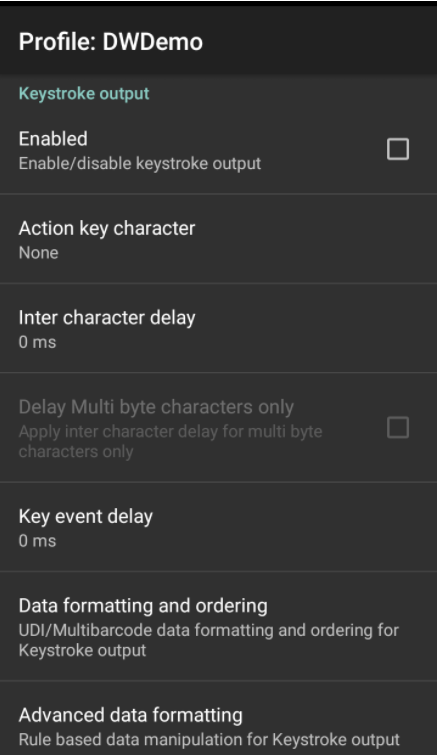
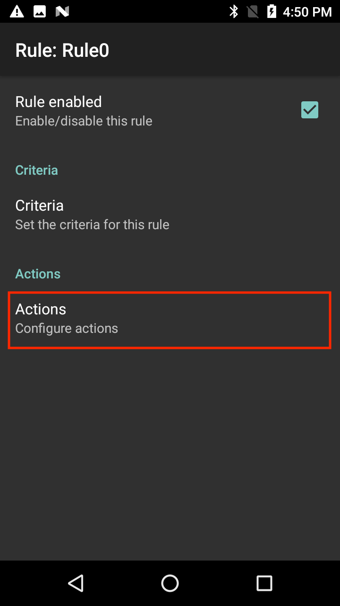

## Overview
Keystroke Output collects the processed data and sends it to the associated application as a series of keystrokes, emulating the actions of a user pressing keys on the device. DataWedge supports TAB, ENTER and other special characters that might be required by an application to submit acquired data for further processing, to advance the cursor to another input field or for other reasons. Special characters are added to acquired data by using the Action key character (shown below) and in the [Basic Data Formatting](../../process/bdf) or [Advanced Data Formatting](../../process/bdf) Process functions. 

> The parameters of this feature can be configured using the [Set Config API](../../api/setconfig).

-----

### Outputting Raw Data

In addition to its normal plain-text and hexadecimal modes, DataWedge can output acquired data in its raw form, before the application of any encoders. This can be useful if custom encoders are needed for acquiring character sets not supported by Zebra.  

Raw data is received as a byte stream using the `com.symbol.datawedge.decode_data` intent extra. For more information, see the [Intent Output guide](../intent). 

> **Raw data cannot be output as keystrokes**. 

-----

## Keystroke Output Setup

To enable Keystroke output for a Profile, place a check in the checkbox:

_Keystroke Output options_
 

**Action key character -** enables injection of a special character embedded within barcode or MSR data. Possible values:

* **None -** inject no action key
* **Tab -** inject action key in place of a ASCII Tab (0x09) character
* **Line feed -** inject action key in place of ASCII LF (0x0A) character
* **Carriage return -** inject action key in place of ASCII CR (0x0D) character

**Inter-character delay –** used to set a delay (in ms) following the delivery of each character to the application. This parameter is intended to help avoid issues that arise when data is dispatched too quickly for an application to accept. **Default=0**. If experiencing errors in keystroke delivery, increase this value in increments of 100 (to a max. of 1000) until errors cease. **Note: This parameter can negatively effect application performance**. 

**Multi-byte character delay -** applies the Inter-character delay (described above) to multi-byte characters only. This parameter is intended to help avoid problems that arise when sending Unicode and multi-byte characters to the Android browser. Available only when Inter-character delay is enabled. **Disabled by default**. 

**Key event delay -** used to set a delay (in ms) for dispatching control characters as keystrokes to the foreground application. This parameter is useful when sending data containing text as well as key events, where key events are sent asynchronously causing data to be delivered in the incorrect order. In this circumstance, it is recommended to add a key event delay to correct the order of data delivery.

-----

### Profile Import Behavior

* **For Profiles imported <u>into DataWedge 6.7 (and higher)</u> from prior versions**, the value specified for the "Multi byte character delay" is applied to the Inter-character delay and the “Delay Multi-byte characters only” parameter is enabled. 

* **For Profiles created with DataWedge 6.7 (and higher) <u>and imported into a prior version</u>**, the specified delay, if any, is applied only to multi-byte characters. 

-----

### UDI Data Output
This setting applies when the Scanning mode in [Barcode Reader Params](../../input/barcode/#readerparams) is set to UDI, which acquires multiple data points (tokens) as specified in the Universal Device Identifier parameter(s) selected in the above-referenced section. 

<!-- 2/8/18- removed pre-DW 6.7 panel 

 -->

**Token selection -** allows the output order of acquired UDI data to be adjusted and the optional insertion of a Tab, Line Feed or Carriage Return character between tokens, if required.

**To adjust UDI Token settings**: 

**&#49;. Tap "Send tokens" to select the desired output** for acquired UDI data. 

**Tokens only -** DataWedge parses the UDI data into separate Tokens for output (separated by a separator character, if selected).

**Barcodes and tokens -** DataWedge sends the barcode string appended by the tokenized data. If no separator character is selected (see Step 2), DataWedge sends two instances of the same data.

**&#50;. Tap "Token separator" in the Token selection screen to specify a separator character** to be inserted between Tokens, if desired. If "Barcode and tokens" mode is selected, the selected character also is inserted between the two. 

_This setting is not available if "Send tokens" is disabled_.
 

**&#51;. Tap "Token order" to include/exclude Tokens** from the output and adjust their output order. 

_Drag tokens to adjust output order_.
 

-----

### MultiBarcode Data Output

This setting applies when the Scanning mode in [Barcode Reader Params](../../input/barcode/#readerparams) is set to MultiBarcode, which simultaneously acquires the number of barcodes (from 2-10) specified in the corresponding reader parameter. 

####To configure MultiBarcode output:

1. Tap "Data formatting and ordering" to specify a separator character to be inserted between the data from each barcode. 

 
2. Tap "Barcode separator" to specify the desired insertion character (CR, LF or TAB). Data from each barcode is otherwise concatenated and delivered as a single string of keystrokes.

####To configure a custom separator character as the MultiBarcode separator:

Select a supported default character (CR, LF, or TAB) as a MultiBarcode separator together with the Advanced Data Formatting plugin configuration to replace this selected character with a user specified character. The following steps replaces "TAB" with "+" as the custom separator character:

1. Tap "Data formatting and ordering" to specify a separator character to be inserted between the data from each barcode. 

 
2. Tap "Barcode separator" to specify the desired insertion character (CR, LF or TAB). In this case, select TAB. Data from each barcode is otherwise concatenated and delivered as a single string of keystrokes.

3. Tap back to return to the main profile screen. Select **Advanced data formatting** 

4. Under "Keystroke output" click Enable (tap on the checkbox). Tap Rule0.

5. Tap Actions to configure.

6. From the hamburger menu at the top right, select “New action”.

7. Scroll down and tap “Replace string”.

8. Tap “Replace String”. 

9. Tap "Find String". 

10. Enter the hexadecimal notation for tab: \x09. Tap OK.

11. Tap "Replace String". 

12. Enter desired string to use as replacement, for example "+".  Tap OK.

13. Tap back to return to the rule.

14. Tap and hold the horizontal bars next to "Replace string" and drag it above "Send Remaining". 

15. Tap back.

When performing a scan, each barcode in the MultiBarcode decode is now followed by a plus "+" character.

<!-- 
Send data - Set to transfer the captured data to the foreground application. Disabling this option prevents the actual data from being transmitted. However, the prefix and suffix strings, if present, are still transmitted even when this option is disabled (default - enabled).
-->

------

### Hexadecimal Data Output

Hex data is based on the encoded data received from the scanner framework after it's converted from its raw form to the selected character set. When the hex-output option is selected, the plain-text string is converted to the corresponding hex digits and output as a string. That hex data can be acquired programmatically. 

The Java command below returns the hex data stored in the keystroke or intent output string:

	:::java
	String hex = Hex.encodeHex(data.getString(DATA_STRING_TAG).toCharArray(), false);

**For more information and to enable hex output using the DataWedge UI, see [Basic Data Formatting (BDF)](../../process/bdf)**. 

-----

**Other DataWedge Output Options**:

* **[Internet Protocol](../ip) -** outputs data over a network using TCP or UDP
* **[Intent](../intent) -** delivers data to the app as an intent extra

**Related guides**:

* [DataWedge Profiles](../../profiles)
* [DataWedge APIs](../../api) 

