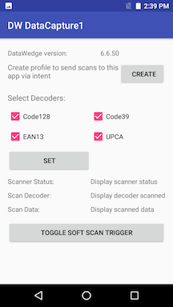
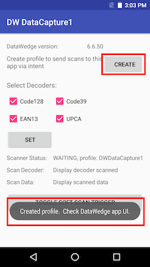
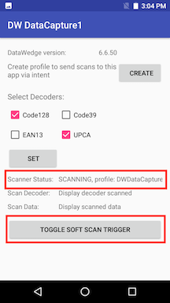
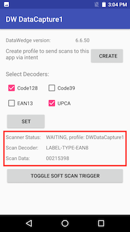

##Overview 
This sample app demonstrates DataWedge barcode scanning, configuration, scanner status notification and soft scan trigger using [intent APIs](http://techdocs.zebra.com/datawedge/latest/guide/api/). 

Available actions in this sample: 
* Display the DataWedge version
* Create a profile if it does not exist   
* Select/deselect certain decoders for scanning
* Set the default scanner (auto) as the selected scanner
* Toggle software scan trigger
* Register for scanner status notifications, such as waiting, scanning, etc.  
* Display the following for each decoded barcode:  
  * scan data 
  * decoder type 

>**Note**: This application is intended for demonstration purposes only. It is provided as-is without guarantee or warranty and may be modified to suit individual needs.

##APIs Used

<table class="facelift" style="width:100%" border="1" padding="5px">
  <tr bgcolor="#dce8ef">
    <th>DataWedge API</th>
    <th>App Functionality</th>
  </tr>
  
  <tr>
	  <td><a href="http://techdocs.zebra.com/datawedge/latest/guide/api/getversioninfo/">Get Version Info</a></td>
	  <td>Get DataWedge version installed on device</td>
  </tr>

  <tr>
    <td><a href="http://techdocs.zebra.com/datawedge/latest/guide/api/createprofile/">Create Profile</a></td>
    <td>Check for existing profile, create if it does not exist</td>
  </tr>

  <tr>
    <td><a href="http://techdocs.zebra.com/datawedge/latest/guide/api/setconfig/">Set Config</a></td>
    <td>Set selected/deselected decoders</td>
  </tr>

  <tr>
    <td><a href="http://techdocs.zebra.com/datawedge/latest/guide/api/registerfornotification/">Register for status notifications</a></td>
    <td>Register to receive notifications via intent for scanner status changes</td>
  </tr>

  <tr>
    <td><a href="http://techdocs.zebra.com/datawedge/latest/guide/api/softscantrigger/">Soft Scan Trigger</a></td>
    <td>Control scanning via Soft Scan Trigger button</td>
  </tr>
</table>

##Requirements
* This sample was created based on DataWedge version 7.0 (version that existed at the time of creation). Check [DataWedge API](http://techdocs.zebra.com/datawedge/latest/guide/about/) documentation for any future version changes that may affect functionality.
* Android API 23 (Marshmallow) or higher.
* DataWedge (built-in all Zebra devices) is running on the device.

##Using This Sample
1. Launch the sample app.
    
 
2. View the DataWedge version installed on the device. 
    
 
3. Tap Create. “DWDataCapture1” profile is created if it does not exist and associates it with this application. 
    
 
4. Select/deselect decoders. All other decoders not specified are set to defaults. Tap Set to save.
     
 
5. Press the hard trigger button or toggle the soft scan trigger button to scan. 
    
 
6. View the displayed information: 
   * Scanner status
   * Scan decoder
   * Scan data 
  
 
  
-----

**Related guides**:

* [DataWedge APIs](../../api) 

Related Guides: 

* [DataWedge Setup Guide](../setup)
* [DataWedge Demo app](../demo)

