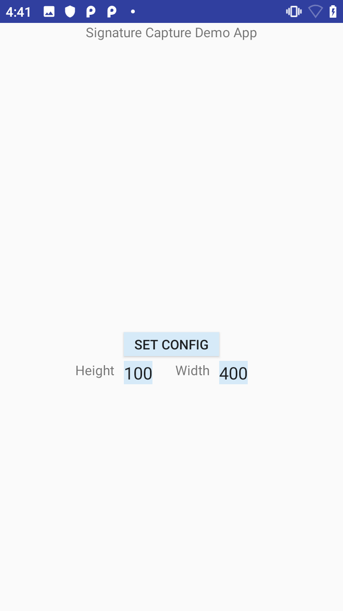
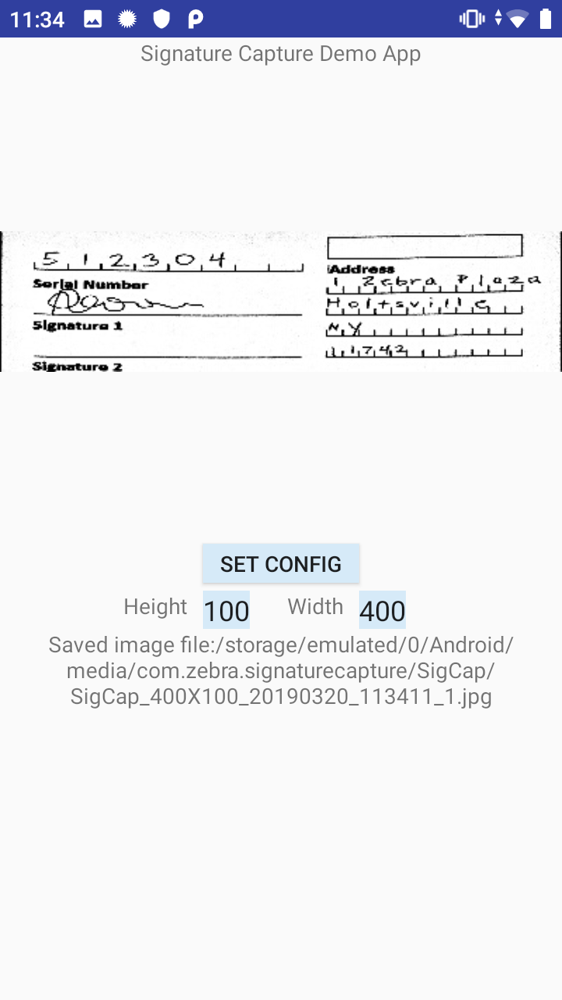

##Overview 
Decoder Signature is a special pattern that encloses an area in a document (such as a signature) and allows that specific area to be captured as an image. The pattern is placed on either side of the area to capture and extends the full height of that area, for example:

This sample app demonstrates how to use Decoder Signature to capture data using [DataWedge Intent APIs](../../api) and save the captured data as an image. Permission is required for reading and writing to device storage, which is prompted upon application launch.

Available actions in this sample: 
* Create a DatatWedge profile if it does not exist, configure it with specific parameters, and associate it with this app.
* Adjust the height and width of the image output.
* Scan and display the captured data. 
* Save the captured data as an image file.

>_This application is intended for demonstration purposes only. It is provided as-is without guarantee or warranty and may be modified to suit individual needs._

##APIs Used

<table class="facelift" style="width:100%" border="1" padding="5px">
  <tr bgcolor="#dce8ef">
    <th>DataWedge API</th>
    <th>App Functionality</th>
  </tr>

  <tr>
    <td><a href="http://techdocs.zebra.com/datawedge/latest/guide/api/createprofile/">Create Profile</a></td>
    <td>Check for existing profile, create if it does not exist</td>
  </tr>

  <tr>
    <td><a href="http://techdocs.zebra.com/datawedge/latest/guide/api/setconfig/">Set Config</a></td>
    <td>Set profile settings</td>
  </tr>

</table>

##Requirements
* This sample was created based on DataWedge version 7.3 (version that existed at the time of creation). Check [DataWedge API](http://techdocs.zebra.com/datawedge/latest/guide/about/) documentation for any future version changes that may affect functionality.
* Android API 23 (Marshmallow) or higher.
* DataWedge (built-in all Zebra devices) is running on the device.

##Using This Sample
1. [Download](https://github.com/Zebra/samples-datawedge), build, and launch the sample app.

  
2. Tap **Set Config**. A messge appears indicating the profile is created and the parameters are updated. The profile, “SigCap”, performs the following:
   * Enable "Barcode input" plugin and enable "Decoder Signature" decoder.
   * Set the Height and Width paramters for "Decoder Signature" to the default values.
   * Associate the profile to the sample app.
   * Configure the intent output to deliver captured data to the sample app.
  

3. Ensure the correct **Height** and **Width** is entered for the output image. If any changes are made, tap **Set Config** to update the new values in the profile.

4. Press the trigger button to scan. The capture data is displayed.

  
-----

**Related guides**:

* [DataWedge Intent APIs](../../api) 

