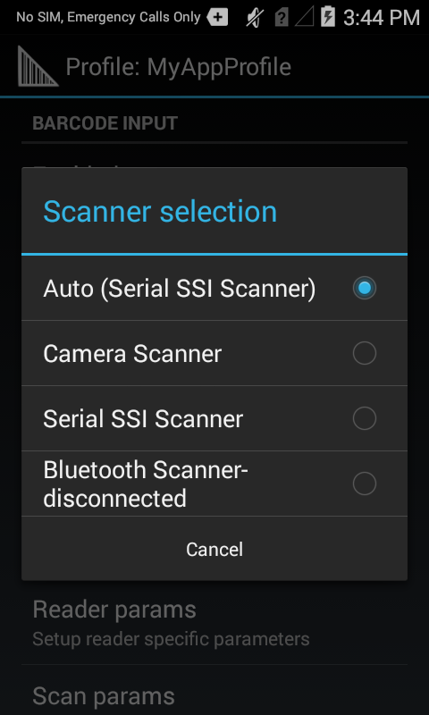
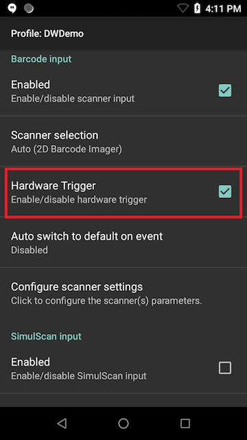
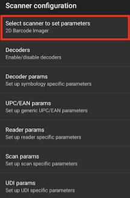
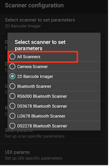
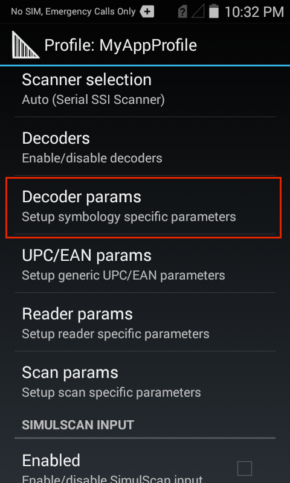
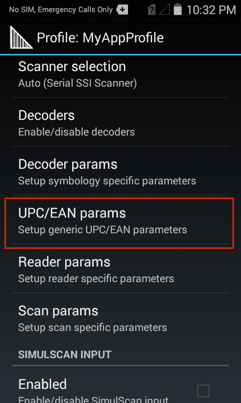
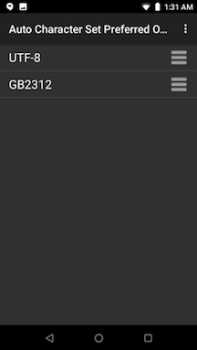
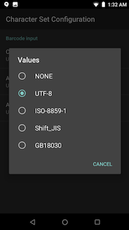

## Overview

Barcode Input options specify the device hardware to use for scanning and the decoders to be applied on the acquired data before sending it for processing. Decoders included with DataWedge are explained below. **DataWedge also provides audio and other feedback to alert the user of scanning results and barcode type. See the [Scanner Parameters](#scanparams) section for more information**. 

If using SimulScan, see [SimulScan Input profile guide](../simulscan). 

Barcode Input is used to specify: 

* Device cameras 
* 1D and 2D and imagers 
* Laser-based barcode scanners 
* Bluetooth-connected scanners 
* USB synchronous serial interface (SSI) scanners 

**Barcode Scanner Input** reads data from the integrated barcode scanner built into the device, or attached via cable or Bluetooth connection, or implemented as a snap-on module. DataWedge supports lasers, imagers and internal cameras. The raw barcode data that's acquired is processed or formatted as using the Basic and Advanced Data Formatting Processing options that are found near the Output options. 

**Note**: When SimulScan is used, DataWedge concatenates all captured text into a single string, and performs processing on the concatenated string. See the **[SimulScan section](../simulscan)** for details. 

> The parameters of this feature can be configured using the [Set Config API](../../api/setconfig).

-----

## Scanner Selection
For Barcode Input, the Scanner selection panel determines which scanning device will be used for data capture. The list of available scanners is based on devices present in (or connected to) the unit being configured. 

 

The "Auto" option automatically determines the best scanning device from the list of available devices based on the rules below. 

**Auto Scanner Selection Rules**:
* If a Zebra Scan Module or Scan/MSR Module is installed, the 2D imager is selected. 
* If no Scan Module is installed, the camera is selected. 
* When the camera is selected, scanning is performed with the rear-facing camera.
* When 2D Imager is selected, scanning is performed using the installed Scan or Scan/MSR module.

-----

### Bluetooth Scanners
DataWedge supports the following Zebra Bluetooth scanners: 

* **RS507** Cordless Ring Scanner
* **RS6000** Ring Scanner
* **DS3678** Ultra-Rugged Scanner
* **LI3678** Ultra-Rugged Laser Scanner
* **DS2278** Bluetooth Scanner
* **DS8178** Bluetooth Scanner

Bluetooth scanners are supported according to the following rules:

* **To initially configure the RS507** in a Profile, the scanner must be paired and connected.
* **After initial configuration**, a Bluetooth scanner can be enabled and disabled in the Profile, even if it is disconnected from the device. However, to configure decoders, reader parameters and other scanner settings, a Bluetooth scanner must be connected.
* **DataWedge does not automatically reconnect** to a Bluetooth scanner if that scanner is connected while DataWedge is using a different auto-selected scanner. To re-enable a Bluetooth scanner, connect the scanner and select it in the Profile or re-choose the "Auto" selection option.
* **Auto-selection and Battery Swap -** If Scanner selection is set to Auto and an RS507 was enabled prior to a battery swap, DataWedge continues working with that RS507 scanner upon reconnection after a battery is swapped. If the RS507 does not reconnect after the swap, DataWedge reverts to the current default scanner.
* **Keep Enabled on Suspend -** This mode is supported on Bluetooth and pluggable scanners, and might result in faster battery drain than would otherwise be expected while in suspend mode. **Note: The Zebra computing device wakes from suspend mode when pressing the scan trigger of any supported scanner**.

### USB SSI Scanners
DataWedge supports the following Zebra USB SSI scanners: 

* **DS3608** USB SSI Scanner
* **LI3608** Ultra-Rugged USB SSI Laser Scanner

**Support notes**: 

* The DS3608 and LI3608 scanners are supported only on VC80 devices running Android 
* Scanner must be configured using Symbol Native API (SNAPI) with Imager Interface
* SNAPI drivers are included with supported devices
* The scanner connects via USB port and cable

>**Important**: Support for decode parameters can vary depending on the scanning device selected. For device-specific support notes, please refer to the [Integrator Guide](https://www.zebra.com/us/en/sitesearch.html?q=integrator) that accompanied the unit. 

-----

## Hardware Trigger
This feature configures DataWedge to enable/disable use of the device hardware trigger for barcode input. The hardware trigger is enabled by default. If disabled, the scan beam does not appear when pressing the hardware trigger. However, the scan beam can still be activated by using the [Soft Scan Trigger](../../api/softscantrigger) DataWedge API intent. This feature allows application programmers to enforce the use of app-specific features when scanning barcodes and documents within their app.

 
Note: When the hardware trigger is disabled, it cannot be used to trigger the scan beam. If scanning is initiated by the soft scan trigger API intent, a hardware trigger press cancels the beam. 

------
## Auto Switch to Default on Event

This feature configures DataWedge to select an external scanner as the default scanning device immediately upon connection and revert to a built-in scanner when the external scanner is disconnected. External scanners include those connecting by Bluetooth, serial cable or snap-on module. **Disabled by default**. Available only when “Auto" is selected in the [Scanner selection panel](#scannerselection). 

This feature is intended to help reduce scanning workflow interruptions when a Bluetooth scanner is introduced and/or it becomes disconnected by losing power or moving out of range. 

For Bluetooth scanners, if the device was not previously paired, a pairing barcode is displayed prior to automatic connection. 

*"Auto switch to default on event" is available only when "Auto" is selected*. 
 

**Available Options**:

* **Disabled -** No scanner switching occurs when an external scanner is connected or disconnected (default).
* **On connect -** Selects the external scanner as the default scanning device immediately upon connection. 
* **On disconnect -** Reverts to a built-in scanner based on its position in an internally managed scanner list (which varies by host device). This is usually the scanner most recently used prior to the external connection (see notes below). 
* **On connect/disconnect -** Selects an external scanner as the default scanning device immediately upon connection. Upon disconnection, reverts to the scanner set as the default prior to the external connection.

<!-- 5/30/18 replaced passage below with that above, per eng (TW). 
* **On connect/disconnect -** Selects a Bluetooth scanner as the default scanning device immediately upon connection; reverts to a built-in scanner based on its position in an internally managed scanner list (which varies by host device). This is usually the scanner most recently used prior to the external connection (see notes below).
-->

**Notes**: 
* The system selects the default scanner based on the connection state and the scanner's position in an internally managed scanner list. If the newly connected scanner is lower in the scanner list than the one currently selected as the default scanner, the newly connected scanner becomes the default scanner.
* On devices with only one built-in scanner or imager, "On disconnect" reverts to that built-in scanner or imager. 

------

## Global Scanner Configuration 

Global scanner configuration allows users to specify a generic scanner configuration applicable for all supported scanners. Rather than specifying multiple individual configurations for each separate scanner within a given DataWedge profile, the global configuration setting is provided to configure multiple scanners in a single profile.

Global scanner configuration displays all scanner parameters and values for each and every scanner even if not supported by a specific scanner.
Since this list is all-inclusive, there is a possibility a particular parameter or value may not be supported on an individual scanner. In this case, an error is logged in logcat during scanning.  

When global scanner configuration is enabled, access is still available to settings specific to individual scanners, such as the option “Keep enabled on suspend” (which specifically applies to Bluetooth and other peripheral scanners), even if the default scanner is selected as an internal scanner for “Scanner Selection” (_See Figure 1_). When applying configurations, if any of the global settings are not applicable to the specific scanner, those settings cannot apply and will be disregarded.  

When a global setting is configured and then an individual scanner is configured, both configuration options are saved. The configurations will be applied in the following order:
  1. The global configuration is applied.
  2. The specific scanner configuration is applied.

If reports are generated when the global scanner configuration is set, the values supported by the connected device will be returned.

### Configuration

Open a profile in DataWedge. The "Barcode input" section contains the option "Configure scanner settings".
 
**Note:** The “Configure scanner settings” option is still accessible even when the selected scanner in “Scanner Selection” is disconnected. _In previous DataWedge versions prior to 6.8, all the scanner parameters (decoders, decoder params, etc.) are grayed-out and inaccessible._

_Figure 1. Profile settings_

Tap "Configure scanner settings". A list of scanner configuration settings appears.

_Figure 2. Scanner configuration_

Tap "Select scanner to set parameters".  **All Scanners** option is available to allow the scanner settings to apply to all scanners. 

_Figure 3. Global scanner configuration_

Select **All Scanners**. A confirmation message appears indicating that any setting changes moving forward will be applicable to all scanners as a common global configuration. **Any existing individual scanner setting will be replaced by this global setting.** The scanner does not need to be connected to the device in order to configure the settings in the global scanner configuration.   

###Using Intents

Set the global scanner configuration by setting the value of parameter `configure_all_scanners` to "true" via [SET_CONFIG](../../../api/setconfig) intent API.

-----

## Decoder Selection

Many input methods include parameters that are configurable according to the expected scan targets and/or preferences of an organization. Enabling a narrow selection of decoders can help increase security, reduce decode errors and improve scan performance. **For example, a company that routinely receives packages encoded with Code 128 symbology might consider limiting the Code 128 decoders it implements to those of the non-EAN variety**.   

Parameters for individual Decoders are modified within a Profile. Each DataWedge Profile can be assigned a unique group of Decoders and Decoder parameters (where applicable) to use with its associated application(s). This guide covers the selection of Decoders and provides details for those with configurable parameters.

### Default Decoders 

DataWedge decodes all major barcode symbologies. Popular formats are enabled by default in all DataWedge Profiles (indicated by an &#42;). **To improve scanning performance, Zebra recommends disabling all Decoders not required by the app(s) associated with a given Profile**.

**Note**: Decoders lacking configurable parameters do not appear in the [Decoder Parameters section](#decoderparameters). Others are linked to their corresponding parameter descriptions. 
 

-----

<table rules="none"
width="100%"
frame="void"
cellspacing="0" cellpadding="4">

<col width="33%" />
<col width="33%" />
<col width="33%" />
<tbody>
<tr>
<td align="left" valign="top">
Australian Postal
</td>
<td align="left" valign="top">
Aztec*
</td>
<td align="left" valign="top">
Canadian Postal
</td>
</tr>
<tr>
<td align="left" valign="top">
Chinese 2of5
</td>
<td align="left" valign="top">
<a href="#codabar">Codabar</a>*
</td>
<td align="left" valign="top">
<a href="#code11">Code 11</a>
</td>
</tr>
<tr>
<td align="left" valign="top">
Code 32*
</td>
<td align="left" valign="top">
<a href="#code39">Code 39</a>*
</td>
<td align="left" valign="top">
<a href="#code93">Code 93</a>
</td>
</tr>
<tr>
<td align="left" valign="top">
<a href="#code128">Code 128</a>*
</td>
<td align="left" valign="top">
<a href="#compositeab">Composite AB</a>*
</td>
<td align="left" valign="top">
<a href="#compositec">Composite C</a>*
</td>
</tr>
<tr>
<td align="left" valign="top">
Datamatrix*
</td>
<td align="left" valign="top">
<a href="#decodersignature">Decoder Signature</a>
</td>
<td align="left" valign="top">
<a href="#discrete2of5">Discrete 2of5</a>
</td>
</tr>
<tr>
<td align="left" valign="top">
<a href="#dotcode">DotCode</a>
</td>
<td align="left" valign="top">
Dutch Postal
</td>
<td align="left" valign="top">
<a href="#ean8">EAN-8</a>*
</td>
</tr>
<tr>
<td align="left" valign="top">
EAN-13*
</td>
<td align="left" valign="top">
<a href="#gridmatrix">Grid Matrix</a>
</td>
<td align="left" valign="top">
GS1 DataBar
</td>
</tr>
<tr>
<td align="left" valign="top">
GS1 DataBar Limited
</td>
<td align="left" valign="top">
GS1 DataBar Expanded
</td>
<td align="left" valign="top">
<a href="#gs1datamatrix">GS1 Datamatrix</a>
</td>
</tr>
<tr>
<td align="left" valign="top">
<a href="#gs1qrcode">GS1 QR Code</a>
</td>
<td align="left" valign="top">
<a href="#hanxin">HAN XIN</a>
</td>
<td align="left" valign="top">
<a href="#interleaved2of5">Interleaved 2 of 5</a>
</td>
</tr>
<tr>
<td align="left" valign="top">
Japanese Postal
</td>
<td align="left" valign="top">
<a href="#korean3of5">Korean 3of5</a>
</td>
<td align="left" valign="top">
MacroPDF*
</td>
</tr>
<tr>
<td align="left" valign="top">
MAILMARK
</td>
<td align="left" valign="top">
<a href="#matrix2of5">Matrix 2of5</a>
</td>
<td align="left" valign="top">
Maxicode*
</td>
</tr>
<tr>
<td align="left" valign="top">
<a href="#micropdf">MicroPDF</a>*
</td>
<td align="left" valign="top">
MicroQR
</td>
<td align="left" valign="top">
MacroMicroPDF*
</td>
</tr>
<td align="left" valign="top">
<a href="#msi">MSI</a>
</td>
<td align="left" valign="top">
PDF417*
</td>
<td align="left" valign="top">
QR Code*
</td>
</tr>
<tr>
<td align="left" valign="top">
TLC 39*
</td>
<td align="left" valign="top">
<a href="#uspostnet">USPostnet</a>
</td>
<td align="left" valign="top">
<a href="#trioptic39">Trioptic 39</a>
</td>
</tr>
<tr>
<td align="left" valign="top">
<a href="#usplanet">US Planet</a>
</td>
<td align="left" valign="top">
US Postal
</td>
<td align="left" valign="top">
UPC-A*
</td>
</tr>
<tr>
<td align="left" valign="top">
<a href="#upce0">UPC-E0</a>*
</td>
<td align="left" valign="top">
US4state FICS
</td>
<td align="left" valign="top">
<a href="#upce1">UPC E1</a>
</td>
</tr>
<tr>
<td align="left" valign="top">
US4state
</td>
<td align="left" valign="top">

</td>
</tr>
</tbody>
</table>

&#42; _Enabled by default_

**Note**: Hyperlinked decoders indicate (and link to) configurable parameters.

-----

### Enable/Disable Decoders

**To enable or disable Decoders**: 

&#49;. **From the Profile being edited, tap Decoders** as highlighted below.  
A list of Decoders appears similar to the image in Step 2.  

 

&#50;. **Select/deselect the desired Decoders** by checking/unchecking the corresponding checkbox.  
**Note**: Reducing nonessential Decoders can improve scanning performance. 

 

### Edit Decoder Parameters

**To edit Decoder parameters**:

&#49;. **From the Profile being edited, tap Decoder params** as highlighted below. 
A list of Decoders appears similar to the image in Step 2, below.

 

&#50;. **From the Decoder list, tap a Decoder to edit its parameters**. 

 

-----

## Decoder Parameters

Editable parameters of individual Decoders are explained below. **Note: Decoders lacking configurable parameters do not appear in the Decoder Parameters section below**. For further instructions about creating and editing DataWedge Profiles, see "[Manage Profiles](../../createprofile)" guide. 

### Reduced Quiet Zone 
The quiet zone is the blank space on either side of a bar code that indicates where the symbology begins and ends, and is intended to prevent the reader from scanning irrelevant information. When marginless decoders are used with Reduced Quiet Zone Level reader parameters, the decoders behave according to the following table: 

_**Descriptions of the 1D Quiet Zone Levels** shown above are in the [Reader Params](#readerparams) section along with important warnings_. 
 

-----

### UPCE0
**Report Check Digit -** The check digit is the last character of the symbol used to verify the integrity of the data. Enables or disables this option. A check in the checkbox indicates that the option is enabled.

**Preamble -** Preamble characters are part of the UPC symbol consisting of Country Code and System Character. There are three options for transmitting a UPCE0 preamble:

**Preamble Sys Char -** Transmit System Character only.

**Preamble Country and Sys Char -** Transmit System Character and Country Code ("0" for USA).

**Preamble None -** Transmit no preamble.

Select the appropriate option to match the host system.

**Convert UPCE0 To UPCA -** Enable to convert UPCE0 (zero suppressed) decoded data to UPC-A format before transmission. After conversion, the data follows UPC-A format and is affected by UPC-A programming selections. Disable to transmit UPCE0 decoded data as UPCE0 data, without conversion (default - disabled).

------

### UPCE1

**Report Check Digit -** The check digit is the last character of the symbol used to verify the integrity of the data. Enables or disables this option. A check in the checkbox indicates that the option is enabled.

**Preamble -** Preamble characters are part of the UPC symbol consisting of Country Code and System Character. There are three options for transmitting a UPCE1 preamble:

**Preamble Sys Char -** Transmit System Character only.

**Preamble Country and Sys Char -** Transmit System Character and Country Code ("0" for USA).

**Preamble None -** Transmit no preamble.

Select the appropriate option to match the host system.

**Convert UPCE1 To UPCA -** Enable this to convert UPCE1 decoded data to UPC-A format before transmission. After conversion, the data follows UPC-A format and is affected by UPC-A programming selections. Disable this to transmit UPCE1 decoded data as UPCE1 data, without conversion.

------

### UPCA

**Report Check Digit -** The check digit is the last character of the symbol used to verify the integrity of the data. Enables or disables this option. A check in the checkbox indicates that the option is enabled.

**Preamble -** Preamble characters are part of the UPC symbol consisting of Country Code and System Character. There are three options for transmitting a UPCA preamble:

**Preamble Sys Char -** Transmit System Character only.

**Preamble Country and Sys Char -** Transmit System Character and Country Code ("0" for USA).

**Preamble None -** Transmit no preamble.

Select the appropriate option to match the host system.

------

### MSI

**Length1&#42; -** To decode an MSI symbol with a specific length range, set this value to the lower limit. For example, to decode MSI symbols containing between 4 and 12 characters, this value would be set to 4.

**Length2&#42; -** To decode an MSI symbol with a specific length range, set this value to the upper limit. For example, to decode MSI symbols containing between 4 and 12 characters, this value would be set to 12.

_&#42; See **[Decode Lengths section](#decodelengths)**, below_

**Redundancy -** Sets the reader to read the barcode twice before accepting data.

**Check Digit -** With MSI symbols, one check digit is required, and is always verified by the reader. The second check digit is optional.
* **One Check Digit -** Verify one check digit.
* **Two Check Digits -** Verify two check digits.

**Check Digit Scheme -** Two algorithms are possible for the verification of the second MSI check digit. Select the algorithm used to encode the check digit:
* **Mod-11-10 -** First check digit is MOD 11; the second check digit is MOD 10.
* **Mod-10-10 -** Both check digits are MOD 10.

**Report Check Digit -** Transmit MSI data with or without the check digit. A check in this checkbox will send MSI data with a check digit.

------

### EAN8

**Convert EAN8 To EAN13 -** Converts EAN8 data to EAN 13 format. A check in the checkbox enables this conversion.

------

### Codabar

**Length1&#42; -** To decode a Codabar symbol with a specific length range, set this value to the lower limit. For example, to decode Codabar symbols containing between 8 and 24 characters, this value would be set to 8.

**Length2&#42; -** To decode a Codabar symbol with a specific length range, set this value to the upper limit. For example, to decode Codabar symbols containing between 8 and 24 characters, this value would be set to 24.

_&#42; See **[Decode Lengths section](#decodelengths)**, below_

**Redundancy -** Sets the reader to read the barcode twice before accepting data. 

**Clsi Editing -** Enable this parameter to strip the start and stop characters and insert a space after the first, fifth, and tenth characters of a 14-character Codabar symbol. Enable this feature if the host system requires this data format.

**Notis Editing -** Enable this parameter to strip the start and stop characters from a decoded Codabar symbol. Enable this feature if the host system requires this data format.

------

### Code39

**Length1&#42; -** To decode a Code 39 symbol with a specific length range, set this value to the lower limit. For example, to decode Code 39 symbols containing between 8 and 24 characters, this value would be set to 8.

**Length2&#42; -** To decode a Code 39 symbol with a specific length range set this value to the upper limit. For example, to decode Code 39 symbols containing between 8 and 24 characters, this value would be set to 24.

_&#42; See **[Decode Lengths section](#decodelengths)**, below_

**Verify Check Digit -** Enable this feature to check the integrity of all Code 39 symbols to verify that the data complies with a specified check digit algorithm. The digital scanner decodes only those Code 39 symbols that include a modulo 43 check digit. Enable this feature only if the Code 39 symbols contain a modulo 43 check digit.

**Report Check Digit -** Transmit Code 39 data with or without the check digit. A check in the checkbox will send Code 39 data with a check digit.

**Full ASCII -** Code 39 Full ASCII is a variant of Code 39 that pairs characters to encode the full ASCII character set. Check this checkbox to enable Code 39 Full ASCII.

**Redundancy -** Sets the reader to read the barcode twice before accepting data.

**Convert Code39 To Code32 -** Code 32 is a variant of Code 39 used by the Italian pharmaceutical industry. 

**Report Code32 Prefix -** Enables the addition of the prefix character "A" to all Code 32 barcodes.

**Security Level -** Options: Security level 0, Security Level 1, Security Level 2 and Security Level 3.

-----

### Discrete 2of5

**Length1&#42; -** To decode a Discrete 2of5 symbol with a specific length range, set this value to the lower limit. For example, to decode Discrete 2of5 symbols containing between 4 and 12 characters, this value would be set to 4.

**Length2&#42; -** To decode a Discrete 2of5 symbol with a specific length range, set this value to the upper limit. For example, to decode Discrete 2of5 symbols containing between 4 and 12 characters, this value would be set to 12.

_&#42; See **[Decode Lengths section](#decodelengths)**, below_

**Redundancy -** Sets the reader to read the barcode twice before accepting data.

------
### DotCode

**Inverse -** To specify the reflectance for decoding DotCode barcodes, set the option:
 * **Disabled (0) -** To decode DotCode barcodes with normal reflectance only.
 * **Enabled (1) -** To decode DotCode barcodes with inverse reflectance only.
 * **Auto (2) -** To decode both normal and inverse reflectance DotCode barcodes (default).

**Mirror -** To specify whether mirrored DotCode barcodes are decoded, set an option:
 * **Disabled (0) -** To decode non-mirrored DotCode barcodes only.
 * **Enabled (1) -** To decode mirrored DotCode barcodes only.
 * **Auto (2) -** To decode both mirrored and non-mirrored DotCode barcodes (default).

------
### Interleaved 2 of 5

**Length1&#42; -** To decode an Interleaved 2 of 5 symbol with a specific length range, set this value to the lower limit. For example, to decode Interleaved 2 of 5 symbols containing between 4 and 12 characters, this value would be set to 4.

**Length2&#42; -** To decode an Interleaved 2 of 5 symbol with a specific length range, set this value to the upper limit. For example, to decode Interleaved 2 of 5 symbols containing between 4 and 12 characters, this value would be set to 12.

_&#42; See **[Decode Lengths section](#decodelengths)**, below_

**Redundancy -** Sets the reader to read the barcode twice before accepting data.

**Febraban -** Enable or disable insertion of special check characters into the transmitted data stream of Interleaved 2 of 5 barcodes that are of length 14 characters and meet specific Febraban criteria.

------

### Check Digit

**No Check Digit -** A check digit is not used.

**USS Check Digit -** Select to check the integrity of all Interleaved 2 of 5 symbols to verify the data complies with the Uniform Symbology Specification (USS) check digit algorithm.

**OPCC Check Digit -** Select to check the integrity of all Interleaved 2 of 5 symbols to verify the data complies with the Optical Product Code Council (OPCC) check digit algorithm.

**Report Check Digit -** Transmit Interleaved 2 of 5 data with or without the check digit. A check in the checkbox sends Interleaved 2 of 5 data with check digit.

**Convert ITF-14 To EAN13 -** Convert 14-character Interleaved 2 of 5 barcodes to EAN-13, and transmit as EAN-13. The Interleaved 2 of 5 barcode must be enabled and must have a leading zero and a valid EAN-13 check digit. 

------

### Code11

**Length1&#42; -** To decode a Code 11 symbol with a specific length range, set this value to the lower limit. For example, to decode Code 11 symbols containing between 4 and 12 characters, this value would be set to 4.

**Length2&#42; -** To decode a Code 11 symbol with a specific length range, set this value to the upper limit. For example, to decode Code 11 symbols containing between 4 and 12 characters, this value would be set to 12.

_&#42; See **[Decode Lengths section](#decodelengths)**, below_

**Redundancy -** Sets the reader to read the barcode twice before accepting data.

**Verify Check Digit -** Check the integrity of all Code 11 symbols to verify that the data complies with the specified check digit algorithm. This selects the check digit mechanism for the decoded Code 11 barcode.

**No Check Digit -** Do not verify check digit.

**One Check Digit -** Barcode contains one check digit.

**Two Check Digits -** Barcode contains two check digits.

**Report Check Digit -** Transmit Code 11 data with or without the check digit. A check in the checkbox sends Code 11 data with a check digit.

-----

### Code93

**Length1&#42; -** To decode a Code 93 symbol with a specific length range, set this value to the lower limit. For example, to decode Code 93 symbols containing between 4 and 12 characters, this value would be set to 4.

**Length2&#42; -** To decode a Code 93 symbol with a specific length range, set this value to the upper limit. For example, to decode Code 93 symbols containing between 4 and 12 characters, this value would be set to 12.

_&#42; See **[Decode Lengths section](#decodelengths)**, below_

**Redundancy -** Sets the reader to read the barcode twice before accepting data.

------

### Code128

**Length1&#42; -** To decode a Code 128 symbol with a specific length range, set this value to the lower limit. For example, to decode Code 128 symbols containing between 4 and 12 characters, this value would be set to 4.

**Length2&#42; -** To decode a Code 128 symbol with a specific length range, set this value to the upper limit. For example, to decode Code 128 symbols containing between 4 and 12 characters, this value would be set to 12.

_&#42; See **[Decode Lengths section](#decodelengths)**, below_

**Redundancy -** Sets the reader to read the barcode twice before accepting data. 

**Enable EAN128 -** Set the EAN128 subtype. A check in the checkbox indicates that the option is enabled for this label type.

**Enable ISBT128 -** Set the ISBT128 subtype. A check in the checkbox indicates that the option is enabled.

**Enable Plain Code128 -** Enables other (non-EAN or ISBT) Code 128 subtypes. 

**ISBT128 Concat Mode -** Select an option for concatenating pairs of ISBT code types:

* **Concat Mode Never -** Do not concatenate pairs of ISBT codes encountered.

* **Concat Mode Always -** There must be two ISBT codes in order to decode and perform concatenation. Does not decode single ISBT symbols.

* **Concat Mode Auto -** Decodes and concatenates pairs of ISBT codes immediately. If only a single ISBT symbol is present, the device must decode the symbol the number of times set via Redundancy - Code128 before transmitting its data to confirm that there is no additional ISBT symbol.

**Check ISBT Table -** The ISBT specification includes a table that lists several types of ISBT barcodes that are commonly used in pairs. If ISBT128 Concat Mode is set, enable "Check ISBT Table" to concatenate only those pairs found in this table. Other types of ISBT codes are not concatenated.

**Security Level -** The scanner offers four levels of decode security for Code 128 barcodes. As the quality of barcodes decreases, implementing an increased level of security will compensate and help improve decoding success. There is an inverse relationship between scanner aggressiveness and security. Zebra recommends choosing carefully the level of security necessary for any given application: 

* **Security Level 0 -** This setting allows the scanner to operate in its most aggressive state, while providing sufficient security in decoding most "in-spec" barcodes.

* **Security Level 1 -** This setting eliminates most decode failures.

* **Security Level 2 -** Select this option if Security level 1 fails to eliminate decode failures.

* **Security Level 3 -** If Security Level 2 is selected and decode failures still occur, select this security level. Be advised, selecting this option is an extreme measure against mis-decoding severely out-of-spec barcodes. Selecting this security level significantly impairs the decoding ability of the scanner. If this level of security is required, try to improve the quality of the barcodes.

------

### Grid Matrix

**Inverse -** To specify the reflectance for decoding Grid Matrix barcodes, set the option:
* **Disabled (0) -** To decode Grid Matrix barcodes with normal reflectance only (default).
* **Enabled (1) -** To decode Grid Matrix barcodes with inverse reflectance only.
* **Auto (2) -** To decode both normal and inverse reflectance Grid Matrix barcodes.

**Mirror -** To specify whether mirrored Grid Matrix barcodes are decoded, set an option:
* **Disabled (0) -** To decode non-mirrored Grid Matrix barcodes only (default). 
* **Enabled (1) -** To decode mirrored Grid Matrix barcodes only.
* **Auto (2) -** To decode both mirrored and non-mirrored Grid Matrix barcodes.

------

### GS1 Datamatrix

The following table depicts the decode behavior between Datamatrix and GS1 Datamatrix:

<table style="width:100%" border="1" padding="5px">
  <tr bgcolor="#dce8ef">
    <th rowspan="2">
Datamatrix
</th>
    <th rowspan="2">
GS1 Datamatrix
</th>
    <th colspan="2">
Regular Datamatrix Barcode
</th>
    <th colspan="2">
GS1 Datamatrix Barcode
</th>
  </tr>
  <tr align="center">
    <td><b>Can Decode</b></td>
    <td><b>Type</b></td>
    <td><b>Can Decode</b></td>
    <td><b>Type</b></td>
  </tr>
  <tr align="center">
    <td>Enabled</td>
    <td>Enabled</td>
    <td>Yes</td>
    <td>LABEL-TYPE-DATAMATRIX</td>
    <td>Yes</td>
    <td>LABEL-TYPE-GS1-DATAMATRIX</td>
  </tr>
  <tr bgcolor="#cce6ff" align="center">
    <td>Enabled</td>
    <td>Disabled</td>
    <td>Yes</td>
    <td>LABEL-TYPE-DATAMATRIX</td>
    <td>Yes</td>
    <td>LABEL-TYPE-DATAMATRIX</td>
  </tr>
  <tr align="center">
    <td>Disabled</td>
    <td>Enabled</td>
    <td>No</td>
    <td>[none]</td>
    <td>Yes</td>
    <td>LABEL-TYPE-GS1-DATAMATRIX</td>
  </tr>
  <tr align="center">
    <td>Disabled</td>
    <td>Disabled</td>
    <td>No</td>
    <td>[none]</td>
    <td>No</td>
    <td>[none]</td>
  </tr>
</table>

Notes: 
* The blue shaded row indicates a successful decode for label types reported as Datamatrix although GS1 Datamatrix is disabled.
<!-- * "●" indicates enabled.  "o" indicates disabled. -->

------
### GS1 QR Code

The following table depicts the decode behavior between QR Code and GS1 QR Code:

<table style="width:100%" border="1" padding="5px">
  <tr bgcolor="#dce8ef">
    <th rowspan="2">
QR Code
</th>
    <th rowspan="2">
GS1 QR Code
</th>
    <th colspan="2">
Regular QR Code Barcode
</th>
    <th colspan="2">
GS1 QR Code Barcode
</th>
  </tr>
  <tr align="center">
    <td><b>Can Decode</b></td>
    <td><b>Type</b></td>
    <td><b>Can Decode</b></td>
    <td><b>Type</b></td>
  </tr>
  <tr align="center">
    <td>Enabled</td>
    <td>Enabled</td>
    <td>Yes</td>
    <td>LABEL-TYPE-QRCODE</td>
    <td>Yes</td>
    <td>LABEL-TYPE-GS1-QRCODE</td>
  </tr>
  <tr bgcolor="#cce6ff" align="center">
    <td>Enabled</td>
    <td>Disabled</td>
    <td>Yes</td>
    <td>LABEL-TYPE-QRCODE</td>
    <td>Yes</td>
    <td>LABEL-TYPE-QRCODE</td>
  </tr>
  <tr align="center">
    <td>Disabled</td>
    <td>Enabled</td>
    <td>No</td>
    <td>[none]</td>
    <td>Yes</td>
    <td>LABEL-TYPE-GS1-QRCODE</td>
  </tr>
  <tr align="center">
    <td>Disabled</td>
    <td>Disabled</td>
    <td>No</td>
    <td>[none]</td>
    <td>No</td>
    <td>[none]</td>
  </tr>
</table>

Notes: 
* The blue shaded row indicates a successful decode for label types reported as QR Code although GS1 QR Code is disabled.

------
### Trioptic39

**Redundancy -** Sets the reader to read the barcode twice before accepting data. 

------

### HAN XIN

**HAN XIN Inverse -** Checks the inverse of the HanXin decoder. 

------

### Matrix 2of5

**Length1&#42; -** Used to set decode length.

**Length2&#42; -** Used to set decode length.

**Redundancy -** Sets the reader to read the bar code twice before accepting data.

**Report Check Digit -** Transmit Matrix 2of5 data with or without the check digit.

**Verify Check Digit -** Enable this feature to check the integrity of all Matrix 2of5 symbols to verify that the data complies with a specified check digit algorithm.

_&#42; See **[Decode Lengths section](#decodelengths)**, below_

------

### MicroPDF

**Code 128 Emulation -** Enable this option to transmit data from certain MicroPDF417 symbols as Code 128. **This option requires that the AIM Code ID Character be enabled**.

**Enable Code 128 Emulation** to transmit these MicroPDF417 symbols with one of the following prefixes:

* **]C1** if the first codeword is 903, 904 or 905

* **]C2** if the first codeword is 908 or 909

* **]C0** if the first codeword is 910 or 911

**Disable Code 128 Emulation** to transmit these MicroPDF417 symbols with one of the following prefixes:

* **]L3** if the first codeword is 903, 904 or 905

* **]L4** if the first codeword is 908 or 909

* **]L5** if the first codeword is 910 or 911.

------

### Composite AB

**UCC Link Mode:**

* Link Flag ignored

* Always Linked

* Auto Discriminate

**MultiPacket Mode:**

* Multi-Part, Single-Packet

* Mutli Independent Reads

**Use UPC Preamble Check Digit -** Use the UPC rules specified in the UPC-EAN parameters when reporting composite decode data.

------

### Composite C

**MultiPacket Mode:**

* Multi-Part, Single-Packet

* Mutli Independent Reads

------

### Korean 3of5

**Length1&#42; -** To decode a Korean 3 of 5 symbol with a specific length range, set this value to the lower limit. For example, to decode Korean 3 of 5 symbols containing between 4 and 12 characters, this value would be set to 4.

**Length2&#42; -** To decode a Korean 3 of 5 symbol with a specific length range, set this value to the upper limit. For example, to decode Korean 3 of 5 symbols containing between 4 and 12 characters, this value would be set to 12.

_&#42; See **[Decode Lengths section](#decodelengths)**, below_

**Redundancy -** Sets the reader to read the barcode twice before accepting data.

------

### Decoder Signature

Decoder Signature is a special barcode format that allows to capture an area of a document (such as a signature) as an image. It is marked by two identical bar patterns placed on either side of the capture area. The bar pattern extends the full height of that area, for example:

 
For help creating a Signature Capture barcode like the one above, refer to the [Decoder Signature Guide (pdf)](Decoder_Signature.pdf)

**Format -** Specify the desired output image format: JPEG, BMP, TIFF.

**Width -** Specify the desired output image width in number of pixels. The aspect ratio of Width to Height must match the aspect ratio of the signature capture barcode to avoid distortion in the captured image.

**Height -** Specify the desired output image height in number of pixels. The aspect ratio of Width to Height must match the aspect ratio of the signature capture barcode to avoid distortion in the captured image.

**JPEG Quality -** An integer value between 5 and 100 with increments of 5, with 100 representing the highest quality image and 5 representing the most optimized for image size.

**Bits per pixel -** Specify the color depth of the output image. This is not applicable to JPEG image formats. Possible values: 
* 0 - 1 BPP (2 levels)
* 1 - 4 BPP (16 levels)
* 2 - 8 BPP (256 levels)

Note: **Handling large image data -** Since the data size of a single image (which can be 1280 x 800 bytes = 1000 kb) can exceed the size limit of a single intent, DataWedge supports image data delivery via Android FileProvider API. For Decoder Signature type decodes, all image data are delivered using this approach.

* It is expected that the user application copy the image files from the given URI (Uniform Resource Identifier) as soon as possible since DataWedge only keeps a maximum of 2 sets of decoded images before deleting them to create new images in the internal memory.

* Refer to the [Signature Capture](../../samples/signaturecapture) sample application for a code sample on handling image data from an Android client app.

------

### UK Postal

**Report Check Digit -** Transmit UK Postal data with or without the check digit. A check in the checkbox sends UK Postal data with a check digit.

------

### USPlanet

**Report Check Digit -** Transmit USPlanet data with or without the check digit. A check in the checkbox sends USPlanet data with a check digit.

------

### USPostnet

**Report Check Digit -** Transmit USPostnet data with or without the check digit. A check in the checkbox sends USPostnet data with a check digit.

------

### Webcode

**Webcode Subtype -** Enables decoding of the GT Webcode subtype. A check in the checkbox enables this option.

------

## Decode Lengths

The allowable decode lengths are specified by **Length1** and **Length2** as follows:

* **Variable length -** Decode symbols containing any number of characters:
	* Set both Length1 and Length2 to "0" (zero)
* **Range -** Decode a symbol with a specific length range from a-b:
	* Set Length1 to "a" (the lower bound) and set Length2 to "b" (the upper bound)
* **Two Discrete Lengths -** Decode only symbols containing either of two specific lengths:
	* Set Length2 as the _**shorter**_ length and Length1 as the _**longer**_ one
* **One Discrete Length -** Decode only symbols containing a specific length:
	* Set both Length1 and Length2 to the desired (non-zero) length

------

## UPC/EAN Params
The UPC/EAN Parameter allows configuration of parameters that apply to more than one UPC or EAN decoder.

 

**Security Level -** The scanner offers four levels of decode security for UPC/EAN barcodes. As the quality of barcodes decreases, implementing an increased level of security will compensate and help improve decoding success. There is an inverse relationship between scanner aggressiveness and security. Zebra recommends choosing carefully the level of security necessary for any given application: 

* **Level 0 -** This setting allows the scanner to operate fastest, while providing sufficient security in decoding "in-spec" UPC/EAN barcodes.

* **Level 1 -** As barcode quality levels diminish, certain characters become prone to decode failures before others (i.e., 1, 2, 7, 8). If the scanner is decode failures poorly printed barcodes, and the decode failures are limited to these characters, select this security level.

* **Level 2 -** If the scanner fails to decode poorly printed barcodes, and the decode failures are not limited to characters 1, 2, 7, and 8, select this security level.

* **Level 3 -** If the scanner is still fails to decode, select this security level. Be advised, selecting this option is an extreme measure against decode failures for severely out-of-spec barcodes. Selecting this level of security can significantly impair the decoding ability of the scanner. If this level of security is required, try to improve the quality of the barcodes.

**Supplemental2 -** A check in the checkbox enables this option.

**Supplemental5 -** A check in the checkbox enables this option.

-----

### Supplemental Mode

**No Supplementals -** The scanner is presented with a UPC/EAN plus supplemental symbol, the scanner decodes UPC/EAN and ignores the supplemental characters.

**Supplemental Always -** The scanner decodes only UPC/EAN symbols with supplemental characters, and ignores symbols without supplementals.

**Supplemental Auto -** The scanner decodes UPC/EAN symbols with supplemental characters immediately. If the symbol does not have a supplemental, the scanner must decode the barcode the number of times set via UPC/EAN Supplemental Redundancy before transmitting its data to confirm that there is no supplemental.

**Supplemental Smart -** Enables smart supplementals. In this mode, the decoder returns the decoded value of the main block immediately unless it belongs to one of the following supplemental types: 
* 378
* 379
* 977
* 978
* 979
* 414
* 419
* 434
* 439

If the barcode is preceded by one of the prefixes above, the image is searched more aggressively for a supplemental and attempts to scan it. If the supplemental scanning fails, only the main barcode is returned.

**Supplemental 378-379 -** Enables (auto-discriminate) supplemental for UPC/EAN codes starting with 378 or 379. Disables reading of supplementals for any other UPC/EAN barcode not starting with 378 or 379. Tries to scan the supplemental if present. If the supplemental scanning fails, only the main barcode is returned.

**Supplemental 978-979 -** Enables (auto-discriminate) supplemental for UPC/EAN codes starting with 978 or 979. Disables reading of supplementals for another UPC/EAN barcode not starting with 978 or 979. Tries to scan the supplemental if present. If the supplemental scanning fails, only then the main barcode is returned.

**Supplemental 414-419-434-439 -** Enables (auto-discriminate) supplemental for UPC/EAN codes starting with 414, 419, 434 or 439. Disables reading of supplementals for another UPC/EAN barcode not starting with 414, 419, 434 or 439. Tries to scan the supplemental if present. If the supplemental scanning fails, only the main barcode is returned.

**Supplemental 977 -** Enables (auto-discriminate) supplemental for UPC/EAN codes starting with 977. Disables reading of supplementals for another UPC/EAN barcode not starting with 977. Tries to scan the supplemental if present. If the supplemental scanning fails, only the main barcode is returned.

**Retry Count -** Retry count for auto-discriminating for supplementals. Possible values are 2 to 20. Note that this flag is only considered if Supplemental Mode is set to one of the following values: Supplementals Auto, Supplementals Smart, Supplementals 378-379, Supplementals 978-979, Supplementals 977 or Supplementals 414-419-434-439 (2 to 20).

**Random Check Digit -** Enables random weight check digit verification. 

**Linear Decode -** Not in use. Deprecated.

**Coupon -** Enables Coupon code decoding. To successfully decode any Coupon codes, all appropriate decoders must be enabled. 

**Bookland -** When enabled, select a Bookland Format from the list below.  

**Bookland Format -** When Bookland is enabled, permits selection of an option for Bookland data:

* **Format ISBN-10 -** The scanner reports Bookland data starting with 978 in traditional 10-digit format with the special Bookland check digit for backward-compatibility. Data starting with 979 is not considered Bookland in this mode.

* **Format ISBN-13 -** The scanner reports Bookland data (starting with either 978 or 979) as EAN-13 in 13-digit format to meet the 2007 ISBN-13 protocol.

* **Convert GS1 To UPC EAN -** If this is set it converts GS1 barcodes to UPC/EAN format. For this setting to work UPC/EAN symbologies must be enabled. A check in the checkbox indicates that the option is enabled.

-----

## Reader Params
Reader Parameters control specific configuration options for the barcode reader selected in the Profile being edited. **Not all parameters will apply to all readers**. 

 

**1D Quiet Zone Level -** Sets the effort at which the decoder will attempt to decode "marginless" barcodes. Behavior of these levels will vary based on the marginless decoder selected. See the [Reduced Quiet Zone](#reducedquietzone) table for behaviors: 

* **Level 0 -** The decoder will perform margin decoding as usual.

* **Level 1 -** The decoder will perform more aggressively.

* **Level 2 -** The decoder requires only one side end of barcode.

* **Level 3 -** The decoder can decode anything.

_**Note**: Higher marginless levels will increase decoding times and the risk of decoding errors. Zebra recommends enabling only the symbologies that require a higher marginless level and leaving all other symbologies at the default level of 1._

**Aim Mode -** Turns aim pattern on and off.

**Aim Timer -** Sets the duration (in ms) for timed aim modes. Supports a range from 0 - 60,000 ms in increments of 100 ms.

**Aim Type -** Permits selection of reader behavior when the trigger is pressed: 

* **Trigger -** For each trigger press, a single barcode can be scanned.

* **Timed Hold –** Once trigger is pressed, an aiming session is started for a time specified by Aim Timer. When this time expires, a decode session is started and scan beam will be visible. The decode session will remain active until the Beam Timer expires, the trigger is released or a barcode is decoded.

* **Timed Release -** Once the trigger is pressed, an aiming session is started and will continue until the trigger is released. If the Aim Timer is expired when the trigger is released, a decode session will be started with scan beam visible for a remaining time equal to Beam Timer or a barcode is decoded.

* **Press and Release -** The scan beam starts when the trigger is pressed and released. The decode session will remain active until the Beam Timer expires or a barcode is decoded.

* **Presentation -** Automatically activates the scanner and starts scanning immediately when a barcode is presented in its field of view, without any trigger press. 

* **Continuous Read -** A press and hold of the scan trigger continuously scans barcodes. The same barcode can be scanned multiple times. **Not supported with the Zebra RS507 Bluetooth Ring Scanner**.

* **Press and Sustain -** Starts the scan beam when the trigger is pressed and continues the decode session until the Beam Timer is expired, barcode is decoded or read is canceled. **Scan beam is not stopped when the trigger is released**. This avoids unexpected cancellations of a read by subsequently pressing the trigger button of the device; subsequent trigger presses while the beam is ON have no effect. **Applies to internal imager on TC20/TC25 and RS6000/RS507 Bluetooth scanners connected to TC57/TC77 and PS20 devices**. 

<!-- **COMMENT OUT TEMPORARILY UNTIL READY IN FUTURE RELEASE**
**Presentation mode parameters -** &#42;<i>**For future use only**</i>&#42;
* **Scene Detection Qualifier** 
 * **None**
 * **Proximity Sensor Input**
 -->

**DPM Illumination Control -** Controls illumination for DPM barcodes: 
* **Direct Illumination -** Scanner uses only direct (white) illumination. Recommended for use with dot peen barcodes - tilt the part 30 degrees for optimal decoding.
* **Indirect Illumination -** Scanner uses only red illumination. Recommended for use with laser etched barcodes on cylinders or curved, rough, grainy, highly reflective, or visibly machined surfaces.
* **Cycle Illumination -** Scanner cycles alternately between direct and indirect illumination. The scanner starts with the illumination used during the last successful decode.

**DPM Mode -** Mode to optimize DPM barcode decoding performance based on barcode size (Default value is Mode 2): 
* **Disabled -** No special processing.
* **DPM Mode 1 -** Optimizes decoding performance for smaller DPM barcodes, typically found on electronics and medical instruments, especially on smooth surfaces. These barcodes tend to be laser etched or direct printed.
* **DPM Mode 2 -** Optimizes decoding performance for larger DPM barcodes, typically found on industrial parts, especially on rough, grainy or visibly machined surface. These barcodes tend to be dot peen or laser etched.

**Illumination mode -**  Turns illumination on and off.

**Inverse 1D Mode -** Permits option selection for inverse 1D barcode decoding: 

* **Disabled -** Disables decoding of inverse 1D symbologies.

* **Enabled -** Enables decoding of inverse 1D symbologies only.

* **Auto -** Automatically detects and decodes positive and inverse 1D symbologies.

**Image Capture Mode -** Sets the barcode scanner to image capture mode: 

* **None -** No image capturing.

* **Single Image Capture on Decode -** Captures an image with decoded data.

* **Image Capture Only -** Only captures and image and no barcode data will be dispatched.

_**Note:** Zebra does not recommend changing the Image Capture Mode parameter when DataWedge is used to scan barcodes; DataWedge does not process image data._

**LCD Mode -** Used to Enable/Disable LCD Mode, which enhances the ability of the imager to read barcodes from LCD displays such as cellphones (applies to Scan Module only). **Use of LCD mode might lead to performance degradation and a blinking reticle prior to decoding**.

**Linear Security Level -** Sets the number of times a barcode is read to confirm an accurate decode:

* **Security Redundancy and Length -** Two times read redundancy based on redundancy flags and code length.

* **Security Short or Codabar -** Two times read redundancy if short barcode or Codabar.

* **Security All Twice -** Two times read redundancy for all barcodes.

* **Security Long and Short -** Two times read redundancy for long barcodes, three times for short barcodes.

* **Security All Thrice -** Three times read redundancy for all barcodes.

**HW Engine Low Power Timeout -** Time (in ms) of inactivity before scanner enters low-power mode.

**Picklist -** Permits selection of Picklist mode, which instructs the imager to decode only the barcode directly under the cross-hair/reticle in the viewfinder. This feature is most useful for applications in which multiple barcodes may appear in the field of view during a decode session but only one is desired for decoding.

* **Disable -** Disables Picklist mode; any barcode within the field of view can be decoded.

* **Hardware Picklist -** Picklist mode is enabled by sending a command to hardware.
8y6
* **Software Picklist -** Picklist feature is handled in the software; no commands are sent to hardware.

_**Notes**:_

* _Performance might vary on some devices if Hardware or Software Picklist modes are set._
* _If using MultiBarcode mode, see important behavior notes below._ 

**Poor Quality Decode Effort -** Permits selection of enhancement modes for decoding barcodes of poor or degraded quality. Available options:

* **Effort Level 0 -** Decoding performance on regular 1D and 2D barcodes is not affected.

* **Effort Level 1 -** The scanner performance on regular 2D barcodes is impacted while decoding performance on Tesco Thailand barcode and Suppository barcode is improved.

* **Effort Level 2 -** same as Level 1.

* **Effort Level 3 -** same as Level 1.

_**Note:** Same performance from Effort Level 1 to Effort Level 3._

**Beam Timer -** Sets the maximum amount of time (in ms) that the reader remains on. Supports a range from 0 - 60,000 ms in increments of 100 ms. A value of 0 sets the reader to stay on indefinitely.

**Different Symbol Timeout -** Used to prevent the scanner from decoding another symbol within a specified time interval (applicable only when Aim Type is set to Continuous Read). A value of 0 indicates that no interval is required between two successive reads.

**Same Symbol Timeout -** Used to prevent the scanner from decoding the same symbol within a specified time interval (applicable only when Aim Type is set to Continuous Read). A value of 0 indicates that no interval is required between two successive reads.

**Digimarc Decoding -** Used to enable/disable support for Digimarc, which encodes and invisibly integrates traditional barcode data onto product packaging. **Supported with internal imager and rear camera**. Enabled by default. [More about Digimarc](https://www.digimarc.com/). 

**Viewfinder Mode -** Permits selection of supported Viewfinder modes: 

* **Viewfinder Enabled -** Enables only the viewfinder.

* **Static Reticle -** Enables the viewfinder and a red reticle (cross-hairs) in the center of the screen to aid in positioning the barcode for scanning. **This parameter is supported only when the Camera is used for scanning**.

**Scanning Modes -** Used to select between Single (normal), UDI and Basic MultiBarcode modes. [UDI mode]()./#udidecoding) acquires multiple simultaneous inputs as specified in the selected Universal Device Identifier UDI parameter(s). [Basic MultiBarcode mode] acquires 2-10 barcodes with each scan as specified in the Basic MultiBarcode params panel. **Default=5**.

**Zoom -** Required for decoding DotCode barcodes. User needs to set Camera Zoom value to 2 on the following devices: MC33, TC51/TC56, TC70x/TC75x, VC80x, TC52/TC57, TC72/TC77, PS20. If Camera Zoom is set to any value other than 2 on these devices, it can negatively impact the decoding of specific DotCode barcodes. Parameter values: 1 - 8. **Default=1**.

**Keep Pairing Info After Reboot -** Enable/disable automatic re-connection to the connected Bluetooth scanner after device reboot. Applies only to connected Bluetooth scanners.

> See **Important** notes below.

------

### UDI Decoding
The Universal Device Identifier (UDI) parameter acquires multiple barcodes simultaneously. 

**This feature is supported using the imager on the following devices up to Android P (version 9.x) only**:

* **TC51**
* **TC56**
* **TC70x**
* **TC75x**

**Tap Scanning Modes to enable UDI decoding**: 

_When UDI scanning mode is enabled (as above)_... 

..._the selected UDI input parameter(s) will be used_.  

**UDI Decoding Notes** 

* **UDI decoding is supported only on the devices listed above**. 
* **Output of collected UDI data might require settings adjustments** of the token-separation character and/or output order. See the [Keystroke Output guide](../../output/keystroke/#udidataoutput) guide for more information. 
* UDI settings can vary by geographic region. See the relevant sections of [Keystroke Output](../../output/keystroke), [Intent Output](../../output/intent) and/or [IP Output](../../output/ip) guides for more information.

-----

### MultiBarcode Decoding
MultiBarcode acquires multiple, unique barcodes in a single scan session and can deliver the data either immediately or after the specified number of barcodes per scan is reached. **Basic MultiBarcode** is enabled through **Scanning Modes** within **Reader Params**, per above.

<table>

 <tr>
  <td>
  
  </td>
  <td> &nbsp; &nbsp; &nbsp; &nbsp;
  </td>
  <td>
  
  </td>
 </tr>

</table>
<i>Access to Basic MultiBarcode params</i>

Basic MultiBarcode params:
* **Number of barcodes per scan-** Specifies the number of unique barcodes to be decoded with each scan session before sending the scanned data. This setting does not take effect if **Instant Reporting** is enabled. For example, if 5 is specified, the scanner does not send the data until 5 barcodes are scanned. _Default value: 5; value range: 2 to 10._
* **Instant Reporting -** If enabled, returns each unique barcode immediately as it is decoded without waiting for the specified number of barcodes to be scanned. If disabled _(default)_, the decoded data is returned as a single entity after the amount of barcodes scanned reaches the specified **Number of barcodes per scan**.

**MultiBarcode Notes**

* **Acquired data from all barcodes is delivered as a single string** when output as keystrokes. To add separators and adjust output order, see the [Keystroke Output guide](../../output/keystroke/#multibarcodedataoutput). 
* **Picklist behavior -** If the Picklist parameter is set to “Disabled,” the device will attempt to scan the number of barcodes (from 2-10) specified in the Basic MultiBarcode params panel. If the Picklist parameter is set to a value other than “Disabled," the user is expected to move the cross-hair to each barcode to be scanned. **Data is returned only after the specified number of barcodes is read**. 
* **Duplicate barcodes -** If a label to be scanned contains multiple barcodes, some of which are duplicates (with the same label type and data), only one barcode from the duplicates is decoded; the remainder are ignored. If the label has two duplicate barcodes plus another two different barcodes, a maximum of three barcodes will be decoded from that form; one will be ignored as a duplicate.
* **Multiple barcode types -** Barcodes can be of multiple label types and still be acquired together. For example, if the specified quantity for a Multi-barcode scan is four, two barcodes can be label type Code 128 and the other two can be type Code 39. 
* **Barcodes in view -**If the specified number of barcodes is not initially in view of the scanner, the scanner will not decode any data. If the scanner's field of view contains a number of barcodes greater than the specified quantity, the scanner will randomly decode barcode(s) until the specified number is reached. For example, if the count is set to two and eight barcodes are in the field of view, the scanner will decode the first two barcodes it sees, returning the data in random order. **Data is returned only after the specified number of barcodes is read**. 
* **If both Continuous Read and Instant Reporting parameters are enabled, Instant Reporting** takes precedence over **Continuous Read,** which is ignored. Zebra recommends not to enable both parameters simultaneously.

-----

### Character Set Configuration
Provides options to make adjustments with the decoder character set. These options are:
* Character Set Selection 
* Auto Character Set Preferred Order 
* Auto Character Set Failure Option 

**Character Set Selection** - Converts the barcode data to the specified encoding type if different from the default encoding type, UTF-8. Other options are: Auto Character Set Selection, ISO-8859-1, Shift_JIS and GB18030.

* **Auto Character Set Selection (Best Effort)** - Decodes data in the preference order of character sets specified in the "Auto Character Set Preferred Order" list. If the data cannot be decoded based on the character sets listed, "Auto Character Set Failure Option" takes into effect. _See description for each respective option for more details._

**Auto Character Set Preferred Order** - If "Auto Character Set Selection (Best Effort)" is selected, data is decoded in the specified preference order of listed character sets. This is useful in cases where data can be decoded from more than one character set. The first character set listed which can decode the data successfully is chosen to decode the data - any other character set located lower in the list is not considered, even if the data could be successfully decoded using that character set. If DataWedge cannot find a character set from the preferred list to decode the data successfully, the character set selected in "Auto Character Set Failure Option" is used to decode the data.

Both the preferred character set list and its preference order is configurable. The order is rearranged by dragging the “hamburger-like” icon of the character set into the desired position. To delete a character set, long press on the item and the “Delete” option appears. To add a new character set, tap the “hamburger” menu at the top right corner - an option to add a character set, such as UTF-8 and GB2312, appears.

**Auto Character Set Failure Option** - Used to decode data if the device cannot successfully decode based on the character sets listed in the "Auto Character Set Preferred Order" list. If “None” is selected, “Null” is returned as the data string.

-----

## Scan Params
Scan Parameters allow for configuration of Code ID and scanner-specific decoding feedback options for the scanner selected in the Profile being edited. 

**Note: Some parameters are device-dependent**.

 

**Code ID Type -** Permits the selection of a Code ID character to insert between the prefix and the decoded symbol. The Code ID character identifies the code type of a scanned barcode. This information can be useful to an application when multiple barcode types are being read. Available options: 

* **Code ID Type None -** Insert no prefix.

* **Code ID Type Aim -** Inserts a standards-based three-character prefix.

* **Code ID Type Symbol -** Inserts a Zebra-defined single-character prefix.

**Decode Haptic Feedback -** Enable the mobile computer to vibrate to indicate a successful decode.

**Decode Audio Feedback -** Select an audio tone to play to indicate a successful decode.

**Decode Screen Notification -** When enabled, a translucent green screen overlay appears for 1 second upon every successful decode.

**Decode Screen Notification Timer -** Defines the length of time (in milliseconds) to display the screen notification upon successful decode. Timer configuration range is 500 ms to 1500 ms. Default time is 1000 ms.

**Decode Screen Translucency Level -** Sets the translucency of the decode notification green screen. Translucency level range is 20 to 50, in increments of 5. The higher the value, the more the translucency (visibility).

**Decoding LED Notification -** When enabled, causes the Red LED to flash when the scan trigger is pressed.

**Decode Feedback LED Timer -** Defines the length of time (in ms) to flash the Green LED to indicate a successful decode.

**Beep Volume Channel -** Permits selection of the volume setting to be used when playing the Decode Audio Feedback. Available options: 

* **Ringer -** Uses Ringer volume setting for audio feedback.

* **Music and Media -** Uses Music and Media volume setting for audio feedback.

* **Alarms -** Uses the Alarms volume setting for audio feedback.

* **Notification -** Uses Notification volume setting for audio feedback.

<!-- * **Decode Audio Feedback -** Select an audio tone to play to indicate a successful decode. -->

**Note**: Not all ringtones are supported as decode tones; some ringtones might be truncated when used as a decode tone. Zebra recommends testing all selected tones before deployment.

>**Important**: Support for decode parameters can vary depending on the scanning device selected. For device-specific support notes, please refer to the [Integrator Guide](https://www.zebra.com/us/en/sitesearch.html?q=integrator) that accompanied the unit. 

------

**Other DataWedge Input Options**:

* **[Mag-stripe Reader](../msr) -** credit/debit and identity cards
* **[SimulScan](../simulscan) -** document capture and multibarcode scanning 

**Related guides**:

* [Advanced Data Formatting](../../process/adf)
* [Basic Data Formatting](../../process/bdf) 
* [Intent Output](../../output/intent) 
* [Keystroke Output](../../output/keystroke)
* [Profiles/Plug-ins](../../profiles)
* [DataWedge APIs](../../api) 

