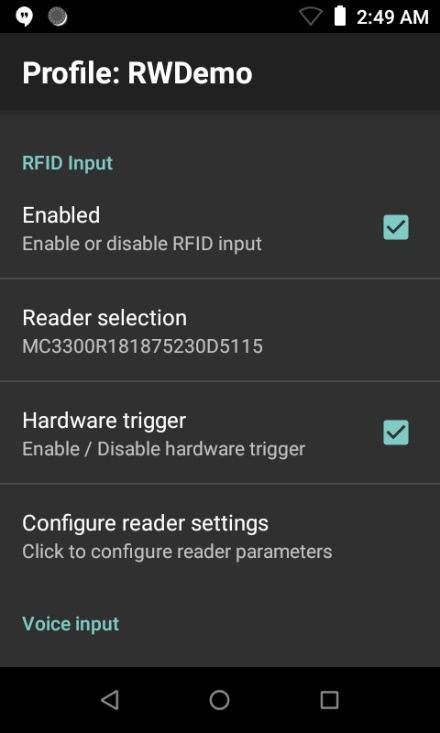
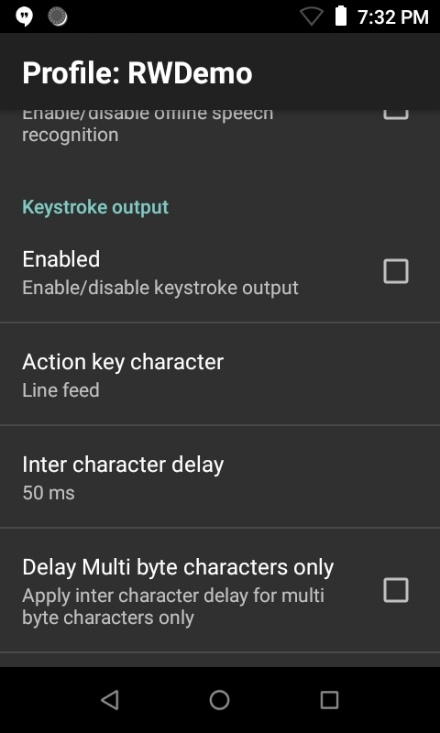

## Overview

**Radio-frequency identification (RFID) Input** is used to acquire data from an RFID tag with the integrated RFID reader built-in some Zebra mobile computers, such as the MC3330R with Android Oreo. This is the only device currently supported - support will be extended to other devices in the future. The type of RFID tags that can be read is dependent on what is supported by the RFID reader on the device. RFID is another input source to DataWedge - data delivery is similar to other input sources such as Barcode and MSR (Magnetic-stripe). The data acquired is processed and formatted according to the [Basic Data Formatting (BDF)](../../process/bdf) and [Advanced Data Formatting (ADF)](../../process/adf) options located in the **Keystroke output** section of the profile. 

## RFID Input
**RFID Input** options specify the trigger mode and reader settings to use for RFID tag reading.

 

**Enabled -** enable/disable RFID tag reading  
**Reader selection -** display the name of the internal RFID reader 
**Hardware trigger -** enable/disable hardware trigger to activate RFID reading. If enabled, set the **Trigger mode**. 
**Configure reader settings:** 
* **Filter duplicate tags –** enable/disable feature to display unique tags instead of duplicate tags for multiple reads. 
* **Tag read duration –** amount of time (in ms) for events to propagate to the application. If the trigger is released before the timeout elapses, data is returned to the application upon trigger release. Data returned to the application is limited to the capacity of the Android bundle payload – any data read beyond that capacity is discarded.
* **Antenna transmit power –** amount of signal power to be transmitted by the RFID reader. The higher the value, the further it is able to read the RFID tag. The range is 5 to 30 dBm. 
* **Memory bank –** configure the memory bank to read. The integrated circuit (IC) on some tags have different bit allocations between the memory banks to allow for more user memory or a longer EPC (electronic product code) number. Refer to the tag specifications to determine the memory bank type needed. Supported values: 
  * **None (default)-** no memory bank to read. 
  * **Reserved -** stores the access and kill password of the tag, 32 bits each. The kill password permanently disables the tag. The access password is set to lock and unlock the write capabilities of the tag. Therefore this is writeable if a password is specified. Can typically be used if an application contains sensitive data. 
  * **EPC -** stores the EPC code with a minimum of 96 bits of memory.  
  * **User -** (optional) extended memory to store more information. This can have various sizes, usually 512 bits and up to 4K or 8K of memory.  Can be used for additional data that is not suitable or does not fit into the EPC memory, such as temperature or expiration date. 
  * **TID (tag identification) -** stores the unique tag identifier from the manufacturer, which typically cannot be changed. 

**Trigger mode –** configure the mode to activate the RFID reader. Supported values: 
  * **Immediate (default) –** tag reading takes place based on when the trigger is pressed 
  * **Continuous-** continually reads tags after pressing the trigger once. Press the trigger again to terminate tag reading. 

**Feedback –** configure audio or visual feedback from an RFID tag read. Options: Beeper, LED. 

## Data
Important notes regarding RFID data reading:
* By default, a newline character is added after each tag read. 
* If applicable, a data set from multiple data reads can be returned if multiple tags are read simultaneously. 
* If receiving data via **Keystroke output**, it requires **Inter character delay** to be set to 50 ms. 

 

##RWDemo
**RWDemo** demonstrates RFID features in DataWedge. This application is pre-installed on supported Zebra RFID devices, such as MC33R, and creates a DataWedge profile associated with RWDemo when launched. 

------

**Related guides**:

* [Advanced Data Formatting](../../process/adf)
* [Basic Data Formatting](../../process/bdf) 
* [Intent Output](../../output/intent) 
* [Keystroke Output](../../output/keystroke)
* [Profiles/Plug-ins](../../profiles)
* [DataWedge APIs](../../api) 

