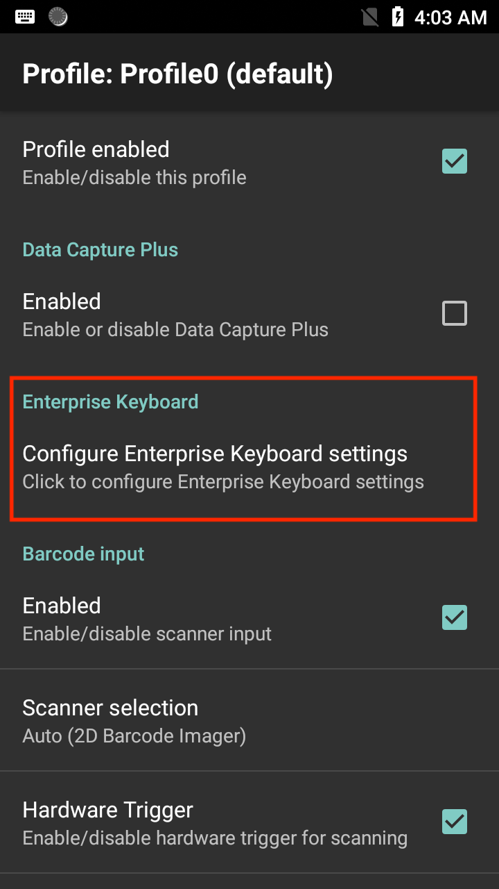
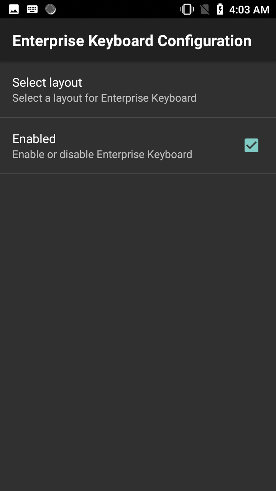
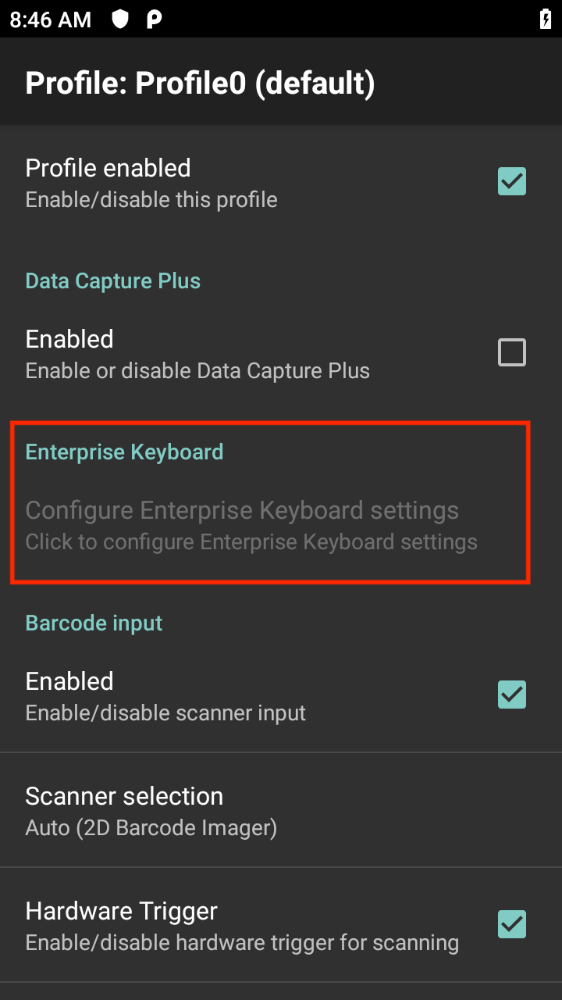

## Overview
Enterprise Keyboard Configuration enables the use of custom keyboard layouts with an associated app in a DataWedge profile, without the need to modify the app. Enterprise Keyboard must be listed as a Virtual Keyboard within Android Settings to allow the use of the custom keyboard layout. The custom keyboard layout is generated with the use of Keyboard Designer tool. 

Enterprise Keyboard Configuration is accessible from the DataWedge profile screen:

_Figure 1. Enterprise Keyboard_             
 

_Figure 2. Enterprise Keyboard Configuration_
  

Enterprise Keyboard Configuration is not accessible (grayed-out) if one of the following conditions exist:
* Enterprise Keyboard is not in the **Virtual keyboard** list in Android Settings on the device.  
* A `*.encrypted` file is not found in `/enterprise/device/settings/ekb/config` directory. 
* Enterprise Keyboard on the device is lower than version 3.0, which does not support custom layouts. 

_Figure 3. Enterprise Keyboard inaccessible_
  

### Enable/Disable  
Enable/disable Enterprise Keyboard. If enabled, the selected layout for Enterprise Keyboard automatically appears within the associated app during a profile or activity switch/change. If disabled, Enterprise Keyboard does not appear within the associated app. 

### Select layout 
Select a layout for the keyboard. The available layouts are populated from a custom generated `*.encrypted` file (for example _EKBCustomLayouts.encrypted_) located in `/enterprise/device/settings/ekb/config` directory on the device.  See [Enterprise Keyboard](https://techdocs.zebra.com/enterprise-keyboard/latest/guide/settings). The Layout group name is based on the `*.encrypted` file name. 

## Configuration

Programmatically set Enterprise Keyboard Configuration and retrieve the configuration:

* [Set Config](../../api/setconfig)
* [Get Config](../../api/getconfig/#getenterprisekeyboardconfiguration)

------

**Related guides**:

* [Profiles/Plug-ins](../../profiles)
* [DataWedge APIs](../../api) 

