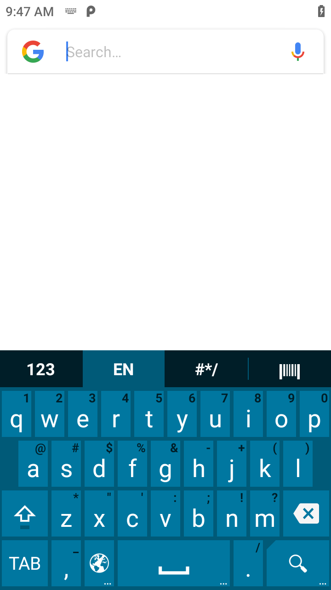

## Overview
Enterprise Keyboard Configuration enables the use of a Enterprise Keyboard, whether standard (default) or custom layout, as the IME (input method editor) with an associated app in a DataWedge profile without the need to modify the app. This enables Enterprise Keyboard to display as the on-screen keyboard for the user to enter text. Enterprise Keyboard must be listed as a Virtual Keyboard within Android Settings to allow the use of the Enterprise Keyboard. A custom Enterprise Keyboard can be generated with the use of Keyboard Designer tool.

_Figure 1. Enterprise Keyboard - standard (default) layout_             
 

Enterprise Keyboard Configuration is accessible from the DataWedge profile screen:

 

Enterprise Keyboard Configuration is not accessible (grayed-out) and cannot be configured if one of the following conditions exist:
* Enterprise Keyboard is not the default IME in Android on the device.  
* A `*.encrypted` file is not found in `/enterprise/device/settings/ekb/config` directory. 
* Enterprise Keyboard on the device is lower than version 3.0, which does not support custom layouts. 

_Figure 4. Enterprise Keyboard inaccessible_
  

### Enable/Disable  
Enable/disable Enterprise Keyboard used with the DataWedge profile. If enabled, the selected layout for Enterprise Keyboard automatically appears within the associated app during a profile or activity switch/change from the activity/app appearing in the foreground. If disabled, Enterprise Keyboard does not appear within the associated app. 

### Select layout 
Select a layout for the keyboard. The available layouts are populated from a custom generated `*.encrypted` file (for example _EKBCustomLayouts.encrypted_) located in `/enterprise/device/settings/ekb/config` directory on the device. If the file does not exist, Enterprise Keyboard Configuration is inaccessible (grayed-out) and cannot be configured. The Layout group name is based on the `*.encrypted` file name. See [Enterprise Keyboard](https://techdocs.zebra.com/enterprise-keyboard/latest/guide/settings) for more information. 

## Configuration

Programmatically set Enterprise Keyboard Configuration and retrieve the configuration:

* [Set Config](../../api/setconfig)
* [Get Config](../../api/getconfig/#getenterprisekeyboardconfiguration)

------

**Related guides**:

* [Profiles/Plug-ins](../../profiles)
* [DataWedge APIs](../../api) 

