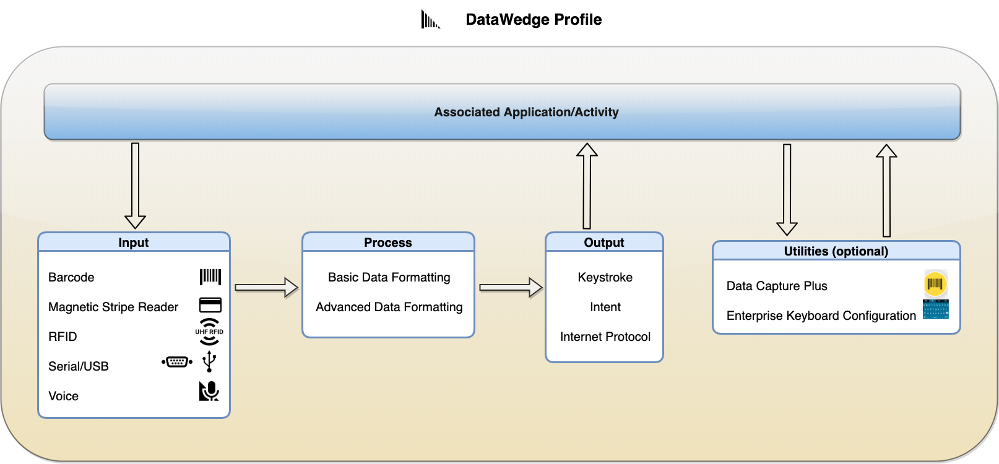

<table class="facelift" align="center" style="width:80%" border="1" padding="5px">
  <tr bgcolor="#dce8ef">
    <th >Plugin</th>
    <th>Type</th>
    <th>Main Options (not all-inclusive)</th>
  </tr>

  <tr>
    <td rowspan="5">Input</td>
    <td>Barcode</td>
	  <td>Select scanner: camera, 1D or 2D imager, Bluetooth scanner, etc. Enable/disable hardware trigger Select decoders Decoder params (configure options for each decoder) Reader params (configure options for the scanner selected) Scan params (configure scanner specific decoding feedback)</td>
  </tr>
  
  <tr>
    <td>Magnetic Stripe Reader</td>
	  <td>(Data output is acquired through intents, which DataWedge automatically parses and places into specific tags to be handled by the app)</td>
  </tr>

  <tr>
    <td>RFID</td>
	  <td>Enable/disable hardware trigger Configure reader settings</td>
  </tr>

  <tr>
    <td>Serial/USB</td>
	  <td>Serial port configuration</td>
  </tr>

  <tr>
    <td>Voice</td>
	  <td>Data capture start option: start phrase or PTT button Specify data capture start phrase Specify data capture end phrase Set timeout for data capture Configure voice commands Configure data type returned: alpha, numeric, any Offline speech recognition Validation window (validate captured data allowing to edit if needed)</td>
  </tr>

  <tr>
    <td rowspan="2">Process</td>
    <td>Basic Data Formatting</td>
	  <td>Add prefix Add suffix Send as hex Append TAB key Append ENTER key Create custom rule with specific criteria and actions to process acquired data</td>
  </tr>

  <tr>
    <td>Advanced Data Formatting</td>
	  <td>Create custom rule with specific criteria and actions to process acquired data</td>
  </tr>

  <tr>
    <td rowspan="3">Output</td>
    <td>Keystroke</td>
	  <td>Inject action key in place of the character: None, Tab, Line feed, Carriage return Send keystrokes as key events Send certain key events as a string Set key event delay</td>
  </tr>

  <tr>
    <td>Intent</td>
	  <td>Intent action Intent category Intent delivery</td>
  </tr>

  <tr>
    <td>Intent Protocol</td>
	  <td>Enable/disable Remote Wedge Set protocol: TCP or UDP IP address Port number</td>
  </tr>

</table>
 
 
