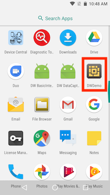
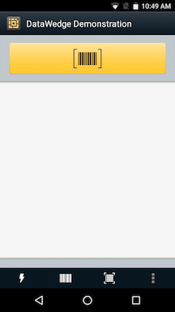
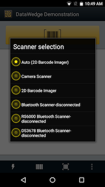
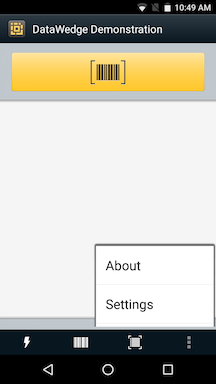
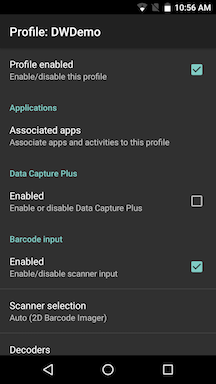
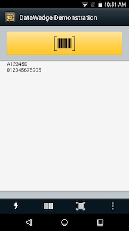

##Overview 
DWDemo provides barcode scanning capabilities, demonstrating how data is acquired by an application using the DataWedge intent output. It is provided by default on all Zebra Android devices.

   
  _Figure 1: DWDemo in Apps screen_

##How It Works
A DataWedge Profile called "DWDemo" is pre-configured in DataWedge and associated with the demo app. The DWDemo Profile must be enabled and can be modified as needed for testing or demo purposes. Once the demo Profile is enabled, tap the app's yellow Scan button or press the device hardware trigger to initiate a barcode scan.  Decoded data is displayed on the app screen. 

The DWDemo app supports scanning with the imager, camera, Bluetooth device or a magstripe reader (MSR), if one is connected.

Available actions in this demo app: 
* Capture barcode data and display decoded data
* Select input device for barcode scan, e.g. camera, scanner, Bluetooth device
* Toggle camera input type between image and barcode
* Toggle camera flash for camera barcode scan
* Access DWDemo profile

##DWDemo Settings

   
  _Figure 2: DWDemo menu_

DWDemo menu settings (from left to right):
* **Lightning Bolt -** toggle the Camera Flash on or off (active when Camera is selected); control illumination mode for other devices. 
* **Input Device -** permit selection of input devices such as Camera, Scanner or Bluetooth device (if no Bluetooth device is connected, it attempts to pair to a Bluetooth device). 
   
  _Figure 3: DWDemo menu_
* **Camera input type -** toggle between image and barcode data capture (active when Camera is selected; varies by device).
* **DWDemo "hamburger" menu -** access "About" screen and "Settings", which invokes DWDemo Profile screen in DataWedge.
   
  _Figure 4: DWDemo hamburger menu_

DataWedge settings and preferences can be configured in the DWDemo Profile, shown below. 

##Using DWDemo
This guide requires a working knowledge of [DataWedge Profiles](../../profiles). 

**To activate scanning in the DWDemo app, the "Profile enabled" checkbox must be checked** (as shown) in the associated DWDemo Profile. Additional settings can be changed as required. 
   
  _Figure 5: Profile settings_

**To perform a test scan, tap the yellow Scan button** or **press the device Scan trigger** while pointing at an object to be scanned. 

Acquired data appears in the window, as below.
   
  _Figure 6: Data captured with DWDemo_

By making changes in the DWDemo Profile, the associated DWDemo app can be used to test different decoders, rules for processing acquired data and other DataWedge configuration variations. For information about changing Profile settings, see [Managing Profiles](../../createprofile).  
  

-----

**Related guides**:

* [DataWedge Getting Started](../../profiles) for information on getting started
* [DataWedge Profiles](../../profiles) for information on DataWedge profiles 
* [Managing Profiles](../../createprofile) to change profile settings

