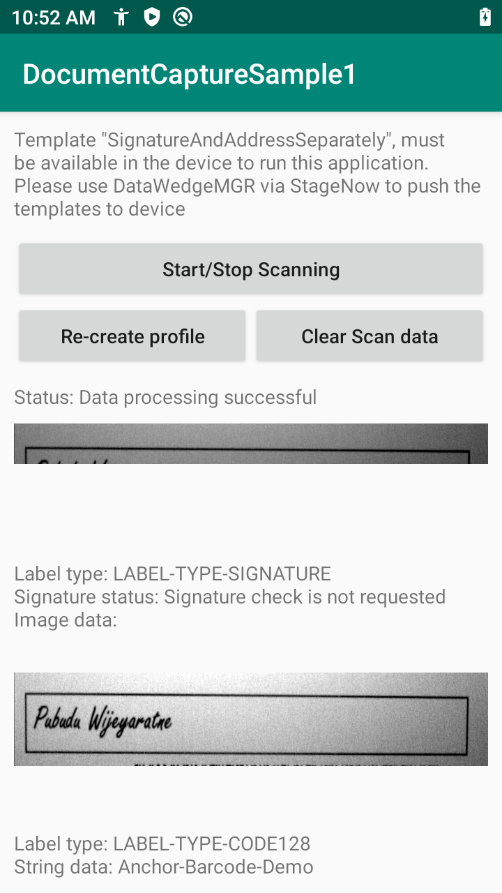

##Overview 
Document Capture provides the capability to scan a document or form and acquire specific data from that printed material based on a defined template. It is part of [NextGen SimulScan](../../input/barcode/#nextgensimulscanconfiguration) in DataWedge. This sample demonstrates how to use [Document Capture](../../input/barcode/#documentselectiondocumentcapture) with Anchor Barcode to capture an address and signature from a document or form based on the barcode scanned. The address and signature are captured as separate images. This is useful in situations such as delivery operations for proof of delivery.

This sample performs the following:
1. Register a broadcast receiver to listen for DataWedge intents.
2. Create DataWedge profile "DocumentCaptureProfile" if it does not exist. The result is retrieved from the broadcast receiver. If the profile does not exist, it creates the profile with the following NextGen SimulScan configurations:
    * Set scanning mode to **Document Capture**.
    * Set the Intent Output action, category and delivery mechanism (broadcast). 
    * Enable content provider.
    * Associate this sample application to the profile.
3. When scanning, the address and signature fields from the document "AnchorBarcodeTemplate.pdf" are captured as separate images based on specifications in the "SignatureAndAddressSeparately.xml" template. The height and width of the image output is adjusted.
4. Display the captured data (address and signature) as separate images. 

> This sample application is only intended for educational purposes, demonstrating the use of DataWedge intent API(s). 

## Requirements
* DataWedge 8.0 for [NextGen SimulScan](../../input/barcode/#nextgensimulscanconfiguration) support
* For [Zebra Professional series devices](/licensing/about/#zebraprofessionalseriesdevices), such as TC21 and TC26, NextGen SimulScan requires a [Mobility DNA Enterprise license](/licensing)
* NextGen SimulScan template "SignatureAndAddressSeparately.xml", supplied with the sample app
* Sample document to scan, "AnchorBarcodeTemplate.pdf", supplied with the sample app

##APIs Used

<table class="facelift" style="width:100%" border="1" padding="5px">
  <tr bgcolor="#dce8ef">
    <th>DataWedge API</th>
    <th>App Functionality</th>
  </tr>

  <tr>
    <td><a href="../../api/createprofile/">Create Profile</a></td>
    <td>Create the profile with specific parameters for Document Capture (see step 2 above).</td>
  </tr>

  <tr>
    <td><a href="../../api/deleteprofile/">Create Profile</a></td>
    <td>Delete the profile if profile creation fails.</td>
  </tr>

  <tr>
    <td><a href="../../api/getprofileslist/">Get Profiles List</a></td>
    <td>Get the list of DataWedge profiles on the device to check if a profile exists.</td>
  </tr>

  <tr>
    <td><a href="../../api/setconfig/">Set Config</a></td>
    <td>Set the appropriate configurations specified.</td>
  </tr>

  <tr>
    <td><a href="../../api/softscantrigger/">Soft Scan Trigger</a></td>
    <td>Start/stop or toggle the software scan trigger.</td>
  </tr>

</table>

##Using This Sample
1. [Download](https://github.com/Zebra/samples-datawedge) and build the sample app.
2. Copy and install the sample app to the device.
3. Follow instructions to [import template](../../admin/#importnextgensimulscantemplates) "SignatureAndAddressSeparately.xml" to the device.
4. Launch the sample app. 
* DataWedge profile “DocumentCaptureProfile” is created if it does not exist. 
* If profile creation fails, the profile is deleted. Tap **Re-create profile** to attempt to recreate the profile.
 

5. Tap **Start/Stop Scanning** to start the scan. 
6. Scan the document "AnchorBarcodeTemplate.pdf". If successful, decoded data is received by the broadcast receiver and processed based on the action given in the Intent Output, in this case Broadcast intent. A message appears indicating the data processed successfully.
 

7. Based on the sample template, the address and signature are captured and displayed as separate images.
 

8. Tap **Clear Scan Data** to clear the data displayed.

-----

**Related guides**:

* [DataWedge Intent APIs](../../api) 
* [Import Template](../../admin/#importnextgensimulscantemplates)

