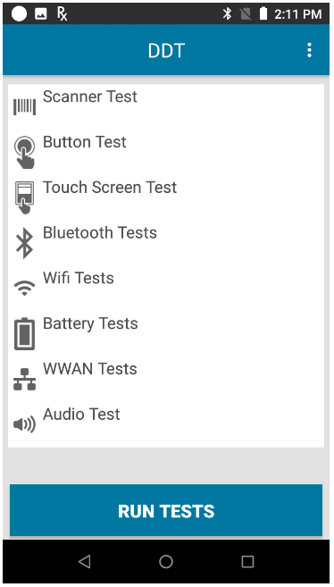

## Overview

Run Diagnostic Tool using one of the following methods: 
1. **Manually using the User Interface** - The user launches Diagnostic Tool and runs the tests manually. See [User Interface](#userinterface) section below. 
2. **Remotely with an EMM (Enterprise Mobility Management) system** - Launch Diagnostic Tool in the background and generate a log using intent `android.intent.SES.Runtests`. Generate log file `/sdcard/SelfDiagnostics/SelfDiagnosticLogs.ini` using one of the following commands based on the Android version:  
 a. For **Android Nougat 7.0 or earlier** use command: 
 `adb shell am broadcast -a “android.intent.SES.RunTests”`. 
 Results:
 
 b. For **Android Oreo 8.0 or later** use command: 
 `adb shell am broadcast -a android.intent.SES.RunTests -p com.symbol.androiddiagnostics`. 
 Results:
  

## User Interface
The main screen displays the overall status of the device. 

Tap **Run Test** to initiate the test. Once the test is executed, the background color of the main screen changes based on the overall test result - green indicates the test passed and red indicates test failure. It is recommended for all tests to be performed while the device is in normal use, i.e. not docked in a cradle or connected via USB to a computer.  
 
Tap **Subsystem Tests** from the main screen to view the test results from the individual subsystems. 

 
The colored icons indicate test result status: 
 
&nbsp;&nbsp;&nbsp;Test executed and passed. Result meets specifications or feature is enabled/activated.  

&nbsp;&nbsp;&nbsp;Test executed and did not pass. Review specification or further configuration may be required.  
 
&nbsp;&nbsp;&nbsp;Either the test is not supported on the device, the feature is disabled on the device (GPS, WAN, WLAN, etc), or the respective test is not configured to run on the device from app **Settings**. For example, some Zebra devices do not support WWAN or GPS - those tests would display with the gray icon. 
  

For details on the subsystem test, tap on the respective subsystem in the screen. Test properties are listed with results:  
 

&nbsp;&nbsp;&nbsp;Pass – test result meets the pass criteria  

&nbsp;&nbsp;&nbsp;Fail – test result does not meet the pass criteria  

&nbsp;&nbsp;&nbsp;Informational – data retrieved and displayed 
  

All tests perform a comparison of the actual property status against the device operational specification based on criteria listed in section [Test Criteria](../criteria).  

##Subsystem
The properties tested in each subsystem are discussed in the following subsections.

###Battery
Accessible by tapping **Battery** in the Subsystems screen. The following information is retrieved at the time of test execution:  

* Battery Level - percent of remaining battery life 
* Battery Voltage 
* Status – battery state of charge: full, charging or discharging 
* Power Source – USB Power, AC Power or Battery Power 
* Temperature - battery temperature 
* Health Percentage – battery health percentage if battery type is PowerPrecision+, otherwise battery charge cycle is displayed 
* Backup Battery Voltage 
* Manufacture Date - manufacture date of battery 
     

These tests can be used to determine if the battery is over or under temperature, whether there is too much drain on the battery by the device, or whether it is time to replace the battery so corrective action can be made prior to battery failure. 

###GPS
Accessible by tapping **GPS** in the Subsystems screen. If GPS is supported on the device, the following information is retrieved at the time of test execution: 
* GPS Provider – status of GPS: enabled, disabled, or not supported
* Latitude  
* Longitude  
* Altitude - height above sea level 
* Bearing – compass direction from current position  
* Speed - distance travelled over a given interval of time
* Accuracy - provides estimated horizontal accuracy of position, radially (in meters) 
     

Unlike the other tests which take a snapshot of the system, this test periodically receives information from the GPS radio and automatically updates the data. It can take several seconds of polling before the data becomes reliable and is eventually displayed. If the data has a green background but the Longitude and Latitude are both 0, then GPS is active but either there are no satellites in range or the system is still collecting data before it can be displayed.  

###System
Accessible by tapping **System** in the Subsystems screen. The following information is retrieved at the time of test execution: 
* CPU Load (%)
* Free Physical Memory (in MB) 
* Free Storage (in MB) 
* Process Count - number of processes currently running 
     

These tests can be used to determine if the CPU or memory load is too high, whether there are too many processes running on the device, or whether storage on the device is reaching full capacity. 

###WLAN 
Accessible by tapping **WLAN** in the Subsystems screen. The following information is retrieved at the time of test execution: 
* WLAN Enabled – state of WLAN radio: enabled or disabled 
* WLAN Status – status of connection 
* ESSID 
* BSSID 
* MAC Address 
* Signal – signal strength 
* IP Address   
     

This information can be used to determine whether the WLAN is configured correctly or whether there is any device connectivity with the AP or network. 

###WWAN 
Accessible by tapping **WWAN** in the Subsystems screen. The following information is retrieved at the time of test execution: 
* SIM State – presence of the SIM card and whether it is locked or unlocked 
* WAN Type - type of carrier technology in use (e.g. GPRS, CDMA, EDGE, etc.)
* Signal Strength 
* Phone Number 
* Device ID - MEID (Mobile Equipment Identifier)    
     

This information can be used to determine whether the device WWAN is configured correctly. The test fails if  any of the following conditions are met: the power to the WAN radio is off, the ICCID (Integrated Circuit Card Identifier) cannot be read from the SIM card, the phone number cannot be read, the registration status cannot be found, the carrier cannot be found, or the signal strength is below 30%.  

###Bluetooth 
Accessible by tapping **Bluetooth** in the Subsystems screen. The following information is retrieved at the time of test execution: 
* Enabled – Bluetooth radio is on or off.  
* Status – paired or not paired 
* Address – Bluetooth MAC address 
* Name – if defined, displays user defined name. Otherwise displays default device name.   
* Connectable/Discoverable - 3 modes: 
     * None: Both discoverable and connectable modes are disabled on the Bluetooth adapter.
     * Connectable: Discoverable mode is disabled, connectable mode is enabled on the Bluetooth adapter.
     * Connectable and discoverable: Both discoverable and connectable modes are enabled on the Bluetooth adapter.
     

This test can be used to determine the status of the Bluetooth radio on the device.

 
 
 

## See Also

* [About Diagnostic Tool](../about)
* [Test Criteria](../criteria)
* [Configuration](../configuration)

