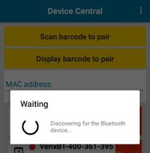
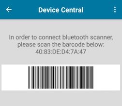
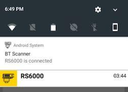
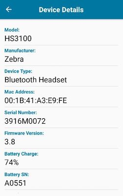
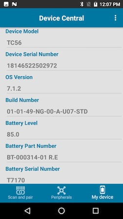
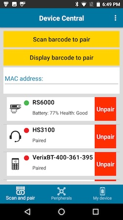
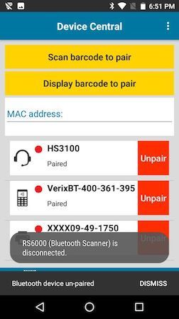
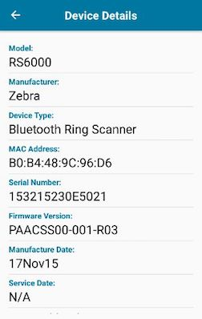
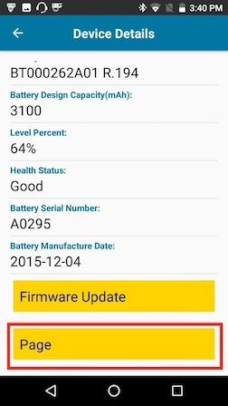
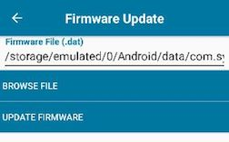

## Overview

This section describes how to use Device Central.  

Device Central works only on [specific devices](../about/#supporteddevices). 

 
## Pair to a Peripheral

Pairing to a peripheral is accomplished by one of the following 3 methods:

* Mobile computer scans the Bluetooth address barcode on the peripheral
* Peripheral scans the pairing barcode displayed on the mobile computer
* Manual entry of the peripheral Bluetooth MAC address.

The subsequent sections cover each method to pair the mobile computer to a peripheral. 

### Scan and Pair a Peripheral

To scan the peripheral’s Bluetooth barcode to pair:

1. Launch **Device Central** from the Apps menu.
2. In the **Scan and Pair** tab, tap **Scan barcode to pair** button.
	
 
3. The scan beam is illuminated. Scan the Bluetooth barcode label on the desired peripheral to pair. Ensure that Bluetooth is enabled on the peripheral and is set to discoverable mode.  Refer to the peripheral user guide for instructions.
	
 
4. When pairing is successful, the peripheral is displayed in the list with a green dot indicating that it is paired.
	
 
###Display Barcode to Pair

To pair by scanning the displayed barcode on the mobile computer (applies to peripherals that have scanning capability, such as Bluetooth handheld and ring scanners):
1. Launch **Device Central** from the Apps menu.
2. In the **Scan and Pair** tab, tap **Display barcode to pair** button.
	
 
3. A barcode is displayed.
	
 
4. Using the peripheral, scan the displayed barcode.
5. When the pairing is successful, the peripheral is displayed in the list with a green dot indicating that it is paired.
	
 

###Manually Pair

To pair a peripheral manually: 

1. Launch **Device Central** from the Apps menu.
2. In the **Scan and Pair** tab, tap the **MAC address** field.
	
 
3. Enter in the Bluetooth Mac address for the peripheral to pair to.
4. When pairing is successful, the peripheral is displayed in the list with a green dot indicating that it is paired.
	
 

##Paired Device List

Once pairing is complete, the peripheral is listed in the **Scan and Pair** tab. The paired peripherals are listed by device name, showing the connected state as indicated by the green (connected) or red (disconnected) dot. An **Unpair** button next to each peripheral allows the capability to unpair each device individually. The icons for each peripheral represent the type of device by category: scanner, headset, printer, and payment.  
	
 

##Notifications

Device Central displays a notification of the paired peripheral in the Notification bar. This notification displays information on the type of peripheral connected and the length of time for the connection. This information remains in the notification bar for the duration of the active connection. 
 
	
 
Tapping on the notification displays the Device Details for the corresponding peripheral.

##Device Details

The **Device Details** screen of the peripheral is accessible from either one of the following:

* **Scan and Pair** tab by tapping on the individual peripheral displayed
* **Peripherals** tab by tapping on the individual peripheral displayed
* Notification bar by tapping on the connected peripheral

The device information listed may vary depending on device type and manufacturer. This information may include: device model, manufacturer, Bluetooth Mac address, serial number, battery information, etc. If supported, the details screen may provide buttons at the bottom to allow tasks to be performed, such as Update Firmware or Page an attached RS6000 Ring Scanner. The following displays a sample of a paired peripheral:
 
	
 

##Peripherals Summery List

The **Peripherals** tab provides a list of the paired peripherals. The peripherals are listed by device name showing their connected state as indicated by the green dot (connected) or red dot (disconnected). If the peripheral is in the connected state, additional information is displayed including battery status and the length of time the peripheral has been connected. Some connected peripherals may provide action buttons that allow the user to perform an action associated with a given peripheral. For example, the RS6000 allows a user to Page the connected scanner or update the firmware.  
 
	
 

##My Device
The **My Device** tab displays information pertaining to the Android device which Device Central is running on. The device name and Device Central version is displayed here.  The **Device Details** button opens the Phone Status screen from device Settings (Settings > About phone). The **Device Battery Details** button opens the Battery screen from device Settings (Settings > Battery).
 
	
 

##Unpair a Peripheral
To unpair a peripheral:
1. Launch **Device Central** from the Apps menu.
2. In the **Scan and Pair** tab, tap the **Unpair** button for the desired peripheral to unpair.
	
 
3. A confirmation pop-up message appears.  Tap **OK**.
	
 
4. Once unpaired, a message appears indicating the peripheral has been disconnected and the peripheral is removed from the list.
	
 

##Page a Connected Peripheral
To page a supported connected peripheral (such as RS6000 Bluetooth Ring Scanner):
1. Launch **Device Central** from the Apps menu.  
2. In the **Scan and Pair** tab, tap on the desired device to pair, in this case RS6000.  The Device Details screen appears.
	
 
3. Scroll down to the bottom and tap on the **Page** button.  
	
 
4. Page will be heard on the RS6000 peripheral device until the trigger button is pressed.

##Update Firmware
In order to update the firmware on a connected peripheral, the firmware .dat file must be placed in the Device Central file storage area on the device’s SD Card:  _/sdcard/Android/data/com.symbol.devicecentral/files/_

To perform a firmware update on supported peripherals (such as RS6000):
1. Launch **Device Central** from the Apps menu.  
2. Open the **Device Details** screen of the desired device to perform the firmware update, in this case RS6000. For example, in the **Scan and Pair** tab tap on RS6000. The Device Details screen appears.
	
 
3. Scroll down to the bottom and tap on the **Firmware Update** button. 
	
 
The Firmware Update screen appears.
    
 
4. Tap on **Browse File**. Navigate to the file location and select the firmware update file.
	
 
5. Tap **Update Firmware**. A confirmation popup appears. 
	
 
6. Tap **Yes**. A warning message appears. The progress is seen through the notification bar.
	
 
7. As indicated from the warning, once the update is complete the RS6000 will reboot.
8. Verify if the update is successful by validating the firmware version in the Device Details screen after the peripheral reconnects.

##Administration
Some features may be controlled through an MDM (mobile device management) solution such as AirWatch or SOTI. These features include:

* An option to configure a setting to only allow one device to be paired from each device category: scanner, headset, printer, and payment. Once this setting is enabled, if a device is already previously paired and another device of that same category type is being paired, the previously paired device will be automatically unpaired.
* A setting that permits the ability to hide the Firmware Update option to prevent firmware updates from taking place.
* A silent pairing setting that allows to bypass the confirmation prompt during the pairing process.  
* A setting that prevents the user from accessing the option to turn the Bluetooth radio on or off within Device Central. This option is shown below from the **Scan and Pair** screen by tapping on the top right hamburger menu:
 
	
 

-----

## See Also

* [About Device Central](../about)
