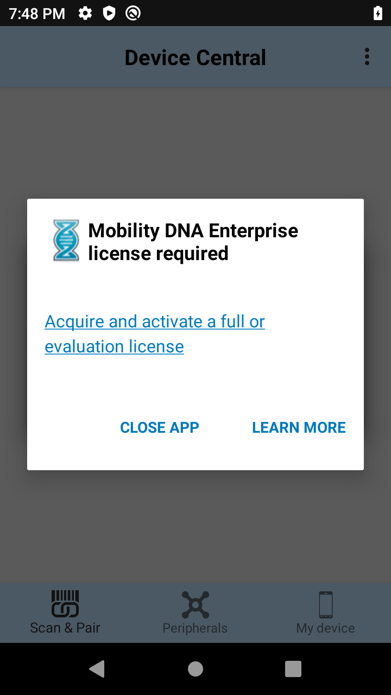

## Overview

Zebra Device Central is an Android app that simplifies the pairing and unpairing of Bluetooth peripherals with Zebra devices and helps with Bluetooth device management. Using the simple user interface, Device Central easily pairs and unpairs Bluetooth peripherals, monitors connection status, and provides details on supported peripherals. If supported by the peripheral, additional capabilities may exist such as paging the peripheral or updating the firmware. 

Device Central features:

* Simple scan and pair to a [supported Bluetooth peripheral](#supporteddevices)
* Display pairing and connection status of paired Bluetooth peripherals
* Display peripheral details, such as device type, Bluetooth Mac address, firmware version, battery status, serial number, etc.
* Unpair the paired Bluetooth peripheral 
* Paging to locate a paired and connected peripheral (applies to supported Bluetooth scanners)
* Firmware update utility for supported peripherals (applies to supported Bluetooth scanners)

> Starting with Android 10, <b>Device Central is no longer built-in the device.</b> It is required to be downloaded through the <a href="https://www.zebra.com/us/en/support-downloads/software/utilities/device-central.html">Zebra support portal</a>.  

## New in Device Central 3.0
* **Important:**  The **Enable/Disable Single Pairing of the Same Device Class** feature is deprecated from Device Central Manager CSP. Starting from MX version 10.2, Zebra recommends to use [Bluetooth Manager CSP](/mx/bluetoothmgr) to configure the same functionality.
* **Install via downloaded .APK -** On Android 10 or higher, Device Central is released via Zebra support portal. Android 9 devices or lower are no longer supported.
* **Connection management for any Bluetooth peripheral -** Device Central now supports Pairing/Unpairing of **all Bluetooth peripherals** that follow the Bluetooth standards, whereas previously a restricted list of peripheral devices were supported. 
* **Fixed issue with inability to pair with printers and other accessories if authentication is set with user PIN entry.** Previously, only devices with a default PIN value of "0000" were supported. 
* **Fixed issue with improper reporting of the connection state if multiple RS5100 devices are paired.**
* Newly supported devices in this release: TC21 Android 10
* Known Issues: 
      * The serial number for HS3100 Bluetooth headset may report incorrectly.
      * When connecting a Bluetooth peripheral device that provides battery information, such as RS6000 scanner or HS3100 headset, it may take 10-15 seconds for the battery information to appear.
      * Intermittently, a pop-up message "Failed to scan Bluetooth peripheral address. Please try again..." appears even though the BT peripheral MAC address barcode is scanned successfully.

### Mobility DNA Enterprise License
Beginning with Device Central 3.0, a **[Mobility DNA Enterprise license](/licensing) is now required** to use Device Central on Zebra Professional-series devices, including TC21 and TC26. When unlicensed, the app displays a “Mobility DNA Enterprise license required” prompt (see below) when a user attempts to open Device Central.  **Learn more about [purchasing an MDNA Enterprise license](/licensing/process).** 

_MDNA Enterprise license required prompt_

## Version History
**New in Device Central 2.1:**
* **Hardware scan trigger support** added in the main app screen for [Scan and Pair](../usage/#scanandpair), utilizing DataWedge profile. 
* **New supported devices:** 
      * Android Devices: CC600/CC6000, EC30, L10A, VC83
      * Bluetooth Scanners: DS2278, DS8178
      * Bluetooth Mobile Payment Modules: Verifone

## Supported Devices

See the device compatibility table for Device Central on [Zebra support portal](https://www.zebra.com/us/en/support-downloads/software/utilities/device-central.html).
<!--
<table class="facelift" style="width:25%" border="1" padding="5px">
  <tr bgcolor="#dce8ef">
    <th>Device</th>
    <th style="text-align:center">Android 10.x  (Q)</th>
  </tr>
  <tr>
    <td>TC21</td>
    <td style="text-align:center">&#x25cf;</td>
  </tr>
</table>
-->
Device Central supports Pairing/Unpairing of all Bluetooth peripherals that follow the Bluetooth standards.

<i>Exception: Unpairing a Bluetooth Scanner peripheral is currently not supported. Zebra Bluetooth scanners act as a master device which controls the pairing and connection with mobile computers. These Bluetooth scanners have the re-connect feature which may be initiated on the scanner itself. Therefore, unpairing the Bluetooth scanner from a mobile computer will not remove the paired information completely. To address this, pressing the re-connect button on the Bluetooth scanner will re-establish the pairing and connection with mobile computers.</i>

   

<!-- -->
-----

## See Also

* [Install](../setup)
* [Usage Guide](../usage)
* [Device Central Manager CSP](/mx/devicecentralmgr) - configures Device Central settings
* [Bluetooth Manager CSP](/mx/bluetoothmgr) - controls whether a device can pair with other Bluetooth devices

