## Overview

This section describes how to use **Device Central**. Device Central works only on [specific devices](../about/#supporteddevices) and requires Bluetooth to be enabled on the device. 

### Version History
* **Device Central 3.1:** New **Smart Leash** feature triggering notification alerts if a Bluetooth accessory moves out of range and becomes disconnected, preventing loss of accessories. This feature applies to Android 10 devices and higher. 
* **Device Central 3.0:** Mobility DNA Enterprise License required for some devices, now supports Pairing/Unpairing of all Bluetooth peripherals that follow the Bluetooth standards, fixed issue pairing with printers and other accessories if authentication is set with user PIN entry, and fixed issue with improper reporting of the connection state if multiple RS5100 devices are paired.
* **Device Central 2.1:** Use of hardware scan trigger to scan and pair. 

## Pair/Unpair a Peripheral

This section describes how to pair to a peripheral, view the paired devices list, and unpair a peripheral.

### Pair to a Peripheral

Pairing to a Bluetooth peripheral is accomplished by one of the following 3 methods:

* **Scan and Pair**: Mobile computer scans the Bluetooth MAC address barcode label on the peripheral
* **Scan to Pair**: Peripheral scans the pairing barcode displayed on the mobile computer
* **Manually Pair**: Manual entry of the peripheral Bluetooth MAC address.

The subsequent sections cover each method to pair the mobile computer to a peripheral. 

#### Scan and Pair

Upon launching Device Central, a DataWedge profile named "DeviceCentral" is created for scanning support. This profile is not intended to be modified - the profile settings are reset to the defaults upon each application launch. The 2 methods to scan the peripheral’s Bluetooth barcode to pair are:
1. **Hardware trigger** - Press the hardware scan trigger when the main screen is displayed. 
2. **Soft trigger** - Press the "Scan barcode to pair" button from the main screen. See **Using Soft Trigger** section below.

If any of the following conditions occur in the middle of operation, the hardware and software trigger will not be responsive in Device Central:
* DataWedge is disabled 
* "DeviceCentral" DataWedge profile is disabled 
* "DeviceCentral" DataWedge profile is deleted 

**Using Soft Trigger:**

1. Launch **Device Central** from the Apps menu.
2. In the **Scan and Pair** tab, tap **Scan barcode to pair** button.

 
3. The scan beam is illuminated. Scan the Bluetooth MAC address barcode label on the desired peripheral to pair. Ensure that Bluetooth is enabled on the peripheral and is set to discoverable mode.  Refer to the peripheral user guide for instructions.
 
4. When pairing is successful, the peripheral is displayed in the list indicating that it is paired. A green dot next to the listed device indicates that the device is connected and may be in use. Other peripherals such as a Bluetooth headset or printer device will have a red dot until the respective application is using these Bluetooth peripherals.
<!--
	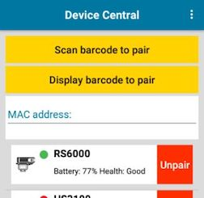 -->
 

#### Scan to Pair (Display Barcode to Pair)

To pair by scanning the displayed barcode on the mobile computer.  This applies to peripherals that have scanning capability, such as Bluetooth handheld scanners (ie. DS3678) and ring scanners (ie. RS6000):
1. Launch **Device Central** from the Apps menu.
2. In the **Scan and Pair** tab, tap **Display barcode to pair** button.

 
3. A barcode is displayed.
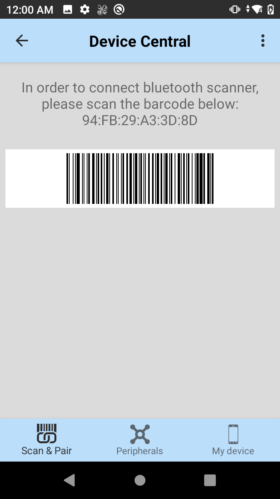
 
4. Using the peripheral, scan the displayed barcode.
5. When the pairing is successful, the peripheral is displayed in the list with a green dot indicating that it is paired.
<!-- 	 -->
 

#### Manually Pair

To pair a peripheral manually if unable to pair via Bluetooth: 

1. Launch **Device Central** from the Apps menu.
2. In the **Scan and Pair** tab, tap the **MAC address** field.

 
3. Enter in the Bluetooth Mac address for the peripheral to pair to.
4. When pairing is successful, the peripheral is displayed in the list.  A green dot next to a Bluetooth scanner indicates that the device is connected and may be in use.  Other peripherals such as a Bluetooth headset or printer will have a red dot until the respective application is using these Bluetooth peripherals.
<!--
	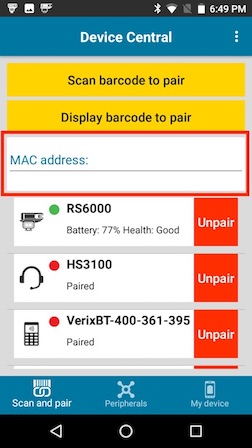 -->
 

### Paired Device List

Once pairing is complete, the peripheral is listed in the **Scan and Pair** tab. The paired peripherals are listed by device name, showing the connected state as indicated by the green (connected) or red (disconnected) dot. An **Unpair** button next to each peripheral allows the capability to unpair each device individually. For identified devices, the icons for each peripheral represent the type of device by category, such as scanner, headset and printer. All other unidentified are displayed as generic Bluetooth icons. 

 

### Unpair a Peripheral
To unpair a Bluetooth peripheral:
1. Launch **Device Central** from the Apps menu.
2. In the **Scan and Pair** tab, tap the **Unpair** button for the desired peripheral to unpair.

3. A confirmation pop-up message appears.  Tap **OK**.
4. Once unpaired, a message appears indicating the peripheral has been disconnected and the peripheral is removed from the list.

 

## Notifications

Device Central displays a notification of the connected peripheral in the Notification bar. This notification displays information on the type of peripheral connected and the length of time for the connection. This information remains in the notification bar for the duration of the active connection. 
 
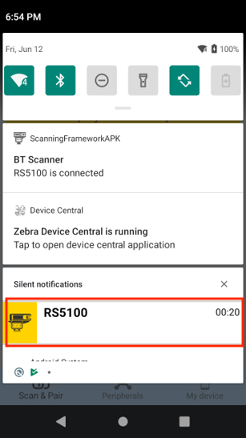
 
Tapping on the notification displays the Device Details for the corresponding peripheral.
 
For Android 10 or higher, Device Central displays a notification related to the running service.  

 
Tapping on the notification opens the Device Central app.

## Device Details

The **Device Details** screen of the peripheral is accessible from either one of the following:

* **Scan and Pair** tab by tapping on the individual peripheral displayed
* **Peripherals** tab by tapping on the individual peripheral displayed
* Notification bar by tapping on the connected peripheral

The device information listed may vary depending on device type and manufacturer. This information may include: device model, manufacturer, Bluetooth Mac address, serial number, battery information, etc. If supported, the details screen may provide buttons at the bottom to allow tasks to be performed, such as Update Firmware or Page an attached RS6000 Ring Scanner. The following displays a sample of a paired peripheral:
 

 

### Page a Connected Peripheral
To page a supported connected peripheral (such as RS6000 Bluetooth Ring Scanner):
1. Launch **Device Central** from the Apps menu.  
2. In the **Scan and Pair** tab, tap on the desired device to pair, in this case RS6000.  The **Device Details** screen appears.

 
3. Scroll down to the bottom and tap on the **Page** button.  
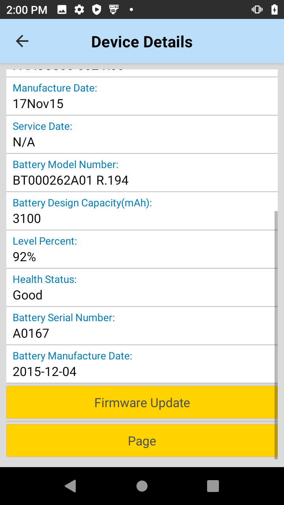
 
4. A page will be heard on the RS6000 peripheral device until the trigger button is pressed.

### Update Firmware
In order to update the firmware on a connected peripheral, the firmware .dat file must be placed in the Device Central file storage area on the device’s SD Card:  _/sdcard/Android/data/com.symbol.devicecentral/files/_

To perform a firmware update on supported peripherals (such as RS6000):
1. Launch **Device Central** from the Apps menu.  
2. Open the **Device Details** screen of the desired device to perform the firmware update, in this case RS6000. For example, in the **Scan and Pair** tab tap on RS6000. The Device Details screen appears.

 
3. Scroll down to the bottom and tap on the **Firmware Update** button. 

 
The Firmware Update screen appears.

 
4. Tap on **Browse File**. Navigate to the file location and select the firmware update file.
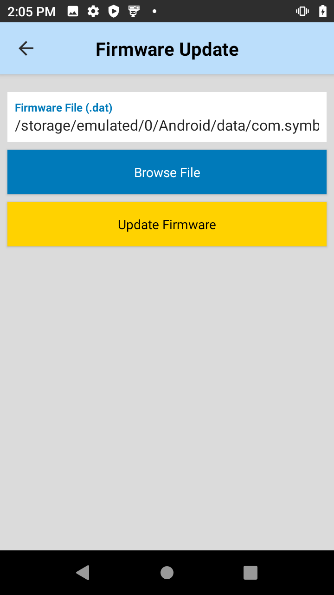
 
5. Tap **Update Firmware**. A confirmation popup appears. 
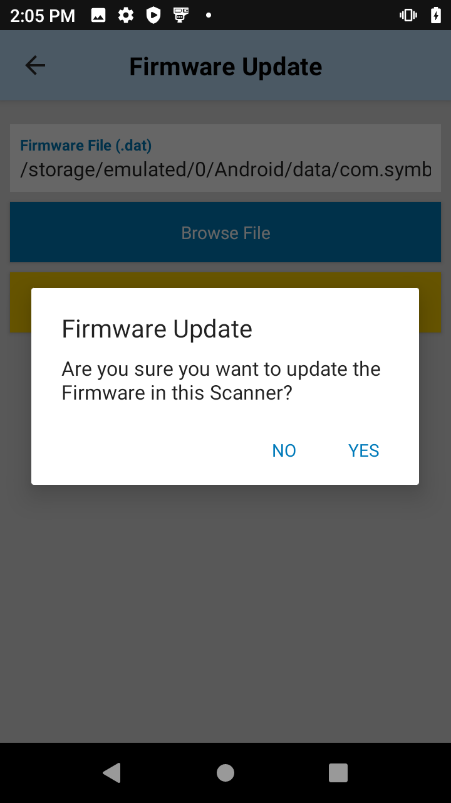
 

6. Tap **Yes**. A warning message appears. The progress is seen through the notification bar.
7. As indicated from the warning, once the update is complete the device will reboot.
8. Verify if the update is successful by validating the firmware version in the Device Details screen after the peripheral reconnects.

## Peripherals Summary List

The **Peripherals** tab provides a list of the paired Bluetooth peripherals. The peripherals are listed by device name showing their connected state as indicated by the green dot (connected) or red dot (disconnected). If the peripheral is in the connected state, additional information is displayed for supported peripherals such as Zebra RS6000 Bluetooth Scanner and ZEbra HS3100 Bluetooth Headset.  This information includes battery status and the length of time the peripheral has been connected. Some connected peripherals may provide action buttons that allow the user to perform an action associated with a given peripheral. For example, the RS6000 allows a user to Page the connected scanner or update the firmware.  
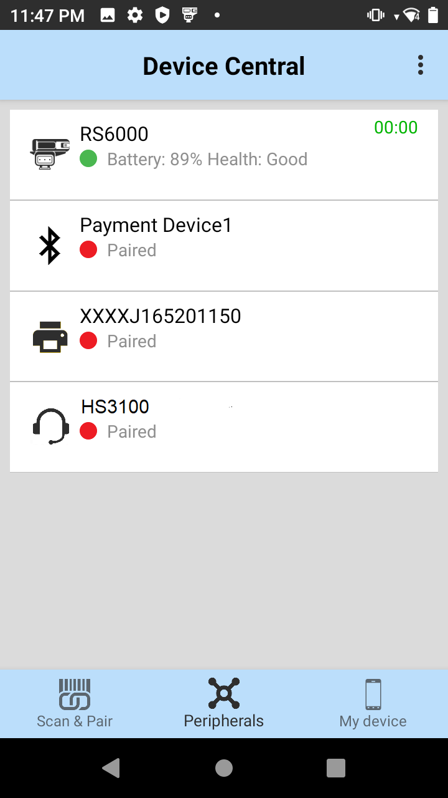
 

## My Device
The **My Device** tab displays information pertaining to the Android device which Device Central is running on and its battery.  This information includes: device model, device serial number, OS version, system build number, battery level, battyer part number, battery serial number, and battery manufactured date.
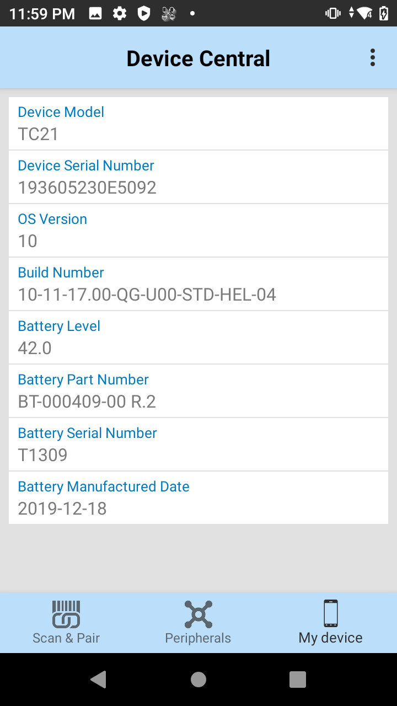
 

## Smart Leash
**Smart Leash** triggers alerts via audio feedback and/or haptic feedback in addition to a notification visible in the notification drawer if a Bluetooth accessory moves out of range and becomes disconnected. These alerts notify the user to take immediate action to prevent accessory loss. This feature applies to Android 10 devices and higher.

<iframe width="560" height="315" src="https://www.youtube.com/embed/pLuftOwcAFk" frameborder="0" allow="accelerometer; clipboard-write; encrypted-media; gyroscope; picture-in-picture" allowfullscreen></iframe>

To use Smart Leash:

1.	Launch **Device Central** from the app menu.
2.	Tap the top right hamburger menu, then tap on **Settings.**

3.	Toggle to enable **Smart Leash.** Optionally, toggle to enable other feedback and related options: 
* **Audio Feedback:**
    * **Notification Sound -** select the audio for the alert
    * **Repeat Count -**  set the number of times (0-100) the audio feedback sound repeats after initial playback
    * **Volume -** set the volume level percentage % (1-100) for the audio feedback sound
* **Haptic Feedback:**
    * **Duration -** set the time in milliseconds (500-1,800,000) equivalent to 0.5 seconds to 30 minutes for the haptic, or vibration, feedback to take place

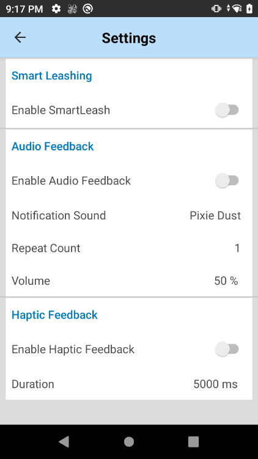

4. When the connected Bluetooth peripheral moves out of range and becomes disconnected from the device, by default a notification message appears in the notification drawer:
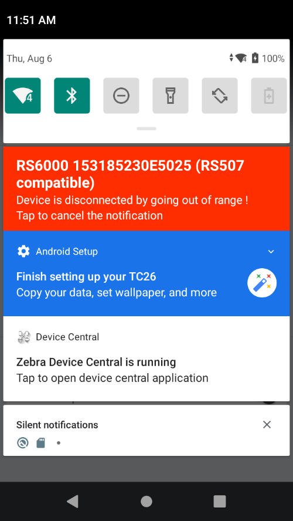
 

## Configuration
Some features may be controlled through [StageNow](/stagenow/latest/about), an Enterprise Mobility Management (EMM) system (sometimes referred to as Mobile Device Management, or MDM), or a custom application using Zebra's [Device Central Manager CSP](/mx/devicecentralmgr). The Device Central application must be installed on the device before configuring with Device Central Manager CSP. The features that can be controlled include:

* **Enable/Disable Single Pairing of the Same Device Class**: If enabled, it allows only one device to be paired from each device category, such as scanner, headset and printer. _This feature is deprecated from Device Central Manager CSP -_ starting with MX version 10.1, Zebra recommends to use [Bluetooth Manager CSP](/mx/bluetoothmgr) to configure the same functionality. 
    * _For Bluetooth headsets, mobile payment modules and printers:_ If a device is already previously paired and another device of that same category type is being paired, the previously paired device will be automatically unpaired to allow the new device to be paired.  
    * _For Bluetooth scanners:_ If a device is already previously paired and another device of that same category type is being paired, the previously paired device will not be unpaired automatcially and the new device will not be paired until the previous device is disconnected or unpaired.  
* **Enable/Disable Firmware Update Option**: If enabled, it permits the ability to hide the Firmware Update button to prevent firmware updates from taking place.  
* **Enable/Disable Bluetooth On/Off Option**: If enabled, it prevents the user from accessing the option to turn the Bluetooth radio on or off. This option is accessible from the **Settings** screen (in the main screen tap on the top right hamburger menu and select **Settings**): 
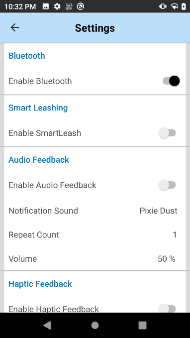
 

* **Smart Leash Option**: Enable/disable **Smart Leash** and configure the Audio/Haptic feedback via [Device Central Manager CSP](/mx/devicecentralmgr). 
* **Enable/Disable Silent Pairing Option**: If enabled and configured, it allows the confirmation prompt to be bypassed during the pairing process. Use [Bluetooth Manager CSP](/mx/bluetoothmgr) to configure this option.

## Usage Notes
* When in **Android Multiple User mode,** Device Central only supports the Primary user.
* **Silent Pairing** can be enabled/disabled via [Bluetooth Manager CSP](/mx/bluetoothmgr), allowing the confirmation prompt to be bypassed during the pairing process.
* The **scanning profile named “DeviceCentral” in DataWedge should not be removed or modified**, otherwise unexpected behavior may occur.
* Only **Zebra Bluetooth scanners are listed in the notification drawer in Android when connected to the device**. All other peripheral devices are listed only in the Device Central main UI.
* **To receive Smart Leash alerts:**
    * Device Central must be installed and launched at least once on the device.
    * Vibration must be supported on the device to receive haptic feedback.
   

<!-- -->
-----

## See Also

* [About Device Central](../about)
* [Install](../setup)
* [Device Central Manager CSP](/mx/devicecentralmgr) - configures Device Central settings
* [Bluetooth Manager CSP](/mx/bluetoothmgr) - controls whether a device can pair with other Bluetooth devices
