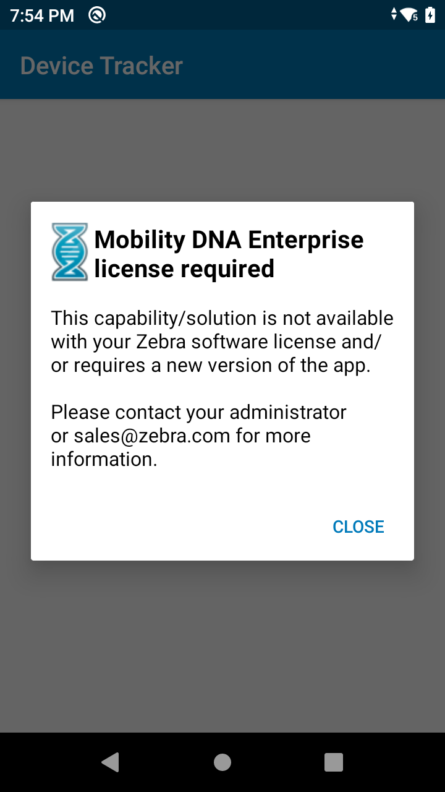
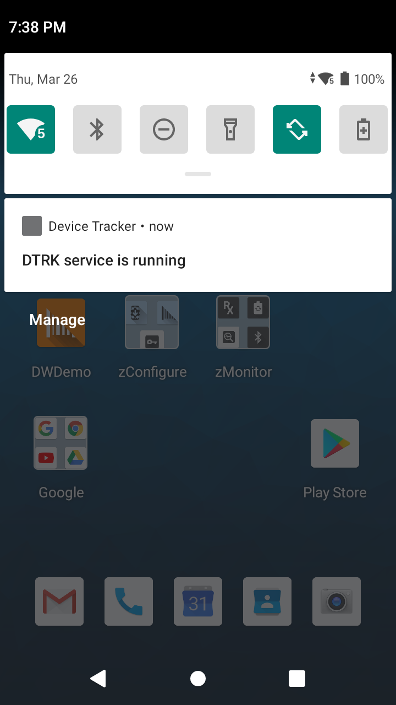

<b>Important information about Device Tracker:</b> 
&nbsp;&nbsp;&nbsp;&nbsp;&nbsp;•&nbsp; <a href="/devicetracker"><b>Device Tracker</b></a> 4.0 is the cloud-based version, which replaces Device Tracker On-Prem 2.3.1 or lower.  
&nbsp;&nbsp;&nbsp;&nbsp;&nbsp;•&nbsp; <b>Device Tracker On-Prem </b> 2.3.1 or lower is the on-premise version, formerly known as Device Tracker. It is incompatible with Device Tracker 4.0 and cannot be upgraded to the cloud-based version. 

<a href="/devicetracker" class="btn btn-danger">Learn About Device Tracker</a> 

## Overview

Device Tracker On-Prem is a centralized software solution that tracks and finds misplaced devices within a facility to help prevent inventory shrinkage. It leverages existing WiFi network infrastructure, Bluetooth Low Energy (BLE) and audio chirping to locate devices. Device Tracker On-Prem continuously monitors device presence, tracking status, connection state, and battery charge to ensure visibility of devices prior to reaching a disconnected or loss of battery state.

When locating a device, Device Tracker On-Prem identifies the general area where the misplaced device is located based on the Access Point (AP) it is connected to within the facility. The BLE proximity indicator uses Bluetooth beacon transmissions to determine the approximate location of the misplaced device in comparison to the finding device. Chirping audio can be played on the misplaced device to further determine its specific location.

## Main Features

Device Tracker On-Prem main features:

- General location information for all supported WiFi devices based on connected AP
- Real-time device proximity tracking with BLE
- Misplaced device prevention by monitoring low power and disconnection state
- Centralized dashboard to easily view device information: WiFi connectivity (connection status, connected AP), tracking status (To Be Found, Being Found, Found, Cannot Find), battery information (percent battery remaining, charging status), and other information from deployed Zebra mobile computers. Other dashboard actions:
    - Filter and sort data
    - Search by status, AP name, device name, device model, device serial number, battery state, and tags
    - Device tagging for easier organization, identification, and tracking
    - Admin action to mark device "To be found", which adds the device to the search list on the associate's client app
- Find and retrieve misplaced devices with client app using audio sound
- Secure communications between the Device Tracker On-Prem Client application and server
- Friendly name assignment for APs and devices for ease of identification and tracking
- Report generation to export data
- Capability for device staging with the use of an EMM such as Zebra's [StageNow](/stagenow/latest/about) with [Battery Manager CSP](/mx/batterymgr).

## How it works

The Device Tracker On-Prem client app registers the device with the server and reports device information based on the defined reporting frequency from the server settings. The Admin uploads a list of friendly names of Access Points within the facility, which identifies the general area or zone where the device is located while connected to the AP. From the web portal, the Admin marks the misplaced device "To be found". On the associate’s device, the Device Tracker On-Prem client displays a list of devices to be found. The associate selects the target device to find from the list and uses the AP friendly name (if configured) to identify the general area where the device is last seen. If BLE is enabled, a proximity meter appears indicating how close or far the user is to the misplaced device. <!--"Out of Bluetooth range" message appears if the user walks beyond the distance which the Bluetooth signal can be received from the target device.--> Audio can be played on the target device to further locate it by sound.

The web portal provides a dashboard for administrators to monitor the status of all tracked devices, identifying any misplaced devices. The last known status is provided from devices so action can be taken to prevent lost or misplaced devices.

## MDNA Enterprise License

Beginning with Device Tracker On-Prem 3.0, a [Mobility DNA Enterprise license](/licensing) is  required to use Device Tracker On-Prem on Zebra Professional-series devices, including TC21 and TC26. Out of the box, Zebra Professional-series devices have a non-functional Device Tracker On-Prem client pre-installed.

### Unlicensed

When unlicensed, the app displays a “Mobility DNA Enterprise license required” prompt (shown below) when a user attempts to open Device Tracker On-Prem on a device. When the unlicensed Device Tracker client is configured via StageNow or an EMM, a staging error occurs indicating a [Mobility DNA Enterprise license](/licensing) is required. **Learn more about [purchasing an MDNA Enterprise license](/licensing/process).**

_MDNA Enterprise license required_

### Licensed

After a Zebra Professional-series device is licensed with the [Mobility DNA Enterprise license](/licensing) for the first time, the non-functional app client must be uninstalled and replaced with [Device Tracker On-Prem version 3.0 or higher](https://www.zebra.com/us/en/support-downloads/software/productivity-apps/device-tracker-on-prem.html). For full functionality, accept all permissions when prompted. See [Client Install & Setup](../setup/#clientinstallsetup).

If a device is being relicensed, Device Tracker On-Prem is fully functional provided all the [permissions are accepted and configuration] are implemented. See [Client Install & Setup](../setup/#clientinstallsetup).

### License Expired

After the [Mobility DNA Enterprise license](/licensing) expires on a Zebra Professional-series device, a message appears stating that a license is required (see [device screen](./#unlicensed) above) and Device Tracker On-Prem client no longer functions. All communication is terminated to the Device Tracker Server. Device Tracker On-Prem client can no longer be configured by StageNow or any EMM. The Device Tracker On-Prem notification message indicating the service is running remains displayed in the device notification drawer:

_Device Tracker On-Prem service_

## New in 3.0

- New device support for Android 10 devices. See supported devices on <a href="https://www.zebra.com/us/en/support-downloads/software/productivity-apps/device-tracker-on-prem.html">Zebra support portal</a> 
- <a href="/licensing/about">Mobility DNA Enterprise license</a> required for Zebra Professional-series devices.
- Device Tracker On-Prem 2.3.1 or earlier cannot be upgraded to 3.0. All prior versions must be uninstalled before installing [Device Tracker 3.0](https://www.zebra.com/us/en/support-downloads/software/productivity-apps/device-tracker-on-prem.html).

## Version History

<table class="facelift" style="width:100%" border="1" padding="5px">
  <tr bgcolor="#dce8ef">
    <th style="text-align:center">Solution Release Version</th>
    <th style="text-align:center">Server/ Client</th>
    <th style="text-align:center">Version</th>
    <th style="text-align:center">New Features/Updates</th>
  </tr>
  <tr>
    <td style="text-align:center" rowspan="2">3.0</td>
    <td style="text-align:center">Server</td>
    <td style="text-align:center">2.3.1</td>
    <td style="text-align:left">No changes.</td>
  </tr>
  <tr>
    <td style="text-align:center">Client</td>
    <td style="text-align:center">3.0</td>
    <td style="text-align:left">• New device support for Android 10 devices. See supported devices on <a href="https://www.zebra.com/us/en/support-downloads/software/productivity-apps/device-tracker-on-prem.html">Zebra support portal</a> • <a href="./licensing/about">Mobility DNA Enterprise license</a> required for Zebra Professional-series devices. • Device Tracker On-Prem 2.3.1 or earlier cannot be upgraded to 3.0. All prior versions must be uninstalled before installing Device Tracker 3.0.</td>
  </tr>
  <tr>
    <td style="text-align:center" rowspan="2">2.3.1</td>
    <td style="text-align:center">Server</td>
    <td style="text-align:center">2.3.1</td>
    <td style="text-align:left">• New feature to toggle BLE for device proximity tracking. • Ability to delete "Never connected" devices in the web portal that have been uploaded but never connected to the server. This option helps to remove devices uploaded to the console via .CSV file in error.  • Self-signed certificates are now supported to help simplify deployment of product demos and trials.</td>
  </tr>
  <tr>
    <td style="text-align:center">Client</td>
    <td style="text-align:center">2.3</td>
    <td style="text-align:left">• New BLE device proximity indicator to locate a misplaced device by leveraging BLE device-to-device beacon transmissions. • Enhanced Device Tracker On-Prem mobile client with support for Google API 28, providing greater consistency of application user interfaces and icons.</td>
  </tr>
   <tr>
    <td style="text-align:center" rowspan="2">2.2.1</td>
    <td style="text-align:center">Server</td>
    <td style="text-align:center">2.2.1</td>
    <td style="text-align:left">Added method to start server background services to run on startup and without a logged-in user.</td>
  </tr>
  <tr>
    <td style="text-align:center">Client</td>
    <td style="text-align:center">2.2.1</td>
    <td style="text-align:left">New Android P devices supported: TC52, TC72, PS20 </td>
  </tr>
  <tr>
    <td style="text-align:center" rowspan="2">2.1</td>
    <td style="text-align:center">Server</td>
    <td style="text-align:center">2.1</td>
    <td style="text-align:left">• <b>Disconnect Threshold Time</b> removed from Application Configuration screen and integrated with <b>Reporting Frequency</b>.  • Ability to upgrade server from previous version to current version without the need to reinstall. </td>
  </tr>
  <tr>
    <td style="text-align:center">Client</td>
    <td style="text-align:center">2.1</td>
    <td style="text-align:left">• New devices supported: ET50/ET55, WT6000, TC25, ET51/ET56, TC20, MC9300, TC8300, EC30, L10 Android  • Known issues fixed:    1. During network congestion, when pressing the back button in the proximity screen it takes about 10 seconds to show a status message.    2. When a user clicks on the play sound button before 5 minutes (reporting interval) has elapsed after marking a misplaced device as "To Be Found" in ZDVC console, the proper message is not displayed on the finding device. </td>
  </tr>
  <tr>
    <td style="text-align:center" rowspan="2">1.0</td>
    <td style="text-align:center">Server</td>
    <td style="text-align:center">2.0</td>
    <td style="text-align:left">Initial release</td>
  </tr>
  <tr>
    <td style="text-align:center">Client</td>
    <td style="text-align:center">1.0</td>
    <td style="text-align:left">Initial release</td>
  </tr>
</table>

 

## Supported Devices

See supported devices on <a href="https://www.zebra.com/us/en/support-downloads/software/productivity-apps/device-tracker-on-prem.html">Zebra support portal</a>.

<!--
Supported Devices (including GMS and non-GMS versions):

<table class="facelift" align="center" style="width:80%" border="1" padding="5px">
  <tr bgcolor="#dce8ef">
    <th>Device</th>
    <th style="text-align:center">Android 6.x  (Marshmallow)</th>
    <th style="text-align:center">Android 7.x  (Nougat)</th>
    <th style="text-align:center">Android 8.x  (Oreo)</th>
     <th style="text-align:center">Android 9.x  (Pie)</th>
  </tr>
  <tr>
    <td>EC30</td>
    <td></td>
    <td></td>
    <td style="text-align:center">&#x25cf;</td>
    <td></td>
  </tr>
  <tr>
    <td>ET50/ET55</td>
    <td style="text-align:center">&#x25cf;</td>
    <td></td>
    <td></td>
    <td></td>
  </tr>
  <tr>
    <td>ET51/ET56</td>
    <td></td>
    <td></td>
    <td style="text-align:center">&#x25cf;</td>
    <td></td>
  </tr>
  <tr>
    <td>L10 Android</td>
    <td></td>
    <td></td>
    <td style="text-align:center">&#x25cf;</td>
    <td></td>
  </tr>
  <tr>
    <td>MC3300 </td>
    <td style="text-align:center">&#x25cf;</td>
    <td style="text-align:center">&#x25cf;</td>
    <td style="text-align:center">&#x25cf;</td>
    <td></td>
  </tr>
  <tr>
    <td>MC9300</td>
    <td></td>
    <td></td>
    <td style="text-align:center">&#x25cf;</td>
    <td></td>
  </tr>
  <tr>
    <td>PS20</td>
    <td></td>
    <td></td>
    <td style="text-align:center">&#x25cf;</td>
    <td style="text-align:center">&#x25cf;</td>
  </tr>
  <tr>
    <td>TC20</td>
    <td></td>
    <td></td>
    <td style="text-align:center">&#x25cf;</td>
    <td></td>
  </tr>
  <tr>
    <td>TC25</td>
    <td></td>
    <td style="text-align:center">&#x25cf;</td>
    <td></td>
    <td></td>
  </tr>
  <tr>
    <td>TC51/TC51-HC/TC56 </td>
    <td style="text-align:center">&#x25cf;</td>
    <td style="text-align:center">&#x25cf;</td>
    <td style="text-align:center">&#x25cf;</td>
    <td></td>
  </tr>
  <tr>
    <td>TC52</td>
    <td></td>
    <td></td>
    <td style="text-align:center">&#x25cf;</td>
    <td style="text-align:center">&#x25cf;</td>
  </tr>
  <tr>
    <td>TC57</td>
    <td></td>
    <td></td>
    <td style="text-align:center">&#x25cf;</td>
    <td></td>
  </tr>
  <tr>
    <td>TC70X/TC75X</td>
    <td style="text-align:center">&#x25cf;</td>
    <td style="text-align:center">&#x25cf;</td>
    <td style="text-align:center">&#x25cf;</td>
    <td></td>
  </tr>
  <tr>
    <td>TC72</td>
    <td></td>
    <td></td>
    <td style="text-align:center">&#x25cf;</td>
    <td style="text-align:center">&#x25cf;</td>
  </tr>
  <tr>
    <td>TC77</td>
    <td></td>
    <td></td>
    <td style="text-align:center">&#x25cf;</td>
    <td></td>
  </tr>
  <tr>
    <td>TC8300</td>
    <td></td>
    <td></td>
    <td style="text-align:center">&#x25cf;</td>
    <td></td>
  </tr>
  <tr>
    <td>WT6000</td>
    <td></td>
    <td style="text-align:center">&#x25cf;</td>
    <td></td>
    <td></td>
  </tr>
</table>
-->

## Device Tracker Comparison

Comparison of **Device Tracker On-Prem** and **[Device Tracker](/devicetracker/latest/guide/about)** cloud-based:

<table class="facelift" style="width:100%" border="1" padding="5px">
  <tr bgcolor="#dce8ef">
    <th style="text-align:center">Features</th>
    <th style="text-align:center">Device Tracker On-Prem</th>
    <th style="text-align:center">Device Tracker</th>
  </tr>
  <tr>
    <td style="text-align:left">Host platform</td>
    <td style="text-align:left">On-Premise server, requires manual install and setup</td>
    <td style="text-align:left">Cloud-based solution managed by Zebra</td>
  </tr>
  <tr>
    <td>Maximum Devices Supported</td>
    <td>500</td>
    <td>100,000</td>
  </tr>
  <tr>
    <td>Site support</td>
    <td>Single; multiple sites require individual server installation at each location</td>
    <td>Multi-site; centralized in-the-cloud supporting multiple locations up to 5,000 sites without any additional install required</td>
  </tr>
  <tr>
    <td>Server setup required</td>
    <td>Yes, Windows server with required software and other system requirements</td>
    <td>No, server is in the cloud and managed by Zebra</td>
  </tr>
  <tr>
    <td>Android platform support</td>
    <td>Only supported on select devices up to Android 10</td>
    <td>Only supported on select Android Oreo and Android 10 devices</td>
  </tr>
  <tr>
    <td>Common Features</td>
    <td colspan="2">• Simple real-time device locationing with connected AP identification, Bluetooth-based visual proximity indicator and remote play sound feature • Registration of sites, APs and devices with friendly names for ease of identification • Misplaced and at-risk device prevention by monitoring low power and disconnection device states • Role-based access to find and manage devices based on administrator, site manager and associate roles • Centralized dashboard</td>
  </tr>
  <tr>
    <td>Device Check-out/ Check-in</td>
    <td>No</td>
    <td>Yes, identifies device user</td>
  </tr>
  <tr>
    <td>Dashboard</td>
    <td>Server-based dashboard view</td>
    <td>Device-based dashboard view</td>
  </tr>
  <tr>
    <td>Cost</td>
    <td>Free</td>
    <td>Licensed subscription service</td>
  </tr>
</table>

 
 

---

## See Also

- [Install & Setup](../setup)
- [Admin View](../admin)
- [Device Tracking](../mgmt)
- [Configuration](../config)
- [Troubleshooting & FAQ](../troubleshooting)
