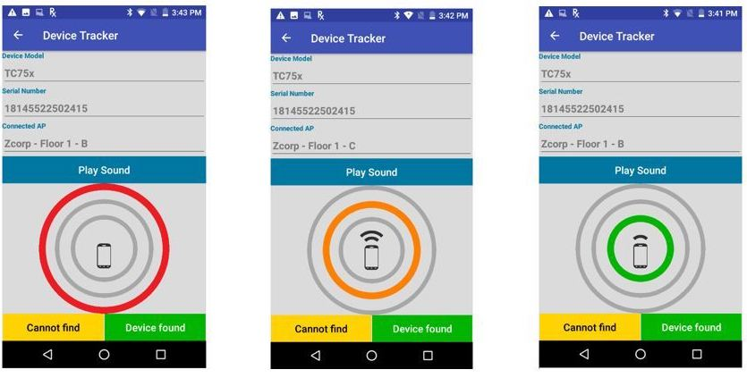

## Overview
Monitoring device presence and prevention of misplaced devices is important for smooth operational productivity. This section covers the procedures to organize, track, locate, and prevent misplaced devices.

## Locating Devices
The facility administrator monitors devices from the [admin dashboard](../admin) and can mark a device "To be found" if it is misplaced or needs to be charged due to low battery to avoid loss of connectivity. The associate selects the target device to find in the client application and walks to the Access Point (AP) area where the device is connected. BLE (Bluetooth Low Energy) based device proximity indicator and remote chirping are used to locate the device: 

1. Animated BLE proximity indicator – Uses the associate's device as a proximity indicator to locate the misplaced device. The indicator shows the distance (in real-time) of the associate's device in relation to the target device being found. As the associate physically approaches near the target device, the distance (in feet) is displayed on the screen. A color-coded visual indicator with animation contracts and expands as the associate moves closer or further away from the target.
2. Chirping sound – Trigger a chirping sound to play on the target device. This is particularly helpful if the device is hidden. The volume level and sound duration can be adjusted in the server [Settings](../config).

> WiFi and Bluetooth must be enabled on both devices.

###Procedure to find a device

From the [dashboard](../admin) in the web portal, the administrator selects the device to find within the table and sets it to the “To be found” state as follows:
1. Tick the checkbox for the device row.
2. Click on the Action menu and select “Set device: ‘To be found’”. 
3. Click “OK” on the confirmation message. The device status changes from "Active" to "To be found".

The next time the target device reports to the server, it identifies it is marked "To be found". The length of time this takes is based on both the [Reporting Frequency](../config/#applicationconfiguration) and the elapsed time since the last report was received (seen in the **Updated** column on the [admin dashboard](../admin)) [1]. The administrator can then notify the associate to find the device using the Device Tracker client. The process follows: 

1. [Associate] Open the Device Tracker client. It presents a list of devices that need to be found, including the device marked "To be found" by the admin. 
2. [Associate] Tap on the target device to find. The **Device Details** screen appears providing information on the device including “Last Connected AP” which identifies the AP zone where the device is located. 
3. [Associate] Walk towards the AP zone. Tap **Go** button to begin the device search.  
[Admin] On the admin dashboard, the device changes state from "To be Found" to "Being Found". 
4. [Associate] The BLE proximity meter appears in the device client showing the approximate distance (in meters) between the device conducting the search and the misplaced device. The animation and color changes as the user moves closer (green) or further away (red) from the device being searched. 

  _Figure 1. Device Tracker client screens while locating a device_
5. [Associate] Tap “Play Sound” to hear an audio sound on the misplaced device to further isolate the device location.  
6. [Associate] Once found, tap **Device found** at the bottom of the screen. Some devices may require the user to scroll down the screen for the button to be visible.  
[Admin] On the dashboard, the device status changes from “Being found” to “Device has been found”. 
7. [Associate] Tap “Yes” to the confirmation message to designate the device as found.  
[Admin] On the dashboard, the device status changes from “Being found” to "Found". 

Once the device is found, the admin can then take action to set the device back to the “Active” state to place back into the main device pool as follows:
1. Select the device in the dashcoard.
2. In the Action menu, select “Set device to: Active”. 
The device is moved out of the "Found" state into the "Active" state. 

[1] **Important Note**: Depending on when the device being searched last reported to the server, it may take at most the specified [Reporting Frequency](../config/#applicationconfiguration) time to elapse before the associate device can start finding the target device. Once the target device reports to the server and receives the flag that it is in the "To be found" state, it automatically changes the reporting frequency to 30 seconds for more frequent updates to the server until the device has been found. _For example, if Device A is marked “To be found” from the admin and the following conditions exist:_ 
* _Reporting Frequency is set to 5 minutes_
* _Device A reported to the server a few seconds ago (as seen in the **Updated** column on the admin dashboard)_

_In this scenario, approximately 5 minutes need to elapse (the next time the target device reports to the server) before the Device A identifies that it is marked as "To be found" and the associate can take action to find Device A. In this same scenario, if Device A reported to the server 4 minutes ago as seen from the dashboard, then 1 minute must elapse (time left to reach the 5 minute Reporting Frequency interval) before Device A identifies that it is marked "To be found" and the associate can take action to find Device A._ 

###Cannot find device

If the device cannot be located, in step 6 above tap on "Cannot find" and proceed to step 7 to tap "Yes" to the confirmation message. On the admin dashboard, the device status is changed from "Being found" to "Cannot find". 

##Track Device Presence
The admin dashboard on the web portal monitors device tracking by providing information on: misplaced devices, devices that are being searched for, devices that have been found, and devices that cannot be found. For each device, the “Connected AP” friendly name provides a general location of where the device resides based on the AP the device is connected to. The connected AP is displayed both on the admin dashboard and Device Tracker client. 

##Prevent Misplaced Devices
Prevent devices from being misplaced by monitoring the low battery state so action can be taken by the administrator to charge the device prior to battery loss. Configure the “Low Power Alert Threshold %” in the Settings screen from the web portal to set the threshold value. When a device battery drops below this defined threshold, the device is listed in the Low Battery section in the admin dashboard. The admin can then initiate the device to be located by [marking the device "To be found"](./#locatingdevices).

##Device Tagging
Tag devices for easier organization and tracking. Refer to [Organize Devices](../admin/#organizedevices) in the Admin View.

##Friendly Names
Use of friendly names for devices allows for easier device identification. The same holds true for access point friendly names to quickly identify the device location based on the access point it is connected to. See [Device & Access Point Management](../config/#device&accesspointmanagement) in the Configuration section.

 

-----

## See Also

* [About Device Tracker](../about)
* [Install & Setup](../setup)
* [Admin View](../admin)
* [Configuration](../config)