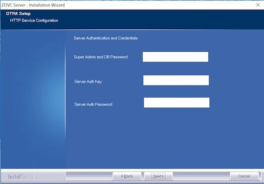
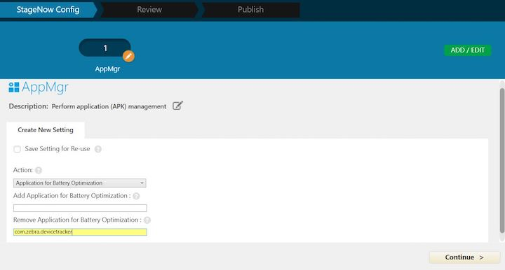
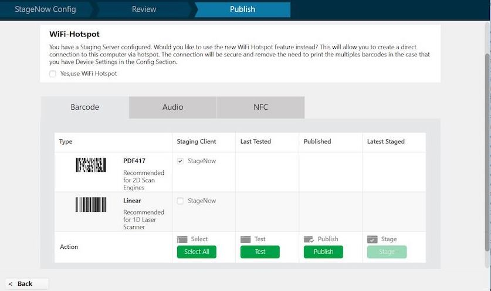
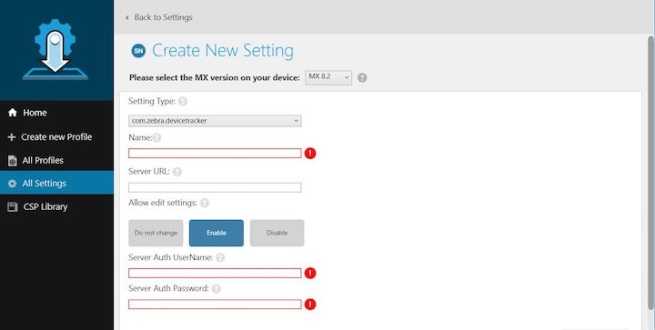
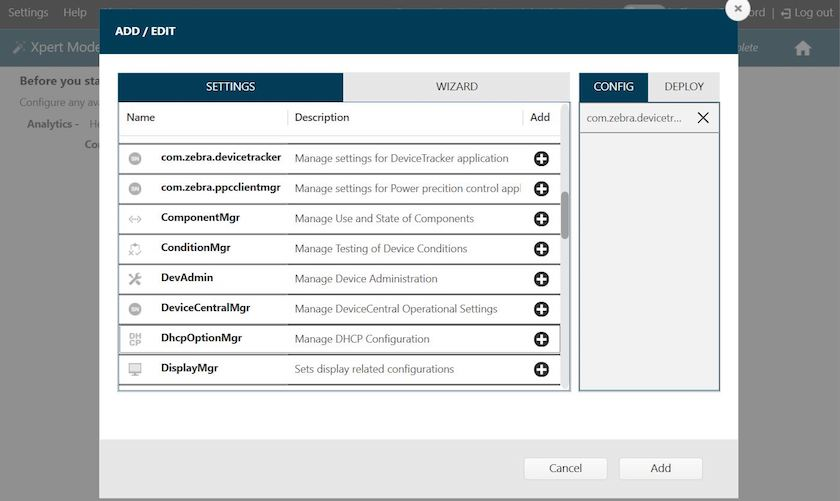
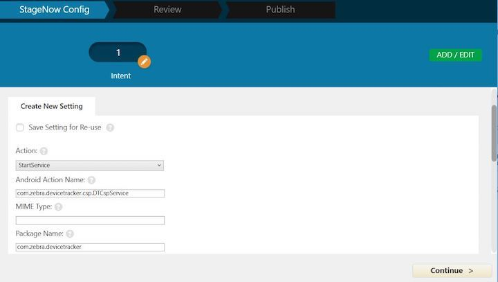
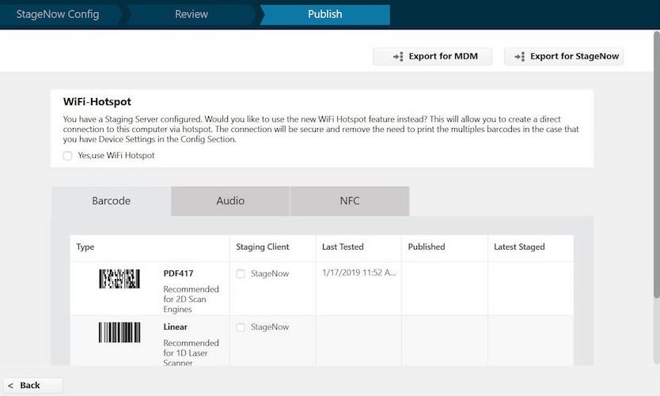

## Overview

Device Tracker server runs on a supported Windows-based server or desktop. Device Tracker client runs on supported [Zebra devices](../about/#supporteddevices). This section provides system requirements and instructions for install and setup for the solution.

Solution components:
* **On-premise Device Tracker server** - application server with database
* **Web portal** - centralized dashboard accessible from a supported browser for monitoring device information including tracking status, connection state, AP friendly name, device friendly name, charging status, remaining battery percentage, and more.
* **Device Tracker client** - reports device presence status and information (such as remaining battery and charging status) to server

Before installing, ensure to prepare additional steps for system setup:
 * **Install SSL certificate** (procured by a signed Certificate Authority) - configured on server for secure HTTPS communication
 * **Open specific incoming and outgoing ports** - for server communication through the firewall, by default ports 8443 and 8080
 * **Add DNS (Domain Name Server) Entry** - an entry is added to the DNS to map the server IP address to the domain 

> Important: An SSL Certificate is required from a third party certificate authority (CA), such as Verisign or Thawte. Any self-signed certificate or one issued by a non-third party CA will not work. The .pfx certificate must contain the complete certificate chain, including intermediate certificates.

##System Requirements
This section provides the server and device requirements. Device Tracker supports a maximum of 500 devices per installation.

###Server Requirements
1. Windows Operating Systems supported:
   * Windows® 2012 server, 64-bit processor
   * Windows® 2016, 64-bit processor

2. Browsers supported (connect over https):  
   * Google Chrome Browser version 66 and higher
   * Microsoft Internet Explorer version 11 and higher
   * Microsoft Edge for Windows 10
   * Safari for Mac version 11 and higher

3. Software Required (included in server installation):
   * Java runtime
   * Node.js version 6.11
   * PostgreSQL 9.6.3-3 and higher
   * Device Tracker software (server and client) 

4. Network Access Requirements:
   * If required, open incoming and outgoing ports for communication between server and mobile devices through the server firewall. The default ports used are: 
        * Data Port 8080 for Device Tracker client to register and transmit device data 
        * Web Portal Port 8443 for accessing Device Tracker web portal  
   * If required, perform DNS setup to add server IP address to the DNS server. 

5. Hardware Requirements: 
   * Minimum CPU cores: 8  
   * Minimum memory (RAM): 4 GB  
   * Minimum available hard drive space: 300 GB 

  Recommended hardware requirements based on number of devices:
   <table class="facelift" align="center" style="width:70%" border="1" padding="5px">
   <tr bgcolor="#dce8ef">
      <th>Number of Devices</th>
      <th style="text-align:center">RAM</th>
      <th style="text-align:center">CPU Cores</th>
      <th style="text-align:center">Hard Drive Space</th>
    </tr>
    <tr>
      <td>Up to 1,000 devices</td>
      <td style="text-align:center">4 GB</td>
      <td style="text-align:center">8 cores</td>
      <td style="text-align:center">300 GB</td>
    </tr>
    <tr>
      <td>1,000 to 5,000 devices</td>
      <td style="text-align:center">8 GB</td>
      <td style="text-align:center">8 cores</td>
      <td style="text-align:center">600 GB</td>
    </tr>
    <tr>
      <td>Up to 10,000 devices</td>
      <td style="text-align:center">16 GB</td>
      <td style="text-align:center">16 cores</td>
      <td style="text-align:center">750 GB</td>
    </tr>
   </table>

###Device Requirements
Requirements for Device Tracker client:
* The device is connected via WiFi on the same network as the server. 
* Zebra Data Service agent is running on the device. This agent collects data from the device and transmits it to the Device Tracker server.
* Bluetooth radio is enabled on the device. BLE (Bluetooth Low Energy) beacons are used to help locate devices.
* The server URL, user name, and password is configured in the Device Tracker client to communicate with the server. 

See supported [Zebra devices](../about/#supporteddevices).

##Server Install & Setup
Install Device Tracker server on the supported system that meets the specified requirements. Download Device Tracker server from [Zebra Support and Downloads](https://www.zebra.com/us/en/support-downloads/software/productivity-apps/power-precision-console.html). After server installation, further network and certificate setup is required to allow communication between the server and devices via DNS and firewall. Instructions for server installation and setup:

###Server Installation
1. Double-click on the .EXE to launch the installer.
2. At the initial window, click Next.

_Figure 1. Installation - initial screen_
3. Accept the license agreement. Click Next.

_Figure 2. Installation - EULA_
4. Accept the default folder or browse to the destination folder. Click Next.

_Figure 3. Installation - destination location_
5. Enter in the server configurations, then click Next:
   * **Domain** - domain name for server, e.g. "name.company.com"
   * **Server Certificate Path** - location of server certificate (.pfx file)
   * **Server Certificate Password** - password for server certificate
   * **UI port** - designated UI port, can default to 8443
   * **Backend Server Port** - designated server port, can default to 8080

_Figure 4. Installation - server configuration_
6. Enter in server authentication and credentials, then click Next:
   * Super admin and database password
   * Server auth key
   * Server auth password

_Figure 5. Installation - server authentication and credentials_
7. Review settings. Click Next. Third party applications (such as Postgres and Node.js) will be installed if it does not pre-exist in the system.

_Figure 6. Installation - review settings_
8. Installation complete. Click Finish.

_Figure 7. Installation - complete_

###Server Setup
1. **DNS (Domain Name Server) Setup.** Device Tracker server runs in a domain, for example _name.company.com_. To run Device Tracker, an entry in the DNS server is required to add the server IP address. The DNS server and Device Tracker server are required to be on the same network. Contact your local IT Administrator to configure the domain to IP address mapping. 

2. **Server SSL Certificate.** An SSL certificate is required for secured connections. 
Steps to generate the certificate: 
A. Zebra recommends the certificate to be procured in .p7b format and the certificate private key to be a .key file. If the certificates are in different format, use a SSL certificate converter tool to convert to the proper format. 
B. Download [OpenSSL](https://www.openssl.org/source/) tool and install on the server. 
C. Create an empty directory named "generated_certs" to contain the .pfx certificate. 
D. Copy the following certificate files to "generated_certs" folder: primary certificate (e.g. "ssl_certificate.p7b"), private key (e.g. "ppc_private_key.key"), and intermediate CA certificate (e.g. "IntermediateCA.cer").  _The intermediate CA certificate is optional - use if required in the certificate chain._   
E. Open a command prompt. Execute the following command to generate "ssl_certificate.cer": 
 		`openssl pkcs7 -print_certs -in ssl_certificate.p7b -out ssl_certificate.cer`
 
F. At the command prompt, execute the following command: 
		`openssl pkcs12 -export -in ssl_certificate.cer -inkey ppc_private_key.key -out ssl_certificate.pfx -certfile IntermediateCA.cer`
	 
	Where "-certfile IntermediateCA.cer" is optional.
 
G. When prompted, enter the certificate password to export "ssl_certificate.pfx". 
H. Copy the SSL certificate "ssl_certificate.pfx" with domain name “name.company.com” to a designated folder.
 

3. **Open Inbound/Outbound Ports on the Firewall.** The appropriate ports are required to be opened for inbound/outbound network traffic flow through the firewall for communication between the server and devices. These are the UI and backend server ports specified during the server install. The method to open the ports depends on the firewall software used by the network administrator. The ports are specified during the server install. By default the ports are:   

	* Inbound ports: TCP ports 8080 and 8443 (by default)
	* Outbound port: TCP port 8080 (by default)
 
4. **Run the Device Tracker Server Software.** Start the server services by launching the desktop shortcut icon "START_ZDVC_SERVICE". Open the supported browser. Enter the default server URL: **https://name.company.com:8443/zdvc**

	Where "name.company.com:8443" is replaced with the appropriate domain and port number.

As part of Zebra's DNA Visibility Console, the server consists of multiple solution offerings. Select "Device Tracker" then login.

5. **Server certificate validation.** Use an SSL Tool (such as [ssltools.com](http://ssltools.com/)) to aid in diagnostics and validate the certificate chain. 
A. Open [ssltools.com](http://ssltools.com/) in the browser. 
B. Enter the Web UI URL, for example `https://name.company.com:8443/zdvc` 
C. Click the Scan button. A successful result returns green checks for each step. _See Figure 8 below._  
D. Enter the backend URL for your server, for example `https://name.company.com:8080/zdvc`  
E. Click the Scan button. A successful result returns green checks for each step:

_Figure 8. SSLTools.com results_

##Client Install & Setup
Install Device Tracker client on the supported Zebra device to register the device and transmit data to the server. Client install and setup can be accomplished either manually or remotely with Zebra's [StageNow](/stagenow/latest/about) or an EMM (Enterprise Mobility Management). 

###Client Installation
Steps for client installation on the device, which may be performed either manually or with an EMM (Enterprise Mobile Management):
1. Download Device Tracker client from [Zebra Support and Downloads](https://www.zebra.com/us/en/support-downloads/software/productivity-apps/power-precision-console.html). Extract the files and folders.
2. Install DTRKClient.apk. 
3. If updating an existing client, reboot the device.

###Client Configuration
Configure the client settings either manually or remotely. For information on using CSP for remote configuration deployment, refer to [MX documentation](/mx/overview).

####Manual Configuration
Steps for manual client configuration after installation:
1. Open Device Tracker client.
2. Tap "Yes" to "Ignore battery optimizations". This is required for the client to remain connected to the server while running in the background.
3. Tap "Allow" to "Allow Device Tracker to access this device's location". This is required to allow BLE (Bluetooth Low Energy) locationing.
4. Tap the hamburger menu at the top right, then tap "Settings".  
5. Enter in the following information:
   * **Server URL** - URL for the server with port number and Device Tracker path specified, for example: **name.company.com:8080/zdvc/dtrk**, where "name.company.com:8080" is replaced with the appropriate domain and port number. The URL must not contain "https://" nor "http://".
   * **Server Auth UserName** - UserName designated during server install
   * **Server Auth Password** - Password designated during server install
 
6. Tap the device back button to save the changes and return to the main screen.
Device Tracker client registers with the server and loads "Devices to be found".

####Remote Configuration
After client installation, follow these steps to remotely configure the client:
1. Disable Battery Optimization
2. Reboot device (refer to [Power Manager](http://techdocs.zebra.com/stagenow/latest/csp/power/) in StageNow documentation)
3. Configure Device Tracker settings with CSP
4. Start Device Tracker Service

Detailed procedures follow for Device Tracker configuration.

**Steps to create StageNow profile to automatically bypass the device Battery Optimization pop-up message:**
1. Open [StageNow](https://www.zebra.com/us/en/support-downloads/software/utilities/stagenow.html) on a PC. 
2. In the StageNow home screen, click “Create New Profile” from the left menu.   
3. Ensure the proper MX version is selected at the top drop-down selector. This should match the StageNow client version on the device. Select “XpertMode" from the table. Click Create. 

_Figure 9. Profile wizard_  
4. Enter the profile name. Click Start. 
5. Scroll down and click the plus (+) sign next to “AppMgr”. This adds to the Config tab on the right side. Click Add. 

_Figure 10. Add Setting_  
6. In the StageNow Config section, click “Re-use Saved Setting” tab. The screen is populated with the information from the setting created in step 5. Validate all settings and click Continue.

_Figure 11. Re-use saved setting_  
7. Click “Complete Profile."  
8. In the Publish section, select the desired barcode type. Click Test. 

_Figure 12. Generate StageNow barcode_  
9. A window opens with the generated StageNow barcode in .pdf format. When ready to publish, click Publish. 
10. For EMM Staging, continue to section "Steps for EMM Staging" below.
11. Open the StageNow client on the device.
12. Scan the barcode generated to automatically bypass the Battery Optimization message.

**Steps for remote client configuration with StageNow and CSP Plug-in:**

1. Download Device Tracker client software DTRKClient.zip from [Zebra Support and Downloads](https://www.zebra.com/us/en/support-downloads/software/productivity-apps/power-precision-console.html). The .zip file includes the following: 
	* com.zebra.devicetracker.dsd 
	* DTRKClient.apk
2. Open [StageNow](https://www.zebra.com/us/en/support-downloads/software/utilities/stagenow.html) on a PC. 
3. Import the CSP Plugin Library:  
A. In the StageNow home screen, click “CSP Library” from the left menu.  
B. Upload the .zip file to the CSP Library by clicking “Choose File” then browsing to the .zip file, or by dragging and dropping the .zip file. Click "OK" in the confirmation message.   
C. Once successfully uploaded, the CSP Library is listed in the Plugin tab. 

_Figure 13. Import plugin into CSP Library_
4. Create a new setting: 
A. In the StageNow home screen, click “All Settings” from the left menu. Click “Create Setting” at the top right.  

_Figure 14. Import into CSP Library_  
B. Select the MX version for the device. For the “Setting Type”, select “com.zebra.devicetracker." Enter a name for the setting. Enter the server URL e.g. `name.company.com:8080/zdvc/dtrk`, where "name.company.com:8080" is replaced with the appropriate domain name and port number. Select the desired option to determine whether or not to allow the end user to edit the setting. Enter the "Server Auth UserName" and "Server Auth Password", both designated during server install.   

_Figure 15. Create New Setting_  
C. Tap Save. The new setting is listed in the Settings screen.

_Figure 16. New Setting created_  
5. Create profile: 
A. In the StageNow home screen, click “Create New Profile” from the left menu.   
B. Ensure the proper MX version is selected at the top drop-down selector. Select “XpertMode" from the table. Click Create. 

_Figure 17. Profile wizard_  
C. Enter the profile name. Click Start. 
D. Click the plus (+) sign next to “com.zebra.devicetracker”. This adds to the Config tab on the right side. Click Add. 

_Figure 18. Add Setting_  
E. In the StageNow Config section, click “Re-use Saved Setting” tab. The screen is populated with the information from the setting created in previous steps. Validate all settings and click Continue.

_Figure 19. Re-use saved setting_  
F. Click “Complete Profile."  
G. In the Publish section, select the desired barcode type. Click Test. 

_Figure 20. Generate StageNow barcode_  
H. A window opens with the generated StageNow barcode in .pdf format. When ready to publish, click Publish. 
6. For EMM Staging, continue to section "Steps for EMM Staging" below.
7. Open the StageNow client on the device.
8. Scan the barcode generated to configure the Device Tracker client with the settings specified.  

**Steps to create StageNow profile to start Device Tracker service remotely:**
1. Open [StageNow](https://www.zebra.com/us/en/support-downloads/software/utilities/stagenow.html) on a PC. 
2. In the StageNow home screen, click “Create New Profile” from the left menu.   
3. Ensure the proper MX version is selected at the top drop-down selector. This should match the StageNow client version on the device. Select “XpertMode" from the table. Click Create. 

_Figure 21. Profile wizard_  
4. Enter the profile name. Click Start. 
5. Scroll down and click the plus (+) sign next to “Intent”. This adds to the Config tab on the right side. Click Add. 

_Figure 22. Add Setting_  
6. Enter the following information:
   * Action: select "StartService"
   * Android Action Name: enter "com.zebra.devicetracker.csp.DTCspService"
   * Package Name: enter "com.zebra.devicetracker"
Click Continue.

_Figure 23. Configure Setting_  
7. Click “Complete Profile."  
8. In the Publish section, select the desired barcode type. Click Test. 

_Figure 24. Generate StageNow barcode_  
9. A window opens with the generated StageNow barcode in .pdf format. When ready to publish, click Publish. 
10. For EMM Staging, continue to section "Steps for EMM Staging" below.
11. Open the StageNow client on the device.
12. Scan the barcode generated to start the Device Tracker service in the background.

For more information on StageNow, refer to its [documentation](http://techdocs.zebra.com/stagenow) and [download](https://www.zebra.com/us/en/support-downloads/software/utilities/stagenow.html). 
 
 
**Steps for EMM Staging (optional):**
1. Pre-requisite steps:
   * Follow procedure for "Device Tracker remote configuration with StageNow and CSP Plug-in" up to step 6
   * Follow procedure for "Create StageNow profile to automatically bypass the device Battery Optimization pop-up message" up to step 11.
2. Select "Export option for EMM" from the top to export the .xml file.  Save the .xml file.

_Figure 25. Export for EMM_
3. Push the .xml settings via EMM to the device for the desired client configuration.

 
-----

## See Also

* [About Device Tracker](../about)
* [Admin View](../admin)
* [Device Management](../mgmt)
* [Configuration](../config)
