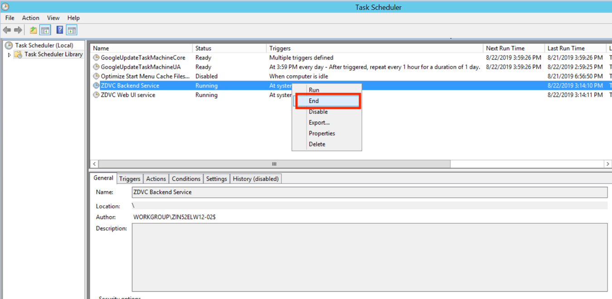
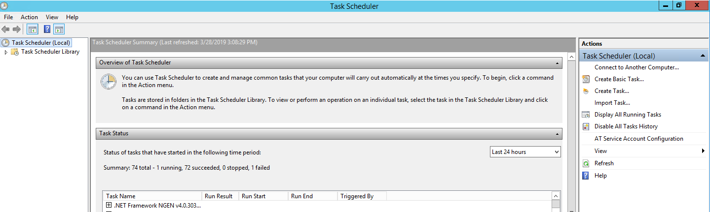
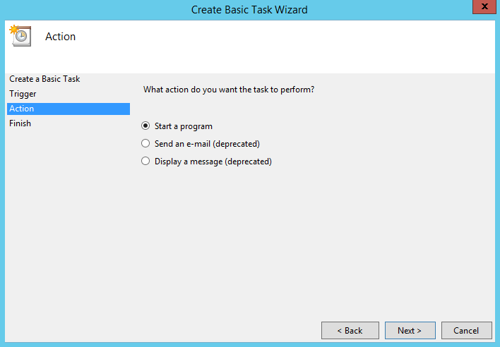
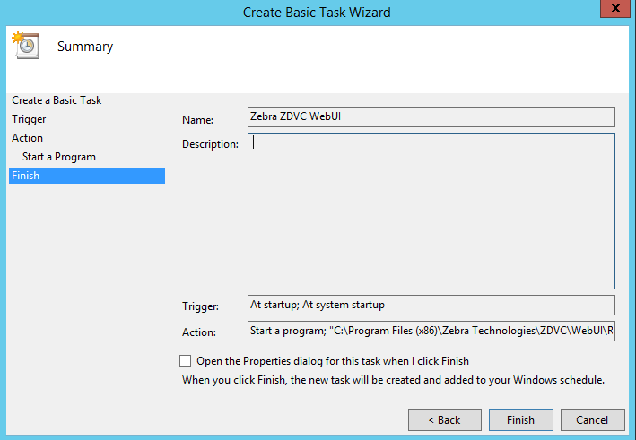
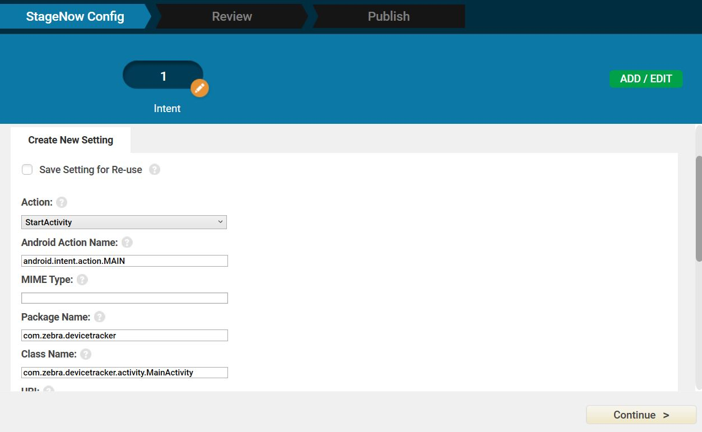

## Overview

As part of Zebra DNA Visibility Console (ZDVC) server, Device Tracker runs on a supported Windows-based server. Device Tracker client runs on supported [Zebra devices](../about/#supporteddevices). This section provides system requirements and instructions for install and setup for the solution.

Solution components:
* **ZDVC server** - ZDVC server includes Device Tracker and [PowerPrecision Console](/ppc/latest/guide/about). Device Tracker collects and processes device data for tracking misplaced devices.
* **Web portal** - ZDVC centralized dashboard for monitoring device presence, device tracking, and battery status.
* **Device Tracker client** - reports device presence status and information (such as remaining battery and charging status) to server

Before installing, ensure to prepare additional steps for system setup - consult your local IT department for assistance:
 * **Install a server certificate** - Supported certificates:
     * **SSL certificate** - use for secure HTTPS communications. The SSL certificate must be procured and signed from a trusted third-party Certificate Authority (CA), such as Verisign or Thawte, and must contain the complete certificate chain, including intermediate certificates.
     * **Self-signed certificate** - use for demos and trials. A self-signed certificate is considered as untrusted - _use at your own risk._ 
 * **Open specific incoming and outgoing ports** - for server communication through the firewall, based on ports specified during server installation
 * **Add DNS (Domain Name Server) Entry** - an entry is added to the DNS to map the server IP address to the domain 

<!--
<b>Important:</b> An SSL Certificate is required from a third-party certificate authority (CA), such as Verisign or Thawte, for production environments. Any self-signed certificate or one issued by a non third-party CA will not work. The .pfx certificate must contain the complete certificate chain, including intermediate certificates.
-->
###Version History
* **Device Tracker 2.3.1 -** Self-signed certificates are now supported to help simplify deployment of product demos and trials.

##System Requirements
This section provides the server and device requirements. Device Tracker supports a maximum of 500 devices per installation.

###Server Requirements
1. Windows Operating System supported:
   * Windows Server 2012, 64-bit processor
   * Windows Server 2016, 64-bit processor

2. Browsers supported (connect over https):  
   * Google Chrome Browser version 66 and higher
   * Microsoft Internet Explorer version 11 and higher
   * Microsoft Edge for Windows 10
   * Safari for Mac version 11 and higher

3. Software Required (included in server installation):
   * Java runtime
   * Node.js version 6.11
   * PostgreSQL 9.6.3-3 and higher
   * Device Tracker software (server and client) 

4. Network Access Requirements (see **Server Setup** below):
   * If required, **open incoming and outgoing ports** for communication between server and mobile devices through the server firewall. Sample ports are: 
        * Backend Server: Data port 8080 for Device Tracker client to register to the server and transmit device data 
        * Web Portal: UI port 8443 for accessing Device Tracker web portal  
   * If required, perform **DNS setup** to add server IP address to the DNS server. 

5. Certificate requirement: An SSL Certificate for secure communications or a self-signed certificate for product demos and trials.

6. Internet Access Required: Internet access is needed during initial setup to download npm package dependencies.

7. Hardware Requirements: 
&nbsp;&nbsp;&nbsp;&nbsp;&nbsp;&nbsp;○&nbsp;&nbsp;&nbsp;Minimum CPU cores: 16 
&nbsp;&nbsp;&nbsp;&nbsp;&nbsp;&nbsp;○&nbsp;&nbsp;&nbsp;Minimum memory (RAM): 64 GB 
&nbsp;&nbsp;&nbsp;&nbsp;&nbsp;&nbsp;○&nbsp;&nbsp;&nbsp;Minimum available hard drive space: 500 GB 

<!-- 
7. Hardware Requirements:
   * Minimum CPU cores: 16
     * Minimum memory (RAM): 64 GB
         * Minimum available hard drive space: 500 GB
-->

###Device Requirements
Requirements for Device Tracker client:
* The ZDVC server is installed and running.
* The device is connected via WiFi on the same network as the server. 
* Zebra Data Service agent is running on the device. This agent collects data from the device.
* The server URL, user name, and password is configured in the Device Tracker client to communicate with the server. 
* Bluetooth radio is enabled on both devices for proximity tracking with BLE (Bluetooth Low Energy) beacons.

See [Supported Devices](../about#supporteddevices).

##Server Install & Setup
Download ZDVC server from [Zebra Support and Downloads](https://www.zebra.com/us/en/support-downloads/software/productivity-apps/device-tracker.html). Install ZDVC server via a new install or an upgrade from an existing install on the supported system that meets the specified requirements. The user must have the appropriate system privileges to install the server. After server installation, further network and certificate setup is required to allow communication between the server and devices via DNS and firewall. Instructions for server installation and setup:

###Server Prerequisites
The following are the prerequisites required for the server:  
1. **DNS (Domain Name Server) Setup.** ZDVC server runs in a domain, for example _company.com_. An entry with the server hostname and corresponding IP address is required in the DNS server for name resolution. The DNS server and ZDVC server are required to be on the same network. Contact your local IT Administrator to configure the domain to IP address mapping. 

2. **Server Certificate.** An SSL certificate is required for secure communications or a self-signed certificate can be used for product demos and trials. The certificate must be in .pfx format and set with a password. See [Server Certificate](./#servercertificate) for details.

3. **Open Inbound/Outbound Ports on the Firewall.** The appropriate ports are required to be opened for inbound/outbound network traffic flow through the firewall for communication between the server and devices. The UI and Backend Server ports are specified during server install. The method to open the ports depends on the firewall software used by the network administrator. 

	* Backend Server (data) Port: inbound (e.g. port 8080)  
	* Web Portal (UI) Port: inbound and outbound (e.g. port 8443)
 

###Server Certificate
An SSL tool is required to generate the server certificate. Download and install the SSL toolkit [OpenSSL](https://www.openssl.org/source). Instructions follow to generate an SSL certificate or self-signed certificate.

####SSL Certificate
An SSL certificate is needed for secure connections. Domain level and wildcard certificates are acceptable. Generate the CSR (Certificate Signing Request) with private key and submit it to the trusted CA. The CA issues the SSL Certificate signed with the public key (in .p7b format). Use this issued certificate to generate the SSL certificate with the private key. The final, complete SSL certificate contains the server certificate, any intermediate certificates, the public key and private key. The procedure to accomplish this is separated into two sections below:
* **Procure server certificate** (.p7b format) with public key 
* **Generate complete SSL certificate** (.pfx format) with both public and private keys 

If the server certificate with public key already exists, skip to the second section _Generate complete SSL Certificate_. If the complete SSL certificate already exists, skip to section _Server Installation_.   
**Procure server certificate:** Create a private key and generate the CSR. Submit the CSR to the CA for signing. The server certificate issued should be in .p7b format. Watch a video demonstration or follow the steps below:
<video controls width="430" height="290"> <source src="../../../videos/ZDVC_ServerCert-Step1.mp4" type="video/mp4">
</video>
1. Add a new "openSSL" environment variable to the Windows system and set the value to the location where openSSL is installed (e.g. "C:\Program Files\OpenSSL-Win64\bin\"). 
2. Create a folder named "ServerCert".  Open the command prompt to this folder path. 
3. Create a private key. It prompts to enter the passphrase - _make note of this passphrase_, which is used in Device Tracker. Run the command:  
&nbsp;&nbsp;&nbsp;&nbsp;&nbsp;`openSSL genrsa -des3 -out dtrkdemo.key 2048` 
where "dtrkdemo.key" can be replaced with a custom file name. 
4. Create a CSR based on the new private key. Run the command: 
&nbsp;&nbsp;&nbsp;&nbsp;&nbsp;`openSSL req key dtrkdemo.key -new -out dtrkdemo.csr` 
where "dtrkdemo.key" (same file name as in step 4) and "dtrkdemo.csr" (new file created) can be replaced with custom file names. 
It prompts to enter the private key password (created in step 5). Enter in the required fields when prompted (the information entered must match that registered with the CA):
   * **Country Name** - Enter the two-letter code without punctuation for country, for example: US or CA.
   * **State or Province** - Enter the full state or province name without abbreviation, for example: California.
   * **Locality or City** - Enter the city or town name without abbreviation, for example: Berkeley or Saint Louis.
   * **Organization Name** - Enter the company. If the company or department contains a special character such as "&" or "@", the symbol must be spelled out or omitted in order to enroll successfully. 
   * **Organizational Unit Name** - Enter the name of the department or organization unit making the request. This is optional, to skip, press Enter on the keyboard.
   * **Common Name** - Enter the fully qualified host name, for example: "hostname.company.com". _This is the same name to be used in the Server Installation in step 5 for the Domain name._
   * **Email Address** - Enter the contact email address. 
When prompted for the challenge password, it is not required - _do not supply one_. 
5. Submit the CSR created to the CA. They will supply a certificate in .p7b format, e.g. ssl_certificate.p7b.

**Generate complete SSL Certificate:** Zebra requires the certificate be procured in .p7b format and combined with the private key (.key file) to generate the SSL certificate in .pfx file format. If the certificate is in a different format, use an SSL certificate converter tool to convert to the proper format. Watch a video demonstration and follow the steps below:
<video controls width="450" height="280"> <source src="../../../videos/ZDVC_ServerCert-Step2.mp4" type="video/mp4">
</video>
1. Create an ssl_certificate.cer file with the command: 
&nbsp;&nbsp;&nbsp;&nbsp;&nbsp;`openssl pkcs7 -print_certs -in ssl_certificate.p7b -out ssl_certificate.cer` 
where "ssl_certificate.p7b" is the certificate issued by the CA.
2. Create SSL certificate "ssl_certificate.pfx" with command (using the private key password created from step 4 in the previous section):  
&nbsp;&nbsp;&nbsp;&nbsp;&nbsp;`openssl pkcs12 -export -in ssl_certificate.cer -inkey dtrkdemo.key -out ssl_certificate.pfx` 
where "dtrkdemo.key" is the private key generated from step 4 in the previous section and "ssl_certificate.cer" is the file generated from the previous step 1. When prompted, enter the passphrase (from step 4 in the previous section) and specify an export password. 
3. Import the SSL certificate on the server. Double-click the certificate on the local computer and follow the Certificate Import wizard. When prompted for a password, enter the password set from the previous step.
4. Use SSL certificate "ssl_certificate.pfx" and the private key password for Device Tracker server installation and setup in the sections that follow.

####Self-Signed Certificate
A self-signed certificate can be used for for product demos and trials. Procedure to generate a self-signed certificate:
1. Generate a private key: 
&nbsp;&nbsp;&nbsp;&nbsp;&nbsp;`openssl genrsa -des3 -out dtrkdemo.key 2048` 
where "dtrkdemo.key" is the name of the private key.
2. When prompted, enter a pass phrase.
3. Generate a CSR: 
&nbsp;&nbsp;&nbsp;&nbsp;&nbsp;`openssl req -new -key dtrkdemo.key -sha256 -out dtrkdemo.csr`  
where "dtrkdemo.key" is the name of the private key from step 1 and "dtrkdemo.csr" is the name of the CSR.
4. When prompted, enter the pass phrase set in step 2.
5. When prompted, enter information in the fields requested, including the challenge password.
6. Generate a self-signed certficate: 
&nbsp;&nbsp;&nbsp;&nbsp;&nbsp;`openssl x509 -req -days 365 -in dtrkdemo.csr -signkey dtrkdemo.key -sha256 -out dtrkdemo.crt` 
where "dtrkdemo.crt" is the self-signed certficate to be used for the client app.
7. When prompted, enter the pass phrase set in step 2.
8. Generate the .pfx certificate file: 
&nbsp;&nbsp;&nbsp;&nbsp;&nbsp;`openssl pkcs12 -export -out dtrkdemo.pfx -inkey dtrkdemo.key -in dtrkdemo.crt` 
where "dtrkdemo.pfx" is the certificate required to install on the server.
9. When prompted, enter the pass phrase for the private key.
10. Use self-signed certificate "dtrkdemo.pfx" and the private key password for Device Tracker server installation and setup in the sections that follow.

###Server Installation
ZDVC Server Installation steps for a new installation:  
1. Double-click on the .EXE to launch the installer.
2. At the initial window, click **Next.**

_Figure 1. Installation - initial screen_
3. Accept the license agreement. Click **Next.**

_Figure 2. Installation - EULA_
4. Accept the default folder or browse to the destination folder. Click **Next.**

_Figure 3. Installation - destination location_
5. Enter in the server configurations, then click **Next:**
   * **Domain** - fully qualified domain name (FQDN) which consists of the hostname and domain name, e.g. "hostname.company.com"
   * **Server Certificate Path** - location of server certificate (.pfx file)
   * **Server Certificate Password** - password for server certificate
   * **UI port** - designated UI port, can default to 8443
   * **Backend Server Port** - designated server port, can default to 8080

_Figure 4. Installation - server configuration_
6. Set the server authentication and login credentials, then click **Next:**
   * Super admin and database password
   * Server auth key
   * Server auth password
 
**Important**: Use of the following special characters is not supported for the "Server auth key" and "Server auth password":  
&nbsp; &nbsp; &nbsp; &nbsp; &nbsp; &lt; (less than)  
&nbsp; &nbsp; &nbsp; &nbsp; &nbsp; &gt; (greater than)  
&nbsp; &nbsp; &nbsp; &nbsp; &nbsp; &#38; (ampersand)  
&nbsp; &nbsp; &nbsp; &nbsp; &nbsp; &#39; (single quote)  
&nbsp; &nbsp; &nbsp; &nbsp; &nbsp; &#34; (double quote)  

_Figure 5. Installation - server authentication and credentials_
7. Review settings. Click **Next.** Third party applications (such as Postgres and Node.js) will be installed if it does not pre-exist in the system.

_Figure 6. Installation - review settings_
8. Installation complete. Click **Finish.**

_Figure 7. Installation - complete_
9. For first time installations, reboot the server. Otherwise, perform one of the following to start the server: 
A. Reboot the server. The ZDVC server services automatically start as scheduled tasks. 
B. Manually start the **ZDVC Backend Server** and **ZDVC WebUI Server** scheduled tasks to run the services. Open **Task Scheduler** in **Administrative Tools.** For each scheduled task, right-click on the task and select **Run** from the menu.

_Figure 8. Run ZDVC service_

###Server Upgrade
ZDVC Server can be upgraded from a previous existing ZDVC installation. Prior to upgrading, the ZDVC services must be stopped. Procedure to upgrade:
1. Follow steps to [stop the application server.](./#stopapplicationserver) 
2. Run the new installer.
3. Click **Yes** when prompted to upgrade.
4. At the initial window, click **Next** to proceed with the upgrade.
5. Once installation completes, click **Finish.**

###Server Downgrade
To downgrade the server, uninstall the previous version, terminate the ZDVC server processes and install the older server version. Procedure to downgrade:
1. Uninstall ZDVC server.
2. Terminate the active processes running on specified ports by using one of the following methods: 
A. Reboot the system. 
B. Run the following commands from the command prompt to find the process ID and terminate the specific process ID: 
&nbsp; &nbsp; &nbsp; &nbsp; &nbsp;`netstat -aon | find /i "8080" ` 
&nbsp; &nbsp; &nbsp; &nbsp; &nbsp;`taskkill /pid 1234 /f`
 
Where "8080" represents the specific backend server port number specified during install and "1234" represents the process ID returned from the first command. Repeat these steps for the Web UI port.
3. Run the installer for the older server version. Follow the prompts to complete installation.

###Server Setup
Steps for ZDVC server setup after installation:  
&nbsp; &nbsp; &nbsp;1. **Run ZDVC Server Software.** Start the server services either manually or by rebooting the server after install. Refer to the last step in the [Server Installation](#serverinstallation) section. 
&nbsp; &nbsp; &nbsp;2. **View the web portal.** Open a supported browser. Enter the default WebUI server URL: `https://hostname.company.com:8443/zdvc`, where "hostname.company.com:8443" is replaced with the appropriate hostname, domain and port number. 
&nbsp; &nbsp; &nbsp;3. **Select app to launch.** As part of ZDVC, the server consists of multiple solution offerings. Select "Device Tracker". 
&nbsp; &nbsp; &nbsp;4. **Login.** Enter the login credentials. The default user name is "SAdmin". The password is the _super admin and database password_ entered during server installation. _If using an SSL certificate, proceed to step 5._
* **If using self-signed certificate for the first time,** permission needs to be granted. Follow the steps below to login depending on the browser:
  * **For Chrome, Safari, or Internet Explorer:** 
  &nbsp; &nbsp; &nbsp;A. In the browser, enter the backend URL: `https://hostname.company.com:8080`, where "hostname.company.com:8080" is replaced with the appropriate hostname, domain and port number. Enter the username and password. This is the _Server Auth Key_ and _Server Auth Password_ set during server install. 
  &nbsp; &nbsp; &nbsp;B. A message appears indicating the connection is not private due to the lack of a secured certificate. Click "Proceed...". 
  &nbsp; &nbsp; &nbsp;C. Enter the WebUI server URL: `https://hostname.company.com:8443/zdvc`, where "hostname.company.com:8443" is replaced with the appropriate hostname, domain and port number. 
  &nbsp; &nbsp; &nbsp;D. A message appears indicating the connection is not private due to the lack of a secured certificate. Click "Advanced", then click "Proceed..."
  * **For Edge:** 
  &nbsp; &nbsp; &nbsp;A. In the browser, enter the backend URL: `https://hostname.company.com:8080`, where "hostname.company.com:8080" is replaced with the appropriate hostname, domain and port number. Enter the username and password. This is the _Server Auth Key_ and _Server Auth Password_ set during server install.
  &nbsp; &nbsp; &nbsp;B. Click “Continue to this website”.  
  &nbsp; &nbsp; &nbsp;C. Click on “Certificate error” in the address bar, then click “View certificates." 
  &nbsp; &nbsp; &nbsp;D. Click “Install Certificate”.  
  &nbsp; &nbsp; &nbsp;E. Click “Place all certificates in the following store”, then click “Browse”. Do not rely on the pre-selected option to automatically select the certificate store since this will not work. 
  &nbsp; &nbsp; &nbsp;F. In the dialog box, click “Trusted Root Certification Authorities”, then click “OK”.  
  &nbsp; &nbsp; &nbsp;G. Click "Finish".  
  &nbsp; &nbsp; &nbsp;H. A security warning is displayed. Click “Yes” to trust the certificate.  
  &nbsp; &nbsp; &nbsp;I. Reload the page.  
  &nbsp; &nbsp; &nbsp;J. Enter the WebUI server URL: `https://hostname.company.com:8443/zdvc`, where "hostname.company.com:8443" is replaced with the appropriate hostname, domain and port number. 
  &nbsp; &nbsp; &nbsp;K. Click "Advanced" and then click "Proceed..." 
  
&nbsp; &nbsp; &nbsp;5. **SSL certificate validation.** For SSL certificates, an SSL Tool (such as [ssltools.com](http://ssltools.com/)) can be used to aid in diagnostics and validate the SSL certificate chain. 
&nbsp;&nbsp;&nbsp;&nbsp;&nbsp;&nbsp;&nbsp;&nbsp;&nbsp;A. Open [ssltools.com](http://ssltools.com/) in the browser. 
&nbsp;&nbsp;&nbsp;&nbsp;&nbsp;&nbsp;&nbsp;&nbsp;&nbsp;B. Enter the Web UI URL, for example `https://hostname.company.com:8443/zdvc` 
&nbsp;&nbsp;&nbsp;&nbsp;&nbsp;&nbsp;&nbsp;&nbsp;&nbsp;C. Click the Scan button. A successful result returns green checks for each step. _See Figure 9 below._  
&nbsp;&nbsp;&nbsp;&nbsp;&nbsp;&nbsp;&nbsp;&nbsp;&nbsp;D. Enter the backend URL for your server, for example `https://hostname.company.com:8080/zdvc`  
&nbsp;&nbsp;&nbsp;&nbsp;&nbsp;&nbsp;&nbsp;&nbsp;&nbsp;E. Click the Scan button. A successful result returns green checks for each step:

_Figure 9. SSLTools.com results_

###Stop Application Server
Procedure to stop the application server:
1. Stop the **ZDVC Backend Service** and **ZDVC Web UI Service** from **Task Scheduler** in **Administrative Tools.** Right-click on the service and select **End.**

_Figure 10. End ZDVC service_
2. Terminate the active processes that are running on specified ports by using one of the following methods: 
&nbsp;&nbsp;&nbsp;A. Reboot the system. 
&nbsp;&nbsp;&nbsp;B. Run the following commands from the command prompt to find the process ID and terminate the specific process ID returned: 
&nbsp;&nbsp;&nbsp;&nbsp;&nbsp;&nbsp;&nbsp;&nbsp;&nbsp;netstat -aon | find /i "8080" 
&nbsp;&nbsp;&nbsp;&nbsp;&nbsp;&nbsp;&nbsp;&nbsp;&nbsp;taskkill /pid 1234 /f 
where "8080" represents the backend server port number specified during install and "1234" represents the process ID returned from the first command. Repeat these steps for the Web UI port.

<!--
###Post-Server Setup
To meet certain customer requirement needs, for example for Device Tracker to run without a logged in user or Device Tracker to run on server startup, this can be accomplished by having Device Tracker run as a scheduled task using the following procedure.  Two scheduled tasks are needed, one for the backend and one for the WebUI: 
1. Open **Task Scheduler** in **Administrative Tools.** 

_Figure 11. Task Scheduler main screen_
2. Click **Create Basic Task** in the Actions menu to the right. Enter a name for the task, such as “Zebra ZDVC Backend." 

_Figure 12. Create Backend Task_
3. Click **Next.** Select the desired time to trigger the task, for example “When the computer starts” to run on startup.

_Figure 13. Task Trigger_
4. Click **Next.** Select **Start a program**.

_Figure 14. Task Action_
5. Click **Next.** Browse to the backend RunBackendServer.bat file (file path by default `C:\Program Files (x86)\Zebra Technologies\ZDVC\BackendServer\RunBackendServer.bat`). Enter the folder path for the **Start in** field - even though it indicates it is optional, it is required for this to work.

_Figure 15. Task Program_
6. Click **Next.**

_Figure 16. Complete Task creation_
7. Click **Finish.** After authentication, the new task is listed in the Active Tasks list.

_Figure 17. Task list_
8. Repeat above steps for the WebUI batch file RunWebUI.bat (file path by default: `C:\Program Files (x86)\Zebra Technologies\ZDVC\WebUI\RunWebUI.bat`).  Screens specific to WebUI:

_Figure 18. Create WebUI Task_

_Figure 19. Task WebUI Program_

_Figure 20. Complete WebUI Task_
9. Both tasks created are listed in the Active Tasks list.

_Figure 21. Select Task Trigger_
10.	Double-click on one of the schedule tasks created. The specific task is displayed.

_Figure 22. Task Details_
11.	Tap **Properties** in the right panel. In the **Security options** section select “Run whether user is logged on or not”.

_Figure 23. Task Properties_
12.	Click **OK.**
13.	Repeat steps 10–12 for the other scheduled task.
14.	Click **Run** in the right menu (same screen as in step 11). 

This allows Device Tracker to run each time the server restarts regardless of the user logged in.
-->
##Client Install & Setup
Install Device Tracker client on the supported Zebra device to register the device and transmit data to the server. The device must be connected to the same network as the server. Client install and setup can be accomplished either manually or remotely with Zebra's [StageNow](/stagenow/latest/about) or an EMM (Enterprise Mobility Management) system. 

###Client Installation
Steps for client installation on the device, which may be performed either manually or with an EMM (Enterprise Mobile Management):
1. Download Device Tracker client from [Zebra Support and Downloads](https://www.zebra.com/us/en/support-downloads/software.html). Extract the files: 
&nbsp;&nbsp;&nbsp;&nbsp;&nbsp;• DTRKClient.apk 
&nbsp;&nbsp;&nbsp;&nbsp;&nbsp;• com.zebra.devicetracker.dsd 
&nbsp;&nbsp;&nbsp;&nbsp;&nbsp;• EnableSelfSigned_DTRK.pdf 
&nbsp;&nbsp;&nbsp;&nbsp;&nbsp;• DisableSelfSigned_DTRK.pdf 
2. Copy and install DTRKClient.apk on the device. 
3. If updating an existing client, reboot the device.
4. Open Device Tracker client app.
5. Accept the permissions when prompted.
6. Once the app is opened on Android O or higher devices, a Device Tracker notification message is displayed in the device notifications drawer. This notification cannot be dismissed, indicating that Device Tracker is running in the background. 

_Figure 11. Device Tracker client notification_  

###Client Configuration
Configure the client settings either manually or remotely. For information on using CSP for remote configuration deployment, refer to [MX documentation](/mx/overview).
> WiFi sleep policy "Keep Wi-Fi on during sleep" must be set to "Always" on Android Marshmallow devices for Device Tracker to work in Doze mode. By default it is set to "Never".

####Manual Configuration
Steps for manual client configuration after installation:
1. Open Device Tracker client.
2. Grant all permissions requested by the app. _If using an SSL certificate,_ proceed to step 4.
3. **If using a self-signed certificate,** open the StageNow application. Scan the barcode from file "EnabledSelfSigned_DTRK.pdf" to enable self-signed certificates in the client app. The .PDF file is included as part of the Device Tracker client installation package.
4. Tap the hamburger menu at the top right, then tap "Settings".  
5. Enter in the following information:
   * **Server URL** - URL for the server with port number and Device Tracker path specified, for example: `hostname.company.com:8080/zdvc/dtrk`, where "hostname.company.com:8080" is replaced with the appropriate hostname, domain and port number. The URL must not contain "https://" nor "http://".
   * **Server Auth Key** - user name designated during server install
   * **Server Auth Password** - password designated during server install
 
6. Tap the device back button to save the changes and return to the main screen. Device Tracker client registers with the server and loads "Devices to be found". _If using an SSL certificate,_ manual client configuration is complete.
7. **If using a self-signed certificate,** proceed as follows: 
&nbsp;&nbsp;&nbsp;A. Copy the self-signed certificate .CRT file to folder `/Android/data/com.zebra.devicetracker/files/cert` on the device to establish communication with the server. The .CRT certificate file was generated from step 6 above in the **Self-Signed Certificate** subsection under **Server Certificate**.  
&nbsp;&nbsp;&nbsp;B. The message "Connected via untrusted certificate" is displayed in the app:

_Figure 12. Untrusted certificate message in client app_ 
&nbsp;&nbsp;&nbsp;C. To disable self-signed certificates in the app, scan the barcode from "DisableSelfSigned_DTRK.pdf" (part of the Device Tracker client installation package).

####Remote Configuration
After client installation, follow these steps to create StageNow profiles to remotely configure the client:
1. Disable Battery Optimization
2. Start Device Tracker Service
3. Configure Device Tracker settings with CSP
<!-- 2. Reboot device (refer to [Power Manager](http://techdocs.zebra.com/stagenow/latest/csp/power/) in StageNow documentation) -->

Detailed procedures for each follow in the sections below.

When using StageNow or any EMM system for remote configuration, use of the following special characters is not supported (for example, when setting the password):  
&nbsp; &nbsp; &nbsp; &nbsp; &nbsp; &lt; (less than)  
&nbsp; &nbsp; &nbsp; &nbsp; &nbsp; &gt; (greater than)  
&nbsp; &nbsp; &nbsp; &nbsp; &nbsp; &#38; (ampersand)  
&nbsp; &nbsp; &nbsp; &nbsp; &nbsp; &#39; (single quote)  
&nbsp; &nbsp; &nbsp; &nbsp; &nbsp; &#34; (double quote)  

> Use of a StageNow profile which combines installation and configuration into a single profile is not supported. Two separate profiles need to be created:
1. Install Device Tracker application and start the service.
2. Configure Device Tracker settings.

**Steps to create StageNow profile to automatically bypass the device Battery Optimization pop-up message:**
1. Open [StageNow](https://www.zebra.com/us/en/support-downloads/software/utilities/stagenow.html) on a PC. 
2. In the StageNow home screen, click “Create New Profile” from the left menu.   
3. Ensure the proper MX version is selected at the top drop-down selector. This should match the MX version on the device. See [MX documentation](/mx/mx-version-on-device) for instructions how to check the version.  Select “XpertMode" from the table. Click Create. 

_Figure 13. Profile wizard_  
4. Enter the profile name. Click Start. 
5. Scroll down and click the plus (+) sign next to “AppMgr”. This adds to the Config tab on the right side. Click Add. 

_Figure 14. Add Setting_  
6. In the StageNow Config section, click “Re-use Saved Setting” tab. The screen is populated with the information from the setting created in step 5. Validate all settings and click Continue.

_Figure 15. Re-use saved setting_  
7. Click “Complete Profile."  
8. In the Publish section, select the desired barcode type. Click Test. 

_Figure 16. Generate StageNow barcode_  
9. A window opens with the generated StageNow barcode in .pdf format. When ready to publish, click Publish. 
10. For EMM Staging, continue to section "Steps for EMM Staging" below.
11. Open the StageNow client on the device.
12. Scan the barcode generated to automatically bypass the Battery Optimization message.

**Steps to create StageNow profile to start Device Tracker service remotely:**
1. Open [StageNow](https://www.zebra.com/us/en/support-downloads/software/utilities/stagenow.html) on a PC. 
2. In the StageNow home screen, click “Create New Profile” from the left menu.   
3. Ensure the proper MX version is selected at the top drop-down selector. This should match the MX version on the device. See [MX documentation](/mx/mx-version-on-device) for instructions how to check the version.  Select “XpertMode" from the table. Click Create. 

_Figure 17. Profile wizard_  
4. Enter the profile name. Click Start. 
5. Scroll down and click the plus (+) sign next to “Intent”. This adds to the Config tab on the right side. Click Add. 

_Figure 18. Add Setting_  
6. Enter the following information:
   * Action: select "StartService"
   * Android Action Name: enter "com.zebra.devicetracker.csp.DTCspService"
   * Package Name: enter "com.zebra.devicetracker"
Click Continue.

_Figure 19. Configure Setting_  
7. Click “Complete Profile."  
8. In the Publish section, select the desired barcode type. Click Test. 

_Figure 20. Generate StageNow barcode_  
9. A window opens with the generated StageNow barcode in .pdf format. When ready to publish, click Publish. 
10. For EMM Staging, continue to section "Steps for EMM Staging" below.
11. Open the StageNow client on the device.
12. Scan the barcode generated to start the Device Tracker service in the background.

**Steps for remote client configuration with StageNow and CSP Plug-in:**

1. Download Device Tracker client software DTRKClient.zip from [Zebra Support and Downloads](https://www.zebra.com/us/en/support-downloads/software/productivity-apps/power-precision-console.html). The .zip file includes the following: 
	* com.zebra.devicetracker.dsd 
	* DTRKClient.apk
2. Open [StageNow](https://www.zebra.com/us/en/support-downloads/software/utilities/stagenow.html) on a PC. 
3. Import the CSP Plugin Library:  
A. In the StageNow home screen, click “CSP Library” from the left menu.  
B. Upload the .zip file to the CSP Library by clicking “Choose File” then browsing to the .zip file, or by dragging and dropping the .zip file. Click "OK" in the confirmation message.   
C. Once successfully uploaded, the CSP Library is listed in the Plugin tab. 

_Figure 21. Import plugin into CSP Library_
4. Create a new setting: 
A. In the StageNow home screen, click “All Settings” from the left menu. Click “Create Setting” at the top right.  

_Figure 22. Import into CSP Library_  
B. Select the MX version for the device and enter the following: 
&nbsp;&nbsp;&nbsp;&nbsp;&nbsp;**• Setting Type:** select “com.zebra.devicetracker"  
&nbsp;&nbsp;&nbsp;&nbsp;&nbsp;**• Name:** enter a name for the setting 
&nbsp;&nbsp;&nbsp;&nbsp;&nbsp;**• Server URL:** enter the server URL e.g. `hostname.company.com:8080/zdvc/dtrk`, where "hostname.company.com:8080" is replaced with the appropriate hostname, domain name and port number.  
&nbsp;&nbsp;&nbsp;&nbsp;&nbsp;**• Allow edit settings:** select the desired option to determine whether or not to allow the end user to edit the setting 
&nbsp;&nbsp;&nbsp;&nbsp;&nbsp;**• Server Auth UserName:** enter the "Server Auth Key" designated during server install 
&nbsp;&nbsp;&nbsp;&nbsp;&nbsp;**• Server Auth Password:** enter the "Server Auth Password" designated during server install 
&nbsp;&nbsp;&nbsp;&nbsp;&nbsp;**• Enable self-signed certificate:** enable/disable based on whether self-signed certificate is in use  
<!--
Select the MX version for the device. For the “Setting Type”, select “com.zebra.devicetracker." Enter a name for the setting. Enter the server URL e.g. `hostname.company.com:8080/zdvc/dtrk`, where "hostname.company.com:8080" is replaced with the appropriate hostname, domain name and port number. Select the desired option to determine whether or not to allow the end user to edit the setting. Enter the "Server Auth Key" and "Server Auth Password", both designated during server install.   
-->

_Figure 23. Create New Setting_  
C. Tap Save. The new setting is listed in the Settings screen.

_Figure 24. New Setting created_  
5. Create profile: 
A. In the StageNow home screen, click “Create New Profile” from the left menu.   
B. Ensure the proper MX version is selected at the top drop-down selector. Select “XpertMode" from the table. Click Create. 

_Figure 25. Profile wizard_  
C. Enter the profile name. Click Start. 
D. Click the plus (+) sign next to “com.zebra.devicetracker”. This adds to the Config tab on the right side. Click Add. 

_Figure 26. Add Setting_  
E. In the StageNow Config section, click “Re-use Saved Setting” tab. The screen is populated with the information from the setting created in previous steps. Validate all settings and click Continue.

_Figure 27. Re-use saved setting_  
F. Click “Complete Profile."  
G. In the Publish section, select the desired barcode type. Click Test. 

_Figure 28. Generate StageNow barcode_  
H. A window opens with the generated StageNow barcode in .pdf format. When ready to publish, click Publish. 
6. For EMM Staging, continue to section "Steps for EMM Staging" below.
7. Open the StageNow client on the device.
8. Scan the barcode generated to configure the Device Tracker client with the settings specified.  

For more information on StageNow, refer to its [documentation](http://techdocs.zebra.com/stagenow) and [download](https://www.zebra.com/us/en/support-downloads/software/utilities/stagenow.html). 
 
 
**Steps for EMM Staging (optional):**
1. Pre-requisite steps:
   * Follow procedure for "Device Tracker remote configuration with StageNow and CSP Plug-in" up to step 6
   * Follow procedure for "Create StageNow profile to automatically bypass the device Battery Optimization pop-up message" up to step 11.
2. Select "Export option for EMM" from the top to export the .xml file.  Save the .xml file.

_Figure 29. Export for EMM_
3. Push the .xml settings via EMM to the device for the desired client configuration.

 
-----

## See Also

* [About Device Tracker](../about)
* [Admin View](../admin)
* [Device Tracking](../mgmt)
* [Configuration](../config)
* [Troubleshooting & FAQ](../troubleshooting)
