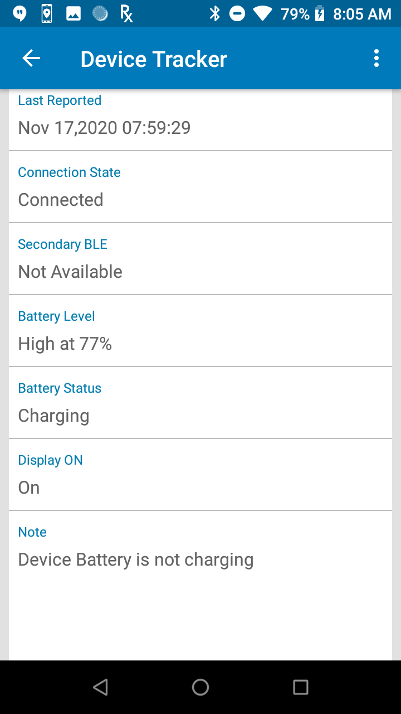
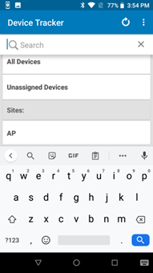

## Overview

Device Tracker is a role-based solution in which administrators and managers possess additional features and functionality.

<!-- -->
-----

## Administrator/Manager Login

Administrators and managers are required to login to view and perform actions based on their respective role. Device Tracker supports a single session for each user login and does not support multiple login sessions. If an admin/manager logs in to multiple browser sessions or devices using the same user login, the login sessions are automatically terminated after a period of time.

To login as administrator or manager:

1. Launch the Device Tracker app.
2. If the Check-out feature is enabled, scan a barcode to check-out the device.
3. Tap the options menu at the top right and select **Admin/Manager Login.**
4. Enter the administrator/manager login credentials or scan the barcodes for the username and password.
5. Perform the required tasks.
6. Logout when complete. Tap the options menu at the top right and select **Admin/Manager Logout.**

After logging in as <i>administrator</i> on the device, tap on the top right option menu and select one of the following:

* **Admin/Manager Logout –** logs out the administrator or manager.
* **Settings –** displays information and options:
        * **Import Access Points/Sites/Devices -** import access point, site and device data to aid in locating devices. See [Site, Access Point, and Device Data](../config/#siteaccesspointanddevicedata).
        * **Device Friendly Name –** displays the friendly name assigned to the device. 
        * **Site Name –** displays the friendly name assigned to the site location.

<!-- -->
-----

## Reset Password

Passwords can be reset through the web portal or the client app.

Steps to reset the password in the client app:

1. In the Admin/Manager Login screen, tap **Forgot your password.**
2. When prompted, enter your email address then click **Reset Password.**
3. A message appears indicating a password reset email is sent.
4. Open the email and click on the link.
5. Enter in the new password in the password reset page.
6. The password is reset with the new password.

<!-- -->
-----

## Administration

Administrators and managers have additional capability to view data:

* **Site List –** administrator access only; lists the sites in the organization
* **Dashboard –** administrator and manager access; lists a summary showing metrics based on device tracker and device status
* **Device List –** administrator and manager access; lists devices with capability to view device details 
<!-- -->
Administrator or manager login is required to access the data.
 

### Site List

After administrator login, a site listing is visible for site selection:

* **All Devices –** when selected, displays the dashboard of all devices (whether assigned or not assigned to a site) across all sites
* **Unassigned Devices –** when selected, displays the dashboard of devices that are not assigned to a site.
* **Sites -** lists all the sites across the entire organization. Select an individual site to display the dashboard for the particular site.
 
<!-- -->

<i>Site list</i>
 
<!-- -->

### Dashboard

The dashboard is accessible to administrators and managers, displaying device categories based on device status, along with statistics for each category. For administrators, the dashboard can be displayed for any site selected in the site list, including All Devices (across all sites) or Unassigned Devices. For managers, the dashboard displays information based on the site their device is assigned to. If the manager device is not assigned to a particular site, the dashboard displays information based on all unassigned devices.

Dashboard categories:

* **Total Devices –** displays the total number of devices being tracked within the particular site. If **All Devices** is selected instead of a particular site, the total number of devices reflects the devices across all sites. If **Unassigned Devices** is selected, the total number of devices reflects the devices that are not assigned to any site.  
  <!-- -->

Device status:

* **To Be Found –** filters devices designated To Be Found where action has not been taken to initiate the search for these devices.
* **Being Found –** filters devices that are actively being searched. Triggered when a user initiates a device search.
* **Found –** filters devices that were successfully found after a search. Triggered when a user indicates the device is found.
* **Cannot Find –** filters devices that could not be found after a search was conducted.
* **Decommissioned –** filters devices that are designated as decommissioned. These devices are not in the active device pool, the collection of devices with active server communication.
* **Unlicensed -** the device is not allocated with a license, therefore the app will not operate.
 

Device battery states:

* **Low Battery –** filters devices that have reached the low power threshold of 15% remaining battery or lower, requiring attention to be charged prior to battery depletion.
* **Charging –** filters devices that are powered on and in the charging state.
* **Discharging –** filters devices that are powered on and discharging.
 

Device connection states:

* **Never Connected –** filters devices that are registered but never connected to the server.
* **Disconnected –** filters devices that have connected to the server but are no longer connected due to no communication with the server for approximately 12 minutes.
 
<!-- -->

<i>Dashboard</i>
 
<!-- -->

**Note:** In split-screen mode, when the dashboard is displayed in Device Tracker and the app is not in focus, the app displays a blank screen. When Device Tracker is back in focus, the dashboard is displayed as expected.
 

### Device List

The device list displays all devices corresponding to the selected category in the dashboard. In the dashboard screen, select a category in the list to view the corresponding list of devices. The search result is limited to display 100 records. If this limit is exceeded, a message is displayed below the device list indicating that there are additional records and the search should be refined to avoid exceeding the limit.  

Each individual device is displayed as a “device card” that shows information pertaining to that particular device:

* Device friendly name (if not available, the device model and serial number is displayed)
* Device model and serial number
* AP friendly name (if available) or BSSID - **Never Connected** is displayed if device has never connected to the server. The icon indicates the connectivity state to the access point. A WiFi icon with a slash indicates the device is not connected to the AP.
* Device status:
        * **In Service –** device is part of the active device pool and not in any of the other device states
        * **To Be Found –** the administrator or manager tagged the device, waiting for a user to take action to find the device
        * **Finding –** the device search is initiated by another user
        * **Found –** the device is located after conducting the search
        * **Cannot Find –** the device could not be found after the search was conducted
        * **Decommissioned –** device is removed from the active device pool
        * **Unlicensed -** the device is not allocated with a license, therefore the app will not operate.
- Top right icon indicates device battery level or charging state.
 
<!-- -->

<i>Device list from <b>All Devices</b></i>
 
<!-- -->
Tap and hold on any device card to display the available device actions:

* **View Details –** displays the Device Details screen, see below.
* **Add a Note –** enter text to capture comments specific to the device that could be helpful in tracking. For example, when a device is decommissioned a note can be added as follows: “Battery does not charge, needs to be replaced”.
* **Start Finding –** begins the device search process. Refer to [Find a Device](../use/#findadevice). This is visible only if the device is marked "To Be Found".
* **Recommission –** places a device from the decommissioned state back to the **In Service** state as part of the active device pool.
* **Decommission –** removes the device from the active device pool and places it out-of-service. This can be used when a device is undergoing repair or is deprecated and no longer in use.
<!-- -->

<i>Device action menu</i><!-- -->
  

#### Device Details

Tap on any device card to display the **Device Details** screen:

* **Device Status:**
        * **In Service –** device is part of the active device pool and not in any of the other device states
        * **To Be Found –** the administrator or manager tagged the device, waiting for a user to take action to find the device
        * **Finding –** the device search is initiated by another user
        * **Found –** the device is located after conducting the search
        * **Cannot Find –** the device could not be found after the search was conducted
        * **Decommissioned –** the device is removed from the active device pool
        * **Unlicensed -** the device is not allocated with a license, therefore the app will not operate.
* **Friendly name –** the assigned friendly device name as registered by the administrator
* **Device Model –** the model of the device
* **Serial Number –** the serial number of the device
* **License State:** 
        * **Licensed -** device is allocated with a license
        * **Unlicensed -** the device is not allocated with a license, therefore the app will not operate.
* **Site Name –** displays the assigned friendly name for the site as registered by the administrator. If no value assigned, it is blank.
* **Last Connected AP –** displays the AP the device was last connected to, which aids in identifying the device location
* **Last Reported –** displays the time stamp of the last time the device reported to the server
* **Connection State:**
        * **Never connected –** the device has never connected to the server
        * **Connected –** the device is connected to the server
        * **Disconnected –** the device previously connected to the server and is now disconnected due to no communication with the server for approximately 12 minutes.
* **Secondary BLE:** identifies the state of the [secondary BLE beacon](../config/#secondaryble):
        * **Enabled -** the device has a secondary BLE beacon and beaconing is enabled. When the device loses power, the secondary BLE continues to transmit beacons to aid in locating the device. 
        * **Disabled -** the device has a secondary BLE beacon and beaconing is disabled
        * **Not Available -** the device does not have a secondary BLE beacon
* **Battery Level –** displays the battery level (high, medium, or low) along with the percent (%) of battery remaining:
        * **High –** indicates the remaining battery is greater than 66%
        * **Medium –** indicates the remaining battery is within the range 15% to 66%
        * **Low –** indicates the remaining battery is less than or equal to 15%
* **Battery Status:**
        * **Charging –** the device is charging while plugged to a power source
        * **Not Charging –** device is not plugged to a power source

* **Display On –** displays “true” or “false”. If true, it indicates the device display is on and the device may be in active use. If false, it indicates the device display is off, indicating the device is not in active use.
* **Note –** text entered by an administrator or manager capturing information specific to the device.
<table>
  <tr>
   <td>
     
   </td> 
   <td> &nbsp; &nbsp; &nbsp;
   </td>
   <td>
     
   </td>
  </tr>
</table>
<i>Device details information</i>

<!-- -->
-----

## Device/Site Search

Two types of searches can be performed:

1. Search by site
2. Search by device

### Search By Site

A site search performs a partial search for the characters entered in the search field. The search results display matches that include the characters being searched for within the site name. 
To perform a site search:

<!-- -->

1. From the main site list, tap the search icon at the top.
   <i>Site list with search</i>

2. Enter the text to search in the field then tap the search icon in the virtual keyboard to start the search.
   <i>Site search field</i>

3. The search results are listed in the **Sites** section. The results include site names that contain the text entered. The search is not case sensitive.
 

### Search by Device

A device search returns a list of devices that match the keyword entered based on the criteria selected: device friendly name, device model, serial number, or AP friendly name. The search result is limited to display 100 records. If this limit is exceeded, a message is displayed below the device list indicating that there are additional records and the search should be refined to avoid exceeding the limit.
 
To perform a device search:

1. Tap the search icon located in the lower right of the device list.
2. Select the type of search to be conducted, whether based on the device friendly name, device model, serial number, AP friendly name or check-out (if check-out is enabled). Enter the text to conduct a search. The search is case-sensitive.  
   <i>Device search</i>

3. Tap Search.
4. The search results return matches that begin with the text entered in the search field corresponding with the type of search conducted.

  

<!-- -->
-----

## See Also

* [User Roles](../roles)
* [Install](../setup)
* [Configuration](../config)
* [Device Tracking](../use)