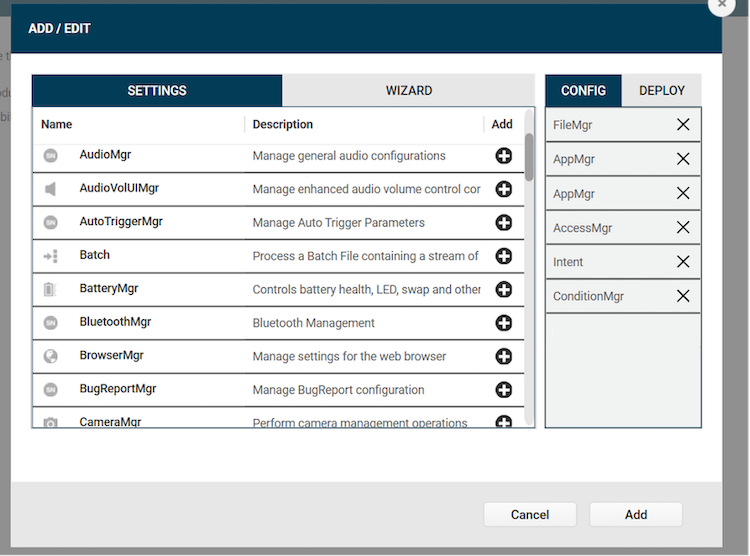

## Overview

This section discusses installation and setup of Device Tracker. The client app (APK file) can be downloaded from the [Zebra support portal](https://www.zebra.com/us/en/products/software/mobile-computers/device-tracker.html). Zebra’s [StageNow](/stagenow/latest/about) tool or an EMM can be used for deployment to the mobile devices. 

<b>Installation and setup on the device:</b>

1. **Install client APK file** and ensure all permissions are granted.
2. **Disable battery optimization** to permit the app to continue running in the background during doze mode (Android’s power-saving feature triggered when the device is in a prolonged suspended state).
3. **Allow overlay permission _(optional)_.** If the [Device Check-out](../use/#devicecheckout) feature is required to prevent users from accessing the device prior to scanning their unique user barcode, automatically allow the overlay permission to avoid manual intervention during setup.
4. **Launch the app** by starting the app service.
5. **Deploy server settings** to communicate with the cloud server.
6. **Enable secondary BLE beacon**, if supported by the device, for the device to be located when powered off. 

 

Execute steps 1 to 4 by creating a <a href="#installationprofile">StageNow installation profile</a>.  
Execute step 5 by creating a <a href="#serverconnectivityprofile">StageNow server connectivity profile.</a> 
Execute step 6 by creating a <a href="#bleprofile">StageNow BLE profile.</a>

<!-- -->
-----

## Requirements

See [Requirements](../about/#requirements).

<!-- -->
-----

## StageNow Profiles

This section provides procedures to create three separate StageNow profiles for deployment: installation, server connectivity and BLE. Zebra’s [StageNow](/stagenow/latest/about) tool or an EMM can be used for device deployment. StageNow version 4.2 or higher is required if automatically bypassing the overlay permission for the optional [Check-out](../config/#devicecheck-out) feature. See [Zebra downloads](https://www.zebra.com/us/en/support-downloads/software/utilities/stagenow.html) for the StageNow install file.

### Installation Profile

Create a StageNow installation profile to install and setup the Device Tracker client as described in the [overview](./#overview). If using the [Device Check-out](../use/#devicecheckout) feature, before proceeding follow [Extract Client App Certificate](./#extractclientappcertificate), a prerequisite to automatically allow the overlay permission.
<!-- 
Create a StageNow installation profile to perform the following: 

&nbsp;&nbsp;&nbsp;&nbsp;&nbsp;A. **Install the Device Tracker client APK file.** 
&nbsp;&nbsp;&nbsp;&nbsp;&nbsp;B. **Disable battery optimization** to permit the client app to continue running in the background even while the system is in doze mode while in long suspended state. 
&nbsp;&nbsp;&nbsp;&nbsp;&nbsp;C. _[Optional]_ If using the **Check-out feature** to enforce users to scan their unique barcode prior to accessing the device, automatically allow the overlay permission for device check-out without manual intervention.  
&nbsp;&nbsp;&nbsp;&nbsp;&nbsp;D. **Start the app** via the Device Tracker service. 
&nbsp;&nbsp;&nbsp;&nbsp;&nbsp;E. **Add a delay** (minimum of 5 seconds) to allow time for the app to be ready to accept the configurations before executing the StageNow server connectivity profile.   

For part C, the client app certificate must be extracted. Perform the steps in section **Extract Client App Certificate** below before proceeding.
-->

To create a StageNow installation profile:

1. Open [StageNow](https://www.zebra.com/us/en/support-downloads/software/utilities/stagenow.html) on a host computer.
2. In the StageNow home screen, click **Create New Profile** from the left menu.
3. Ensure MX version 8.0 or higher is selected at the top drop-down selector. The MX version on the device should match this or higher. See [MX documentation](/mx/mx-version-on-device/) for instructions how to check the version. If automatically bypassing the overlay permission for Check-out, select MX 10.0 or higher.
4. Select **Xpert Mode** from the list and click **Create.**
   <i>Wizard selection</i>

5. Enter the profile name. Click **Start.**
6. If using StageNow to copy the install file to the device, scroll down and click the plus (+) sign next to **FileMgr.** This adds FileMgr to the Config tab on the right side.
7. Scroll to **AppMgr** and click the plus (+) sign next to it. This adds AppMgr to the Config tab on the right side.
8. Repeat step 7 again. AppMgr is listed twice in the Config tab.
9. If automatically bypassing the screen overlay permission, scroll to **AccessMgr** and click the plus (+) sign next to it. This adds AccessMgr to the Config tab on the right side.
10. Scroll to **Intent** and click the plus (+) sign next to it. This adds Intent to the Config tab on the right side.
11. _If using EMM for device deployment, skip this step and proceed to step 13._ Scroll to find **ConditionMgr** and click the plus (+) sign next to it. This adds ConditionMgr to the Config tab on the right side.
    <i>Installation profile - config settings</i>

12. Click **Add.**
13. _If using StageNow to copy the install file to the device, proceed with this step. Otherwise, skip to step 14._ 
    _StageNow Config 1_ - Copy the install file to the device with FileMgr. In the **FileMgr** screen under the **Create New Setting** tab, select and enter the desired options to install the APK, for example: 
    &nbsp;&nbsp;&nbsp;&nbsp;&nbsp;• **File Action:** Transfer/Copy File 
    &nbsp;&nbsp;&nbsp;&nbsp;&nbsp;• **Target Access Method:** File in the device file system 
    &nbsp;&nbsp;&nbsp;&nbsp;&nbsp;• **Target Path and File Name:** [enter file path] 
    &nbsp;&nbsp;&nbsp;&nbsp;&nbsp;• **Source Access Method:** [select applicable method] 
    &nbsp;&nbsp;&nbsp;&nbsp;&nbsp;• **Source File URI:** [enter information prompted] 
    Click **Continue.**
14. _StageNow Config 2_ – Install the client app. For the first **AppMgr,** select the following: 
    &nbsp;&nbsp;&nbsp;&nbsp;&nbsp;• **Action:** Install 
    Enter/select the desired options for the remaining fields. Click **Continue.**
15. _StageNow Config 3_ – Battery Optimization. For the second **AppMgr,** enter/select the following: 
    &nbsp;&nbsp;&nbsp;&nbsp;&nbsp;• **Action:** Application for Battery Optimization 
    &nbsp;&nbsp;&nbsp;&nbsp;&nbsp;• **Remove Application for Battery Optimization:** com.zebra.devicetrackercloud 
    Click **Continue.**
16. _StageNow Config 4_ – Grant overlay permission. For **AccessMgr,** enter the following: 
    &nbsp;&nbsp;&nbsp;&nbsp;&nbsp;• **Permission Access Action:** Grant Permission to an Application 
    &nbsp;&nbsp;&nbsp;&nbsp;&nbsp;• **Permission Name:** System Alert Window 
    &nbsp;&nbsp;&nbsp;&nbsp;&nbsp;• **Application Package Name:** com.zebra.devicetrackercloud 
    &nbsp;&nbsp;&nbsp;&nbsp;&nbsp;• **Application Signature:** [path of certificate file extracted (see <b>Extract Client App Certificate</b> below)] 
17. _StageNow Config 5_ – Launch NGDTCspService with an intent. For **Intent,** enter/select the following: 
    &nbsp;&nbsp;&nbsp;&nbsp;&nbsp;• **Action:** StartService 
    &nbsp;&nbsp;&nbsp;&nbsp;&nbsp;• **Android Action Name:** com.zebra.devicetrackercloud.csp.NGDTCspService 
    &nbsp;&nbsp;&nbsp;&nbsp;&nbsp;• **Package Name:** com.zebra.devicetrackercloud 
    &nbsp;&nbsp;&nbsp;&nbsp;&nbsp;• **Class Name:** com.zebra.devicetrackercloud.csp.NGDTCspService 
    Click **Continue.**
18. _If using EMM for device deployment, skip this step and proceed to step 19._ 
_StageNow Config 6_ – Add a delay for the app to be ready to accept configurations. In the **ConditionMgr** screen under the “Create New Setting” tab, enter/select the following:  
    &nbsp;&nbsp;&nbsp;&nbsp;&nbsp;• **Data Type:** Integer 
    &nbsp;&nbsp;&nbsp;&nbsp;&nbsp;• **Integer System Value:** Battery Level 
    &nbsp;&nbsp;&nbsp;&nbsp;&nbsp;• **Integer Condition Test:** Equal-to a Constant Integer 
    &nbsp;&nbsp;&nbsp;&nbsp;&nbsp;• **Integer Constant Value:** 0 
    &nbsp;&nbsp;&nbsp;&nbsp;&nbsp;• **Condition Met Action:** Success 
    &nbsp;&nbsp;&nbsp;&nbsp;&nbsp;• **Condition Not Met Action:** Retry 
    &nbsp;&nbsp;&nbsp;&nbsp;&nbsp;• **Condition Repeat Count:** 5 
    &nbsp;&nbsp;&nbsp;&nbsp;&nbsp;• **Condition Repeat Interval:** 1 
    &nbsp;&nbsp;&nbsp;&nbsp;&nbsp;• **Condition Fail Message:** [enter message text] 
    &nbsp;&nbsp;&nbsp;&nbsp;&nbsp;• **Suppress the error message:** enable 
    This sets the condition such that if the battery level is not 0, it retries 5 times with an interval of 1 second for each retry. The end result is a 5 second delay.
19. Click **Complete Profiles.** Profile creation is complete.
20. Continue to [Device Deployment](#devicedeployment) section.
 
 
<!-- 
- Device Owner mode – use [OEMConfig](/oemconfig) to configure the app
- Device Administrator mode – use [MX](/mx/overview/) to configure the app -->

#### Extract Client App Certificate

If using the [Device Check-out](../use/#devicecheckout) feature, the Device Tracker certificate must be extracted as a pre-requisite to creating the StageNow installation profile in order to automatically grant the screen overlay permission. This prevents the screen overlay detected warning from appearing to the end user.

Steps to extract the client app certificate:

1.  Download SigTools.jar from [Zebra’s App Signature Tools](https://techdocs.zebra.com/emdk-for-android/latest/samples/sigtools/).
2.  Follow the instructions provided from the link to extract the certificate from Device Tracker’s APK file using command: 

`java -jar SigTools.jar GetCert -INFORM APK -OUTFORM DER -IN [filename.apk] -OUTFILE [filename.crt]`
 
where _[filename.apk]_ is the full path and file name of the Device Tracker APK install file and _[filename.crt]_ is the designated certificate file name. The file extensions should be preserved in both file names. 
3. The certificate file is extracted as the CRT file.
The certificate file is needed to create the StageNow Installation Profile.
  

### Server Connectivity Profile

Create a StageNow server connectivity profile to apply server settings in the app client for it to communicate with the server. The server configuration XML file is required, supplied by Zebra.

Steps to create a StageNow server connectivity profile:

1. Open [StageNow](https://www.zebra.com/us/en/support-downloads/software/utilities/stagenow.html) on a host computer.
2. In the StageNow home screen, click **Create New Profile** from the left menu.
3. Ensure the proper MX version is selected at the top drop-down selector. This should match the MX version on the device. See [MX documentation](/mx/mx-version-on-device/) for instructions how to check the version. Select **Xpert Mode** from the list and click **Create.**
   <i>Wizard selection</i>

4. Enter the profile name. Click **Start.**
5. Find **Batch** and click the plus (+) sign next to it. This adds **Batch** to the Config tab on the right side.
   <i>Server connectivity profile - config setting</i>

6. Click **Add.** In the Batch screen, select the following: 
   &nbsp;&nbsp;&nbsp;&nbsp;&nbsp;• **Batch Action:** Execute Batch 
   &nbsp;&nbsp;&nbsp;&nbsp;&nbsp;• **Batch File Type:** XML File 
   &nbsp;&nbsp;&nbsp;&nbsp;&nbsp;• **Batch File Access Method:** File embedded in XML 
   &nbsp;&nbsp;&nbsp;&nbsp;&nbsp;• **XML File Data:** [browse to the server configuration XML file supplied from Zebra services] 
7. Click **Continue.**
8. Click **Complete Profiles.**  
9. Continue to [Device Deployment](#devicedeployment) section.

<b>Note:</b> If an enterprise reset is performed on the device, the server settings must be re-applied for communication with the server.

 

### BLE Profile

Create a StageNow profile to enable the secondary BLE beacon, if supported by the device, so the device can be located when powered off. 

To create the BLE profile:

1. Open [StageNow](https://www.zebra.com/us/en/support-downloads/software/utilities/stagenow.html) on a host computer.
2. In the StageNow home screen, click **Create New Profile** from the left menu.
3. Ensure the proper MX version, MX 10.2 or higher, is selected at the top drop-down selector. See [MX documentation](/mx/mx-version-on-device/) for instructions how to check the version. Select **Xpert Mode** from the list and click **Create.**
   <i>Wizard selection</i>

4. Enter the profile name. Click **Start.**
5. Find **BeaconMgr** and click the plus (+) sign next to it. This adds **BeaconMgr** to the Config tab on the right side.
   <i>Add config setting</i>

6. Click **Add.** In the BeaconMgr screen, select the following: 
   &nbsp;&nbsp;&nbsp;&nbsp;&nbsp;• **Beaconing:** Turn ON 
   &nbsp;&nbsp;&nbsp;&nbsp;&nbsp;• **Beaconing in Airplane Mode:** Turn ON 
   &nbsp;&nbsp;&nbsp;&nbsp;&nbsp;• **Beacon type:** AltBeacon 
   &nbsp;&nbsp;&nbsp;&nbsp;&nbsp;• **Explicit Beacon UUID?:** [uncheck checkbox] 
   &nbsp;&nbsp;&nbsp;&nbsp;&nbsp;• **AltBeacon ID1:** EBEB 
   &nbsp;&nbsp;&nbsp;&nbsp;&nbsp;• **AltBeacon ID2:** ECDD 
   &nbsp;&nbsp;&nbsp;&nbsp;&nbsp;• **Transmission (Tx) Power Level:** High (1 dBm) 
   &nbsp;&nbsp;&nbsp;&nbsp;&nbsp;• **Transmission (Tx) Interval:** Low Latency (100 ms) 
7. Click **Continue.**
8. Click **Complete Profiles.**  
9. Continue to [Device Deployment](#devicedeployment) section. Ensure devices are connected to the network and <i>can connect to the server for at least 5 minutes</i> during the intial setup.

See <a href="/mx/beaconmgr/">Beacon Manager CSP documentation</a> for more information.

<!-- -->
-----

## Device Deployment

The device must be connected to the network during deployment. After creating the StageNow profiles, use one of the following methods based on the desired tool for device deployment:

* **StageNow:** Generate the barcode from the StageNow profile. Open StageNow client on the device and scan the barcode(s) generated from the installation, configuration and/or BLE profile. 
* **EMM:** Export each StageNow XML file from the StageNow installation, connection and BLE profiles. Do not edit the XML file - it can cause unexpected behavior. Send the XML using either [OEMConfig](/oemconfig) or [MX](/mx/overview/) to configure the app and grant all required permissions. The installation profile and server connectivity profile XML files must be used separately.
 

After deploying the installation and server connectivity profiles, reboot the device. Once the app is started on Android O or higher devices, a Device Tracker notification message is displayed in the device notification drawer. This notification cannot be dismissed, indicating that Device Tracker is running in the background.

<!-- -->
-----

## See Also

* [User Roles](../roles)
* [Configuration](../config)
* [License](../license)
* [Device Management](../mgmt)
* [Device Tracking](../use)
