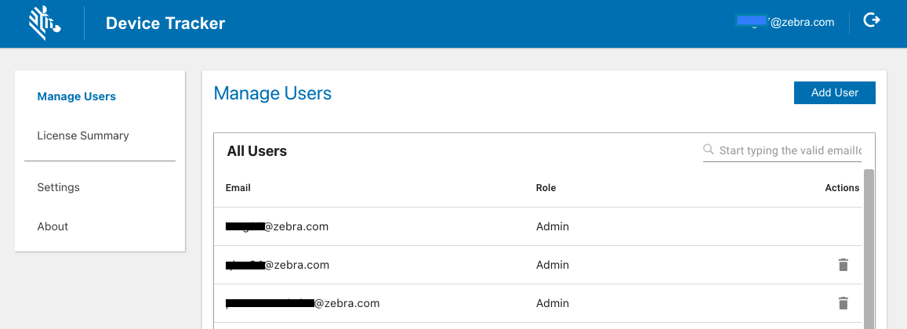
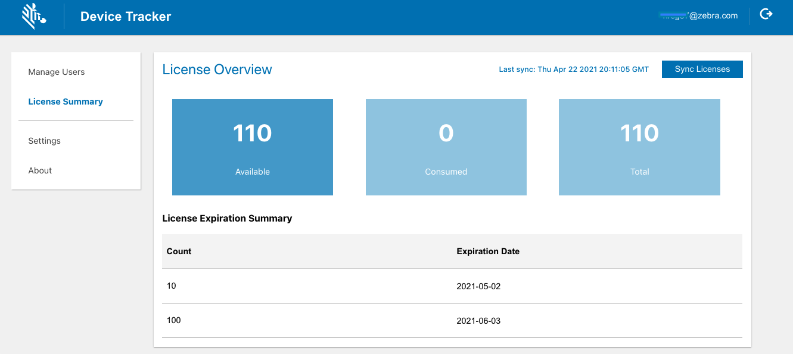

## Overview

This section discusses the configuration settings for Device Tracker (some content is already discussed in the [Setup](../config) section, for which links are provided): 

- **[Register access points](../config/#siteaccesspointanddevicedata) -** Register the access point location to identify which AP the device is connected to and to aid in locating the device (from **Setup** section).
  - **Assign a friendly name to the access point -** helps users identify the physical location of the AP in the site
  - **Assign site location –** helps users identify which site the AP belongs in
- **[Register devices](../config/#siteaccesspointanddevicedata) -** Register device information to identify the devices (from **Setup** section).
  - **Assign a device friendly name -** helps users identify the device
  - **Assign a site location -** identifies the physical location of the device
- **[Enable/Disable secondary BLE beacon](../config/#secondaryble) -** Allow devices with a secondary BLE beacon to be located when the device loses power (from **Setup** section).
- **[Enable/Disable device check-out](#devicecheckout) –** _Optional:_ Administrators toggle the check-out feature in the web portal, enforcing users to scan their user barcode at the beginning of their work shift to check-out their device. This associates the device to the particular user.
    - **[Set check-out barcode prefix](#devicecheckout) -** Specify a prefix for the barcode scanned during check-out. This adds the restriction to only accept scanned barcodes that begin with the specified prefix.

Administrators have access to the [web portal](#webportal) to:
  - Enable/Disable device check-out
  - Add/Delete administrators and managers
  - Search users
  - Reset passwords
  - View license information

For the convenience of administrators, logging can be captured for diagnostic purposes, as detailed in the [Diagnostics](#diagnostics) section.

---

## Web Portal

In the web portal, administrators can enable features, create and manage users, and view license information.

To access the web portal, in a supported browser enter the URL shared by Zebra. For first-time use, login with the super administrator (SuperAdmin) credentials provided by Zebra.

Supported browsers:

- Chrome
- Edge
- Safari (v14.0 and later)

_Device Tracker web portal_

### Device Check-out

Device check-out is an _optional_ feature that maintains user accountability and traces device use. When enabled, a unique barcode is required for each user to scan at the start of their work shift. User operation in the check-out screen is limited to only scanning barcodes. The check-out screen is in kiosk mode, preventing the user from accessing the device until check-out is performed.

- **Check-out:** At the start of a work shift, the user checks-out the device by scanning their unique barcode. This associates the user with the device, as seen in the device card and device details screen.
- **Check-in:** At the end of a work shift, the user checks-in the device by placing it on a powered cradle or logging out through the top-right menu from the main device screen. After check-in, the user is no longer associated with the device.
 

The check-out/check-in feature displays an overlay on top of the screen to enforce the user to scan their unique barcode, maintaining user accountability of the device. If any other app also uses a screen overlay, the check-out/check-in feature may conflict with the other app. For example, this feature cannot be used with Zebra’s MotionWorks Proximity application.

**Enable device check-out:**

1. From the web portal, tap **Settings** in the left menu.
2. Toggle **Checkin/Checkout** to enable the feature.

If enabled, Checkout appears as a device state in the administrator and manager dashboard listing the devices that are checked-out.

#### Set Check-out Barcode Prefix

When check-out is enabled, by default no prefix is defined allowing all barcodes to be accepted. The administrator can configure a prefix in the form of a character string, adding a restriction to accept only barcodes that begin with the specified prefix. If a barcode scanned does not contain the prefix, check-out is not successful.
 
When generating a barcode with the prefix, the specified prefix is followed by the username identifier. The following is a sample barcode containing prefix “NGDTRK-” and username “JohnDoe”:

_Sample barcode with prefix and username: "NGDTRK-JohnDoe"_
 

**To set the barcode prefix:**

1. **Enable Checkin/Checkout the web portal.** This exposes the Prefix field in the Application Configuration screen.
2. **Enter the desired text for the prefix.** If all barcodes should be accepted with no prefix, keep the entry blank.
    
   Only barcodes that begin with the specified prefix can initiate the checkout.

### Add User

To add a user:

1. From the web portal, tap **Manage Users** in the left menu.
2. Select the role of the new user: Admin or Manager
3. Enter the information prompted, including the email and password based on the following guidelines:
    * **Login ID guidelines:** 
        * Must be a valid email
        * Maximum length: 255 characters
        * Special characters allowed prior to '@': `! ~ # $ % ^ & * - _ + = {} | ' / ?`
        * Characters allowed after '@': `. -`
        * Spaces are not allowed
        * '@' character is only allowed once
        * '.' is only allowed in the middle of alphanumeric characters before and after '@'.
    * **Password guidelines:**
        * Minimum length: 6 characters
        * Any combination of letters, numbers and symbols (ASCII-standard characters) are accepted

4. Tap **Add User.**
5. The new user is added to the **All Users** list.
    

### Delete User

To delete a user:

1. From the web portal, tap **Manage Users** in the left menu.
2. From the list of users, locate the user to delete and click on the _delete icon_ next to the user.
3. Click **OK** in the confirmation message.
    

### Search for User

User names can be searched by email address. The entire email address must be entered. Action can be taken on the user after the search is performed, e.g. delete user.

To search for a user:

1. From the web portal, tap **Manager Users** in the left menu.
2. Enter the email address to search for in the search field located below the **Add User** button from the top right of the page. Press the enter key.
3. The search results are displayed.
    

### Reset Password

The password can be reset through the web portal or the client app if the administrator or manager forgot the password.

Steps to reset the password in the web portal:

1. From the web portal login page, click **Forgot your password.**
2. Enter your email address then click **Reset Password.**
3. A message appears indicating a password reset email is sent.
4. Open the email and click on the link.
5. Enter in the new password based on the following guidelines:
    * Minimum length: 6 characters
    * Any combination of letters, numbers and symbols (ASCII-standard characters) are accepted.
6. The password is reset with the new password.
    
<!--
### View License Information

[Licenses](../license) are required for Device Tracker operation on devices. Licenses are combined into a single license pool regardless of expiration date. When a device registers to the Device Tracker server, if a license available, it is allocated to the device from the license pool.

To view license information:

1. From the web portal, tap **License Summary** in the left menu.
2. The following information is provided based on unexpired licenses:
   - **Total licenses -** quantity of licenses that have been purchased
     - **Total licenses available -** quantity of licenses that are available and can be allocated to devices
     - **Total licenses consumed -** quantity of licenses allocated to devices
   - **List of licenses purchased** with corresponding quantity and expiration date. This data is static and removed from the list after the expiration date is surpassed.
   - **Sync Licenses** button to refresh license data on-demand and synchronize with the Zebra Enterprise Software Licensing system. The license information is updated once each day.
   - **Time stamp** of the last occurrence when the license information was synchronized with the license server.

_License Summary in Device Tracker web portal_
-->
---

## Diagnostics

For diagnostic purposes, logging can be enabled in Device Tracker to capture application and system information to Android logcat. [RxLogger](/rxlogger) is a built-in tool on Zebra Android devices that collects data and event logs from logcat and stores them in a single location. If issues are encountered, a Zebra representative may request for the log files to be collected and supplied. There are 2 methods to capture logging: StageNow or EMM (Enterprise Mobility Management) system.

### StageNow

To use StageNow to capture logging:

1. Open StageNow on the device.
2. Scan the barcode to enable Device Tracker logging and start RxLogger log capture:
   

3. Reproduce the issue.
4. Scan the barcode to disable Device Tracker logging and stop RxLogger log capture:
   

Logs are located in the RxLogger folder (default location: /sdcard/RxLogger).

 

### EMM

To use EMM to capture logging, refer to the following XML content:

- To enable logging:

        <wap-provisioningdoc>
            <characteristic version="1.0" type="com.zebra.devicetracker">
                <parm name="EnableLog" value="1" />
            </characteristic>
        </wap-provisioningdoc>

- To disable logging:

        <wap-provisioningdoc>
            <characteristic version="1.0" type="com.zebra.devicetracker">
                <parm name="EnableLog" value="0" />
            </characteristic>
        </wap-provisioningdoc>

Send the desired XML content to the EMM using either [OEMConfig](/oemconfig) or [MX](/mx/overview) to configure the app.
  

---

## See Also

- [User Roles](../roles)
- [Install](../setup)
- [Device Management](../mgmt)
- [Device Tracking](../use)
