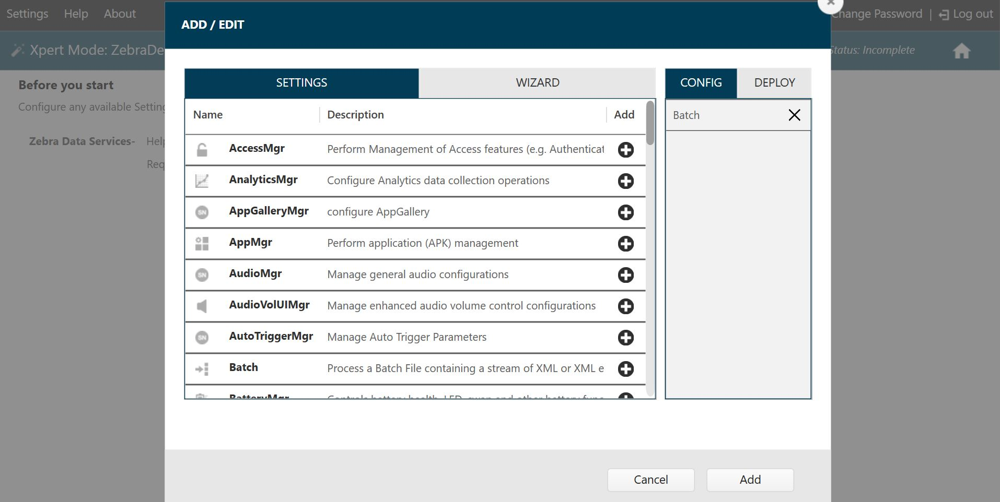

## Overview

Device Tracker can be installed using one of the following methods:
* **[Manual Installation](#manualinstallation) -** manually install the client app on the device, accept all permissions when granted and configure the server connection.
* **Automated Installation -** create profiles that remotely install the client app on the device, automatically grant all permissions during install, configure the server connection and enable secondary BLE (optional); can be employed for mass deployment to multiple devices. Use one of the following tools:
    * Using **Zebra's [StageNow](#usingstagenow) -** a tool used to stage, setup and mass-deploy Zebra Android mobile computers.
    * Using an **[Enterprise Mobility Management (EMM)](#usingemm) system**

[Requirements](#requirements) must be met prior to installation. If needed, contact Zebra services for access to Device Tracker cloud and licenses prior to installation.

After installation is complete, proceed to the [Configuration](../config) section to setup and configure Device Tracker for initial use.

---

## Requirements

### Device Requirements

Requirements for Device Tracker client on the device:

- **Supported Devices -** See compatible devices table on the [Zebra support portal](https://www.zebra.com/us/en/support-downloads/software/productivity-apps/device-tracker.html).
- **Operating System -** Only supported on select Android Oreo and Android 10 GMS devices. See [Zebra support portal](https://www.zebra.com/us/en/support-downloads/software/productivity-apps/device-tracker.html) for compatible devices.
- **Bluetooth** must be enabled to find devices using the visual proximity indicator. Zebra provides a tool, [StageNow](/stagenow), for EMMs to configure the device remotely to enable Bluetooth.
- **WiFi** must be enabled and connected to the network to communicate with the server. Zebra's [StageNow](/stagenow) tool used with [Wi-Fi Manager](/mx/wifi) allows EMMs to configure the device remotely to enable WiFi.
- **Location** services must be enabled on all devices to find devices using the Bluetooth-based proximity indicator.
- **Secondary BLE** device support to locate device if it loses battery power or if it is powered off.
- Device **[licenses](../license)** are required for Device Tracker to operate. Contact a [Zebra reseller](../license/#icontactareseller) to procure licenses.

### Network Requirements

The network requirements for communication between the device client app and the cloud server are:

- **Open HTTPS port for communication** between the Device Tracker client and Device Tracker cloud. Port 443 is normally used for all HTTPS communication by default, but this may vary based on network configuration. 
- The following **domains must be allowed through the firewall or proxy.** 
    Domain names accessed by device:

    * `*.google.com` (Required for Android to check internet connectivity.)
    * `connectivitycheck.gstatic.com` (Required for Android to check internet connectivity.)
    * `*.googleapis.com` (Required for Device Tracker to authenticate device communication and connect with the cloud server.)
    * `*.firebaseio.com` (Required for Device Tracker to access the cloud database.)
    * `*.cloudfunctions.net` (Required for Device Tracker to access the cloud server.)
    * `[ProjectID].firebaseapp.com` (Required for accessing password reset link, where `[ProjectID]` is supplied by Zebra during onboarding.)
    

    Domain name accessed by the admin on a PC:
    * Web portal - supplied by Zebra during onboarding.
   

If the firewall or proxy does not support wildcards, add the following domains to the allow list:

- `www.google.com` (Required for Android to check internet connectivity.)
- `connectivitycheck.gstatic.com` (Required for Android to check internet connectivity.)
- `www.googleapis.com` (Required for Device Tracker to authenticate device communication with the cloud server.)
- `firestore.googleapis.com` (Required for Device Tracker to access the cloud database.)
- `cloudfunctions.googleapis.com` (Required for Device Tracker to connect with the cloud server.)
- `us-central1-[ProjectID].cloudfunctions.net` (Required for Device Tracker to connect with the cloud server, where `[ProjectID]` is supplied by Zebra during onboarding.)
- `[ProjectID].firebaseio.com` (Required for Device Tracker to access the cloud database, where `[ProjectID]` is supplied by Zebra during onboarding.)
- `[ProjectID]-default-rtdb.firebaseio.com` (Required for Device Tracker to access the cloud database, where `[ProjectID]` is supplied by Zebra during onboarding.)
- `s-usc1c-nss-*.firebaseio.com` (Required for Device Tracker to access the cloud database, where `*` represents multiple characters. Since `*` can change over time, the firewall needs to allow any domain with this pattern for the app to function.)
- `[ProjectID].firebaseapp.com` (Required for accessing password reset link, where `[ProjectID]` is supplied by Zebra during onboarding.)

If the password is reset, an email is sent from `zdtrksupport@zebra.com`.

### Web Portal Requirements

The web portal allows adminstrators to configure application behavior, manage users and manage licenses. To access the web portal, in a supported browser enter the URL provided by Zebra. For first-time use, login with the super administrator (SuperAdmin) credentials provided.

The supported browsers are:

* Chrome
* Edge
* Safari (v14.0 and later)

---

## Manual Installation 

The requirements and prerequisites must be met prior to proceeding with the manual installation procedure.

### Prerequisites

Prerequisites for manual installation:
1. **Download the latest .APK file** from the [Zebra support portal](https://www.zebra.com/us/en/support-downloads/software/productivity-apps/device-tracker.html).
2. **Download the server connectivity settings barcode** provided by Zebra during the onboarding process. If not supplied, perform the following:
    * **Download the server connectivity settings XML** file provided by Zebra during the onboarding process. 
    * Create a **server connectivity settings barcode** using StageNow. Follow steps in StageNow [Server Connectivity Profile](#serverconnectivityprofile).
3. _Optional:_ For devices that support secondary BLE, create a **barcode to enable [secondary BLE](../config/#secondaryble)** using StageNow to allow these devices to be located even if powered off. Follow steps in [Secondary BLE Profile](#secondarybleprofile).

### Installation

Manual installation steps to be performed on the device:

1. Connect the device to a WiFi network, ensuring the [network requirements](#networkrequirements) are met to access the Device Tracker cloud.
2. Install the downloaded .APK file.
3. Launch the Device Tracker app. Grant all permissions when prompted.
4. Launch StageNow app and scan the server connectivity settings barcode from the **Prerequisites** section above. 
5. _Optional:_ On supported devices, scan the barcode created to enable secondary BLE so devices can be located when powered off; see step 3 in **Prerequisites**.

---

## Automated Installation

Automated installation allows for installation and configuration on devices without manual intervention. This enables administrators to mass deploy an app and configurations across multiple devices unattended. There are 2 methods for automated installation: StageNow or EMM.

### Using StageNow

For automated installation using Zebra's [StageNow](/stagenow/latest/about) tool,  generate barcodes and scan the barcodes with the StageNow client app on the device per the instructions below. This installs the client app on the device, automatically grants all permissions during install, configures the server connection and enables secondary BLE (optional). 

#### Prerequisites

Prerequisites for automated installation using StageNow:

1. **Download the latest .APK file** from the [Zebra support portal](https://www.zebra.com/us/en/products/software/mobile-computers/device-tracker.html).
2. **Download the app certificate,** (add link with download) needed to create the install profile in step 4.
3. **Download the server connectivity settings barcode** provided by Zebra during the onboarding process. If not supplied, perform the following:
    * **Download the server connectivity settings XML** file provided by Zebra during the onboarding process. 
    * Create a **server connectivity settings barcode** using StageNow. Follow steps in StageNow [Server Connectivity Profile](#serverconnectivityprofile).
4. Create a **barcode to install and setup Device Tracker.** Follow steps in [Install Profile](#installprofile) to:
    * Grant permission for the app to run in the background and track devices.
    * _Optional:_ Grant permission to display the [Device Check-out](../use/#devicecheckout) screen to prevent users from accessing the device prior to scanning their user barcode.
    * Launch app to start tracking.
    * Add a delay to allow time for the changes to be implemented.
5. _Optional:_ For devices that support secondary BLE, create a **barcode to enable [secondary BLE](../config/#secondaryble)** using StageNow to allow these devices to be located even if powered off. Follow steps in [Secondary BLE Profile](#secondarybleprofile).

#### Installation

Steps to install and configure Device Tracker on the device using StageNow:

1. Connect the device to a WiFi network, ensuring the [network requirements](#networkrequirements) are met to access the Device Tracker cloud.
2. Launch StageNow app.
3. Scan the barcode to install and setup Device Tracker; see step 4 in **Prerequisites**. 
4. Scan the barcode to enable the mobile app to communicate with the cloud server; see step 3 in **Prerequisites** . 
5. On supported devices, scan the barcode created to enable secondary BLE so devices can be located when powered off; see step 5 in **Prerequisites**.

### Using EMM

Device Tracker can be remotely installed to devices without manual intervention through an EMM. XML is exported from StageNow profiles to be consumed by the EMM to install the client app on the device, automatically grant all permissions during install, configure the server connection and enable secondary BLE (optional). 

#### Prerequisites

Prerequisites for installation using EMM:

1. **Download the latest .APK file** from the [Zebra support portal](https://www.zebra.com/us/en/products/software/mobile-computers/device-tracker.html).
2. **Download the X,** (add link with download) needed to create the install profile in step 4.
3. **Download the server connectivity settings barcode** provided by Zebra during the onboarding process. If not supplied, perform the following:
    * **Download the server connectivity settings XML** file provided by Zebra during the onboarding process. 
    * **Export XML for server connectivity settings** using StageNow. Follow steps in StageNow [Server Connectivity Profile](#serverconnectivityprofile).
4. **Export XML to install and setup Device Tracker.** Follow steps in [Install Profile](#installprofile) to:
    * Grant permission for the app to run in the background and track devices.
    * _Optional:_ Grant permission to display the [Device Check-out](../use/#devicecheckout) screen, which prevents users from accessing the device prior to scanning their user barcode.
    * Launch app to start tracking.
    * Add a delay to allow time for the changes to be implemented.
5. _Optional:_ For devices that support secondary BLE, **export XML to configure [secondary BLE](../config/#secondaryble)** using StageNow to allow these devices to be located even if powered off. Follow steps in [Secondary BLE Profile](#secondarybleprofile).

#### Installation

Instructions to install and configure Device Tracker through an EMM:

1. Connect the device to a WiFi network, ensuring the [network requirements](#networkrequirements) are met to access the Device Tracker cloud.
2. Install the app and grant the following permissions:
    * Location 
    * Read from storage
    * Read phone state 
3. Deploy XML to install and setup Device Tracker; see step 4 in **Prerequisites**.
4. Deploy XML to set the server connectivity settings; see step 3 in **Prerequisites**.
5. _Optional:_ On supported devices, deploy XML to enable secondary BLE; see step 5 in **Prerequisites** .

<!-- 

<b>Installation and setup on the device:</b>

1. **Install client APK file** and ensure all permissions are granted.
2. **Disable battery optimization** to permit the app to continue running in the background during doze mode (Android’s power-saving feature triggered when the device is in a prolonged suspended state).
3. **Allow overlay permission _(optional)_.** If the [Device Check-out](../use/#devicecheckout) feature is required to prevent users from accessing the device prior to scanning their unique user barcode, automatically allow the overlay permission to avoid manual intervention during setup.
4. **Start the Device Tracker service** to accept the server settings. The Device Tracker service can be silently deployed to start without user intervention.
5. **Deploy server settings** to communicate with the cloud server.
6. **Enable secondary BLE beacon**, if supported by the device, for the device to be located when powered off.

 

Execute steps 1 to 4 by creating a <a href="#installationprofile">StageNow installation profile</a>.  
Execute step 5 by creating a <a href="#serverconnectivityprofile">StageNow server connectivity profile.</a> 
Execute step 6 by creating a <a href="#secondarybleprofile">StageNow Secondary BLE profile.</a>

-->
---

### Remote Install Profiles

Use Zebra's [StageNow](/stagenow/latest/about) tool to create 3 separate profiles to remotely install and setup Device Tracker on the devices: 
1. Install
2. Server connectivity 
3. Secondary BLE

Once created, these profiles are consumed by Zebra’s [StageNow](/stagenow/latest/about) tool or an EMM for automated installations. The prerequisites must be met prior to proceeding to create these profiles. Instructions to create each profile follows in the subsections below. 

#### Prerequisites

Prerequisites to create StageNow profiles:
* StageNow, downloaded from [Zebra support and downloads portal](https://www.zebra.com/us/en/support-downloads/software/utilities/stagenow.html) is installed on a host system. 
* If using the optional [Device Check-out](../config/#devicecheck-out) feature, StageNow version 4.2 or higher is required to automatically bypass the overlay permission. 
* Download server connectivity settings XML file provided by Zebra to create the [Server Connectivity Profile](#serverconnectivityprofile).

#### Install Profile

Create a StageNow install and setup profile to:
* Copy the .APK file to the device 
* Install the .APK file.
* Grant permission for the app to run in the background during doze mode (Android’s power-saving feature triggered when the device is in a prolonged suspended state).
* _Optional:_ Grant overlay permission to display the checkout screen.
* Start Device Tracker service to begin tracking.
If using the [Device Check-out](../use/#devicecheckout) feature, before proceeding follow [Extract Client App Certificate](./#extractclientappcertificate), a prerequisite to automatically allow the overlay permission.

Instructions to create a StageNow install profile (must fulfill the prerequisites to create StageNow profiles):

1. Open [StageNow](https://www.zebra.com/us/en/support-downloads/software/utilities/stagenow.html) on a host computer.
2. In the StageNow home screen, click **Create New Profile** from the left menu.
3. Ensure MX version 8.0 or higher is selected at the top drop-down selector. The MX version on the device should match this or higher. See [MX documentation](/mx/mx-version-on-device/) for instructions how to check the version. If automatically bypassing the overlay permission for Check-out, select MX 10.0 or higher.
4. Select **Xpert Mode** from the list and click **Create.**
   <i>Wizard selection</i>

5. Enter the profile name. Click **Start.**
6. If using StageNow to copy the install file to the device, scroll down and click the plus (+) sign next to **FileMgr.** This adds FileMgr to the Config tab on the right side.
7. Scroll to **AppMgr** and click the plus (+) sign next to it. This adds AppMgr to the Config tab on the right side.
8. Repeat step 7 again. AppMgr is listed twice in the Config tab.
9. If automatically bypassing the screen overlay permission, scroll to **AccessMgr** and click the plus (+) sign next to it. This adds AccessMgr to the Config tab on the right side.
10. Scroll to **Intent** and click the plus (+) sign next to it. This adds Intent to the Config tab on the right side.
11. _If using EMM for device deployment, skip this step and proceed to step 13._ Scroll to find **ConditionMgr** and click the plus (+) sign next to it. This adds ConditionMgr to the Config tab on the right side.
    <i>Installation profile - config settings</i>

12. Click **Add.**
13. _If using StageNow to copy the install file to the device, proceed with this step. Otherwise, skip to step 14._ 
    _StageNow Config 1_ - Copy the install file to the device with FileMgr. In the **FileMgr** screen under the **Create New Setting** tab, select and enter the desired options to install the APK, for example: 
    &nbsp;&nbsp;&nbsp;&nbsp;&nbsp;• **File Action:** Transfer/Copy File 
    &nbsp;&nbsp;&nbsp;&nbsp;&nbsp;• **Target Access Method:** File in the device file system 
    &nbsp;&nbsp;&nbsp;&nbsp;&nbsp;• **Target Path and File Name:** [enter file path] 
    &nbsp;&nbsp;&nbsp;&nbsp;&nbsp;• **Source Access Method:** [select applicable method] 
    &nbsp;&nbsp;&nbsp;&nbsp;&nbsp;• **Source File URI:** [enter information prompted] 
    Click **Continue.**
14. _StageNow Config 2_ – Install the client app. For the first **AppMgr,** select the following: 
    &nbsp;&nbsp;&nbsp;&nbsp;&nbsp;• **Action:** Install 
    Enter/select the desired options for the remaining fields. Click **Continue.**
15. _StageNow Config 3_ – Battery Optimization. For the second **AppMgr,** enter/select the following: 
    &nbsp;&nbsp;&nbsp;&nbsp;&nbsp;• **Action:** Application for Battery Optimization 
    &nbsp;&nbsp;&nbsp;&nbsp;&nbsp;• **Remove Application for Battery Optimization:** com.zebra.devicetrackercloud 
    Click **Continue.**
16. _StageNow Config 4_ – Grant overlay permission. For **AccessMgr,** enter the following: 
    &nbsp;&nbsp;&nbsp;&nbsp;&nbsp;• **Permission Access Action:** Grant Permission to an Application 
    &nbsp;&nbsp;&nbsp;&nbsp;&nbsp;• **Permission Name:** System Alert Window 
    &nbsp;&nbsp;&nbsp;&nbsp;&nbsp;• **Application Package Name:** com.zebra.devicetrackercloud 
    &nbsp;&nbsp;&nbsp;&nbsp;&nbsp;• **Application Signature:** [path of certificate file extracted (see <b>Extract Client App Certificate</b> below)] 
17. _StageNow Config 5_ – Start Device Tracker service by sending an intent. For **Intent,** enter/select the following: 
    &nbsp;&nbsp;&nbsp;&nbsp;&nbsp;• **Action:** StartService 
    &nbsp;&nbsp;&nbsp;&nbsp;&nbsp;• **Android Action Name:** com.zebra.devicetrackercloud.csp.NGDTCspService 
    &nbsp;&nbsp;&nbsp;&nbsp;&nbsp;• **Package Name:** com.zebra.devicetrackercloud 
    &nbsp;&nbsp;&nbsp;&nbsp;&nbsp;• **Class Name:** com.zebra.devicetrackercloud.csp.NGDTCspService 
    Click **Continue.**
18. _If using EMM for device deployment, skip this step and proceed to step 19._ 
    _StageNow Config 6_ – Add a delay for the app to be ready to accept configurations. In the **ConditionMgr** screen under the “Create New Setting” tab, enter/select the following:  
    &nbsp;&nbsp;&nbsp;&nbsp;&nbsp;• **Data Type:** Integer 
    &nbsp;&nbsp;&nbsp;&nbsp;&nbsp;• **Integer System Value:** Battery Level 
    &nbsp;&nbsp;&nbsp;&nbsp;&nbsp;• **Integer Condition Test:** Equal-to a Constant Integer 
    &nbsp;&nbsp;&nbsp;&nbsp;&nbsp;• **Integer Constant Value:** 0 
    &nbsp;&nbsp;&nbsp;&nbsp;&nbsp;• **Condition Met Action:** Success 
    &nbsp;&nbsp;&nbsp;&nbsp;&nbsp;• **Condition Not Met Action:** Retry 
    &nbsp;&nbsp;&nbsp;&nbsp;&nbsp;• **Condition Repeat Count:** 5 
    &nbsp;&nbsp;&nbsp;&nbsp;&nbsp;• **Condition Repeat Interval:** 1 
    &nbsp;&nbsp;&nbsp;&nbsp;&nbsp;• **Condition Fail Message:** [enter message text] 
    &nbsp;&nbsp;&nbsp;&nbsp;&nbsp;• **Suppress the error message:** enable 
    This sets the condition such that if the battery level is not 0, it retries 5 times with an interval of 1 second for each retry. The end result is a 5 second delay.
19. Click **Complete Profiles.** Profile creation is complete.
20. Select one of the following based on the deployment method:
* **StageNow:** Generate the barcode from the StageNow profile. Open StageNow client on the device and scan the barcode(s) generated.
* **EMM:** Export XML from the StageNow profile. Do not edit the XML file - it can cause unexpected behavior. Send the XML using either [OEMConfig](/oemconfig) or [MX](/mx) to configure the app and grant all required permissions. The install profile and server connectivity profile XML files must be used separately.

 
<!--
- Device Owner mode – use [OEMConfig](/oemconfig) to configure the app
- Device Administrator mode – use [MX](/mx/overview/) to configure the app -->

##### Extract Client App Certificate

If using the [Device Check-out](../use/#devicecheckout) feature, the Device Tracker certificate must be extracted as a pre-requisite to creating the StageNow installation profile in order to automatically grant the screen overlay permission. This prevents the screen overlay detected warning from appearing to the end user.

Steps to extract the client app certificate:

1.  Download SigTools.jar from [Zebra’s App Signature Tools](https://techdocs.zebra.com/emdk-for-android/latest/samples/sigtools/).
2.  Follow the instructions provided from the link to extract the certificate from Device Tracker’s APK file using command: 

        java -jar SigTools.jar GetCert -INFORM APK -OUTFORM DER -IN [filename.apk] -OUTFILE [filename.crt]

    where _[filename.apk]_ is the full path and file name of the Device Tracker APK install file and _[filename.crt]_ is the designated certificate file name. The file extensions should be preserved in both file names. 
3. The certificate file is extracted as the CRT file.
The certificate file is needed to create the StageNow Installation Profile.
  

#### Server Connectivity Profile

Create a StageNow server connectivity profile to apply server settings in the app client for it to communicate with the server. The server configuration XML file is required, supplied by Zebra.

Steps to create a StageNow server connectivity profile (must fulfill the prerequisites to create StageNow profiles):

1. Open [StageNow](https://www.zebra.com/us/en/support-downloads/software/utilities/stagenow.html) on a host computer.
2. In the StageNow home screen, click **Create New Profile** from the left menu.
3. Ensure the proper MX version is selected at the top drop-down selector. This should match the MX version on the device. See [MX documentation](/mx/mx-version-on-device/) for instructions how to check the version. Select **Xpert Mode** from the list and click **Create.**
   <i>Wizard selection</i>

4. Enter the profile name. Click **Start.**
5. Find **Batch** and click the plus (+) sign next to it. This adds **Batch** to the Config tab on the right side.
   <i>Server connectivity profile - config setting</i>

6. Click **Add.** In the Batch screen, select the following: 
   &nbsp;&nbsp;&nbsp;&nbsp;&nbsp;• **Batch Action:** Execute Batch 
   &nbsp;&nbsp;&nbsp;&nbsp;&nbsp;• **Batch File Type:** XML File 
   &nbsp;&nbsp;&nbsp;&nbsp;&nbsp;• **Batch File Access Method:** File embedded in XML 
   &nbsp;&nbsp;&nbsp;&nbsp;&nbsp;• **XML File Data:** [browse to the server configuration XML file supplied from Zebra services] 
7. Click **Continue.**
8. Click **Complete Profiles.**
9. Select one of the following based on the deployment method:
* **StageNow:** Generate the barcode from the StageNow profile. Open StageNow client on the device and scan the barcode(s) generated.
* **EMM:** Export XML from the StageNow profile. Do not edit the XML file - it can cause unexpected behavior. Send the XML using either [OEMConfig](/oemconfig) or [MX](/mx) to configure the app and grant all required permissions. The installation profile and server connectivity profile XML files must be used separately.

<b>Note:</b> If an enterprise reset is performed on the device, the server settings must be re-applied to communicate with the server.

After deploying the installation and server connectivity profiles, reboot the device. Once the app is started on Android Oreo or higher devices, a Device Tracker notification message is displayed in the device notification drawer. This notification cannot be dismissed, indicating that Device Tracker is running in the background.
 

#### Secondary BLE Profile

For devices with secondary BLE beaconing capability, Device Tracker can locate the device if it loses power due to critically low battery or when manually powered off. Locationing is based on signals transmitted from the secondary BLE beacon. Create a StageNow profile to enable the secondary BLE feature. 

To create the BLE profile (must fulfill the prerequisites to create StageNow profiles):

1. Open [StageNow](https://www.zebra.com/us/en/support-downloads/software/utilities/stagenow.html) on a host computer.
2. In the StageNow home screen, click **Create New Profile** from the left menu.
3. Ensure the proper MX version, MX 10.2 or higher, is selected at the top drop-down selector. See [MX documentation](/mx/mx-version-on-device/) for instructions how to check the version. Select **Xpert Mode** from the list and click **Create.**
   <i>Wizard selection</i>

4. Enter the profile name. Click **Start.**
5. Find **BeaconMgr** and click the plus (+) sign next to it. This adds **BeaconMgr** to the Config tab on the right side.
   <i>Add config setting</i>

6. Click **Add.** In the BeaconMgr screen, select the following: 
   &nbsp;&nbsp;&nbsp;&nbsp;&nbsp;• **Beaconing:** Turn ON 
   &nbsp;&nbsp;&nbsp;&nbsp;&nbsp;• **Beaconing in Airplane Mode:** Turn ON 
   &nbsp;&nbsp;&nbsp;&nbsp;&nbsp;• **Beacon type:** AltBeacon 
   &nbsp;&nbsp;&nbsp;&nbsp;&nbsp;• **Explicit Beacon UUID?:** [uncheck checkbox] 
   &nbsp;&nbsp;&nbsp;&nbsp;&nbsp;• **AltBeacon ID1:** EBEB 
   &nbsp;&nbsp;&nbsp;&nbsp;&nbsp;• **AltBeacon ID2:** ECDD 
   &nbsp;&nbsp;&nbsp;&nbsp;&nbsp;• **Transmission (Tx) Power Level:** High (1 dBm) 
   &nbsp;&nbsp;&nbsp;&nbsp;&nbsp;• **Transmission (Tx) Interval:** Low Latency (100 ms) 
7. Click **Continue.**
8. Click **Complete Profiles.**
9. Select one of the following based on the deployment method:
* **StageNow:** Generate the barcode from the StageNow profile. Open StageNow client on the device and scan the barcode(s) generated.
* **EMM:** Export XML from the StageNow profile. Do not edit the XML file - it can cause unexpected behavior. Send the XML using either [OEMConfig](/oemconfig) or [MX](/mx) to configure the app and grant all required permissions. The installation profile and server connectivity profile XML files must be used separately.

Ensure devices are connected to the network and <i>can connect to the server for at least 5 minutes</i> during the intial setup.

See <a href="/mx/beaconmgr/">Beacon Manager CSP documentation</a> for more information.

<!--
---

## Device Deployment

The device must be connected to the network during deployment. After creating the StageNow profiles, use one of the following methods based on the desired tool for device deployment:

- **StageNow:** Generate the barcode from the StageNow profile. Open StageNow client on the device and scan the barcode(s) generated from the installation, configuration and/or BLE profile.
- **EMM:** Export each StageNow XML file from the StageNow installation, connection and BLE profiles. Do not edit the XML file - it can cause unexpected behavior. Send the XML using either [OEMConfig](/oemconfig) or [MX](/mx/overview/) to configure the app and grant all required permissions. The installation profile and server connectivity profile XML files must be used separately.
 

After deploying the installation and server connectivity profiles, reboot the device. Once the app is started on Android O or higher devices, a Device Tracker notification message is displayed in the device notification drawer. This notification cannot be dismissed, indicating that Device Tracker is running in the background.

-->
---

## Uninstallation

Instructions to uninstall Device Tracker:
1. Remove the app through EMM or manually remove the app on the device.  
2. Contact Zebra services to terminate the Device Tracker cloud instance.

---

## See Also

- [User Roles](../roles)
- [Configuration](../config)
- [License](../license)
- [Device Management](../mgmt)
- [Device Tracking](../use)
