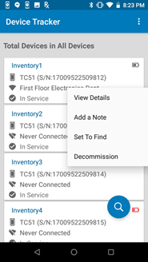
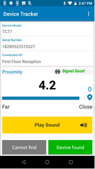
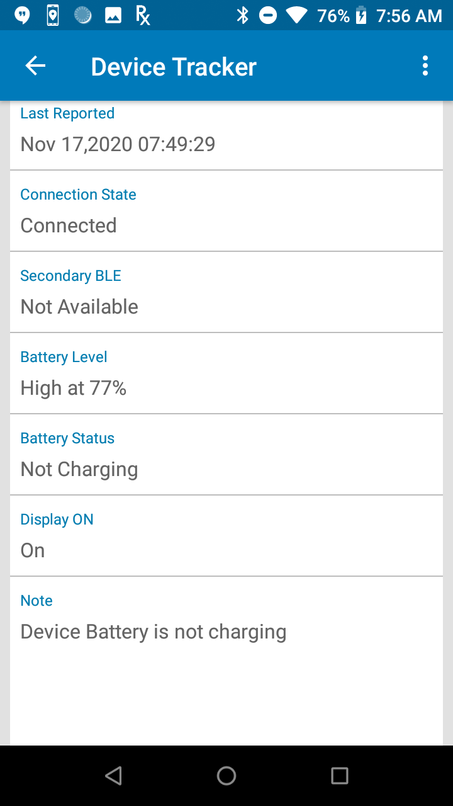
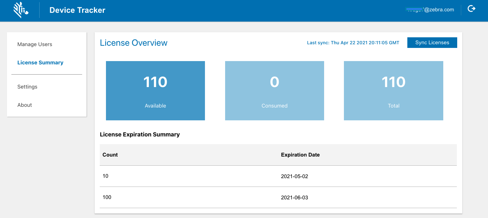

## Overview

When using Device Tracker, the end user is initially presented with the [Check-out](#devicecheckout) screen if the [Check-out feature](../config/#configuredevicecheckout) is enabled. Once an administrator or manager logs in after check-out, they gain access to [monitor devices](#monitordevices) across their organization (administrator) or site (manager) to identify devices at-risk. 

To initiate the process to find a device, the target device must be [marked for retrieval](#markdevicetofind) by the administrator or manager. To [find a device](#finddevice), the “seeking” device (the device performing the search) is used to determine the distance the user is located in relation to the “target” device (the device to be found) using the visual proximity meter. Once a device is found, [recommission the device](#decommissionrecommissiondevice) to place it back into the active device pool. Alternatively, [decommission the device](#decommissionrecommissiondevice) if it needs to be removed from the active device pool.

A [note](#addeditnote) can be added at any time to capture comments specific to the device (e.g. device screen damaged) to aid in tracking or identifying problems with the device. This feature is available only for administrators and managers.

For operation, device [licenses](#licenses) are required.

The [Requirements](../setup/#requirements) must be met to find a device.

---

<!--
This section discusses the actions that can be taken to track devices:

- **[Device Check-out](#devicecheckout) -** an optional feature enforcing users to scan their user barcode to gain access to the device and associate the user to the device for accountability.
- **[Find Devices](#finddevices) -** provides the procedure to find a device, even if the device has lost power (for devices with secondary BLE).
- **[Decommission/Recommission Device](#decommissionrecommissiondevice) -** remove or reinstate a device from the active pool of devices. Easily track devices that need to be removed from the pool due to repair or decommission.
- **[Add/Edit a Note](#addeditnote) -** add device-specific comments, e.g. to identify device issues.
-->

## Device Check-out

[Device Check-out](../settings/#devicecheckout) is an optional feature that can be enabled by the administrator. If enabled, the user is required to scan their barcode at the start of their work shift to check-out the device, then logout at the end of their work shift to check-in the device. The check-out screen is in kiosk mode, preventing the user from accessing the device until check-out is performed. When a device is checked-out, the user is associated with the particular device until the user checks in the device.

### Check-out

Perform a device check-out at the start of a work shift as follows:

1. Remove the device from power to automatically display the check-out screen or launch the app on the device.
2. The check-out screen appears, prompting to scan a barcode. When in the check-out screen, the user is prevented access to the device until check-out is performed.
   <i>Device check-out</i>

3. Scan the barcode associated with the user by pressing the scan trigger or tapping on the barcode image on the screen. If the administrator has set a prefix string in the [barcode prefix option](../config/#enablecheckoutcheckin), the barcode must contain the prefix specified for check-out to be successful.
4. A message appears indicating the user is checked-out successfully. The app is placed in the background.
5. The user is now associated with the device.  

**Note:** If Check-out is enabled, after a device is rebooted the Check-out screen may take up to one minute to be displayed.
  

### Check-In

Choose one of the following options to Check-In a device:

<b>Option 1:</b>

1. Launch the app.
2. Tap on the options menu from the top right and select Check-In Device.
3. The user is checked-in. The check-out screen appears prompting to scan a barcode.

<b>Option 2:</b>

1. Connect the device to power.
2. The user is checked-in. The check-out screen appears prompting to scan a barcode.

<b>Option 3:</b>

1. Reboot the device.
2. The check-out screen appears prompting to scan a barcode.

<b>Option 4:</b>

1. Perform a battery swap.
2. The check-out screen appears prompting to scan a barcode.

 

---

## Monitor Devices

### Administrator/Manager Login

Administrators and managers are required to login to view and perform actions based on their respective role. Device Tracker supports a single session for each user login and does not support multiple login sessions. If an admin/manager logs in to multiple browser sessions or devices using the same user login, the login sessions are automatically terminated after a period of time.

To login as administrator or manager:

1. Launch the Device Tracker app.
2. If the Check-out feature is enabled, scan a barcode to check-out the device.
3. Tap the options menu at the top right and select **Admin/Manager Login.**
4. Enter the administrator/manager login credentials or scan the barcodes for the username and password.
5. Perform the required tasks.
6. Logout when complete. Tap the options menu at the top right and select **Admin/Manager Logout.**

After logging in as <i>administrator</i> on the device, tap on the top right option menu and select one of the following:

- **Admin/Manager Logout –** logs out the administrator or manager.
- **Settings –** displays information and options:
  - **Import Access Points/Sites/Devices -** import access point, site and device data to aid in locating devices. See [Site, Access Point, and Device Data](../config/#siteaccesspointanddevicedata).
  - **Device Friendly Name –** displays the friendly name assigned to the device.
  - **Site Name –** displays the friendly name assigned to the site location.

---

### Device Information

Administrators and managers have additional capability to view data:

- **Site List –** administrator access only; lists the sites in the organization
- **Dashboard –** administrator and manager access; lists a summary showing metrics based on device tracker and device status

* **Device List –** administrator and manager access; lists devices with capability to view device details 

Administrator or manager login is required to access the data.

#### Site List

After administrator login, a site listing is visible for site selection:

- **All Devices –** when selected, displays the dashboard of all devices (whether assigned or not assigned to a site) across all sites
- **Unassigned Devices –** when selected, displays the dashboard of devices that are not assigned to a site.
- **Sites -** lists all the sites across the entire organization. Select an individual site to display the dashboard for the particular site.
   

<i>Site list</i>

#### Dashboard

The dashboard is accessible to administrators and managers, displaying device categories based on device status, along with statistics for each category. For administrators, the dashboard can be displayed for any site selected in the site list, including All Devices (across all sites) or Unassigned Devices. For managers, the dashboard displays information based on the site their device is assigned to. If the manager device is not assigned to a particular site, the dashboard displays information based on all unassigned devices.

Dashboard categories:

- **Total Devices –** displays the total number of devices being tracked within the particular site. If **All Devices** is selected instead of a particular site, the total number of devices reflects the devices across all sites. If **Unassigned Devices** is selected, the total number of devices reflects the devices that are not assigned to any site.  

Device status:

- **To Be Found –** filters devices designated To Be Found where action has not been taken to initiate the search for these devices.
- **Being Found –** filters devices that are actively being searched. Triggered when a user initiates a device search.
- **Found –** filters devices that were successfully found after a search. Triggered when a user indicates the device is found.
- **Cannot Find –** filters devices that could not be found after a search was conducted.
- **Decommissioned –** filters devices that are designated as decommissioned. These devices are not in the active device pool, the collection of devices with active server communication.
- **Unlicensed -** the device is not allocated with a license, therefore the app will not operate.
 

Device battery states:

- **Low Battery –** filters devices that have reached the low power threshold of 15% remaining battery or lower, requiring attention to be charged prior to battery depletion.
- **Charging –** filters devices that are powered on and in the charging state.
- **Discharging –** filters devices that are powered on and discharging.
   

Device connection states:

- **Never Connected –** filters devices that are registered but never connected to the server.
- **Disconnected –** filters devices that have connected to the server but are no longer connected due to no communication with the server for approximately 12 minutes.
   

If <a href="../settings/#devicecheckout">Device Check-out</a> is enabled:

- **Checked Out –** filters devices that are checked-out by users after scanning their user barcode, associating the user to the device.

<i>Dashboard</i>
 

**Note:** In split-screen mode, when the dashboard is displayed in Device Tracker and the app is not in focus, the app displays a blank screen. When Device Tracker is back in focus, the dashboard is displayed as expected.
 

#### Device List

The device list displays all devices corresponding to the selected category in the dashboard. In the dashboard screen, select a category in the list to view the corresponding list of devices. The search result is limited to display 100 records. If this limit is exceeded, a message is displayed below the device list indicating that there are additional records and the search should be refined to avoid exceeding the limit.

Each individual device is displayed as a “device card” that shows information pertaining to that particular device:

- Device friendly name (if not available, the device model and serial number is displayed)
- Device model and serial number
- AP friendly name (if available) or BSSID - **Never Connected** is displayed if device has never connected to the server. The icon indicates the connectivity state to the access point. A WiFi icon with a slash indicates the device is not connected to the AP.
- Device status:
  - **In Service –** device is part of the active device pool and not in any of the other device states
  - **To Be Found –** the administrator or manager tagged the device, waiting for a user to take action to find the device
  - **Finding –** the device search is initiated by another user
  - **Found –** the device is located after conducting the search
  - **Cannot Find –** the device could not be found after the search was conducted
  - **Decommissioned –** device is removed from the active device pool
  - **Unlicensed -** the device is not allocated with a license, therefore the app will not operate.

* Top right icon indicates device battery level or charging state.

<i>Device list from <b>All Devices</b></i>
 
Tap and hold on any device card to display the available device actions:

- **View Details –** displays the Device Details screen, see below.
- **Add a Note –** enter text to capture comments specific to the device that could be helpful in tracking. For example, when a device is decommissioned a note can be added as follows: “Battery does not charge, needs to be replaced”.
- **Start Finding –** begins the device search process. Refer to [Find a Device](../use/#findadevice). This is visible only if the device is marked "To Be Found".
- **Recommission –** places a device from the decommissioned state back to the **In Service** state as part of the active device pool.
- **Decommission –** removes the device from the active device pool and places it out-of-service. This can be used when a device is undergoing repair or is deprecated and no longer in use.

<i>Device action menu</i>
 

#### Device Details

Tap on any device card to display the **Device Details** screen:

- **Device Status:**

  - **In Service –** device is part of the active device pool and not in any of the other device states
  - **To Be Found –** the administrator or manager tagged the device, waiting for a user to take action to find the device
  - **Finding –** the device search is initiated by another user
  - **Found –** the device is located after conducting the search
  - **Cannot Find –** the device could not be found after the search was conducted
  - **Decommissioned –** the device is removed from the active device pool
  - **Unlicensed -** the device is not allocated with a license, therefore the app will not operate.

- **Friendly name –** the assigned friendly device name as registered by the administrator
- **Device Model –** the model of the device
- **Serial Number –** the serial number of the device

- **License State:**

  - **Licensed -** device is allocated with a license
  - **Unlicensed -** the device is not allocated with a license, therefore the app will not operate.

- **Site Name –** displays the assigned friendly name for the site as registered by the administrator. If no value assigned, it is blank.
- **Last Connected AP –** displays the AP the device was last connected to, which aids in identifying the device location
- **Last Reported –** displays the time stamp of the last time the device reported to the server

- **Connection State:**

  - **Never connected –** the device has never connected to the server
  - **Connected –** the device is connected to the server
  - **Disconnected –** the device previously connected to the server and is now disconnected due to no communication with the server for approximately 12 minutes.

- **Secondary BLE:** identifies the state of the [secondary BLE beacon](../config/#secondaryble):

  - **Enabled -** the device has a secondary BLE beacon and beaconing is enabled. When the device loses power, the secondary BLE continues to transmit beacons to aid in locating the device.
  - **Disabled -** the device has a secondary BLE beacon and beaconing is disabled
  - **Not Available -** the device does not have a secondary BLE beacon

- **Battery Level –** displays the battery level (high, medium, or low) along with the percent (%) of battery remaining:

  - **High –** indicates the remaining battery is greater than 66%
  - **Medium –** indicates the remaining battery is within the range 15% to 66%
  - **Low –** indicates the remaining battery is less than or equal to 15%

- **Battery Status:**

  - **Charging –** the device is charging while plugged to a power source
  - **Not Charging –** device is not plugged to a power source

- **Display On –** displays “true” or “false”. If true, it indicates the device display is on and the device may be in active use. If false, it indicates the device display is off, indicating the device is not in active use.
- **Note –** text entered by an administrator or manager capturing information specific to the device.

<table>
  <tr>
   <td>
     
   </td> 
   <td> &nbsp; &nbsp; &nbsp;
   </td>
   <td>
     
   </td>
  </tr>
</table>
<i>Device details information</i>

### Device/Site Search

Two types of searches can be performed:

1. Search by site
2. Search by device

#### Search By Site

A site search performs a partial search for the characters entered in the search field. The search results display matches that include the characters being searched for within the site name. 
To perform a site search:

1. From the main site list, tap the search icon at the top.
   <i>Site list with search</i>

2. Enter the text to search in the field then tap the search icon in the virtual keyboard to start the search.
   <i>Site search field</i>

3. The search results are listed in the **Sites** section. The results include site names that contain the text entered. The search is not case sensitive.
    

#### Search by Device

A device search returns a list of devices that match the keyword entered based on the criteria selected: device friendly name, device model, serial number, or AP friendly name. The search result is limited to display 100 records. If this limit is exceeded, a message is displayed below the device list indicating that there are additional records and the search should be refined to avoid exceeding the limit.
 
To perform a device search:

1. Tap the search icon located in the lower right of the device list.
2. Select the type of search to be conducted, whether based on the device friendly name, device model, serial number, AP friendly name or check-out (if check-out is enabled). Enter the text to conduct a search. The search is case-sensitive.  
   <i>Device search</i>

3. Tap Search.
4. The search results return matches that begin with the text entered in the search field corresponding with the type of search conducted.

---

## Mark Device To Find

When initiating the process to find a device, the target device must first be set to the **To Be Found** state by the administrator or manager. The “seeking” device, or the device performing the search, is used to determine the distance the user is located in relation to the “target” device, or the device to be found. Location must be enabled on the seeking device to perform the device search.

A device must be marked **To Be Found** before a device search can take place.

To mark a device "To Be Found":

1. From the device list, tap and hold the device card of the target device to find. Select **Set To Find.**
   
   <i>Device action menu</i>
2. The status is changed to **To Be Found** and the device is now listed in the **To Be Found** category in the dashboard.
3. To proceed to find the device, continue to the next section [Find a Device](./#findadevice).

Managers and administrators can alternatively mark a device <b>To Be Found</b> as follows:

1. Open the [device list](../mgmt/#devicelist).
2. Tap on a device card.
3. Tap **Enable Finding**.
   
   <i>Manager/admin view to mark a device "To Be Found"</i>

## Find Device

A device search is initiated from the **To Be Found** device list. For an associate, the **To Be Found** device list is displayed after starting the client app. For an administrator or manager, the **To Be Found** device list is accessible via the dashboard.

When the user is ready to take action to perform the device search, the first step is to use the seeking device to find the access point (AP) that the target device is connected to. This provides the general location of the target device. The user walks toward the AP, then uses the Bluetooth proximity indicator on the seeking device to identify how close or far the target device is located in relation to the seeking device. To further pinpoint the device location, a sound can be played by tapping the **Play Sound** button on the seeking device to locate the target device by audio sound.

**To start the search process:**

Perform _one_ of the following in the **To Be Found** device list: Tap and hold the device card for the target device. Select **Start Finding** from the device action menu.  
 <i>Device action menu</i>  
_Or,_ 
Tap on the device card for the target device to open the <b>Device Details</b> screen. Tap <b>Start Finding.</b>

<table style="margin-left:40px">
  <tr>
   <td>
     
   </td> 
   <td>&nbsp;&nbsp;&nbsp;&nbsp;&nbsp;&nbsp;&nbsp;&nbsp;&nbsp;&nbsp;&nbsp;&nbsp;&nbsp;&nbsp;&nbsp;
   </td>
   <td>
     
   </td>
  </tr>
</table>
<i>&nbsp;&nbsp;&nbsp;&nbsp;&nbsp;&nbsp;&nbsp;&nbsp;&nbsp;&nbsp;&nbsp;&nbsp;&nbsp;&nbsp;"Start Finding" Associate view&nbsp;&nbsp;&nbsp;&nbsp;&nbsp;&nbsp;&nbsp;&nbsp;&nbsp;&nbsp;&nbsp;&nbsp;&nbsp;&nbsp;&nbsp;"Start Finding" Manager/Admin view</i>

2. The device tracking screen appears. The device state is changed to **Being Found.**
3. Check the **Connected AP** on the tracking screen on the target device. Walk towards the known location of the AP.
4. Using the BLE proximity meter, walk towards the target device. The BLE proximity meter identifies the overall trend on how far or how close the user is located in relation to the target device. The closer the target, the further the blue indicator bar expands to the right. As the seeking device approaches the target device, the numerical value on the meter decreases as it reaches “Close” or “0” value.
   <i>Tracking screen with proximity meter</i>
5. Tap **Play Sound** on the seeking device. The target device emits a chirping sound to help identify its location. Walk towards the sound. Continue this step until the device is found.
6. If the target device is found, tap **Device found.** The device is then moved to the Found state. If the device is not found, **tap Cannot find.** The device is then moved to the **Cannot Find** state. The device is listed under the corresponding categories accessible from the dashboard.

When a device is found, [recommission](#decommissionrecommissiondevice) the device to place it back into the active device pool. Alternatively, decommission the device if it needs to be removed from the active device pool.

A [note](#addeditnote) can be added at any time to capture comments specific to the device to aid in tracking or identifying problems with the device. This feature is available only for administrators and managers.

<b>Note:</b>

- A device is in the <b>Disconnected</b> state if it does not communicate with the server for approximately 12 minutes. If a device search is performed and audio is attempted to play during this time frame, audio cannot be emitted from the target device.
- If the device being found is powered off during a device search, while powering it on again proximity cannot be detected until the device completes the boot process. Since the secondary BLE is inoperative when the device is powered on, device locationing relies on the primary BLE beacon.

### Secondary BLE

For devices with secondary BLE beaconing capability, Device Tracker can locate the device if it loses power due to critically low battery or is manually powered off. Locationing is based on signals transmitted from the secondary BLE beacon. Attempts to locate the device must occur soon after the device loses power, prior to loss of power of the secondary BLE beacon. In this circumstance, the **Play Sound** feature is disabled during device search since it cannot function due to the loss of device power.

See <a href="../setup/#secondarybleprofile">Secondary BLE Profile</a> to enable the secondary BLE beacon.

The <a href="../mgmt/#devicedetails">Secondary BLE state</a> is viewed from the **Device Details** screen.

### Disable Finding

After a device is marked **To Be Found**, if the device search needs to be terminated follow these steps (applies to only managers and administrators):

1. Open the [device list](../mgmt/#devicelist).
2. Tap on a device card.
3. Tap **Disable Finding**.
   
   <i>Manager/admin view to disable finding</i>

---

## Decommission/Recommission Device

After a device is found, recommission the device to place it back into the active device pool. This changes the device status from **Found** to **In Service.** Or, recommission or decommission a device on-demand to add or remove the device to/from the active device pool. This feature is available only to administrators or managers.

### Decommission a Device

When a device is no longer in use or needs to be taken out of the active device pool, it can be set as **Decommissioned.** This prevents any further device reporting to the server and applies to situations when the device is being sent for repair, the device is being replaced, or the device is deprecated and needs to be removed.

When a device is decommissioned, the license is automatically deallocated from the device and returned to the license pool so it can be reallocated to another device.

To decommission a device (admin/manager access required):

1. Perform _one_ of the following procedures: 
   From the device list, tap and hold on the device card. Tap **Decommission** from the device action menu displayed. The **Device Details** screen appears. 
   _Or,_ 
   If already in the **Device Details** screen, tap on the top right menu and select **Decommission.**
2. The status is changed to **Decommissioned** and the user is prompted to enter a note.
3. If desired, add a note by entering text in the Note section to indicate the reason for the device decommission. See Add/Edit a Note section.
4. Tap back. The note is saved and the device is placed in the **Decommissioned** category in the dashboard.

### Recommission a Device

Recommission a device after it is found, or it is previously **Decommissioned** and needs to be placed back into the active device pool (e.g. returned from repair). Recommissioning a device restarts the device status reporting to the server.

When recommissioning a device, if a license is available it is automatically allocated to the device. If no license is available, the device remains in the decommissioned state and a <a href="./#addeditnote">note</a> is automatically added indicating there is no license available. This note overwrites any pre-existing note. When a license is available, the admin or manager must recommission the device to allocate the license and manually delete the note.

Steps to recommission a device (admin/manager access required):

1. In the dashboard, scroll down and tap **Decommissioned** or **Found** to display the corresponding list of devices.
2. Perform _one_ of the following procedures: Tap and hold the device card and select **Recommission.** 
   _Or,_ 
   Tap the device card to display the **Device Details** screen. Tap on the top right menu and select **Recommission.**
3. The **Status** is changed to **In Service,** as seen in the **Device Details** screen.
4. Tap the **Note** section to enter or edit text indicating the reason why the device is recommissioned.

---

## Add/Edit Note

Administrators and managers can add a note to capture comments specific to the device to help in device tracking or identifying device problems. For example, a comment could be "device screen damaged".

To add or edit a note:

1. From the device list of any category accessed from the dashboard, tap and hold the device card and tap **Add a Note.** If a note already exists, the option is provided to **Edit a Note.**
2. The **Note** section appears in the **Device Details** screen prompting to enter in text.
   <i>Enter a note or comment</i>

3. After entering text for the note, tap the back button.
4. The note is saved and can be viewed in the **Device Details** screen.

---

## Licenses

[Licenses](../license) are required for Device Tracker operation on devices. Licenses are shared from a single pool of licenses, regardless of expiration date. When a device registers to the Device Tracker server, if a license available, it is allocated to the device from the license pool.

After a license expires or when a device is [recommissioned](../use/#recommissionadevice), it is automatically allocated a license if available. Administrators can perform the following:

- Monitor licenses.
- Transfer a license from one device to another.
- Remove a license.

See the [License](../license) section for more information.

To view license information:

1. From the web portal, tap **License Summary** in the left menu.
2. The following information is provided based on unexpired licenses:
   - **Total licenses -** quantity of licenses that have been purchased
     - **Total licenses available -** quantity of licenses that are available and can be allocated to devices
     - **Total licenses consumed -** quantity of licenses allocated to devices
   - **List of licenses purchased** with corresponding quantity and expiration date. This data is static and removed from the list after the expiration date is surpassed.
   - **Sync Licenses** button to refresh license data on-demand and synchronize with the Zebra Enterprise Software Licensing system. The license information is updated once each day.
   - **Time stamp** of the last occurrence when the license information was synchronized with the license server.

_License Summary in Device Tracker web portal_

---

## See Also

- [About Device Tracker](../about)
- [Installation](../setup)
- [Configuration](../config)
- [License](../license)
