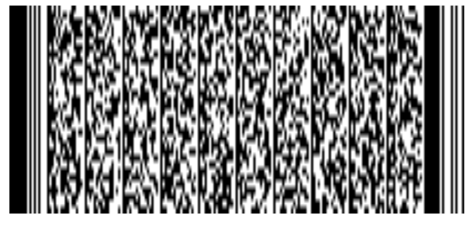

## Overview

This section discusses installation and configuration of Device Tracker. The client app (APK file) and web portal URL are supplied by Zebra. Zebra’s [StageNow](/stagenow/latest/about) tool or an EMM can be used for Device Tracker software deployment to the mobile devices.  

**Installation and configuration on the device:**

1.	**Install client APK file.** Ensure all permissions are granted.   
2.	**Disable battery optimization,** to permit the client app to continue running in the background during doze mode (Android’s power-saving feature triggered when the device is in a prolonged suspended state).
3.	**Allow overlay permission _(optional)_.**  If the Check-out feature is required to prevent users from accessing the device prior to scanning their unique user barcode, automatically allow the overlay permission for device check-out without manual intervention. See Check-out section for more information.
4.	**Launch the app and deploy server settings** to communicate with the cloud server.  

Steps 1 to 3 can be accomplished by creating a [StageNow installation profile](#createstagenowinstallationprofile) and step 4 by creating a [StageNow configuration profile](#createstagenowconfigurationprofile). 
 

**Configuration of the Device Tracker solution:**

* **[Create/Manage admin and manager logins](#webportal) –** Administrators use the web portal to: 
    * Add/Delete administrators
    * Add/Delete site managers
    * Reset passwords
* **[Configure access points](#siteaccesspointanddevicedata) -** Register access point location to identify which AP the device is connected to and aid in locating the device.
    * Assign friendly name to access point based on the AP physical location on site
    * Assign site location – to identify which site the AP belongs
* **[Configure devices](#siteaccesspointanddevicedata) -** Register device information to identify the devices. 
    * Assign friendly name
    * Assign a site location 
 

**Configure the Check-out feature _(optional)_:**

* **[Enable/Disable check-out](#devicecheckout) –** Administrators toggle the check-out feature in the web portal, enforcing users to scan their user barcode at the beginning and end of their work shift to check-out and check-in their device.
* **[Add/Modify barcode prefix](#devicecheckout)** for the barcode used during check-out. This adds the restriction to only accept scanned barcodes that begin with the specified prefix.
* Generate user barcodes for check-out, if needed.
 
 

## Device Requirements

Requirements for Device Tracker client:
* **Operating System:** 
    * Android Oreo with GMS (non-restricted)
* **Bluetooth** must be enabled to find devices using the visual proximity indicator. In some circumstances, if the client application cannot automatically enable Bluetooth (e.g. due to EMM control), then user intervention is required to turn on Bluetooth.
* **Wi-Fi** must be enabled and connected to the network to communicate with the server.
* **Location Services** must be enabled on all devices to find devices using the Bluetooth-based proximity indicator. 
  

## Network Requirements

Network requirements for communication between the device and cloud server:
* Refer to the document supplied by Zebra to ensure the required URLs are accessible:
    * URL for the web portal for administrator access
    * URL for the mobile devices to access the cloud server:  
&nbsp;&nbsp;&nbsp;&nbsp;&nbsp;&nbsp;`https://[ProjectID].firebaseio.com`
  
where [ProjectID] is located in the server config.xml supplied.  

* The client application sends device status and events to the server over HTTPS. Network port 443 or the appopriate URL must be permitted to reach the Google Cloud Firebase platform.
  

## Create StageNow Profiles

This section provides procedures to create StageNow Installation and Configuration profiles. StageNow version 4.2 or higher is required if automatically bypassing the overlay permission for Check-out.  See [Zebra downloads](https://www.zebra.com/us/en/support-downloads/software/utilities/stagenow.html) and [StageNow](/stagenow/latest/about/) for the install file and more information.

### Create StageNow Installation Profile

Create a StageNow installation profile to perform the following:

&nbsp;&nbsp;&nbsp;&nbsp;&nbsp;A. **Install the Device Tracker client APK file.** 
&nbsp;&nbsp;&nbsp;&nbsp;&nbsp;B. **Disable battery optimization** to permit the client app to continue running in the background even while the system is in doze mode while in long suspended state. 
&nbsp;&nbsp;&nbsp;&nbsp;&nbsp;C. _[Optional]_ If using the **Check-out feature** to enforce users to scan their unique barcode prior to accessing the device, automatically allow the overlay permission for device check-out without manual intervention.  
&nbsp;&nbsp;&nbsp;&nbsp;&nbsp;D. **Start the app.** 
&nbsp;&nbsp;&nbsp;&nbsp;&nbsp;E. **Add a delay** (minimum of 5 seconds) to allow time for the app to be ready to accept the configurations before implementing the StageNow configuration profile.  

For part C, the client app certificate must be extracted.  Perform the steps in section **Extract Client App Certificate** below before proceeding.

**To create a StageNow installation profile:**

1.	Open [StageNow](https://www.zebra.com/us/en/support-downloads/software/utilities/stagenow.html) on a host computer.
2.	In the StageNow home screen, click **Create New Profile** from the left menu.
3.	Ensure MX version 8.0 or higher is selected at the top drop-down selector. The MX version on the device should match this or higher. See [MX documentation](/mx/mx-version-on-device/) for instructions how to check the version. If automatically bypassing the overlay permission for Check-out, select MX 10.0 or higher.
4.	Select **Xpert Mode** from the list and click **Create.**
<i>Wizard selection</i>  

5.	Enter the profile name. Click **Start.**
6.	If using StageNow to copy the install file to the device, scroll down and click the plus (+) sign next to **FileMgr.** This adds FileMgr to the Config tab on the right side. 
7.	Scroll to **AppMgr** and click the plus (+) sign next to it. This adds AppMgr to the Config tab on the right side. 
8.	Repeat step 7 again. AppMgr is listed twice in the Config tab.
9.	If automatically bypassing the screen overlay permission, scroll to **AccessMgr** and click the plus (+) sign next to it. This adds AccessMgr to the Config tab on the right side.
10.	Repeat step 7 again.  AppMgr is listed in the Config tab.
11.	Scroll to find **ConditionMgr** and click the plus (+) sign next to it.  This adds ConditionMgr to the Config tab on the right side.
<i>List of config settings added</i>  

12.	Click **Add.**
13.	If using StageNow to copy the install file to the device, proceed with this step.  Otherwise, skip to step 14. 
_StageNow Config 1_ - Copy the install file to the device with FileMgr. In the **FileMgr** screen under the **Create New Setting** tab, select and enter the desired options to install the APK, for example: 
&nbsp;&nbsp;&nbsp;&nbsp;&nbsp;• **File Action:** Transfer/Copy File 
&nbsp;&nbsp;&nbsp;&nbsp;&nbsp;• **Target Access Method:** File in the device file system 
&nbsp;&nbsp;&nbsp;&nbsp;&nbsp;• **Target Path and File Name:** [enter file path] 
&nbsp;&nbsp;&nbsp;&nbsp;&nbsp;• **Source Access Method:** [select applicable method] 
&nbsp;&nbsp;&nbsp;&nbsp;&nbsp;• **Source File URI:** [enter information prompted] 
Click **Continue.**
14.	_StageNow Config 2_ – Install the client app. For the first **AppMgr,** select the following: 
&nbsp;&nbsp;&nbsp;&nbsp;&nbsp;• **Action:** Install 
Enter/select the desired options for the remaining fields.  Click **Continue.**
15.	_StageNow Config 3_ – Battery Optimization. For the second **AppMgr,** enter/select the following: 
&nbsp;&nbsp;&nbsp;&nbsp;&nbsp;• **Action:** Application for Battery Optimization 
&nbsp;&nbsp;&nbsp;&nbsp;&nbsp;• **Remove Application for Battery Optimization:** com.zebra.devicetrackercloud 
Click **Continue.**
16.	_StageNow Config 4_ – Grant overlay permission. For **AccessMgr,** enter the following: 
&nbsp;&nbsp;&nbsp;&nbsp;&nbsp;• **Permission Access Action:** Grant Permission to an Application 
&nbsp;&nbsp;&nbsp;&nbsp;&nbsp;• **Permission Name:** System Alert Window 
&nbsp;&nbsp;&nbsp;&nbsp;&nbsp;• **Application Package Name:** com.zebra.devicetrackercloud 
&nbsp;&nbsp;&nbsp;&nbsp;&nbsp;• **Application Signature:** [path of certificate file extracted (see <b>Extract Client App Certificate</b> below)] 
17.	_StageNow Config 5_ – Launch app. For the third AppMgr, enter/select the following: 
&nbsp;&nbsp;&nbsp;&nbsp;&nbsp;• **Action:** Launch an application 
&nbsp;&nbsp;&nbsp;&nbsp;&nbsp;• **Application Name:** Device Tracker 
Click **Continue.**
18.	_StageNow Config 6_ – Add a delay for the app to be ready to accept configurations. In the **ConditionMgr** screen under the “Create New Setting” tab, enter/select the following:  
&nbsp;&nbsp;&nbsp;&nbsp;&nbsp;• **Data Type:** Integer 
&nbsp;&nbsp;&nbsp;&nbsp;&nbsp;• **Integer System Value:** Battery Level 
&nbsp;&nbsp;&nbsp;&nbsp;&nbsp;• **Integer Condition Test:** Equal-to a Constant Integer 
&nbsp;&nbsp;&nbsp;&nbsp;&nbsp;• **Integer Constant Value:** 0 
&nbsp;&nbsp;&nbsp;&nbsp;&nbsp;• **Condition Met Action:** Success 
&nbsp;&nbsp;&nbsp;&nbsp;&nbsp;• **Condition Not Met Action:** Retry 
&nbsp;&nbsp;&nbsp;&nbsp;&nbsp;• **Condition Repeat Count:** 5 
&nbsp;&nbsp;&nbsp;&nbsp;&nbsp;• **Condition Repeat Interval:** 1 
&nbsp;&nbsp;&nbsp;&nbsp;&nbsp;• **Condition Fail Message:** [enter message text] 
&nbsp;&nbsp;&nbsp;&nbsp;&nbsp;• **Suppress the error message:** enable 
This sets the condition such that if the battery level is not 0, it retries 5 times with an interval of 1 second for each retry.  The end result is a 5 second delay.
19.	Click **Complete Profiles.** Profile creation is complete.
  

Perform **one** of the following steps based on the staging method. Ensure devices are connected to the network during the staging process:

* **StageNow:** Generate the barcode.  Open StageNow on the device and scan the barcode to deploy the app. 
* **EMM:** Click on **Export the XML for MDM.** Send the XML using either [OEMConfig](/oemconfig) or [MX](/mx/overview) to configure the app and grant all required permissions.
<!-- 
* Device Owner mode – use [OEMConfig](/oemconfig) to configure the app
* Device Administrator mode – use [MX](/mx/overview/) to configure the app -->
 

#### Extract Client App Certificate

This section is a pre-requisite to create the StageNow installation profile. Prior to automatically granting the screen overlay permission, the Device Tracker certificate must be extracted. Automatically granting the screen overlay permission avoids the screen overlay detected warning from appearing to the user. 

Steps to extract the client app certificate:

1.	Download SigTools.jar from [Zebra’s App Signature Tools](https://techdocs.zebra.com/emdk-for-android/latest/samples/sigtools/).
2.	Follow the instructions provided from the link to extract the certificate from Device Tracker’s APK file using command:

        java -jar SigTools.jar GetCert -INFORM APK -OUTFORM DER -IN [filename.apk] -OUTFILE [filename.crt]

where _[filename.apk]_ is the full path and file name of the Device Tracker APK install file and _[filename.crt]_ is the designated certificate file name.  The file extensions should be preserved in both file names.
3.	The certificate file is extracted as the CRT file. 
The certificate file is needed to create the StageNow Installation Profile.
  

### Create StageNow Configuration Profile
Create a StageNow configuration profile to apply server settings in the app client for it to communicate with the server. The server configuration XML file is required, supplied by Zebra.

Steps to create a StageNow configuration profile:

1. Open [StageNow](https://www.zebra.com/us/en/support-downloads/software/utilities/stagenow.html) on a host computer.
2. In the StageNow home screen, click **Create New Profile** from the left menu.
3. Ensure the proper MX version is selected at the top drop-down selector. This should match the MX version on the device. See [MX documentation](/mx/mx-version-on-device/) for instructions how to check the version. Select **Xpert Mode** from the list and click **Create.**
<i>Wizard selection</i>  

4. Enter the profile name. Click **Start.**
5. Find **Batch** and click the plus (+) sign next to it. This adds **Batch** to the Config tab on the right side.
<i>List of config setting added</i>  

6.	Click **Add.** In the Batch screen, select the following: 
&nbsp;&nbsp;&nbsp;&nbsp;&nbsp;• **Batch Action:** Execute Batch 
&nbsp;&nbsp;&nbsp;&nbsp;&nbsp;• **Batch File Type:** XML File 
&nbsp;&nbsp;&nbsp;&nbsp;&nbsp;• **Batch File Access Method:** File embedded in XML 
&nbsp;&nbsp;&nbsp;&nbsp;&nbsp;• **XML File Data:** [browse to the server configuration XML file supplied from Zebra services] 
7.	Click **Continue.**
8.	Click **Complete Profiles.**  
 

Perform **one** of the following based on the staging method.  Ensure devices are connected to the network during the staging process:

* **StageNow:** Generate the barcode.  Open StageNow on the device and scan the barcode to deploy the app.
* **EMM:** Click on **Export the XML for MDM.** Send the XML using either [OEMConfig](/oemconfig) or [MX](/mx/overview) to configure the app and grant all required permissions.
 

**Note:** If an enterprise reset is performed on the device, the server settings must be re-applied for communication with the server.

## Device Deployment
The device must be connected to the network during deployment. Use one of the following methods based on the desired tool for device deployment:
* **StageNow:** Open StageNow client on the device and scan the barcodes generated from the installation and configuration profiles. See Appendix. 
* **EMM:** Export each StageNow XML file from the StageNow installation and configuration profiles (see Appendix). Do not edit the XML file - it can cause unexpected behavior. Send the XML using either [OEMConfig](/oemconfig) or [MX](/mx/overview/) to configure the app and grant all required permissions.

When installation and configuration is complete, reboot the device. Once the app is started on Android O or higher devices, a Device Tracker notification message is displayed in the device notification drawer. This notification cannot be dismissed, indicating that Device Tracker is running in the background. 
  

## Site, Access Point and Device Data
Administrators register site names, access points, and device information with friendly names to aid in identifying, tracking and locating devices. Sample AP and device CSV files are supplied by Zebra for the administrator to populate with the appropriate data. Copy the populated CSV files to the mobile device for the data to be imported through the client app. Importing data either modifies or adds entries to the existing database. The data fields are:  

<table class="facelift" style="width:100%" border="1" padding="5px">
  <tr bgcolor="#dce8ef">
    <th style="text-align:center">CSV File</th>
    <th style="text-align:center">Data</th>
    <th style="text-align:center">Description</th>
    <th style="text-align:center">Required</th>
  </tr>
  <tr>
    <td style="text-align:center" rowspan="4">AP</td>
    <td style="text-align:center">SiteName</td>
    <td style="text-align:left">Site name or location</td>
    <td style="text-align:left">Yes</td>
  </tr>
  <tr>
    <td style="text-align:center">BSSID</td>
    <td style="text-align:left">Access point MAC address</td>
    <td style="text-align:left">Yes</td>
  </tr>
  <tr>
    <td style="text-align:center">AssetName</td>
    <td style="text-align:left">Name used by IT admin for drawings, labeling of hardware, etc.  <i>(For future use only – does not have any impact whether or not it is in use.)<i></td>
    <td style="text-align:left">Optional</td>
  </tr>
  <tr>
    <td style="text-align:center">LocationFriendlyName</td>
    <td style="text-align:left">Access point location friendly name, useful to identify general device location</td>
    <td style="text-align:left">Optional</td>
  </tr>

  <tr>
    <td style="text-align:center" rowspan="4">Device</td>
    <td style="text-align:center">ModelNumber</td>
    <td style="text-align:left">Device model</td>
    <td style="text-align:left">Yes</td>
  </tr>
  <tr>
    <td style="text-align:center">SerialNumber</td>
    <td style="text-align:left">Device serial number</td>
    <td style="text-align:left">Yes</td>
  </tr>
  <tr>
    <td style="text-align:center">DeviceFriendlyName</td>
    <td style="text-align:left">Name used to identify device</td>
    <td style="text-align:left">Optional</td>
  </tr>
  <tr>
    <td style="text-align:center">SiteName</td>
    <td style="text-align:left">Site name or location where the device is assigned, useful when finding a device</td>
    <td style="text-align:left">Optional</td>
  </tr>
</table>
 
The device data fields are required in the device .CSV file whether adding or deleting devices. In each .CSV file, keep the header information intact and replace the sample data with the appropriate data desired. It is particularly important for the AP location friendly name to be easily understood for users to determine the location within the facility when finding a device. Special characters, such as '.', '#', '$', '[', or ']', are not supported. 

Sample AP .CSV file content: 

        SiteName,BSSID,AssetName,LocationFriendlyName
        New York,14:a7:2b:24:cc:a5,,First Floor Reception Area
 
Sample Device .CSV file content: 

        ModelNumber,SerialNumber,DeviceFriendlyName,SiteName
        TC51,17009522509812,Inventory1,Chicago
        TC51,17009522509813,Inventory2,Los Angeles

 

### Import Site and AP Data
When adding or modifying site and AP data, it is particularly important for the AP friendly name to be easily understood by users to aid in finding the location where the device is connected.  
 
To import site/AP data from the AP .CSV file:

1.	Copy the .CSV file from the PC to the device root `\Internal shared storage` folder. 
2.	In the client app, login as the admin.  In the main screen, tap on the options menu at the top right and select **Admin/Manager Login.**  Enter the Administrator credentials and tap **Login.**
3.	Tap the top right options menu and select **Settings,** which is now visible.  
4.	Tap **Import Access Points/Sites/Devices.**
5.	Under the section **Import Access Point CSV File,** tap **Browse File.**  Browse and select the appropriate .CSV file.
6.	Under the section **Import Access Point CSV File,** tap **Upload CSV.**  
7.	The AP data import is complete.  Results are displayed in the **Status** section at the bottom of the screen.  
 

### Import Device Data
To add/modify device data, import the device .CSV file:

1.	Copy the CSV file from the PC to the device root `\Internal shared storage` folder. 
2.	In the client app, login as the admin.  In the main screen, tap on the options menu at the top right and select **Admin/Manager Login.**  Enter the Administrator credentials and tap **Login.**
3.	Tap the top right options menu and select **Settings,** which is now visible.
4.	Tap **Import Access Points/Sites/Devices.**
5.	Under the section **Import Device CSV File,** tap **Browse File.**  Browse and select the appropriate .CSV file.
6.	Under the section **Import Device CSV File,** tap **Upload CSV.**  
7.	The device data import is complete.  Results are displayed in the **Status** section at the bottom of the screen.  
 

New devices imported are initially in the **Never Connected** state until the Device Tracker app is installed on the devices, configured and communicating with the server.

### Delete Device Data
To delete device data, import the device .CSV file containing the specific data to delete:
1.	Copy the .CSV file from the PC to the device root `\Internal shared storage` folder. 
2.	In the client app, login as the admin.  In the main screen, tap on the options menu at the top right and select **Admin/Manager Login.** Enter the Administrator credentials and tap **Login.**
3.	Tap the top right options menu and select **Settings,** which is now visible.
4.	Tap **Import Access Points/Sites/Devices.**
5.	Under the section **Import Delete Device CSV File,** tap **Browse File.**  Browse and select the appropriate .CSV file.
6.	Under the section **Import Delete Device CSV File,** tap **Upload CSV.**  
7.	The specified device data is removed from the system.  Results are displayed in the **Status** section at the bottom of the screen.  
8. Reboot the device for which the data is being deleted. After reboot, the device is listed in the **Unassigned Devices** category in the dashboard.
  

## Web Portal
The web portal provides administrators the capabilities to: 
* create and manage users
* reset passwords
* enable check-in/check-out

In a browser, enter the URL shared by Zebra services to access the web portal. For first-time use, login with the super administrator (SuperAdmin) credentials provided by Zebra.
 

### Add User
To add a user:

1.	From the web portal, tap **Manage Users** in the left menu.
2.	Select the role of the new user: Admin or Manager
3.	Enter the information prompted, including the email and password.
4.	Tap **Add User.**
5.	The new user is added to the **All Users** list.
 

### Delete User
To delete a user:

1.	From the web portal, tap **Manage Users** in the left menu.
2.	From the list of users, locate the user to delete and click on the _delete icon_ next to the user.
3.	Click **OK** in the confirmation message.
 

### Search for User
User names can be searched by email address. The entire email address must be entered.  Action can be taken on the user after the search is performed, e.g. delete user.

To search for a user:

1.	From the web portal, tap **Manager Users** in the left menu.
2.	Enter the email address to search for in the search field located below the **Add User** button from the top right of the page. Press the enter key.
3.	The search results are displayed.
 

### Reset Password
The password can be reset through the web portal or the client app if the administrator or manager forgot the password. 

Steps to reset the password in the web portal:

1.	From the web portal login page, click **Forgot your password.**
2.	Enter your email address then click **Reset Password.**
3.	A message appears indicating a password reset email is sent.  
4.	Open the email and click on the link.
5.	Enter in the new password.
6.	The password is reset with the new password.
  

## Device Check-out

Device check-out/check-in is an _optional_ feature that maintains user accountability and traces device use. When enabled, a unique barcode is required for each user to scan at the start of their work shift. User operation in the check-out screen is limited to only scanning barcodes. The check-out screen is in kiosk mode, preventing the user from accessing the device until check-out is performed. 

* **Check-out:** At the start of a work shift, the user checks-out the device by scanning their unique barcode. This associates the user with the device, as seen in the device card and device details screen.
* **Check-in:** At the end of a work shift, the user checks-in the device by placing it on a powered cradle or logging out through the top-right menu from the main device screen. After check-in, the user is no longer associated with the device.  

The check-out/check-in feature displays an overlay on top of the screen to enforce the user to scan their unique barcode, maintaining user accountability of the device. If any other app also uses a screen overlay, the check-out/check-in feature may conflict with the other app. For example, this feature cannot be used with Zebra’s MotionWorks Proximity application.
 

### Enable check-out/check-in
To toggle check-out:
1.	From the web portal, tap **Settings** in the left menu.
2.	Toggle **Checkin/Checkout** to enable the feature.
 
If enabled, Checkout appears as a device state in the administrator and manager dashboard listing the devices that are checked-out.
 

### Set Check-out Barcode Prefix
When check-out is enabled, by default no prefix is defined allowing all barcodes to be accepted. The administrator can configure a prefix in the form of a character string, adding a restriction to accept only barcodes that begin with the specified prefix. If a barcode scanned does not contain the prefix, check-out is not successful.
  
When generating a barcode with the prefix, the specified prefix is followed by the username identifier. The following is a sample barcode containing prefix “NGDTRK-” and username “JohnDoe”: 

_Sample barcode with prefix and username: "NGDTRK-JohnDoe"_
  
To set the barcode prefix:

1.	**Enable Checkin/Checkout the web portal.** This exposes the Prefix field in the Application Configuration screen.
2.	**Enter the desired text for the prefix.** If all barcodes should be accepted with no prefix, keep the entry blank.
 
Only barcodes that begin with the specified prefix can initiate the checkout.
 
 

## Diagnostics
For diagnostic purposes, logging can be enabled in Device Tracker to capture application and system information to Android logcat. [RxLogger](/rxlogger) is a built-in tool on Zebra Android devices that collects data and event logs from logcat and stores them in a single location. If issues are encountered, a Zebra representative may request for the log files to be collected and supplied.  <br 
There are 2 methods to capture logging: StageNow or EMM.

### StageNow
To use StageNow to capture logging:
1.	Open StageNow on the device. 
2.	Scan the barcode to enable Device Tracker logging and start RxLogger log capture:

3.	Reproduce the issue.
4.	Scan the barcode to disable Device Tracker logging and stop RxLogger log capture:

 

Logs are located in the RxLogger folder (default location: /sdcard/RxLogger).
 

### EMM
To use EMM to capture logging, refer to the following XML content:

* To enable logging:

        <wap-provisioningdoc>
        <characteristic version="1.0" type="com.zebra.devicetrackercloud">
            <parm name="EnableLog" value="1" />
        </characteristic>
        </wap-provisioningdoc>

* To disable logging:

        <wap-provisioningdoc>
        <characteristic version="1.0" type="com.zebra.devicetrackercloud">
            <parm name="EnableLog" value="0" />
        </characteristic>
        </wap-provisioningdoc>

Send the desired XML content to the EMM using either [OEMConfig](/oemconfig) or [MX](/mx/overview) to configure the app.
  

<!-- -->

